# JIRA Epic Organization - Test Coverage Expansion

**Date**: October 12, 2025
**Project**: AV11 - Aurigraph V11 Standalone
**Purpose**: Organize test coverage work into structured epics for better tracking

---

## Epic Structure Overview

### 🎯 Master Epic: Test Infrastructure & Quality Assurance

**Epic Key**: To be created or AV11-XXX
**Status**: In Progress
**Target**: Achieve 95%+ test coverage across all Sprint 14-20 services

---

## Epic Hierarchy

### Epic 1: Sprint 14-20 Test Coverage Expansion
**Status**: 🚧 In Progress
**Owner**: QA Team
**Target Coverage**: 95% line, 90% branch

#### Child Stories:

##### ✅ AV11-263: Test Coverage Infrastructure Setup
**Status**: Done
**Coverage**: CI/CD Quality Gates
- JaCoCo integration with 95% enforcement
- GitHub Actions pipeline (8 jobs)
- SonarQube integration
- OWASP security scanning
**Deliverables**:
- `.github/workflows/ci-cd-pipeline.yml`
- `CI-CD-QUALITY-GATES.md`
- `pom.xml` (JaCoCo configuration)

##### ✅ Story: EthereumBridgeService Coverage (Week 1)
**Ticket**: AV11-XXX (to be created/linked)
**Baseline**: 15%
**Target**: 95%+
**Achieved**: 95%+ ✅
**Tests Added**: 58 total (28 new)
**Focus Areas**:
- Fraud detection with transaction rate limiting
- Multi-signature validation (2/3 threshold)
- Bridge completion flows (to/from Ethereum)
- Asset locking and unlocking
- Statistics accumulation
- Error handling and edge cases
- Validator network coverage

##### ✅ Story: EnterprisePortalService Coverage (Week 2)
**Ticket**: AV11-XXX (to be created/linked)
**Baseline**: 33%
**Target**: 95%+
**Achieved**: 95%+ ✅
**Tests Added**: 62 (EnterprisePortalServiceTest_Enhanced.java)
**Focus Areas**:
- DashboardMetrics (16 tests)
- UserManagement with RBAC (12 tests)
- ConfigurationManager CRUD (10 tests)
- AlertManager lifecycle (8 tests)
- Request/Response structures (12 tests)
- WebSocket data models

##### ✅ Story: SystemMonitoringService Coverage (Week 2)
**Ticket**: AV11-XXX (to be created/linked)
**Baseline**: 39%
**Target**: 95%+
**Achieved**: 95%+ ✅
**Tests Added**: 46 (SystemMonitoringServiceTest_Enhanced.java)
**Focus Areas**:
- MetricsCollector (8 tests)
- HealthChecker with unhealthy scenarios (10 tests)
- AlertEngine lifecycle (10 tests)
- PerformanceMonitor with degradation detection (10 tests)
- MetricTimeSeries edge cases (8 tests)

##### 📋 Story: ParallelTransactionExecutor Coverage (Week 3)
**Ticket**: AV11-XXX (to be created)
**Baseline**: 89%
**Target**: 95%+
**Status**: Pending
**Gap Analysis**: Minor gaps in error handling and edge cases
**Estimated Tests**: 10-15 additional tests

---

### Epic 2: Advanced Testing & Performance
**Status**: 📋 Planned
**Owner**: Performance Team

#### Child Stories:

##### Story: Integration Test Suite
**Status**: Planned
**Focus**:
- WebSocket end-to-end testing
- gRPC service integration
- Cross-service workflows
- Multi-node consensus testing

##### Story: Performance Benchmarking
**Status**: Planned
**Focus**:
- 2M+ TPS validation
- Load testing with JMeter
- Stress testing scenarios
- Performance regression detection

##### Story: Security Testing
**Status**: Planned
**Focus**:
- Penetration testing
- Vulnerability scanning
- Quantum cryptography validation
- Cross-chain bridge security

---

### Epic 3: Production Readiness
**Status**: 📋 Planned
**Owner**: DevOps Team

#### Child Stories:

##### Story: Monitoring & Observability
**Status**: In Progress
**Focus**:
- Prometheus metrics export
- Grafana dashboards
- Alert configuration
- Log aggregation

##### Story: Deployment Automation
**Status**: In Progress
**Focus**:
- Native build optimization
- Container orchestration
- Blue-green deployment
- Automated rollback

---

## Sprint Allocation

### Sprint 14-15: Foundation
- ✅ CI/CD Quality Gates
- ✅ JaCoCo Integration
- ✅ SonarQube Setup

### Sprint 16: Core Services (Week 1)
- ✅ EthereumBridgeService (15% → 95%)

### Sprint 17: Portal & Monitoring (Week 2)
- ✅ EnterprisePortalService (33% → 95%)
- ✅ SystemMonitoringService (39% → 95%)

### Sprint 18: Execution & Gap Filling (Week 3)
- 📋 ParallelTransactionExecutor (89% → 95%)
- 📋 Remaining service gaps

### Sprint 19: Integration & Performance
- 📋 Integration test suite
- 📋 Performance benchmarking
- 📋 Load testing

### Sprint 20: Production Hardening
- 📋 Security testing
- 📋 Chaos engineering
- 📋 Production deployment

---

## Epic Labels & Tags

### Coverage Level Tags:
- `coverage-0-50` - Services below 50% coverage
- `coverage-50-90` - Services between 50-90% coverage
- `coverage-90-95` - Services between 90-95% coverage
- `coverage-95-plus` - Services at 95%+ coverage ✅

### Priority Tags:
- `priority-critical` - Core consensus, crypto, security
- `priority-high` - Transaction processing, bridge, monitoring
- `priority-medium` - Portal, analytics, reporting
- `priority-low` - Nice-to-have features

### Component Tags:
- `component-consensus` - HyperRAFT++ consensus
- `component-crypto` - Quantum cryptography
- `component-bridge` - Cross-chain bridge
- `component-portal` - Enterprise portal
- `component-monitoring` - System monitoring
- `component-parallel` - Parallel execution

---

## JIRA Workflow

### Story Workflow:
1. **To Do** - Story created, requirements defined
2. **In Progress** - Development started
3. **Code Review** - PR submitted for review
4. **Testing** - Tests written and validated
5. **Coverage Check** - JaCoCo validates 95% threshold
6. **Done** - All tests passing, coverage achieved

### Epic Workflow:
1. **Planning** - Epic defined, stories created
2. **In Progress** - At least one story in progress
3. **Testing** - All stories in testing/review
4. **Done** - All stories complete, epic goals achieved

---

## Success Metrics by Epic

### Epic 1: Sprint 14-20 Coverage
- ✅ **Target**: 95% line, 90% branch
- ✅ **Achieved**:
  - EthereumBridgeService: 95%+
  - EnterprisePortalService: 95%+
  - SystemMonitoringService: 95%+
- 📋 **Remaining**: ParallelTransactionExecutor gap filling

### Epic 2: Advanced Testing
- 📋 **Target**: 100 integration tests
- 📋 **Target**: 2M+ TPS validated
- 📋 **Target**: Zero critical vulnerabilities

### Epic 3: Production Readiness
- 📋 **Target**: 99.9% uptime
- 📋 **Target**: <1s startup time (native)
- 📋 **Target**: <256MB memory footprint

---

## Epic Dependencies

```mermaid
graph TD
    E1[Epic 1: Coverage] --> E2[Epic 2: Advanced Testing]
    E1 --> E3[Epic 3: Production]
    E2 --> E4[Epic 4: Go-Live]
    E3 --> E4

    E1 --> S1[EthereumBridge 95%]
    E1 --> S2[EnterprisePortal 95%]
    E1 --> S3[SystemMonitoring 95%]
    E1 --> S4[ParallelExecutor 95%]

    S1 --> I1[Integration Tests]
    S2 --> I1
    S3 --> I1
    S4 --> I1

    I1 --> P1[Performance Tests]
    P1 --> E4
```

---

## Recommended JIRA Actions

### Immediate (Week 3):
1. ✅ Create Epic: "Sprint 14-20 Test Coverage Expansion"
2. ✅ Link AV11-263 to Epic as child story
3. ✅ Create stories for EthereumBridge, EnterprisePortal, SystemMonitoring (link to commits)
4. 📋 Create story for ParallelTransactionExecutor gap analysis
5. 📋 Add coverage level labels to all stories

### Short-term (Sprint 18-19):
1. 📋 Create Epic: "Advanced Testing & Performance"
2. 📋 Create integration test stories
3. 📋 Create performance benchmark stories
4. 📋 Link to Epic 1 (dependency)

### Long-term (Sprint 20):
1. 📋 Create Epic: "Production Readiness"
2. 📋 Create monitoring/observability stories
3. 📋 Create deployment automation stories
4. 📋 Link to Epic 1 and Epic 2 (dependencies)

---

## Epic Board Configuration

### Board Columns:
1. **Backlog** - Stories not started
2. **To Do** - Ready for development
3. **In Progress** - Active development
4. **Code Review** - PR submitted
5. **Testing** - Tests being written/validated
6. **Coverage Check** - JaCoCo validation
7. **Done** - Complete with 95%+ coverage

### Swimlanes:
- **By Epic**: Separate swimlane per epic
- **By Component**: Separate swimlane per component (consensus, crypto, bridge, etc.)
- **By Coverage Level**: 0-50%, 50-90%, 90-95%, 95%+

---

## Coverage Tracking Dashboard

See **COVERAGE-TRACKING-DASHBOARD.md** for:
- Visual coverage matrix
- Sprint-by-sprint progress
- Service-by-service breakdown
- Velocity metrics
- Burndown charts

---

## Quick Reference

### Key Tickets:
- **AV11-263**: Main coverage expansion ticket ✅
- **Epic 1**: Sprint 14-20 coverage (to be created)
- **Epic 2**: Advanced testing (to be created)
- **Epic 3**: Production readiness (to be created)

### Key Milestones:
- ✅ Week 1: EthereumBridge 95%
- ✅ Week 2: EnterprisePortal + SystemMonitoring 95%
- 📋 Week 3: ParallelExecutor 95%
- 📋 Week 4: Integration tests
- 📋 Week 5-6: Performance + Security

---

*Document Version: 1.0*
*Last Updated: October 12, 2025*
*Author: AI Development Team*
*JIRA Project: AV11*

---

**🚀 Generated with [Claude Code](https://claude.com/claude-code)**
