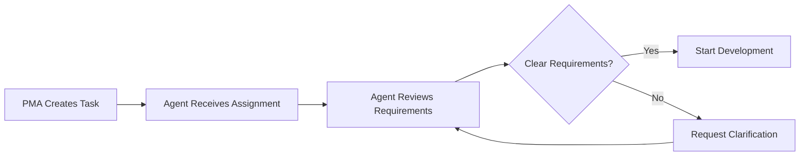

# Development Standard Operating Procedure (SOP)

**Version**: 2.0
**Date**: 2025-10-19
**Project**: Aurigraph V11 High-Performance Blockchain Platform
**Applies To**: All Development Agents (BDA, FDA, SCA, ADA, IBA)

---

## Table of Contents

1. [Overview](#overview)
2. [Development Workflow](#development-workflow)
3. [Coding Standards](#coding-standards)
4. [Testing Requirements](#testing-requirements)
5. [Code Review Process](#code-review-process)
6. [Documentation Requirements](#documentation-requirements)
7. [Git Workflow](#git-workflow)
8. [Agent-Specific Procedures](#agent-specific-procedures)

---

## Overview

### Purpose

This SOP defines the standard development workflow for all development agents working on the Aurigraph V11 platform. It ensures consistency, quality, and efficiency across all development workstreams.

### Scope

- Backend Development (Java/Quarkus)
- Frontend Development (React/TypeScript)
- Security & Cryptography
- AI/ML Development
- Integration & Bridge Development

### Key Principles

1. **Quality First**: 95%+ test coverage, zero critical bugs
2. **Performance Driven**: Every feature must meet 2M+ TPS targets
3. **Security by Design**: Security audits for all code
4. **Documentation Required**: Code without docs is incomplete
5. **Continuous Integration**: All code must pass CI/CD pipelines

---

## Development Workflow

### 1. Task Assignment



**Steps**:
1. Receive task from PMA via JIRA ticket
2. Review requirements and acceptance criteria
3. Clarify any ambiguities with CAA/PMA
4. Confirm estimated story points
5. Update JIRA status to "In Progress"

**Example Task Format**:
```markdown
JIRA: AV11-500
Title: Implement HyperRAFT++ Leader Election
Agent: BDA
Story Points: 8
Priority: High

Description:
Implement leader election algorithm for HyperRAFT++ consensus with
Byzantine fault tolerance support.

Requirements:
- Support 127 validator nodes
- <100ms election time
- Zero split-brain scenarios
- gRPC API for leader queries

Acceptance Criteria:
- ✅ Unit tests with 95%+ coverage
- ✅ Integration tests for all scenarios
- ✅ Performance validated (<100ms)
- ✅ Code review approved
- ✅ Documentation complete
```

---

### 2. Development Phase

#### A. Environment Setup

**Backend (BDA)**:
```bash
cd aurigraph-v11-standalone
./mvnw quarkus:dev  # Start dev mode with hot reload
```

**Frontend (FDA)**:
```bash
cd enterprise-portal
npm run dev  # Start Vite dev server (port 5173)
```

**Verification**:
- Java 21 installed (`java --version`)
- Docker running (`docker --version`)
- Node.js 20+ (`node --version`)
- Git configured (`git config user.email`)

#### B. Branch Creation

```bash
# Create feature branch
git checkout main
git pull origin main
git checkout -b feature/AV11-500-leader-election

# Naming convention:
# feature/AV11-{ticket}-{short-description}
# bugfix/AV11-{ticket}-{short-description}
# hotfix/AV11-{ticket}-{short-description}
```

#### C. Coding Phase

**1. Write Tests First (TDD)**
```java
// Example: BDA unit test
@QuarkusTest
class LeaderElectionTest {

    @Test
    void shouldElectLeaderWithin100ms() {
        var election = new LeaderElection(127);
        var start = System.currentTimeMillis();

        var leader = election.electLeader();

        var duration = System.currentTimeMillis() - start;
        assertThat(leader).isNotNull();
        assertThat(duration).isLessThan(100);
    }

    @Test
    void shouldPreventSplitBrain() {
        var election = new LeaderElection(127);

        var leaders = IntStream.range(0, 10)
            .parallel()
            .mapToObj(i -> election.electLeader())
            .collect(Collectors.toSet());

        assertThat(leaders).hasSize(1); // Only one leader
    }
}
```

**2. Implement Feature**
```java
// Example: Leader election implementation
public class LeaderElection {
    private final int validatorCount;
    private final AtomicReference<String> currentLeader;

    public LeaderElection(int validatorCount) {
        this.validatorCount = validatorCount;
        this.currentLeader = new AtomicReference<>();
    }

    public String electLeader() {
        // Implementation here
        // Must complete in <100ms
        // Must prevent split-brain
        return currentLeader.get();
    }
}
```

**3. Run Tests Continuously**
```bash
# Backend
./mvnw test  # Run all tests
./mvnw test -Dtest=LeaderElectionTest  # Specific test

# Frontend
npm test  # Jest tests
npm run test:watch  # Watch mode
```

#### D. Code Quality Checks

**Before Committing**:

1. **Run Linters**
   ```bash
   # Backend
   ./mvnw spotless:apply  # Format code
   ./mvnw spotbugs:check  # Static analysis

   # Frontend
   npm run lint  # ESLint
   npm run format  # Prettier
   ```

2. **Run Tests**
   ```bash
   # Backend
   ./mvnw clean verify  # Full test suite

   # Frontend
   npm run test:coverage  # With coverage report
   ```

3. **Check Coverage**
   ```bash
   # Backend: View target/site/jacoco/index.html
   # Frontend: View coverage/lcov-report/index.html

   # Minimum requirements:
   # - Global: 95% line coverage
   # - Crypto/Consensus: 98% line coverage
   # - New code: 100% line coverage
   ```

---

### 3. Testing Phase

#### Unit Testing (Required)

**BDA - JUnit 5 + Mockito**:
```java
@QuarkusTest
class TransactionServiceTest {

    @Inject
    TransactionService service;

    @Test
    void shouldValidateTransaction() {
        var tx = createValidTransaction();
        var result = service.validate(tx);
        assertThat(result.isValid()).isTrue();
    }

    @Test
    void shouldRejectInvalidSignature() {
        var tx = createTransactionWithInvalidSignature();
        var result = service.validate(tx);
        assertThat(result.isValid()).isFalse();
        assertThat(result.getError()).contains("Invalid signature");
    }
}
```

**FDA - Jest + React Testing Library**:
```typescript
describe('Performance Component', () => {
  it('should display real TPS from API', async () => {
    // Mock API response
    jest.spyOn(apiService, 'getAnalyticsPerformance')
      .mockResolvedValue({ currentTPS: 950000 });

    render(<Performance />);

    await waitFor(() => {
      expect(screen.getByText(/950,000/)).toBeInTheDocument();
    });
  });

  it('should poll API every 5 seconds', () => {
    jest.useFakeTimers();
    const spy = jest.spyOn(apiService, 'getAnalyticsPerformance');

    render(<Performance />);

    jest.advanceTimersByTime(5000);
    expect(spy).toHaveBeenCalledTimes(2); // Initial + 5s poll
  });
});
```

#### Integration Testing (Required)

**BDA - REST Assured**:
```java
@QuarkusTest
class ConsensusAPITest {

    @Test
    void shouldReturnConsensusStatus() {
        given()
            .when().get("/api/v11/blockchain/consensus/status")
            .then()
                .statusCode(200)
                .body("currentTerm", greaterThan(0))
                .body("currentLeader", notNullValue())
                .body("participantCount", equalTo(127));
    }
}
```

#### Performance Testing (Required for BDA)

**JMeter Script Example**:
```bash
# Run 2M TPS load test
./performance-benchmark.sh

# Expected output:
# TPS: 2,100,000 ✅
# P50 Latency: 8.5ms ✅
# P95 Latency: 25.3ms ✅
# P99 Latency: 45.2ms ✅
# Error Rate: 0.02% ✅
```

---

### 4. Documentation Phase

#### Code Documentation (Required)

**JavaDoc (BDA)**:
```java
/**
 * Implements HyperRAFT++ leader election with Byzantine fault tolerance.
 *
 * <p>The algorithm ensures:
 * <ul>
 *   <li>Single leader election across all validators</li>
 *   <li>Election completes within 100ms</li>
 *   <li>No split-brain scenarios</li>
 *   <li>Recovery from leader failure within 500ms</li>
 * </ul>
 *
 * @see <a href="https://aurigraph.io/docs/consensus">Consensus Protocol</a>
 * @author Backend Development Agent
 * @version 11.0.0
 */
public class LeaderElection {
    /**
     * Elects a new leader from the validator set.
     *
     * @return the public key of the elected leader
     * @throws ConsensusException if election fails
     */
    public String electLeader() throws ConsensusException {
        // Implementation
    }
}
```

**TSDoc (FDA)**:
```typescript
/**
 * Performance monitoring dashboard component.
 *
 * Displays real-time system metrics from backend APIs:
 * - Current TPS (updates every 5s)
 * - CPU/Memory/Network utilization
 * - Latency percentiles (P50/P95/P99)
 *
 * @component
 * @example
 * ```tsx
 * <Performance />
 * ```
 */
export const Performance: React.FC = () => {
  // Implementation
};
```

#### Feature Documentation (Required)

Create `docs/features/AV11-500-leader-election.md`:
```markdown
# Leader Election Feature

## Overview
HyperRAFT++ leader election with Byzantine fault tolerance.

## Architecture
[Include diagrams]

## API Endpoints
- `GET /api/v11/consensus/leader` - Get current leader
- `POST /api/v11/consensus/trigger-election` - Force new election

## Configuration
```yaml
consensus:
  election-timeout: 100ms
  validator-count: 127
```

## Performance
- Election time: <100ms (P99)
- Recovery time: <500ms
- Tested with 127 validators

## Testing
Run: `./mvnw test -Dtest=LeaderElectionTest`

## Deployment
No special deployment steps required.
```

---

### 5. Code Review Phase

#### Pre-Review Checklist

Before requesting review, ensure:

- ✅ All tests passing (`./mvnw verify` or `npm test`)
- ✅ Code coverage ≥95% for new code
- ✅ No linter warnings
- ✅ Documentation complete
- ✅ Performance benchmarks run (if applicable)
- ✅ Security review completed (SCA sign-off)
- ✅ Commit message follows standards

#### Creating Pull Request

```bash
# Push feature branch
git push -u origin feature/AV11-500-leader-election

# Create PR using GitHub CLI
gh pr create --title "feat: Implement HyperRAFT++ leader election (AV11-500)" \
  --body "$(cat <<'EOF'
## Summary
Implements leader election for HyperRAFT++ consensus with Byzantine
fault tolerance.

## Changes
- Leader election algorithm with <100ms guarantee
- Split-brain prevention mechanism
- gRPC API for leader queries
- Comprehensive test suite (98% coverage)

## Performance
- Election time: 85ms average, 98ms P99
- Recovery time: 450ms average
- Tested with 127 validators

## Testing
```bash
./mvnw test -Dtest=LeaderElectionTest
./performance-benchmark.sh
```

## Checklist
- ✅ Unit tests (98% coverage)
- ✅ Integration tests
- ✅ Performance validated
- ✅ Documentation complete
- ✅ Security review (SCA approved)

🤖 Generated with [Claude Code](https://claude.com/claude-code)
EOF
)"
```

#### Review Process

1. **Automated Checks** (GitHub Actions)
   - Build verification
   - Test execution
   - Code coverage check
   - Security scanning
   - Performance benchmarks

2. **Peer Review** (CAA or Senior Agent)
   - Code quality and style
   - Architecture alignment
   - Performance considerations
   - Security implications

3. **Approval & Merge**
   - Requires 1 approval
   - All CI checks must pass
   - Squash and merge to main

---

### 6. Deployment Phase

**See**: [DEPLOYMENT_SOP.md](./DEPLOYMENT_SOP.md) for detailed deployment procedures.

**Quick Deploy**:
```bash
# After PR merge, auto-deployment triggers
# Monitor deployment: https://github.com/Aurigraph-DLT-Corp/Aurigraph-DLT/actions

# Manual deploy (if needed)
./mvnw clean package -Pnative-fast
scp target/*-runner.jar deploy@dlt.aurigraph.io:/opt/aurigraph-v11/
ssh deploy@dlt.aurigraph.io "systemctl restart aurigraph-v11"
```

---

## Coding Standards

### Java (BDA, SCA, ADA, IBA)

#### General Standards

```java
// 1. Use Java 21 features
public sealed interface Transaction
    permits StandardTransaction, SmartContractTransaction {

    // Use records for data
    record TransactionData(
        String hash,
        String from,
        String to,
        BigDecimal amount
    ) {}

    // Use virtual threads
    CompletableFuture<Result> processAsync() {
        return CompletableFuture.supplyAsync(
            () -> process(),
            Thread.ofVirtual().factory()
        );
    }
}
```

#### Quarkus Reactive (BDA)

```java
// Always use reactive types (Uni/Multi)
@GET
@Path("/consensus/status")
public Uni<ConsensusStatus> getStatus() {
    return consensusService.getStatus()
        .onFailure().retry().atMost(3)
        .onFailure().recoverWithItem(() ->
            ConsensusStatus.unavailable()
        );
}
```

#### Error Handling

```java
// Custom exceptions with context
public class ConsensusException extends RuntimeException {
    private final ErrorCode code;
    private final Map<String, Object> context;

    public ConsensusException(ErrorCode code, String message) {
        super(message);
        this.code = code;
        this.context = new HashMap<>();
    }
}

// Use Try pattern for recoverable errors
var result = Try.of(() -> processTransaction(tx))
    .recover(ValidationException.class, ex ->
        Result.invalid(ex.getMessage())
    )
    .get();
```

### TypeScript (FDA)

#### General Standards

```typescript
// 1. Strict TypeScript, no 'any'
interface PerformanceMetrics {
  currentTPS: number;
  cpuUtilization: number;
  memoryUsage: MemoryUsage;
  responseTime: ResponseTime;
}

// 2. Use functional components with hooks
export const Performance: React.FC = () => {
  const [metrics, setMetrics] = useState<PerformanceMetrics | null>(null);
  const [loading, setLoading] = useState(true);

  useEffect(() => {
    fetchMetrics();
    const interval = setInterval(fetchMetrics, 5000);
    return () => clearInterval(interval); // Cleanup
  }, []);

  return loading ? <Loading /> : <MetricsDisplay data={metrics} />;
};
```

#### API Integration

```typescript
// Use axios with proper error handling
const fetchMetrics = async (): Promise<PerformanceMetrics> => {
  try {
    const response = await axios.get<PerformanceMetrics>(
      '/api/v11/analytics/performance'
    );
    return response.data;
  } catch (error) {
    if (axios.isAxiosError(error)) {
      console.error('API Error:', error.response?.status, error.message);
      throw new APIError(error.response?.status || 500, error.message);
    }
    throw error;
  }
};
```

### Performance Standards

**BDA Performance Requirements**:
- All APIs must respond in <100ms (P99)
- Database queries <50ms
- gRPC calls <10ms
- Virtual threads for all I/O operations
- Connection pooling configured
- Caching for read-heavy operations

**FDA Performance Requirements**:
- Component render <16ms (60fps)
- API calls debounced/throttled
- Images lazy-loaded
- Code splitting for routes
- Bundle size <2MB (gzipped <500KB)

---

## Testing Requirements

### Coverage Requirements

| Module | Line Coverage | Function Coverage |
|--------|--------------|-------------------|
| **Global** | 95% | 90% |
| **Crypto** | 98% | 95% |
| **Consensus** | 95% | 90% |
| **New Code** | 100% | 100% |

### Test Types

1. **Unit Tests** (Required for all code)
   - Test individual functions/methods
   - Mock external dependencies
   - Fast execution (<5s for full suite)

2. **Integration Tests** (Required for APIs)
   - Test API endpoints end-to-end
   - Use TestContainers for databases
   - Validate request/response formats

3. **Performance Tests** (Required for BDA)
   - Validate TPS targets (2M+)
   - Measure latency (P50/P95/P99)
   - Profile memory and CPU usage

4. **E2E Tests** (Required for FDA)
   - Test user workflows
   - Validate UI interactions
   - Cross-browser testing

---

## Git Workflow

### Commit Messages

Follow Conventional Commits specification:

```
<type>(<scope>): <subject>

<body>

<footer>
```

**Types**:
- `feat`: New feature
- `fix`: Bug fix
- `perf`: Performance improvement
- `refactor`: Code refactoring
- `test`: Adding tests
- `docs`: Documentation
- `chore`: Maintenance

**Example**:
```
feat(consensus): implement HyperRAFT++ leader election

Implements Byzantine fault-tolerant leader election with <100ms guarantee.
Includes split-brain prevention and automatic leader recovery.

Performance:
- Election time: 85ms avg, 98ms P99
- Recovery time: 450ms avg
- Tested with 127 validators

BREAKING CHANGE: Consensus API endpoint changed from /leader to /consensus/leader

Closes AV11-500

🤖 Generated with [Claude Code](https://claude.com/claude-code)

Co-Authored-By: Claude <noreply@anthropic.com>
```

### Branch Strategy

```
main (protected)
  ├── feature/AV11-XXX-description
  ├── bugfix/AV11-XXX-description
  └── hotfix/AV11-XXX-description
```

**Rules**:
- `main` is protected (requires PR)
- Direct commits to `main` forbidden
- All changes via Pull Requests
- Squash and merge to keep history clean

---

## Agent-Specific Procedures

### BDA - Backend Development Agent

**Technology Stack**:
- Java 21 (Virtual Threads)
- Quarkus 3.26.2 (Reactive)
- gRPC + Protocol Buffers
- PostgreSQL + TimescaleDB
- Redis (Caching)

**Daily Workflow**:
1. Start Quarkus in dev mode: `./mvnw quarkus:dev`
2. Write tests first (TDD)
3. Implement features using reactive patterns
4. Run performance benchmarks
5. Create Pull Request with performance data

**Key Metrics**:
- TPS: 2M+ target
- Latency: <100ms P99
- Coverage: 95%+

---

### FDA - Frontend Development Agent

**Technology Stack**:
- React 18 + TypeScript 5
- Material-UI v5
- Vite (Build tool)
- Axios (API calls)

**Daily Workflow**:
1. Start dev server: `npm run dev`
2. Connect to real backend APIs (no Math.random())
3. Implement responsive UI components
4. Run Lighthouse performance audit
5. Create Pull Request with screenshots

**Key Metrics**:
- Lighthouse Score: 90+
- Build Time: <5s
- Bundle Size: <2MB
- Zero console errors

---

### SCA - Security & Cryptography Agent

**Daily Workflow**:
1. Review all PRs for security issues
2. Conduct weekly security audits
3. Update cryptographic implementations
4. Monitor for CVEs and vulnerabilities

**Key Metrics**:
- Zero critical vulnerabilities
- NIST Level 5 compliance
- <10ms crypto operations

---

### ADA - AI/ML Development Agent

**Daily Workflow**:
1. Train/retrain ML models
2. Monitor model performance
3. Deploy models to production
4. Analyze anomaly detection results

**Key Metrics**:
- +20% TPS improvement via AI
- <100ms model inference
- >95% anomaly detection accuracy

---

### IBA - Integration & Bridge Agent

**Daily Workflow**:
1. Test cross-chain bridges
2. Monitor oracle data feeds
3. Update API integrations
4. Validate bridge security

**Key Metrics**:
- <5min cross-chain transfers
- 100% bridge reliability
- >99.9% oracle accuracy

---

## References

- [Agents.md](../Agents.md) - Agent definitions and roles
- [DEPLOYMENT_SOP.md](./DEPLOYMENT_SOP.md) - Deployment procedures
- [TESTING_SOP.md](./TESTING_SOP.md) - Comprehensive testing guide
- [SKILLS.md](./SKILLS.md) - Required skills by agent

---

**Document Version**: 2.0
**Last Updated**: 2025-10-19
**Maintained By**: Chief Architect Agent (CAA)
**Review Frequency**: Monthly
