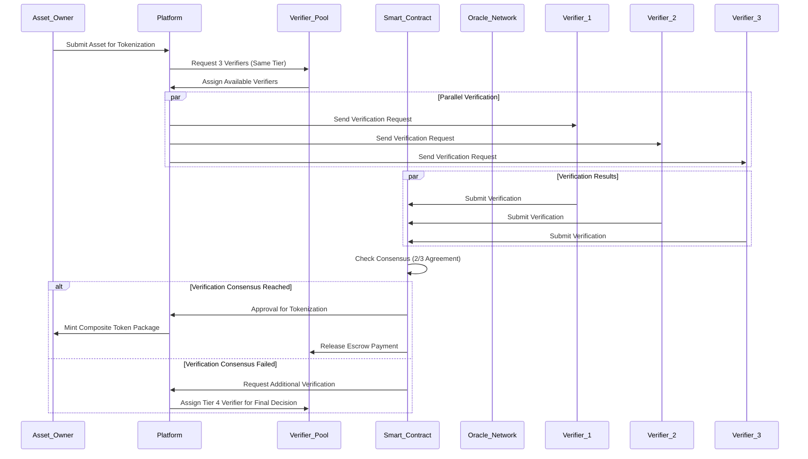

# Composite wAUR Token Architecture - PRD Extension

**Document Version**: 1.0  
**Last Updated**: September 13, 2025  
**Status**: In Development  
**Component**: Real World Asset Tokenization Platform  

---

## 🏗️ **COMPOSITE TOKEN ARCHITECTURE OVERVIEW**

### **Product Vision**
Revolutionize real-world asset (RWA) tokenization through a comprehensive composite token system that combines primary asset representation with rich metadata, third-party verification, and complete asset lifecycle management.

### **Key Innovation**
Move beyond simple asset tokenization to create **composite digital asset packages** that include:
- Primary asset ownership tokens
- Verification and attestation tokens from trusted third parties
- Rich media and documentation tokens
- Compliance and regulatory tokens
- Real-time valuation and market data tokens

---

## 🏛️ **COMPOSITE TOKEN STRUCTURE**

### **Architecture Overview**
Each real-world asset is tokenized as a **composite package** consisting of:

```
wAUR-COMPOSITE-{ASSET_ID}
├── PRIMARY TOKEN (Core Asset)
│   └── wAUR-ASSET-{ID} (ERC-721)
└── SECONDARY TOKENS (Metadata Ecosystem)
    ├── wAUR-OWNER-{ID} (Ownership & History)
    ├── wAUR-COLL-{ID}[] (Collateral Bundle)
    ├── wAUR-MEDIA-{ID}[] (Rich Media Collection)
    ├── wAUR-VERIFY-{ID}[] (Third-party Verification)
    ├── wAUR-VALUE-{ID} (Valuation Data)
    └── wAUR-COMPLY-{ID} (Compliance Record)
```

### **Primary Token Specifications**

#### **wAUR-ASSET-{ID} (Core Asset Token)**
- **Standard**: ERC-721 (Non-Fungible Token)
- **Purpose**: Legal representation of real-world asset ownership
- **Uniqueness**: Each asset has exactly one primary token
- **Transferability**: Can be transferred only with complete verification package
- **Fractional Support**: Can be fractionalized using ERC-1155 for partial ownership

**Properties**:
- `assetId`: Unique global identifier
- `assetType`: Category (real estate, carbon credit, commodity, financial)
- `legalTitle`: Hash of legal ownership documents
- `jurisdiction`: Legal jurisdiction and applicable law
- `coordinates`: GPS location (if applicable)
- `verificationRequirement`: Required verification level
- `fractionalizable`: Whether asset supports partial ownership

### **Secondary Token Specifications**

#### **1. wAUR-OWNER-{ID} (Ownership Record Token)**
- **Standard**: ERC-721 (Non-Fungible Token)
- **Purpose**: Current ownership and complete transfer history
- **Linkage**: Cryptographically linked to primary asset token

**Properties**:
- `currentOwner`: Current holder wallet address
- `ownershipPercentage`: Percentage ownership (for fractional assets)
- `transferHistory`: Complete chain of ownership transfers
- `acquisitionDate`: When current owner acquired the asset
- `acquisitionPrice`: Purchase price (if public)
- `ownerKYCStatus`: KYC verification status of current owner

#### **2. wAUR-COLL-{ID}[] (Collateral Bundle Tokens)**
- **Standard**: ERC-1155 (Multi-Token Standard)
- **Purpose**: Insurance, guarantees, and additional backing assets
- **Quantity**: Multiple collateral tokens per asset

**Collateral Types**:
- `INSURANCE`: Insurance policies covering the asset
- `GUARANTEE`: Third-party guarantees and warranties
- `ESCROW`: Escrowed funds for performance guarantees
- `BACKUP_ASSET`: Additional assets providing security

**Properties per Collateral**:
- `collateralType`: Type of collateral backing
- `provider`: Insurance company or guarantor
- `coverage`: Coverage amount and terms
- `expiration`: Expiration date of coverage
- `claimHistory`: History of claims against collateral

#### **3. wAUR-MEDIA-{ID}[] (Rich Media Collection)**
- **Standard**: ERC-1155 (Multi-Token Standard)
- **Purpose**: Visual, documentary, and digital representations
- **Storage**: IPFS with redundant node storage

**Media Categories**:
- `IMAGES`: High-resolution property photos, drone imagery
- `VIDEOS`: Property tours, 360° walkthroughs
- `DOCUMENTS`: Contracts, deeds, certificates, reports
- `3D_MODELS`: Digital twin 3D representations
- `LIVE_DATA`: Real-time IoT sensor feeds (temperature, occupancy, etc.)

**Properties per Media Token**:
- `mediaType`: Image, video, document, model, data
- `ipfsHash`: IPFS content hash for decentralized storage
- `resolution`: Quality/resolution specification
- `timestamp`: Creation or last update timestamp
- `verificationStatus`: Whether media has been verified as authentic
- `accessLevel`: Public, owner-only, or verifier-only access

#### **4. wAUR-VERIFY-{ID}[] (Third-party Verification Tokens)**
- **Standard**: ERC-721 (Non-Fungible Token)
- **Purpose**: Attestations from certified third-party verifiers
- **Authority**: Only certified verifiers can mint these tokens

**Verifier Categories**:
- `APPRAISER`: Licensed property appraisers
- `AUDITOR`: Certified accounting firms (Big 4 preferred)
- `LEGAL`: Qualified law firms for legal verification
- `REGULATORY`: Government or regulatory body approval
- `TECHNICAL`: Engineering or technical assessment firms
- `ENVIRONMENTAL`: Environmental impact and sustainability auditors

**Properties per Verification Token**:
- `verifierAddress`: Ethereum address of certified verifier
- `verifierCredentials`: Professional licenses and certifications
- `verificationDate`: When verification was performed
- `verificationExpiry`: When verification expires (if applicable)
- `verificationScope`: What aspects were verified
- `verificationReport`: IPFS hash of detailed verification report
- `verificationLevel`: Basic, Enhanced, Certified, Institutional

#### **5. wAUR-VALUE-{ID} (Valuation Data Token)**
- **Standard**: ERC-20 (Fungible Token)
- **Purpose**: Real-time and historical valuation data
- **Updates**: Continuous updates via oracle networks

**Valuation Components**:
- `currentValue`: Real-time market value
- `lastUpdate`: Timestamp of last valuation update
- `historicalPrices`: 30-day price history
- `volatilityIndex`: Price volatility measurement
- `liquidityScore`: Asset liquidity assessment (1-100)
- `marketTrends`: AI-driven market trend analysis
- `comparables`: Similar asset pricing data

#### **6. wAUR-COMPLY-{ID} (Compliance Record Token)**
- **Standard**: ERC-721 (Non-Fungible Token)
- **Purpose**: Regulatory compliance and legal status tracking
- **Updates**: Automated compliance monitoring

**Compliance Elements**:
- `kycStatus`: Know Your Customer verification status
- `amlClearance`: Anti-Money Laundering clearance
- `regulatoryApproval`: Jurisdiction-specific regulatory approvals
- `taxCompliance`: Tax filing and payment status
- `reportingRequirements`: Required regulatory reporting
- `sanctionScreening`: OFAC and sanctions list screening

---

## 🏛️ **THIRD-PARTY VERIFICATION FRAMEWORK**

### **Certified Verifier Network**

#### **Verifier Categories and Requirements**

**Tier 1 - Basic Verification**:
- **Requirements**: Local professional licenses, 2+ years experience
- **Scope**: Document verification, basic asset inspection
- **Examples**: Local appraisers, certified inspectors
- **Compensation**: 0.05% of asset value

**Tier 2 - Enhanced Verification**:
- **Requirements**: Regional certification, 5+ years experience, insurance coverage
- **Scope**: Comprehensive asset evaluation, market analysis
- **Examples**: Regional appraisal firms, certified environmental auditors
- **Compensation**: 0.1% of asset value

**Tier 3 - Certified Verification**:
- **Requirements**: National certification, 10+ years experience, institutional clients
- **Scope**: Full due diligence, compliance verification, risk assessment
- **Examples**: Major appraisal firms, environmental consulting companies
- **Compensation**: 0.15% of asset value

**Tier 4 - Institutional Verification**:
- **Requirements**: Big 4 accounting firms, major law firms, regulatory bodies
- **Scope**: Complete institutional-grade verification and compliance
- **Examples**: Deloitte, PwC, EY, KPMG, major legal firms
- **Compensation**: 0.2% of asset value

### **Verification Process Flow**



### **Verification Consensus Mechanism**

**Standard Consensus (2/3 Agreement)**:
- Minimum 2 out of 3 verifiers must agree on asset validity
- Agreement threshold: 90% alignment on key metrics
- Automatic approval if consensus reached
- Escrow release to verifiers upon successful consensus

**Dispute Resolution Process**:
- If consensus fails, escalate to higher tier verifier
- Tier 4 verifier provides binding final decision
- Additional verification costs borne by platform insurance fund
- Appeal process available through DAO governance

**Verifier Performance Tracking**:
- **Accuracy Score**: Percentage of verifications later validated
- **Timeliness Score**: Average time to complete verifications
- **Dispute Rate**: Percentage of verifications disputed
- **Overall Rating**: Combined performance metric (1-100)
- **Stake Requirements**: Higher-performing verifiers can stake for better positioning

---

## 💻 **TECHNICAL IMPLEMENTATION**

### **Smart Contract Architecture**

#### **Core Contracts**

**1. CompositeTokenFactory.sol**
```solidity
contract CompositeTokenFactory {
    mapping(uint256 => CompositeToken) public compositeTokens;
    mapping(address => bool) public certifiedVerifiers;
    
    function createCompositeToken(
        address assetOwner,
        bytes32 assetHash,
        AssetType assetType,
        VerificationTier requiredTier
    ) external returns (uint256 compositeTokenId);
    
    function addVerification(
        uint256 compositeTokenId,
        bytes32 verificationReport,
        VerificationResult result
    ) external onlyCertifiedVerifier;
}
```

**2. VerifierRegistry.sol**
```solidity
contract VerifierRegistry {
    struct Verifier {
        address verifierAddress;
        VerificationTier tier;
        bytes32[] credentials;
        uint256 successRate;
        uint256 totalVerifications;
        bool isActive;
    }
    
    mapping(address => Verifier) public verifiers;
    
    function registerVerifier(
        address verifier,
        VerificationTier tier,
        bytes32[] credentials
    ) external onlyAdmin;
    
    function updateVerifierPerformance(
        address verifier,
        bool successful
    ) external onlyPlatform;
}
```

**3. AssetValuation.sol**
```solidity
contract AssetValuation {
    mapping(uint256 => ValuationData) public valuations;
    mapping(address => bool) public approvedOracles;
    
    struct ValuationData {
        uint256 currentValue;
        uint256 lastUpdate;
        uint256[] historicalPrices;
        uint8 confidenceScore;
    }
    
    function updateValuation(
        uint256 assetId,
        uint256 newValue,
        bytes calldata oracleSignature
    ) external onlyApprovedOracle;
}
```

### **Token Standards Implementation**

**Primary Token (ERC-721)**:
- Unique identifier for each real-world asset
- Non-transferable without complete verification package
- Metadata includes legal and physical asset properties

**Secondary Tokens (ERC-1155)**:
- Batch operations for efficient gas usage
- Multiple token types in single contract
- Flexible supply (fungible and non-fungible combinations)

**Cross-Chain Bridge Support**:
- LayerZero integration for seamless cross-chain transfers
- Verification state synchronization across chains
- Atomic swaps with verification package integrity

### **Oracle Integration**

**Price Feed Oracles**:
- Chainlink: Primary price feeds with highest reliability
- Band Protocol: Secondary price feeds for redundancy
- Custom oracles: Specialized asset-specific pricing

**Verification Oracles**:
- Document authenticity verification
- Legal status monitoring
- Compliance status updates
- Market condition assessments

---

## 📊 **ECONOMIC MODEL**

### **Revenue Streams**

**1. Asset Tokenization Fees**
- **Base Fee**: 0.5% of asset value (one-time)
- **Minimum Fee**: $500 per asset
- **Maximum Fee**: $50,000 per asset (for mega assets)
- **Volume Discounts**: Tiered pricing for institutional clients

**2. Verification Fees**
- **Tier 1**: 0.05% to verifiers, 0.02% platform fee
- **Tier 2**: 0.10% to verifiers, 0.03% platform fee
- **Tier 3**: 0.15% to verifiers, 0.04% platform fee
- **Tier 4**: 0.20% to verifiers, 0.05% platform fee

**3. Ongoing Service Fees**
- **Storage Fee**: $10/month per asset (IPFS hosting)
- **Valuation Updates**: $5 per oracle update
- **Transfer Fee**: 0.05% per ownership transfer
- **Compliance Monitoring**: $25/month per asset

### **Revenue Distribution Model**

| Stakeholder | Percentage | Purpose |
|-------------|------------|----------|
| **Verifiers** | 35% | Performance-based verification rewards |
| **Platform** | 25% | Development, operations, and maintenance |
| **Validators** | 20% | Network security and consensus |
| **DAO Treasury** | 15% | Governance, growth, and community initiatives |
| **Insurance Fund** | 5% | Asset protection and dispute resolution |

### **Tokenomics and Incentives**

**Verifier Incentives**:
- Base compensation for successful verifications
- Performance bonuses for high accuracy and speed
- Stake rewards for long-term platform commitment
- Reputation scores affecting assignment priority

**Platform Utility Token (AUR)**:
- Required for asset tokenization fees
- Staking for premium platform features
- Governance voting rights in DAO
- Validator rewards and penalties

**Asset Owner Benefits**:
- Global liquidity for traditionally illiquid assets
- Fractional ownership capabilities
- Transparent price discovery
- Reduced transaction costs vs traditional markets
- 24/7 tradeable markets

---

## 🎯 **GO-TO-MARKET STRATEGY**

### **Target Markets and Asset Classes**

**Phase 1 (Q1 2025): Real Estate Focus**
- **Target**: $200M TVL in real estate assets
- **Geographic Focus**: United States (REIT-friendly regulations)
- **Asset Types**: Commercial real estate, residential rental properties
- **Partners**: Major real estate investment firms, property management companies

**Phase 2 (Q2 2025): Carbon Credits Expansion**
- **Target**: $100M TVL in carbon credits
- **Geographic Focus**: Global (focus on VCS and Gold Standard projects)
- **Asset Types**: Forestry, renewable energy, industrial reduction projects
- **Partners**: Carbon offset project developers, environmental consultancies

**Phase 3 (Q3 2025): Commodities Integration**
- **Target**: $150M TVL in physical commodities
- **Geographic Focus**: Global commodity exchanges
- **Asset Types**: Precious metals, agricultural products, energy commodities
- **Partners**: Commodity traders, storage facilities, exchanges

**Phase 4 (Q4 2025): Financial Assets**
- **Target**: $50M TVL in financial instruments
- **Geographic Focus**: Regulated financial markets
- **Asset Types**: Bonds, structured products, insurance policies
- **Partners**: Investment banks, asset managers, insurance companies

### **Partnership Strategy**

**Tier 1 Partners (Strategic)**:
- **Big 4 Accounting Firms**: Deloitte, PwC, EY, KPMG for institutional verification
- **Major Law Firms**: Top 50 global firms for legal verification and compliance
- **Rating Agencies**: Moody's, S&P, Fitch for credit and risk assessment

**Tier 2 Partners (Operational)**:
- **Regional Appraisal Firms**: Local expertise and market knowledge
- **Environmental Consultancies**: Specialized carbon and sustainability verification
- **Technology Providers**: IPFS infrastructure, oracle services, security auditors

**Tier 3 Partners (Distribution)**:
- **DeFi Protocols**: Uniswap, Aave, Compound for liquidity and lending
- **Institutional Platforms**: Coinbase Institutional, Galaxy Digital for enterprise access
- **Wealth Management**: Traditional wealth managers for client asset tokenization

---

## 🛡️ **RISK MANAGEMENT AND COMPLIANCE**

### **Risk Categories and Mitigation**

**1. Asset Verification Risks**
- **Risk**: Fraudulent or inaccurate asset representation
- **Mitigation**: Multi-tier verification system with 2/3 consensus requirement
- **Insurance**: $10M verification error insurance fund
- **Recovery**: Asset freeze and investigation process for disputed verifications

**2. Regulatory Compliance Risks**
- **Risk**: Changing regulations in different jurisdictions
- **Mitigation**: Automated compliance monitoring and legal partnerships
- **Response**: Jurisdiction-specific compliance tokens with automatic updates
- **Coverage**: Legal partnership with top law firms in major markets

**3. Technology and Security Risks**
- **Risk**: Smart contract vulnerabilities and platform hacks
- **Mitigation**: Multi-signature controls, formal verification, security audits
- **Insurance**: $50M smart contract insurance coverage
- **Response**: Rapid response team and emergency pause capabilities

**4. Market and Liquidity Risks**
- **Risk**: Asset value volatility and liquidity crunches
- **Mitigation**: Diversified oracle networks and automated market makers
- **Insurance**: Market maker incentives and liquidity provision rewards
- **Response**: Circuit breakers and volatility management systems

### **Compliance Framework**

**Regulatory Requirements by Jurisdiction**:

**United States**:
- SEC registration for securities tokens
- CFTC oversight for commodity derivatives
- FinCEN compliance for money transmission
- State-level real estate licensing requirements

**European Union**:
- GDPR compliance for personal data
- MiCA (Markets in Crypto Assets) regulation
- AIFMD for alternative investment funds
- National real estate regulations

**Asia-Pacific**:
- MAS guidelines (Singapore) for digital assets
- FSA oversight (Japan) for crypto assets
- ASIC requirements (Australia) for financial products
- Local real estate and commodity regulations

**Automated Compliance Features**:
- **KYC Integration**: Automated identity verification through third-party providers
- **AML Screening**: Real-time transaction monitoring and sanctions screening
- **Tax Reporting**: Automated tax calculation and reporting for token holders
- **Regulatory Updates**: Smart contract updates for changing regulatory requirements

---

## 📈 **SUCCESS METRICS AND KPIs**

### **Platform Metrics**

**Growth Metrics**:
- **Total Value Locked (TVL)**: Target $500M within 12 months
- **Number of Assets Tokenized**: Target 10,000 assets within 18 months
- **Active Verifiers**: Target 500 certified verifiers globally
- **Cross-Chain Volume**: Target 25% of transactions on non-Ethereum chains

**Quality Metrics**:
- **Verification Accuracy**: Target 98%+ accuracy rate
- **Dispute Resolution Time**: Target <72 hours average resolution
- **Compliance Score**: Target 100% regulatory compliance across jurisdictions
- **Security Incidents**: Target zero security breaches or asset losses

**User Adoption Metrics**:
- **Institutional Clients**: Target 100+ institutional users
- **Individual Investors**: Target 50,000+ retail participants
- **Geographic Coverage**: Target presence in 25+ countries
- **Asset Categories**: Target coverage of 10+ major asset types

### **Financial Metrics**

**Revenue Targets**:
- **Q1 2025**: $2M revenue (real estate focus)
- **Q2 2025**: $5M revenue (carbon credits expansion)
- **Q3 2025**: $8M revenue (commodities integration)
- **Q4 2025**: $12M revenue (financial assets)
- **Year 1 Total**: $27M revenue target

**Profitability Timeline**:
- **Break-even**: Month 18 (Q3 2025)
- **Positive Cash Flow**: Month 24 (Q1 2026)
- **10% Net Margin**: Month 30 (Q3 2026)
- **Scale Economics**: Month 36 (Q1 2027)

---

## 🔮 **FUTURE ROADMAP AND INNOVATION**

### **Technology Roadmap**

**2025 Q1-Q2: Foundation**
- Complete composite token implementation
- Launch certified verifier network
- Deploy real estate tokenization MVP
- Integrate with 3 major DeFi protocols

**2025 Q3-Q4: Expansion**
- Multi-chain deployment (5+ chains)
- AI-powered asset valuation
- Advanced fractional ownership features
- Institutional custody integration

**2026 Q1-Q2: Innovation**
- Zero-knowledge privacy features
- Quantum-resistant cryptography upgrade
- Automated compliance across 10+ jurisdictions
- Machine learning fraud detection

**2026 Q3-Q4: Scale**
- Global verifier network (50+ countries)
- Integration with traditional finance systems
- Corporate treasury asset tokenization
- Central bank digital currency (CBDC) compatibility

### **Business Model Evolution**

**Phase 1: Platform Business**
- Transaction-based revenue model
- Focus on high-value asset tokenization
- Premium services for institutional clients

**Phase 2: Network Effects**
- Ecosystem revenue from partner integrations
- Data and analytics services monetization
- Automated market making and liquidity provision

**Phase 3: Financial Services**
- Lending and borrowing against tokenized assets
- Insurance and risk management products
- Investment management and advisory services

**Phase 4: Infrastructure Provider**
- White-label tokenization solutions
- API and developer platform monetization
- Enterprise blockchain-as-a-service

---

## ✅ **CONCLUSION**

The Composite wAUR Token Architecture represents a revolutionary approach to real-world asset tokenization, moving beyond simple asset representation to create comprehensive digital asset packages that include:

- **Complete Asset Packages**: Primary ownership tokens plus rich metadata ecosystem
- **Trusted Verification**: Multi-tier third-party verification with consensus mechanisms
- **Rich Media Integration**: Visual and documentary evidence stored on decentralized networks
- **Real-time Valuation**: AI-driven pricing with multiple oracle integration
- **Regulatory Compliance**: Automated compliance monitoring and reporting
- **Global Accessibility**: Cross-chain interoperability with major blockchain networks

This architecture positions Aurigraph to capture significant market share in the **$100+ trillion global asset tokenization opportunity** while maintaining the highest standards of security, compliance, and user experience.

**Next Steps**:
1. Technical implementation of composite token smart contracts
2. Onboarding of Tier 1-4 verification partners
3. Regulatory approval in key jurisdictions
4. Launch of real estate tokenization MVP
5. Integration with major DeFi protocols for liquidity

The composite token approach creates a **sustainable competitive advantage** through network effects, quality assurance, and comprehensive asset representation that traditional tokenization platforms cannot match.

---

*This PRD extension forms the foundation for the next generation of real-world asset tokenization, combining blockchain innovation with real-world utility and institutional-grade quality assurance.*