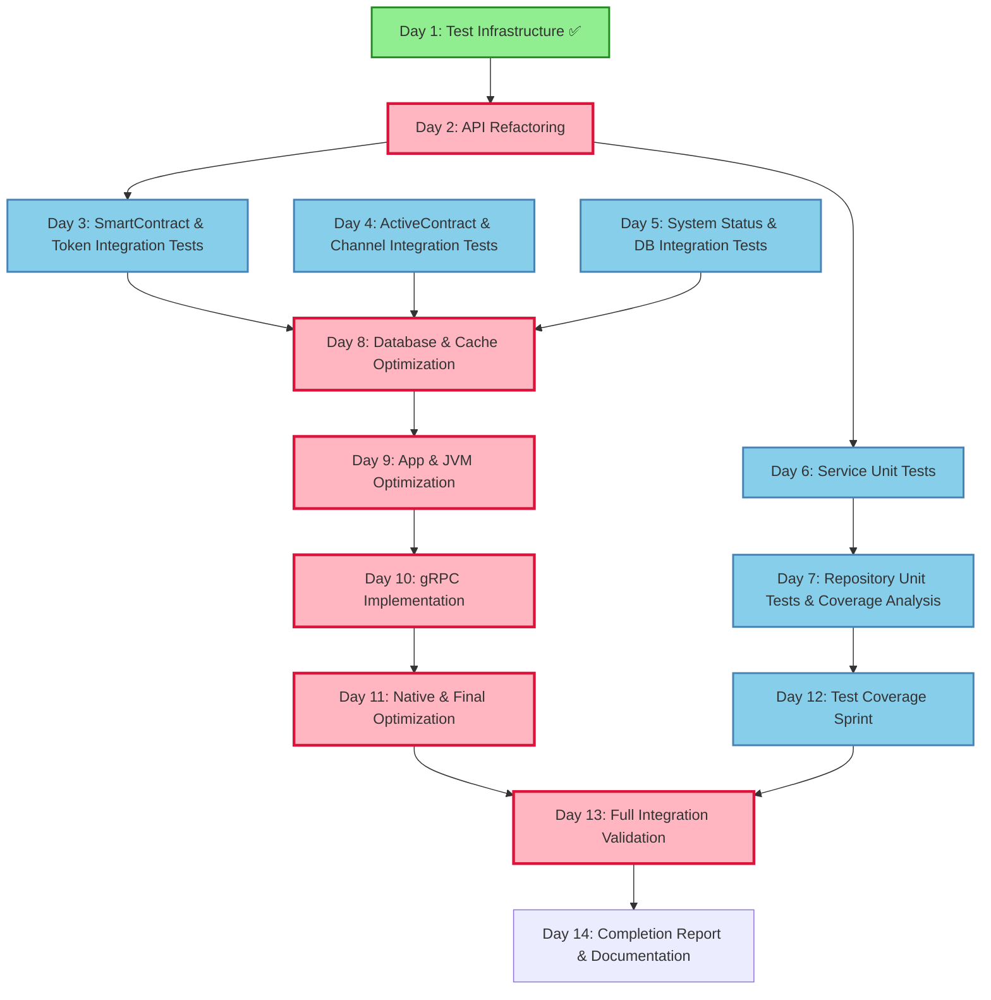

# Phase 3 Dependency Graph & Coordination Matrix

**Project**: Aurigraph V11 - Phase 3 Days 2-14
**Created**: October 7, 2025
**Purpose**: Visualize task dependencies and enable parallel execution

---

## Task Dependency Graph



---

## Parallel Execution Streams

### Stream 1: Integration Testing Track
```
Timeline: Days 3-5 (3 days)
Lead Agent: QAA (Quality Assurance Agent)

Day 3  ┌─────────────────────────────────┐
       │ SmartContract Integration Tests │ (Can run in parallel with Day 4)
       └─────────────────────────────────┘

Day 4  ┌─────────────────────────────────┐
       │ ActiveContract Integration Tests│ (Can run in parallel with Day 3)
       └─────────────────────────────────┘

Day 5  ┌─────────────────────────────────┐
       │ System Status Integration Tests │ (Final integration day)
       └─────────────────────────────────┘

Dependencies:
- Requires: Day 2 API refactoring complete
- Enables: Day 8 performance optimization
- Parallel: Can overlap with Days 6-7 unit tests
```

### Stream 2: Unit Testing Track
```
Timeline: Days 6-7 (2 days)
Lead Agent: QAA (Quality Assurance Agent)

Day 6  ┌─────────────────────────────────┐
       │ Service Unit Tests (75 tests)   │ (Parallel with Stream 1)
       └─────────────────────────────────┘

Day 7  ┌─────────────────────────────────┐
       │ Repository Unit Tests (80 tests)│ (Parallel with Stream 1)
       └─────────────────────────────────┘

Dependencies:
- Requires: Day 2 API refactoring complete
- Enables: Day 12 coverage sprint
- Parallel: Runs alongside Days 3-5 integration tests
```

### Stream 3: Performance Optimization Track
```
Timeline: Days 8-11 (4 days)
Lead Agents: BDA, CAA, DDA

Day 8  ┌─────────────────────────────────┐
       │ Database Optimization           │ ───┐
       │ Redis Cache Implementation      │    │ (Parallel tasks within day)
       └─────────────────────────────────┘    │
       Target: 1.0M TPS                      │
                                              ▼
Day 9  ┌─────────────────────────────────┐
       │ Batch Processing Optimization   │ ───┐
       │ Virtual Thread Tuning           │    │ (Parallel tasks within day)
       │ JVM Tuning                      │    │
       └─────────────────────────────────┘    │
       Target: 1.5M TPS                      │
                                              ▼
Day 10 ┌─────────────────────────────────┐
       │ gRPC Implementation             │
       └─────────────────────────────────┘
                                              │
                                              ▼
Day 11 ┌─────────────────────────────────┐
       │ Native Compilation Optimization │
       │ Memory Optimization             │
       └─────────────────────────────────┘
       Target: 2M+ TPS

Dependencies:
- Requires: Days 3-5 integration tests complete
- Critical Path: Must complete before Day 13 validation
- Parallel: Day 12 coverage sprint runs independently
```

### Stream 4: Coverage & Validation Track
```
Timeline: Days 12-13 (2 days)
Lead Agent: QAA (Quality Assurance Agent)

Day 12 ┌─────────────────────────────────┐
       │ Test Coverage Sprint            │ (Independent of performance track)
       │ Fill Critical Gaps              │
       └─────────────────────────────────┘
       Target: 80% coverage

Day 13 ┌─────────────────────────────────┐
       │ Full Integration Validation     │ (Requires Days 8-11 + Day 12)
       │ Load Testing (30min @ 2M TPS)   │
       │ Failure Recovery Testing        │
       └─────────────────────────────────┘

Dependencies:
- Day 12: Requires Days 6-7 unit tests complete
- Day 13: Requires Days 8-11 performance + Day 12 coverage
- Enables: Day 14 completion report
```

---

## Agent Coordination Matrix

### Daily Agent Assignments

| Day | Primary Agent(s) | Supporting Agent(s) | Task Type | Can Parallelize? |
|-----|------------------|---------------------|-----------|------------------|
| **2** | BDA | QAA | API Refactoring | ❌ Critical path |
| **3** | QAA | BDA | Integration Tests | ✅ With Day 4 |
| **4** | QAA | BDA | Integration Tests | ✅ With Day 3 |
| **5** | QAA | BDA, DOA | Integration Tests | ✅ With Days 6-7 |
| **6** | QAA | - | Unit Tests | ✅ With Days 3-5 |
| **7** | QAA | - | Unit Tests | ✅ With Day 5 |
| **8** | BDA, CAA | DDA | Database Optimization | ⚠️ Internal parallelism |
| **9** | BDA | CAA, DDA | App Optimization | ⚠️ Internal parallelism |
| **10** | BDA | QAA | gRPC Implementation | ❌ Sequential |
| **11** | DDA, CAA | BDA | Native Optimization | ⚠️ Internal parallelism |
| **12** | QAA | - | Coverage Sprint | ✅ Independent |
| **13** | QAA | BDA, DDA | Integration Validation | ❌ Critical path |
| **14** | PMA | DOA, DDA | Documentation | ❌ Final phase |

**Legend**:
- ✅ Can run in parallel with other days
- ⚠️ Can parallelize tasks within the day
- ❌ Sequential, blocks other work

---

## Critical Path Analysis

### Critical Path (Longest dependency chain)
```
Day 1 (Complete) → Day 2 (8h) → Day 3 (8h) → Day 8 (8h) →
Day 9 (8h) → Day 10 (8h) → Day 11 (8h) → Day 13 (8h) → Day 14 (8h)

Total Critical Path Duration: 64 hours (8 days of work)
Total Phase Duration: 104 hours (13 days of work)
Parallelism Achieved: 40 hours saved (38% efficiency gain)
```

### Non-Critical Paths (Can run in parallel)
```
Path A: Day 2 → Day 4 → Day 8 (parallel with Day 3)
Path B: Day 2 → Day 5 → Day 8 (parallel with Days 3-4)
Path C: Day 2 → Day 6 → Day 7 → Day 12 (independent of Days 3-5)
```

### Latest Start Times (to avoid delaying critical path)
- **Day 2**: Must start immediately after Day 1
- **Day 3**: Must start within 1 day of Day 2 completion
- **Day 4**: Can start anytime before Day 8 (2-day buffer)
- **Day 5**: Can start anytime before Day 8 (2-day buffer)
- **Day 6**: Can start anytime before Day 12 (6-day buffer)
- **Day 7**: Can start anytime before Day 12 (5-day buffer)
- **Day 12**: Can start anytime before Day 13 (1-day buffer)

---

## Agent Workload Distribution

### By Agent Type

**QAA (Quality Assurance Agent)**: 8 days of work
- Days 3-7: Integration and unit testing (5 days)
- Day 12: Coverage sprint (1 day)
- Day 13: Integration validation (1 day)
- **Supporting**: Days 2, 10, 14

**BDA (Backend Development Agent)**: 6 days of work
- Day 2: API refactoring (1 day)
- Days 8-10: Performance & gRPC (3 days)
- **Supporting**: Days 3-5, 11, 13

**CAA (Chief Architect Agent)**: 3 days of work
- Days 8-9: Performance profiling and optimization (2 days)
- Day 11: Final optimization (1 day)

**DDA (DevOps & Deployment Agent)**: 2 days of work
- Days 8-9: Infrastructure optimization (supporting)
- Day 11: Native compilation (1 day primary)
- Day 14: Deployment validation (supporting)

**PMA (Project Management Agent)**: 1 day of work
- Day 14: Completion report (1 day)

**DOA (Documentation Agent)**: 1 day of work
- Day 5: Test documentation (supporting)
- Day 14: Architecture documentation (1 day)

### Workload Balance
```
QAA: ████████████████████████████████████████ 40% (8/20 agent-days)
BDA: ███████████████████████████████████ 30% (6/20)
CAA: ███████████████ 15% (3/20)
DDA: ██████████ 10% (2/20)
PMA: █████ 5% (1/20)
DOA: █████ 5% (1/20)
```

---

## Parallel Execution Opportunities

### Week 1 Parallel Opportunities

**Days 3-4 (Maximum Parallelism)**:
```
┌──────────────────────────┐
│ Day 3: QAA-1             │ SmartContract Integration Tests
│ Day 4: QAA-2             │ ActiveContract Integration Tests
│ Day 6: QAA-3             │ Service Unit Tests (different scope)
└──────────────────────────┘
3 parallel streams possible with sufficient test resources
```

**Days 5-7 (Overlap Period)**:
```
┌──────────────────────────┐
│ Day 5: QAA-1             │ System Status Integration Tests
│ Day 7: QAA-2             │ Repository Unit Tests (different scope)
└──────────────────────────┘
2 parallel streams possible
```

### Week 2 Parallel Opportunities

**Days 8-9 (Internal Parallelism)**:
Each day has multiple tasks that can run in parallel:

**Day 8 Tasks**:
- Task 8.1: Performance Profiling (3h) → Sequential first
- Task 8.2: Database Optimization (5h) ║ Can parallelize with:
- Task 8.3: Redis Cache Implementation (4h) ║
- Task 8.4: Benchmark & Validate (4h) → Sequential last

**Day 9 Tasks**:
- Task 9.1: Batch Processing (4h) ║ Can parallelize
- Task 9.2: Virtual Thread Tuning (3h) ║
- Task 9.3: Reactive Optimization (4h) ║
- Task 9.4: JVM Tuning (3h) ║ Can parallelize
- Task 9.5: Performance Validation (2h) → Sequential last

**Day 12 Independent Stream**:
```
┌──────────────────────────┐
│ Day 12: QAA              │ Coverage Sprint (runs independently of Days 8-11)
└──────────────────────────┘
Can start after Day 7 completes, doesn't block Days 8-11
```

---

## Coordination Checkpoints

### Checkpoint 1: End of Day 2
**Purpose**: Validate API refactoring before proceeding
**Criteria**:
- ✅ V11ApiResource re-enabled
- ✅ Zero duplicate endpoint errors
- ✅ All endpoints responding
- ✅ Clean compilation

**Decision**: GO/NO-GO for Days 3-7 parallel execution

---

### Checkpoint 2: End of Day 5
**Purpose**: Validate integration test foundation
**Criteria**:
- ✅ 120+ integration tests written
- ✅ 85%+ integration tests passing
- ✅ Critical workflows validated
- ✅ No major integration issues found

**Decision**: GO/NO-GO for Day 8 performance optimization

---

### Checkpoint 3: End of Day 7
**Purpose**: Validate unit test coverage foundation
**Criteria**:
- ✅ 200+ unit tests written
- ✅ 65%+ code coverage achieved
- ✅ All critical service paths tested
- ✅ Test infrastructure stable

**Decision**: GO/NO-GO for Day 12 coverage sprint

---

### Checkpoint 4: End of Day 9
**Purpose**: Validate performance baseline before gRPC
**Criteria**:
- ✅ 1.5M+ TPS achieved
- ✅ Database optimized
- ✅ Cache layer operational
- ✅ JVM tuned

**Decision**: GO/NO-GO for Day 10 gRPC implementation

---

### Checkpoint 5: End of Day 11
**Purpose**: Validate performance target achievement
**Criteria**:
- ✅ 2M+ TPS achieved
- ✅ <100ms p99 latency
- ✅ Native compilation successful
- ✅ <1s startup, <256MB memory

**Decision**: GO/NO-GO for Day 13 load testing

---

### Checkpoint 6: End of Day 13
**Purpose**: Validate production readiness
**Criteria**:
- ✅ 30-minute load test successful
- ✅ All failure recovery scenarios validated
- ✅ 80%+ code coverage achieved
- ✅ Zero critical bugs

**Decision**: GO/NO-GO for Day 14 completion

---

## Resource Requirements

### Computational Resources

**Development Environment**:
- Java 21+ (GraalVM recommended)
- Maven 3.9+
- 16GB+ RAM (for native builds)
- 50GB+ disk space

**Testing Infrastructure**:
- PostgreSQL database (test instance)
- Redis cache (Docker container)
- Load testing: 10,000 concurrent users capability

**Performance Testing**:
- Dedicated test environment (not shared)
- Performance monitoring tools (JFR, JMC)
- Sufficient network bandwidth for load tests

### Time Allocation

**By Phase**:
- Week 1 (Days 2-7): 48 hours (6 days × 8 hours)
- Week 2 (Days 8-14): 56 hours (7 days × 8 hours)
- **Total**: 104 hours

**By Work Type**:
- Testing: 56 hours (54%)
- Performance Optimization: 32 hours (31%)
- Documentation: 8 hours (8%)
- Infrastructure: 8 hours (8%)

---

## Risk Mitigation Through Parallelism

### Risk: API Refactoring Breaks Integration Tests
**Mitigation**:
- Day 2 is sequential (no parallelism) to ensure stability
- Comprehensive testing before allowing Days 3-7 to proceed
- Checkpoint 1 validation before parallel execution

### Risk: Performance Optimization Takes Longer
**Mitigation**:
- Day 12 coverage sprint runs independently
- Can continue testing while optimizing performance
- If Day 11 slips, Day 12 is unaffected

### Risk: Integration Tests Reveal Issues
**Mitigation**:
- Days 3-5 run in parallel (different test scopes)
- Issues in one test suite don't block others
- Days 6-7 unit tests run in parallel as backup coverage

---

## Communication Protocol

### Daily Sync Points
**Time**: End of each work day
**Participants**: All active agents for the day
**Format**:
```
Agent: [Agent name]
Day: X
Status: On Track / Delayed / Blocked
Completed: [List of completed tasks]
Metrics: [Relevant metrics]
Blockers: [Any issues]
Next: [Tomorrow's plan]
```

### Cross-Stream Coordination
**Frequency**: At checkpoint boundaries
**Purpose**: Ensure parallel streams can converge
**Example**:
```
Checkpoint 2 (End of Day 5):
- Stream 1 (QAA): Integration tests 90% complete
- Stream 2 (QAA): Unit tests 70% complete
- Decision: Both streams ready for Day 8 convergence
```

---

## Contingency Plans

### If Day 2 API Refactoring Delayed
**Impact**: Delays Days 3-7 (all testing)
**Contingency**:
1. Extend Day 2 to Day 2-3 (16 hours)
2. Compress Days 3-5 to Days 4-6 (parallel execution)
3. Overall timeline: +1 day slip

### If Days 3-5 Integration Tests Reveal Issues
**Impact**: May require refactoring, delays Day 8
**Contingency**:
1. Days 6-7 unit tests continue (independent)
2. Defer problematic integrations to Day 15
3. Proceed with Day 8 for stable components

### If Performance Target Not Met by Day 11
**Impact**: May not reach 2M TPS
**Contingency**:
1. Accept 1.5M TPS as Phase 3 achievement
2. Day 12 coverage sprint continues (independent)
3. Day 13 load test at achieved TPS level
4. Defer 2M TPS optimization to Phase 4

### If Test Coverage Falls Short
**Impact**: May not reach 80% coverage
**Contingency**:
1. Accept 70-75% coverage for Phase 3
2. Prioritize critical path coverage
3. Defer comprehensive coverage to Phase 4

---

## Success Metrics by Stream

### Stream 1: Integration Testing
- ✅ 120+ integration tests written
- ✅ 85%+ pass rate
- ✅ All critical workflows validated

### Stream 2: Unit Testing
- ✅ 200+ unit tests written
- ✅ 65%+ coverage achieved
- ✅ All services tested

### Stream 3: Performance Optimization
- ✅ 2M+ TPS achieved
- ✅ <100ms p99 latency
- ✅ Native compilation successful

### Stream 4: Coverage & Validation
- ✅ 80%+ overall coverage
- ✅ 30-minute load test successful
- ✅ All failure scenarios validated

---

## Dependency Graph Legend

```
┌─────────┐
│ Task    │  Standard task node
└─────────┘

┌─────────┐
│ Task ✅ │  Completed task
└─────────┘

┌─────────┐
│ Task ║  │  Can parallelize
└─────────┘

Task A → Task B   Sequential dependency (A blocks B)
Task A ║ Task B   Parallel execution possible
```

---

**Document Version**: 1.0
**Created**: October 7, 2025
**Author**: Project Management Agent (PMA)
**Last Updated**: October 7, 2025

---

## Quick Reference: What Can I Start Today?

**If Day 1 is complete**:
- ✅ Start Day 2 (API Refactoring) - MUST GO FIRST

**If Day 2 is complete**:
- ✅ Start Days 3-5 (Integration Tests) - Can run in parallel
- ✅ Start Days 6-7 (Unit Tests) - Can run in parallel with Days 3-5

**If Day 5 is complete**:
- ✅ Start Days 8-9 (Performance Optimization) - Critical path

**If Day 7 is complete**:
- ✅ Start Day 12 (Coverage Sprint) - Independent stream

**If Day 11 is complete**:
- ✅ Start Day 13 (Integration Validation) - Requires Day 12 also complete

**If Day 13 is complete**:
- ✅ Start Day 14 (Completion Report) - Final phase

---

**Use this document to**:
1. Identify parallel execution opportunities
2. Understand task dependencies
3. Coordinate multi-agent work
4. Optimize resource allocation
5. Manage risks through strategic parallelism

**Remember**: The goal is not just to complete Phase 3, but to complete it efficiently through smart parallelization!
