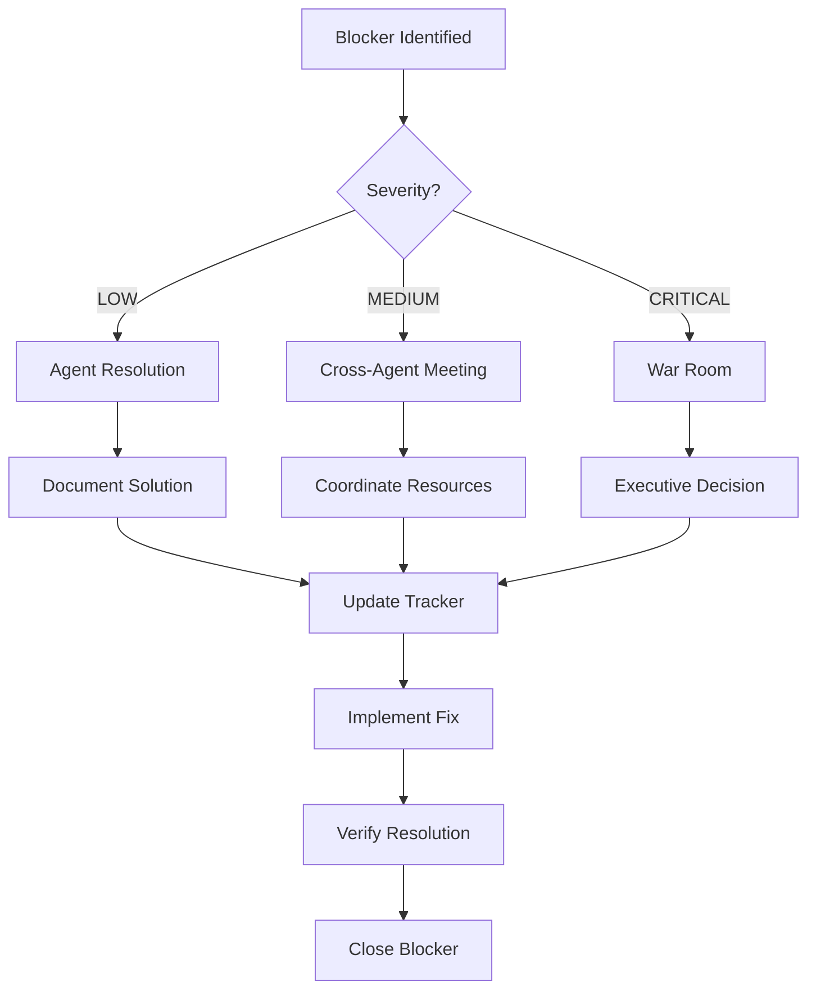

# Multi-Agent Execution Framework for Sprints 13-15
**Date**: November 4, 2025
**Duration**: November 4-29, 2025 (26 calendar days)
**Target**: 15 components, 132 story points, Portal v4.6.0 release
**Status**: 🚀 ACTIVE EXECUTION

---

## 🎯 EXECUTIVE SUMMARY

This framework coordinates 4 specialized agents working in parallel across 4 concurrent workstreams to deliver Portal v4.6.0. Each agent has specific responsibilities, deliverables, and success metrics to maximize development velocity while maintaining quality.

**Agent Team**:
- **FDA (Frontend Development Agent)**: Component development lead
- **QAA (Quality Assurance Agent)**: Testing, coverage, performance
- **DDA (DevOps & Infrastructure Agent)**: Mock APIs, CI/CD, deployment
- **DOA (Documentation Agent)**: Daily tracking, release notes

**Mission**: Execute Sprints 13-15 with maximum parallelization and quality through agent coordination.

---

## 📊 AGENT RESPONSIBILITY MATRIX

### Frontend Development Agent (FDA)
**Primary Responsibility**: Component Development & Code Quality

| Phase | Responsibilities | Daily Tasks | Deliverables |
|-------|-----------------|-------------|--------------|
| **Sprint 13** (Nov 4-15) | Lead development of 8 components | • Write component code<br>• Implement API integrations<br>• Create unit tests<br>• Submit PRs | • 8 components complete<br>• 40 SP delivered<br>• 85%+ coverage |
| **Sprint 14** (Nov 18-22) | Lead development of 11 components | • WebSocket integration<br>• Real-time features<br>• Performance optimization<br>• Code reviews | • 11 components complete<br>• 69 SP delivered<br>• Real-time sync working |
| **Sprint 15** (Nov 25-29) | Performance optimization | • Bundle optimization<br>• Rendering improvements<br>• Memory optimization<br>• Fix critical bugs | • All optimizations complete<br>• < 400ms render time<br>• Production-ready code |

**Success Metrics**:
- ✅ All components delivered on schedule
- ✅ Code quality standards met (ESLint, TypeScript)
- ✅ PR reviews completed within 24 hours
- ✅ Zero critical bugs in production

### Quality Assurance Agent (QAA)
**Primary Responsibility**: Testing & Quality Control

| Phase | Responsibilities | Daily Tasks | Deliverables |
|-------|-----------------|-------------|--------------|
| **Sprint 13** (Nov 4-15) | Test coverage & validation | • Write integration tests<br>• Monitor coverage metrics<br>• Performance benchmarks<br>• Bug tracking | • 85%+ test coverage<br>• Performance reports<br>• Bug tracking dashboard |
| **Sprint 14** (Nov 18-22) | WebSocket & real-time testing | • Test real-time features<br>• Validate WebSocket sync<br>• Load testing<br>• API validation | • Real-time test suite<br>• Load test reports<br>• API compliance report |
| **Sprint 15** (Nov 25-29) | E2E & integration testing | • Full E2E test suite<br>• Cross-component testing<br>• Performance validation<br>• Release testing | • E2E test suite complete<br>• All tests passing<br>• Release validation report |

**Success Metrics**:
- ✅ 85%+ test coverage maintained
- ✅ All performance targets met
- ✅ Zero critical bugs missed
- ✅ Comprehensive test documentation

### DevOps & Infrastructure Agent (DDA)
**Primary Responsibility**: Infrastructure & Deployment

| Phase | Responsibilities | Daily Tasks | Deliverables |
|-------|-----------------|-------------|--------------|
| **Sprint 13** (Nov 4-15) | Mock API maintenance | • Monitor 26 endpoints<br>• Fix API issues<br>• Support developers<br>• GitHub management | • 100% API uptime<br>• Branch management<br>• CI/CD pipeline active |
| **Sprint 14** (Nov 18-22) | WebSocket infrastructure | • WebSocket server setup<br>• Real-time monitoring<br>• Performance tuning<br>• Load balancing | • WebSocket infrastructure<br>• Real-time monitoring<br>• Performance reports |
| **Sprint 15** (Nov 25-29) | Production deployment | • Deployment pipeline<br>• Production setup<br>• Rollback procedures<br>• Release automation | • Portal v4.6.0 deployed<br>• Zero downtime<br>• Rollback ready |

**Success Metrics**:
- ✅ 99.9% infrastructure uptime
- ✅ All mock APIs functional
- ✅ CI/CD pipeline operational
- ✅ Successful production deployment

### Documentation Agent (DOA)
**Primary Responsibility**: Tracking & Documentation

| Phase | Responsibilities | Daily Tasks | Deliverables |
|-------|-----------------|-------------|--------------|
| **Sprint 13** (Nov 4-15) | Daily tracking | • Update daily tracker<br>• Sprint metrics<br>• Standup notes<br>• Progress reports | • Daily tracker updated<br>• Sprint 13 report<br>• Team updates |
| **Sprint 14** (Nov 18-22) | Component docs | • API documentation<br>• Component guides<br>• Integration docs<br>• Sprint report | • Component docs complete<br>• Sprint 14 report<br>• API documentation |
| **Sprint 15** (Nov 25-29) | Release documentation | • Release notes<br>• User guide<br>• Deployment guide<br>• Final report | • v4.6.0 release notes<br>• User documentation<br>• Final sprint report |

**Success Metrics**:
- ✅ Daily updates completed by 11 AM
- ✅ All components documented
- ✅ Release notes comprehensive
- ✅ Zero documentation gaps

---

## 🔄 DAILY WORKSTREAM COORDINATION

### Daily Schedule (All Times in EST)

#### 9:00 AM - Pre-Standup Preparation
**All Agents**: Prepare status updates

```markdown
FDA: Component progress, blockers, today's plan
QAA: Test metrics, coverage report, issues found
DDA: Infrastructure status, API health, CI/CD status
DOA: Yesterday's metrics, documentation updates
```

#### 10:30 AM - Daily Standup (30 minutes)
**Format**: Round-robin agent updates (5 minutes each)

```markdown
1. FDA Report (5 min):
   - Components in progress: ____
   - Story points completed: ____
   - Blockers: ____
   - Today's targets: ____

2. QAA Report (5 min):
   - Test coverage: ____%
   - Tests passing: ____
   - Performance metrics: ____
   - Critical bugs: ____

3. DDA Report (5 min):
   - Infrastructure status: ____
   - API endpoints up: __/26
   - CI/CD status: ____
   - Deployment readiness: ____

4. DOA Report (5 min):
   - Documentation updated: ____
   - Metrics aggregated: ____
   - Reports generated: ____
   - Communication sent: ____

5. Cross-Agent Coordination (10 min):
   - Dependencies identified
   - Blockers escalated
   - Support needed
   - Decisions required
```

#### 11:00 AM - 6:00 PM - Parallel Workstream Execution

**Workstream 1 - Frontend Development (FDA)**:
```bash
# Component development workflow
- Implement features
- Write unit tests
- Submit PRs
- Code reviews
- Bug fixes
```

**Workstream 2 - Quality & Testing (QAA)**:
```bash
# Testing workflow
- Write integration tests
- Run coverage reports
- Performance benchmarks
- Bug verification
- Test automation
```

**Workstream 3 - Infrastructure (DDA)**:
```bash
# Infrastructure workflow
- Monitor mock APIs
- Fix infrastructure issues
- CI/CD pipeline maintenance
- Performance monitoring
- Deployment preparation
```

**Workstream 4 - Documentation (DOA)**:
```bash
# Documentation workflow
- Update daily tracker
- Create progress reports
- Document components
- Prepare release notes
- Team communications
```

#### 6:00 PM - End of Day Sync
**All Agents**: Submit EOD status

```markdown
FDA: Commits pushed, PRs submitted, tomorrow's plan
QAA: Test results, coverage report, issues logged
DDA: Infrastructure stable, backups complete, overnight monitoring
DOA: Daily report complete, metrics updated, tomorrow's agenda
```

---

## 🚨 BLOCKER ESCALATION PROTOCOL

### Severity Levels

#### Level 1: LOW (YELLOW)
**Impact**: Single component/agent affected
**Response Time**: 24 hours
**Escalation**: Within agent team

```markdown
Examples:
- Minor API issue affecting one endpoint
- Test flakiness on single component
- Documentation clarification needed
- Code review pending > 24 hours

Action:
1. Log in daily standup
2. Agent resolves internally
3. Update in next standup
```

#### Level 2: MEDIUM (ORANGE)
**Impact**: Multiple components/agents affected
**Response Time**: 4 hours
**Escalation**: Cross-agent coordination

```markdown
Examples:
- Mock API server down
- Test framework failure
- GitHub branch issues
- Multiple component blockers

Action:
1. Immediate notification to affected agents
2. Emergency sync meeting within 2 hours
3. Resolution plan within 4 hours
4. Update all stakeholders
```

#### Level 3: CRITICAL (RED)
**Impact**: Sprint delivery at risk
**Response Time**: Immediate
**Escalation**: Project management

```markdown
Examples:
- Complete infrastructure failure
- Critical security vulnerability
- Sprint timeline at risk
- Team availability crisis

Action:
1. IMMEDIATE all-hands alert
2. Emergency response team activated
3. War room established
4. Executive escalation if needed
5. Continuous updates every 30 minutes
```

### Escalation Matrix

| Level | First Contact | Second Contact | Final Escalation | Response Time |
|-------|--------------|----------------|------------------|---------------|
| LOW | Agent Lead | Team Lead | PM | 24 hours |
| MEDIUM | Cross-Agent Team | Technical Lead | PM | 4 hours |
| CRITICAL | PM + Tech Lead | Executive Team | CEO | Immediate |

### Blocker Resolution Workflow



---

## 📈 WEEKLY METRICS AGGREGATION

### Friday EOD Metrics Collection (4:00 PM)

#### Week 1 Metrics (Nov 8)
**Target**: 2-3 components, 8-12 SP

```markdown
FDA Metrics:
- Components completed: __/8
- Story points delivered: __/40
- PRs submitted: __
- PRs merged: __
- Code quality score: __%

QAA Metrics:
- Test coverage: __%
- Tests written: __
- Tests passing: __%
- Bugs found: __
- Bugs resolved: __

DDA Metrics:
- API uptime: __%
- CI/CD builds: __
- Build success rate: __%
- Deployment readiness: __%

DOA Metrics:
- Daily updates: __/5
- Components documented: __
- Reports generated: __
- Team satisfaction: __/10
```

#### Week 2 Metrics (Nov 15)
**Target**: Sprint 13 complete (8 components, 40 SP)

```markdown
Sprint 13 Completion Metrics:
✅ Components delivered: 8/8
✅ Story points: 40/40
✅ Test coverage: 85%+
✅ Performance targets met: 8/8
✅ Zero critical bugs
✅ All documentation complete
```

#### Week 3 Metrics (Nov 22)
**Target**: Sprint 14 complete (11 components, 69 SP)

```markdown
Sprint 14 Completion Metrics:
✅ Components delivered: 11/11
✅ Story points: 69/69
✅ WebSocket integration: Complete
✅ Real-time features: Working
✅ Test coverage maintained: 85%+
✅ Performance validated
```

#### Week 4 Metrics (Nov 29)
**Target**: Portal v4.6.0 Released

```markdown
Release Metrics:
✅ All 15 components shipped
✅ 132 story points delivered
✅ E2E tests passing: 100%
✅ Performance validated
✅ Zero critical issues
✅ Portal v4.6.0 in production
```

### Weekly Aggregation Dashboard

| Metric | Week 1 | Week 2 | Week 3 | Week 4 | Total |
|--------|--------|--------|--------|--------|-------|
| **Components** | 2-3 | 5-6 | 11 | Testing | 15 |
| **Story Points** | 8-12 | 28-32 | 69 | 23 | 132 |
| **Test Coverage** | 85% | 85% | 85% | 90% | 85%+ |
| **API Uptime** | 99.9% | 99.9% | 99.9% | 99.9% | 99.9% |
| **Team Velocity** | __ SP/day | __ SP/day | __ SP/day | __ SP/day | Avg: __ |
| **Blockers** | __ | __ | __ | __ | Total: __ |
| **Bug Count** | __ | __ | __ | __ | Total: __ |

---

## 🚀 SPRINT TRANSITION PLANS

### Sprint 13 → Sprint 14 Transition (Nov 15-18)

#### Friday, Nov 15 - Sprint 13 Completion
**2:00 PM - Sprint 13 Retrospective**

```markdown
FDA Tasks:
✅ All 8 components merged to main
✅ Code reviews complete
✅ Technical debt documented

QAA Tasks:
✅ Final test coverage report
✅ Performance benchmarks documented
✅ Bug backlog triaged

DDA Tasks:
✅ Infrastructure audit complete
✅ CI/CD pipeline optimized
✅ Deployment procedures updated

DOA Tasks:
✅ Sprint 13 final report
✅ Lessons learned documented
✅ Sprint 14 prep materials ready
```

#### Monday, Nov 18 - Sprint 14 Kickoff
**9:00 AM - Sprint 14 Launch**

```markdown
All Agents Ready:
✅ Sprint 14 components assigned
✅ WebSocket infrastructure ready
✅ Real-time features planned
✅ Test strategies defined
✅ Documentation templates prepared
```

### Sprint 14 → Sprint 15 Transition (Nov 22-25)

#### Friday, Nov 22 - Sprint 14 Completion
**2:00 PM - Quick Retrospective**

```markdown
FDA: 11 components complete, handoff to QA
QAA: Test suites ready for Sprint 15
DDA: Production environment prepared
DOA: Component docs complete
```

#### Monday, Nov 25 - Sprint 15 Testing Focus

```markdown
Testing Distribution:
- FDA: Performance optimization (7 SP)
- QAA: E2E testing lead (8 SP)
- DDA: Deployment preparation
- DOA: Release documentation (3 SP)
```

---

## 🎉 SPRINT 15 RELEASE PLAN

### Release Week Schedule (Nov 25-29)

#### Monday-Tuesday (Nov 25-26)
**Focus**: E2E Testing & Performance

```markdown
FDA Tasks:
- Performance optimization
- Critical bug fixes
- Code cleanup

QAA Tasks:
- E2E test execution
- Integration testing
- Performance validation

DDA Tasks:
- Production setup
- Deployment scripts
- Rollback procedures

DOA Tasks:
- Release notes draft
- User guide updates
- API documentation
```

#### Wednesday (Nov 27)
**Focus**: Final Testing & Preparation

```markdown
Morning (9 AM - 12 PM):
- Final E2E test run
- Performance benchmarks
- Security validation

Afternoon (1 PM - 5 PM):
- Release candidate build
- Staging deployment
- Final validation
```

#### Thursday (Nov 28)
**Focus**: Release Preparation

```markdown
All Agents:
- Final checklist review
- Release notes finalized
- Team briefing
- Go/No-Go decision (2 PM)
```

#### Friday (Nov 29) - RELEASE DAY
**Portal v4.6.0 Production Release**

```markdown
9:00 AM - Pre-release checks
10:00 AM - Production deployment
11:00 AM - Smoke testing
12:00 PM - Release announcement
2:00 PM - Sprint retrospective
3:00 PM - Team celebration 🎉
```

### Release Success Criteria

```markdown
Pre-Release Checklist:
□ All 15 components complete
□ All 132 story points delivered
□ Test coverage 85%+
□ All E2E tests passing
□ Performance targets met
□ Zero critical bugs
□ Documentation complete
□ Rollback plan tested

Release Validation:
□ Production deployment successful
□ All endpoints responding
□ Performance verified
□ No critical errors
□ User acceptance confirmed

Post-Release:
□ Monitoring active
□ Support team ready
□ Feedback channels open
□ Next sprint planned
```

---

## 📊 AGENT PERFORMANCE METRICS

### Individual Agent KPIs

#### FDA Performance Metrics
```markdown
Velocity: __ SP/day
Quality: __% first-time PR approval
Coverage: __% test coverage
Defects: __ bugs/component
Satisfaction: __/10
```

#### QAA Performance Metrics
```markdown
Coverage: __% achieved vs 85% target
Tests: __ tests written
Bugs: __ critical bugs caught
Performance: __% targets met
Efficiency: __ tests/hour
```

#### DDA Performance Metrics
```markdown
Uptime: __% infrastructure availability
Response: __ min average issue resolution
Builds: __% CI/CD success rate
Deployments: __ successful/total
Automation: __% tasks automated
```

#### DOA Performance Metrics
```markdown
Updates: __% daily updates on time
Documentation: __ pages created
Accuracy: __% information accuracy
Response: __ hour average query response
Completeness: __% coverage
```

### Team Performance Dashboard

| Agent | Efficiency | Quality | Speed | Collaboration | Overall |
|-------|------------|---------|-------|---------------|---------|
| FDA | _/10 | _/10 | _/10 | _/10 | _/10 |
| QAA | _/10 | _/10 | _/10 | _/10 | _/10 |
| DDA | _/10 | _/10 | _/10 | _/10 | _/10 |
| DOA | _/10 | _/10 | _/10 | _/10 | _/10 |
| **Team** | **_/10** | **_/10** | **_/10** | **_/10** | **_/10** |

---

## 🔧 AGENT COORDINATION TOOLS

### Communication Channels

```markdown
Primary Channels:
- Daily Standup: 10:30 AM (mandatory)
- Slack: #sprint-13-15-execution
- Emergency: @all-agents alert
- Documentation: GitHub + JIRA

Agent-Specific:
- FDA: #frontend-dev
- QAA: #quality-assurance
- DDA: #devops-infra
- DOA: #documentation
```

### Collaboration Matrix

| From\To | FDA | QAA | DDA | DOA |
|---------|-----|-----|-----|-----|
| **FDA** | - | Test requirements | API issues | Component specs |
| **QAA** | Bug reports | - | Test env needs | Test docs |
| **DDA** | Dev support | Test infra | - | Deploy docs |
| **DOA** | Status updates | Metrics | Infra docs | - |

### Handoff Procedures

```markdown
Component Handoff (FDA → QAA):
1. PR merged to main
2. Test requirements documented
3. QAA notified via Slack
4. Test suite created
5. Results reported back

Infrastructure Request (Any → DDA):
1. Request logged in #devops-infra
2. Priority assigned (LOW/MED/HIGH)
3. DDA acknowledges within 1 hour
4. Resolution timeline provided
5. Completion confirmed

Documentation Request (Any → DOA):
1. Request via #documentation
2. Template/format specified
3. DOA creates draft
4. Review by requester
5. Final version published
```

---

## 🎯 SUCCESS FRAMEWORK

### Daily Success Indicators

```markdown
Morning (by 11 AM):
✅ All agents present at standup
✅ Previous day's work committed
✅ Today's plan clear
✅ No RED blockers

Afternoon (by 3 PM):
✅ Progress on all workstreams
✅ Cross-agent collaboration active
✅ Blockers being resolved
✅ Metrics being tracked

Evening (by 6 PM):
✅ Daily goals achieved
✅ Code committed and pushed
✅ Documentation updated
✅ Tomorrow's plan ready
```

### Sprint Success Path

```markdown
Sprint 13 Success (Nov 15):
✅ 8 components delivered
✅ 40 story points complete
✅ Team velocity established
✅ Foundation solid

Sprint 14 Success (Nov 22):
✅ 11 components delivered
✅ 69 story points complete
✅ Real-time features working
✅ WebSocket integrated

Sprint 15 Success (Nov 29):
✅ Testing complete
✅ Performance optimized
✅ Documentation ready
✅ Portal v4.6.0 released
```

### Overall Mission Success

```markdown
Portal v4.6.0 Success Criteria:
✅ 15 components operational
✅ 132 story points delivered
✅ 85%+ test coverage
✅ < 400ms render performance
✅ < 100ms API response
✅ Zero critical bugs
✅ WCAG 2.1 AA compliant
✅ Released on schedule
✅ Team satisfaction 8+/10
✅ Stakeholder approval
```

---

## 📞 QUICK REFERENCE

### Emergency Contacts

```markdown
Critical Issues:
- Project Manager: [Primary contact]
- Technical Lead: [Secondary contact]
- Executive: [Escalation contact]

Agent Leads:
- FDA Lead: [Contact]
- QAA Lead: [Contact]
- DDA Lead: [Contact]
- DOA Lead: [Contact]
```

### Key Resources

```markdown
Documentation:
- Sprint Plan: SPRINT-13-15-EXECUTION-IN-PROGRESS.md
- Daily Tracker: SPRINT-13-DAILY-TRACKER.md
- Component Guide: SPRINT-13-EXECUTION-GUIDE.md
- Quick Commands: SPRINT-13-QUICK-COMMANDS.md
- Master Checklist: SPRINT-13-15-MASTER-CHECKLIST.md

Tools:
- GitHub: feature/sprint-13-* branches
- JIRA: AV11 board
- Mock APIs: http://localhost:5173/api/v11/*
- Dev Server: http://localhost:5173
```

### Daily Checklist

```markdown
□ Morning standup attended (10:30 AM)
□ Workstream tasks progressing
□ Blockers identified and escalated
□ Cross-agent dependencies managed
□ Metrics collected and reported
□ Documentation updated
□ End-of-day sync completed
□ Tomorrow's plan ready
```

---

## 🚀 EXECUTION READINESS

### Agent Activation Status

```markdown
FDA (Frontend Development):
✅ Team assigned and ready
✅ Development environment set up
✅ Component specifications clear
✅ READY FOR SPRINT 13

QAA (Quality Assurance):
✅ Test framework configured
✅ Coverage tools ready
✅ Performance benchmarks defined
✅ READY FOR SPRINT 13

DDA (DevOps & Infrastructure):
✅ Mock APIs operational
✅ CI/CD pipeline ready
✅ Monitoring active
✅ READY FOR SPRINT 13

DOA (Documentation):
✅ Templates prepared
✅ Tracking systems ready
✅ Communication channels open
✅ READY FOR SPRINT 13
```

### Launch Confirmation

```markdown
MULTI-AGENT EXECUTION FRAMEWORK STATUS:
✅ All agents assigned and ready
✅ Workstreams defined and clear
✅ Coordination procedures established
✅ Escalation protocols in place
✅ Success metrics defined
✅ Daily/weekly procedures documented
✅ Release plan finalized

READY TO EXECUTE SPRINTS 13-15! 🚀
```

---

**Document**: MULTI-AGENT-EXECUTION-FRAMEWORK.md
**Created**: November 4, 2025
**Status**: ACTIVE - In Execution
**Owner**: Project Management Office
**Update Frequency**: Daily (workstream updates), Weekly (metrics)
**Next Review**: November 8, 2025 (Week 1 checkpoint)

**Let's deliver Portal v4.6.0 with excellence! 🎯**