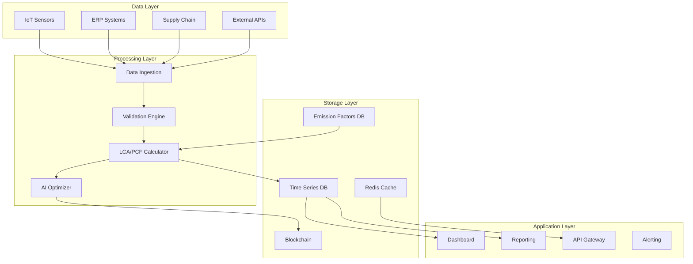

# Product Requirements Document (PRD)
# Life Cycle Assessment (LCA) & Product Carbon Footprint (PCF) Computation
# AUREX Trace Platform

## 1. Executive Summary

### 1.1 Product Vision
AUREX LCA/PCF module will provide comprehensive, automated Life Cycle Assessment and Product Carbon Footprint computation capabilities, enabling organizations to measure, track, and optimize environmental impacts across their entire value chain with blockchain-verified transparency.

### 1.2 Key Objectives
- Automate LCA/PCF calculations using real-time IoT and supply chain data
- Integrate industry-standard emission factors databases (EPA, IPCC, Ecoinvent)
- Provide blockchain-verified carbon accounting with immutable audit trails
- Enable regulatory compliance (ISO 14040/14044, GHG Protocol, PAS 2050)
- Support Science-Based Targets initiative (SBTi) reporting

## 2. Product Overview

### 2.1 Problem Statement
Organizations struggle with:
- Manual, error-prone carbon accounting processes
- Lack of supply chain transparency for Scope 3 emissions
- Inconsistent emission factor application
- Difficulty meeting regulatory reporting requirements
- Limited real-time visibility into environmental impacts
- Inability to verify supplier sustainability claims

### 2.2 Solution
AUREX LCA/PCF module provides:
- **Automated Data Collection**: IoT sensors, ERP integration, supply chain APIs
- **Comprehensive Emission Factors Database**: 50,000+ verified factors
- **AI-Powered Analysis**: Machine learning for impact prediction and optimization
- **Blockchain Verification**: Immutable carbon accounting records
- **Real-time Dashboards**: Live environmental impact monitoring
- **Regulatory Reporting**: Automated compliance reports

## 3. Functional Requirements

### 3.1 Core Features

#### 3.1.1 LCA Computation Engine
```
FEATURE: Full Life Cycle Assessment
- Cradle-to-Gate analysis
- Cradle-to-Grave analysis
- Gate-to-Gate analysis
- Cradle-to-Cradle (circular economy)

COMPONENTS:
1. Raw Material Extraction
   - Mining/harvesting emissions
   - Land use changes
   - Water consumption

2. Manufacturing
   - Energy consumption (electricity, gas, steam)
   - Process emissions
   - Waste generation

3. Transportation
   - Inbound logistics
   - Distribution networks
   - Last-mile delivery

4. Use Phase
   - Product energy consumption
   - Maintenance requirements
   - Expected lifetime

5. End-of-Life
   - Recycling potential
   - Disposal methods
   - Circular economy loops
```

#### 3.1.2 PCF Calculation Module
```
FEATURE: Product Carbon Footprint
SCOPES:
- Scope 1: Direct emissions
- Scope 2: Energy indirect emissions
- Scope 3: Value chain emissions (all 15 categories)

CALCULATION METHOD:
PCF = Σ(Activity Data × Emission Factor × GWP)

Where:
- Activity Data: Measured quantities (kWh, kg, km, etc.)
- Emission Factor: CO2e per unit activity
- GWP: Global Warming Potential
```

#### 3.1.3 Emission Factors Database

##### Primary Sources
| Database | Factors | Region | Update Frequency |
|----------|---------|--------|------------------|
| EPA eGRID | 5,000+ | USA | Annual |
| IPCC | 10,000+ | Global | 5 years |
| Ecoinvent 3.9 | 20,000+ | Global | Annual |
| DEFRA | 3,000+ | UK | Annual |
| GaBi | 15,000+ | Global | Quarterly |
| Custom Factors | Unlimited | Client-specific | Real-time |

##### Factor Categories
```yaml
emission_factors:
  energy:
    electricity:
      grid_mix:
        USA: 0.417  # kg CO2e/kWh
        EU: 0.276
        China: 0.555
      renewable:
        solar: 0.048
        wind: 0.011
        hydro: 0.024

  transportation:
    road:
      diesel_truck: 2.68  # kg CO2e/liter
      electric_vehicle: 0.053  # kg CO2e/km
    sea:
      container_ship: 0.016  # kg CO2e/ton-km
    air:
      cargo_plane: 0.608  # kg CO2e/ton-km

  materials:
    metals:
      steel: 2.32  # kg CO2e/kg
      aluminum: 11.89
      copper: 3.81
    plastics:
      PET: 3.11
      HDPE: 1.93
      PVC: 2.41
    chemicals:
      ammonia: 1.82
      sulfuric_acid: 0.14

  agriculture:
    crops:
      wheat: 0.53  # kg CO2e/kg
      rice: 2.70
      corn: 0.38
    livestock:
      beef: 27.0
      pork: 7.6
      chicken: 4.6

  waste:
    landfill: 467  # kg CO2e/ton
    incineration: 996
    recycling: -635
    composting: -189
```

### 3.2 Data Integration

#### 3.2.1 Input Sources
```python
class DataIntegration:
    def __init__(self):
        self.sources = {
            'iot_sensors': {
                'energy_meters': ['electricity', 'gas', 'steam'],
                'flow_meters': ['water', 'chemicals', 'waste'],
                'environmental': ['temperature', 'humidity', 'emissions']
            },
            'erp_systems': {
                'SAP': ['materials', 'production', 'inventory'],
                'Oracle': ['supply_chain', 'logistics', 'procurement'],
                'Microsoft': ['operations', 'finance', 'hr']
            },
            'supply_chain': {
                'tier1_suppliers': ['materials', 'components', 'emissions'],
                'logistics': ['transportation', 'warehousing', 'distribution'],
                'customers': ['usage_patterns', 'disposal_methods']
            },
            'external_apis': {
                'weather': ['temperature', 'renewable_generation'],
                'energy_grid': ['carbon_intensity', 'renewable_mix'],
                'regulatory': ['emission_limits', 'reporting_requirements']
            }
        }
```

#### 3.2.2 Data Processing Pipeline
```python
class LCAPipeline:
    async def process(self, product_id: str):
        # Step 1: Collect activity data
        activity_data = await self.collect_activity_data(product_id)

        # Step 2: Map to emission factors
        emissions = {}
        for activity in activity_data:
            factor = self.emission_db.get_factor(
                category=activity.category,
                subcategory=activity.subcategory,
                region=activity.region,
                year=activity.year
            )
            emissions[activity.id] = activity.quantity * factor.value

        # Step 3: Calculate total PCF
        pcf = {
            'scope1': sum(e for e in emissions.values() if e.scope == 1),
            'scope2': sum(e for e in emissions.values() if e.scope == 2),
            'scope3': sum(e for e in emissions.values() if e.scope == 3),
            'total': sum(emissions.values())
        }

        # Step 4: Generate blockchain proof
        proof = await self.blockchain.create_proof(pcf)

        return {
            'product_id': product_id,
            'pcf': pcf,
            'emissions_breakdown': emissions,
            'blockchain_proof': proof,
            'timestamp': datetime.utcnow()
        }
```

### 3.3 Advanced Features

#### 3.3.1 AI-Powered Optimization
```python
class EmissionOptimizer:
    def optimize_supply_chain(self, current_emissions):
        recommendations = []

        # Transportation optimization
        if current_emissions['transport'] > benchmark:
            recommendations.append({
                'action': 'Switch to rail transport',
                'potential_reduction': '45%',
                'cost_impact': '-12%',
                'implementation_time': '3 months'
            })

        # Energy optimization
        if current_emissions['energy']['renewable_percent'] < 50:
            recommendations.append({
                'action': 'Install solar panels',
                'potential_reduction': '30%',
                'roi': '4.5 years',
                'implementation_time': '6 months'
            })

        # Material substitution
        for material in current_emissions['materials']:
            if alternative := self.find_low_carbon_alternative(material):
                recommendations.append({
                    'action': f'Replace {material} with {alternative}',
                    'potential_reduction': f'{alternative.reduction}%',
                    'quality_impact': alternative.quality_score
                })

        return recommendations
```

#### 3.3.2 Scenario Modeling
```python
class ScenarioModeling:
    def run_scenarios(self, baseline_pcf):
        scenarios = {}

        # Business as usual
        scenarios['bau'] = self.project_emissions(
            baseline_pcf,
            growth_rate=0.05,
            efficiency_gain=0.02
        )

        # Net zero pathway
        scenarios['net_zero'] = self.calculate_reduction_pathway(
            baseline_pcf,
            target_year=2050,
            interim_targets={
                2030: 0.5,  # 50% reduction
                2040: 0.8   # 80% reduction
            }
        )

        # Technology breakthrough
        scenarios['tech_breakthrough'] = self.model_technology_impact(
            baseline_pcf,
            technologies=[
                'carbon_capture',
                'green_hydrogen',
                'circular_economy'
            ]
        )

        return scenarios
```

## 4. Technical Architecture

### 4.1 System Components



### 4.2 Technology Stack

| Component | Technology | Purpose |
|-----------|------------|---------|
| Backend | FastAPI (Python) | API services |
| Computation | NumPy, Pandas | Numerical processing |
| ML/AI | PyTorch, Scikit-learn | Optimization models |
| Database | PostgreSQL | Transactional data |
| Time Series | InfluxDB | Sensor data |
| Cache | Redis | Performance optimization |
| Blockchain | Hyperledger Fabric | Immutable records |
| Message Queue | Apache Kafka | Event streaming |
| Frontend | React + D3.js | Visualization |
| Monitoring | Prometheus + Grafana | System monitoring |

### 4.3 API Specification

```yaml
openapi: 3.0.0
info:
  title: AUREX LCA/PCF API
  version: 1.0.0

paths:
  /api/lca/calculate:
    post:
      summary: Calculate LCA for product
      requestBody:
        content:
          application/json:
            schema:
              type: object
              properties:
                product_id: string
                assessment_type:
                  enum: [cradle_to_gate, cradle_to_grave, gate_to_gate]
                include_scenarios: boolean
      responses:
        200:
          content:
            application/json:
              schema:
                type: object
                properties:
                  lca_result:
                    type: object
                    properties:
                      carbon_footprint: number
                      water_footprint: number
                      energy_consumption: number
                      waste_generation: number
                  breakdown:
                    type: array
                    items:
                      type: object
                      properties:
                        phase: string
                        emissions: number
                        percentage: number
                  blockchain_hash: string

  /api/pcf/realtime:
    get:
      summary: Get real-time PCF
      parameters:
        - name: product_id
          in: query
          required: true
          schema:
            type: string
      responses:
        200:
          content:
            application/json:
              schema:
                type: object
                properties:
                  current_pcf:
                    type: object
                    properties:
                      scope1: number
                      scope2: number
                      scope3: number
                      total: number
                  trend:
                    type: object
                    properties:
                      direction: string
                      change_percent: number
                  timestamp: string

  /api/emission-factors/search:
    get:
      summary: Search emission factors
      parameters:
        - name: category
          in: query
          schema:
            type: string
        - name: region
          in: query
          schema:
            type: string
        - name: year
          in: query
          schema:
            type: integer
      responses:
        200:
          content:
            application/json:
              schema:
                type: array
                items:
                  type: object
                  properties:
                    factor_id: string
                    name: string
                    value: number
                    unit: string
                    source: string
                    last_updated: string
```

## 5. User Interface

### 5.1 Dashboard Components

#### 5.1.1 Executive Dashboard
- **Real-time PCF Gauge**: Current carbon footprint with trend
- **Scope Breakdown**: Pie chart of Scope 1, 2, 3 emissions
- **Historical Trends**: Time series of emissions over time
- **Reduction Progress**: Progress towards targets
- **Hot Spots Map**: Geographic distribution of emissions
- **Supplier Scorecard**: Top/bottom performing suppliers

#### 5.1.2 Operational Dashboard
- **Live Activity Feed**: Real-time emission events
- **Process Flow Diagram**: Interactive LCA visualization
- **Material Flow Analysis**: Sankey diagram of materials
- **Energy Consumption**: Real-time energy monitoring
- **Alert Panel**: Threshold violations and anomalies
- **Optimization Recommendations**: AI-generated suggestions

#### 5.1.3 Reporting Dashboard
- **Regulatory Reports**: GHG Protocol, CDP, TCFD formats
- **Custom Reports Builder**: Drag-and-drop report creation
- **Benchmarking**: Industry comparison charts
- **Scenario Comparison**: What-if analysis results
- **Export Options**: PDF, Excel, API, blockchain proof

### 5.2 Mobile Application
- **Field Data Collection**: Offline-capable data entry
- **QR Code Scanning**: Product/material tracking
- **Photo Evidence**: Visual documentation
- **Push Notifications**: Alerts and updates
- **Approval Workflows**: Mobile approvals

## 6. Data Models

### 6.1 Core Entities

```sql
-- Products Table
CREATE TABLE products (
    id UUID PRIMARY KEY,
    name VARCHAR(255),
    category VARCHAR(100),
    weight_kg DECIMAL(10,3),
    materials JSONB,
    manufacturing_location VARCHAR(100),
    created_at TIMESTAMP,
    updated_at TIMESTAMP
);

-- Activity Data Table
CREATE TABLE activity_data (
    id UUID PRIMARY KEY,
    product_id UUID REFERENCES products(id),
    activity_type VARCHAR(50),
    quantity DECIMAL(15,6),
    unit VARCHAR(20),
    scope INTEGER CHECK (scope IN (1,2,3)),
    location VARCHAR(100),
    timestamp TIMESTAMP,
    source VARCHAR(50),
    verified BOOLEAN DEFAULT FALSE,
    blockchain_hash VARCHAR(66)
);

-- Emission Factors Table
CREATE TABLE emission_factors (
    id UUID PRIMARY KEY,
    category VARCHAR(100),
    subcategory VARCHAR(100),
    name VARCHAR(255),
    value DECIMAL(15,9),
    unit VARCHAR(50),
    scope INTEGER,
    region VARCHAR(100),
    year INTEGER,
    source VARCHAR(100),
    uncertainty_percent DECIMAL(5,2),
    last_updated TIMESTAMP
);

-- LCA Results Table
CREATE TABLE lca_results (
    id UUID PRIMARY KEY,
    product_id UUID REFERENCES products(id),
    assessment_type VARCHAR(50),
    carbon_footprint DECIMAL(15,3),
    water_footprint DECIMAL(15,3),
    energy_consumption DECIMAL(15,3),
    waste_generation DECIMAL(15,3),
    scope1_emissions DECIMAL(15,3),
    scope2_emissions DECIMAL(15,3),
    scope3_emissions DECIMAL(15,3),
    breakdown JSONB,
    recommendations JSONB,
    blockchain_proof VARCHAR(66),
    calculated_at TIMESTAMP
);

-- Optimization Recommendations Table
CREATE TABLE optimization_recommendations (
    id UUID PRIMARY KEY,
    product_id UUID REFERENCES products(id),
    recommendation_type VARCHAR(50),
    description TEXT,
    potential_reduction_percent DECIMAL(5,2),
    cost_impact DECIMAL(12,2),
    implementation_time_days INTEGER,
    priority VARCHAR(20),
    status VARCHAR(20),
    created_at TIMESTAMP
);
```

## 7. Integration Requirements

### 7.1 ERP Integration
- **SAP S/4HANA**: RFC/OData for material master, production data
- **Oracle ERP Cloud**: REST APIs for procurement, logistics
- **Microsoft Dynamics**: Power Platform connectors
- **NetSuite**: SuiteTalk APIs for inventory, orders

### 7.2 IoT Platforms
- **AWS IoT Core**: MQTT for sensor data
- **Azure IoT Hub**: Device twins for configuration
- **Google Cloud IoT**: Pub/Sub for streaming
- **Industrial Protocols**: OPC-UA, Modbus, BACnet

### 7.3 Supply Chain Networks
- **GS1 EPCIS**: Product traceability
- **EDI**: ANSI X12, EDIFACT for B2B data
- **Blockchain Networks**: Hyperledger, Ethereum
- **Supplier Portals**: API integration

### 7.4 Regulatory Platforms
- **CDP**: Climate disclosure reporting
- **EPA GHGRP**: Greenhouse gas reporting
- **EU ETS**: Emissions trading system
- **Science Based Targets**: SBTi validation

## 8. Security & Compliance

### 8.1 Security Requirements
- **Data Encryption**: AES-256 at rest, TLS 1.3 in transit
- **Authentication**: OAuth 2.0, SAML 2.0, MFA
- **Authorization**: RBAC with fine-grained permissions
- **Audit Logging**: Immutable audit trail
- **Data Residency**: Regional data storage compliance
- **Privacy**: GDPR, CCPA compliance

### 8.2 Compliance Standards
- **ISO 14040/14044**: LCA principles and framework
- **GHG Protocol**: Corporate and product standards
- **PAS 2050**: Product carbon footprinting
- **ISO 14064**: GHG quantification and reporting
- **ISO 14067**: Carbon footprint of products
- **ISO 50001**: Energy management systems

## 9. Performance Requirements

### 9.1 Response Times
- **Dashboard Load**: < 2 seconds
- **PCF Calculation**: < 5 seconds for simple products
- **LCA Full Assessment**: < 30 seconds for complex products
- **Report Generation**: < 10 seconds
- **API Response**: < 200ms for queries

### 9.2 Scalability
- **Concurrent Users**: 10,000+
- **Products Tracked**: 1,000,000+
- **Data Points/Day**: 100,000,000+
- **Historical Data**: 10 years retention
- **Availability**: 99.9% uptime SLA

### 9.3 Data Volume
- **Activity Records**: 1TB+
- **Time Series Data**: 10TB+
- **Document Storage**: 5TB+
- **Backup Retention**: 7 years

## 10. Implementation Roadmap

### Phase 1: Foundation (Months 1-3)
- [ ] Core LCA/PCF calculation engine
- [ ] Basic emission factors database (10,000 factors)
- [ ] Manual data input interface
- [ ] Simple reporting module
- [ ] MVP dashboard

### Phase 2: Integration (Months 4-6)
- [ ] ERP system connectors (SAP, Oracle)
- [ ] IoT data ingestion pipeline
- [ ] Automated data collection
- [ ] Blockchain integration
- [ ] Enhanced visualization

### Phase 3: Intelligence (Months 7-9)
- [ ] AI optimization engine
- [ ] Predictive analytics
- [ ] Scenario modeling
- [ ] Advanced reporting
- [ ] Mobile application

### Phase 4: Scale (Months 10-12)
- [ ] Supply chain integration
- [ ] Full emission factors database (50,000+)
- [ ] Multi-tenant architecture
- [ ] API marketplace
- [ ] Global deployment

## 11. Success Metrics

### 11.1 Business KPIs
- **Carbon Reduction**: 25% reduction in 2 years
- **Cost Savings**: 15% through optimization
- **Compliance Rate**: 100% regulatory compliance
- **Supplier Engagement**: 80% supplier participation
- **ROI**: 300% in 3 years

### 11.2 Technical KPIs
- **Data Accuracy**: 95% emission factor accuracy
- **System Uptime**: 99.9% availability
- **Processing Speed**: 90% calculations < 5 seconds
- **User Adoption**: 85% active user rate
- **API Usage**: 1M+ API calls/month

## 12. Risk Analysis

### 12.1 Technical Risks
| Risk | Probability | Impact | Mitigation |
|------|------------|--------|------------|
| Data quality issues | High | High | Validation rules, ML anomaly detection |
| Integration complexity | Medium | High | Phased rollout, standard APIs |
| Scalability challenges | Low | High | Cloud-native architecture |
| Emission factor updates | Medium | Medium | Automated update pipelines |

### 12.2 Business Risks
| Risk | Probability | Impact | Mitigation |
|------|------------|--------|------------|
| Regulatory changes | High | Medium | Flexible rule engine |
| Supplier resistance | Medium | High | Incentive programs |
| Competitive offerings | Medium | Medium | Continuous innovation |
| User adoption | Low | High | Training programs |

## 13. Budget Estimation

### 13.1 Development Costs
- **Core Platform**: $500,000
- **Integrations**: $300,000
- **AI/ML Models**: $200,000
- **Mobile Apps**: $150,000
- **Testing/QA**: $150,000
- **Total Development**: $1,300,000

### 13.2 Operational Costs (Annual)
- **Cloud Infrastructure**: $120,000
- **Emission Factor Licenses**: $50,000
- **Support & Maintenance**: $200,000
- **Updates & Enhancements**: $150,000
- **Total Annual**: $520,000

## 14. Team Requirements

### 14.1 Development Team
- **Product Manager**: 1 FTE
- **Technical Architect**: 1 FTE
- **Backend Developers**: 4 FTE
- **Frontend Developers**: 3 FTE
- **Data Engineers**: 2 FTE
- **ML Engineers**: 2 FTE
- **DevOps Engineers**: 2 FTE
- **QA Engineers**: 2 FTE

### 14.2 Domain Experts
- **LCA Specialist**: 1 FTE
- **Carbon Accounting Expert**: 1 FTE
- **Supply Chain Analyst**: 1 FTE
- **Regulatory Compliance**: 1 FTE

## 15. Conclusion

The AUREX LCA/PCF Computation module represents a comprehensive solution for automated, accurate, and verifiable environmental impact assessment. By combining real-time data collection, extensive emission factors databases, AI-powered optimization, and blockchain verification, this platform will enable organizations to:

1. **Measure** environmental impacts accurately
2. **Monitor** performance in real-time
3. **Optimize** operations for sustainability
4. **Report** with confidence to stakeholders
5. **Verify** claims with blockchain proof

This PRD provides the foundation for building a world-class sustainability platform that will position AUREX as a leader in environmental intelligence and carbon management solutions.

## Appendices

### Appendix A: Emission Factor Sources
- EPA: https://www.epa.gov/climateleadership/emission-factors
- IPCC: https://www.ipcc-nggip.iges.or.jp/EFDB/
- Ecoinvent: https://ecoinvent.org/
- DEFRA: https://www.gov.uk/government/publications/greenhouse-gas-reporting-conversion-factors

### Appendix B: Regulatory Standards
- GHG Protocol: https://ghgprotocol.org/
- ISO 14040 series: https://www.iso.org/standard/37456.html
- Science Based Targets: https://sciencebasedtargets.org/

### Appendix C: Sample Calculations
```python
# Example PCF Calculation
def calculate_product_carbon_footprint(product_id):
    # Raw materials
    steel_kg = 100
    steel_ef = 2.32  # kg CO2e/kg
    material_emissions = steel_kg * steel_ef

    # Manufacturing energy
    electricity_kwh = 500
    grid_ef = 0.417  # kg CO2e/kWh (US average)
    energy_emissions = electricity_kwh * grid_ef

    # Transportation
    distance_km = 1000
    truck_ef = 0.105  # kg CO2e/ton-km
    weight_tons = 0.1
    transport_emissions = distance_km * truck_ef * weight_tons

    # Total PCF
    total_pcf = material_emissions + energy_emissions + transport_emissions

    return {
        'material': material_emissions,
        'energy': energy_emissions,
        'transport': transport_emissions,
        'total': total_pcf
    }
```

---

*Document Version: 1.0*
*Last Updated: January 2025*
*Author: AUREX Technical Team*