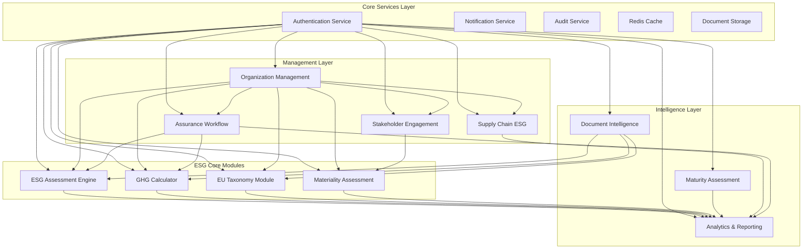

# AUREX LAUNCHPAD - API INTEGRATION MAP & DATA FLOW
## Comprehensive Inter-Module Communication Architecture

**Document Version**: 1.0  
**Last Updated**: January 2025  
**Engineering Manager**: Aurex Launchpad Team  

---

## 📋 OVERVIEW

This document provides detailed API integration patterns and data flow architecture for all 11 Aurex Launchpad sub-applications. It defines how modules communicate, share data, and maintain consistency across the platform.

---

## 🏗️ INTEGRATION ARCHITECTURE

### **Core Integration Patterns**



---

## 🔄 DATA FLOW PATTERNS

### **1. Authentication & Authorization Flow**

```python
# Authentication flow used by all modules
class AuthenticationFlow:
    """
    Central authentication service used by all sub-applications
    """
    
    def authenticate_request(request):
        """
        Standard authentication flow for all API endpoints
        """
        token = extract_jwt_token(request.headers.get('Authorization'))
        user = validate_jwt_token(token)
        organization = get_user_organization(user.id)
        permissions = get_user_permissions(user.id, organization.id)
        
        return AuthContext(
            user=user,
            organization=organization,
            permissions=permissions
        )
    
    # Integration endpoints used by all modules
    endpoints = {
        "POST /auth/validate-token": "Validate JWT token",
        "GET /auth/user-permissions/{user_id}": "Get user permissions",
        "GET /auth/organization-context/{user_id}": "Get user organization context"
    }
```

### **2. Organization Context Flow**

```python
# Organization context shared across all modules
class OrganizationContextFlow:
    """
    Organization context propagated to all sub-applications
    """
    
    def get_organization_context(organization_id):
        """
        Get comprehensive organization context for any module
        """
        return {
            "organization": get_organization_details(organization_id),
            "subscription": get_subscription_details(organization_id),
            "settings": get_organization_settings(organization_id),
            "members": get_organization_members(organization_id),
            "permissions": get_organization_permissions(organization_id)
        }
    
    # Shared integration endpoints
    shared_endpoints = {
        "GET /api/v1/organizations/{org_id}/context": "Get organization context",
        "GET /api/v1/organizations/{org_id}/settings": "Get organization settings",
        "GET /api/v1/organizations/{org_id}/members": "Get organization members"
    }
```

### **3. Cross-Module Data Sharing**

```python
# Data sharing patterns between modules
class CrossModuleDataFlow:
    """
    Standardized data sharing between sub-applications
    """
    
    # ESG Assessment → Analytics Integration
    def esg_to_analytics_flow():
        return {
            "endpoint": "POST /api/v1/analytics/esg-data",
            "data_format": {
                "assessment_id": "uuid",
                "organization_id": "uuid",
                "framework_type": "string",
                "scores": {
                    "environmental": "float",
                    "social": "float", 
                    "governance": "float",
                    "overall": "float"
                },
                "completion_date": "datetime",
                "metadata": "json"
            },
            "trigger": "assessment_completed",
            "frequency": "real_time"
        }
    
    # GHG Calculator → Analytics Integration
    def ghg_to_analytics_flow():
        return {
            "endpoint": "POST /api/v1/analytics/emissions-data",
            "data_format": {
                "calculation_id": "uuid",
                "organization_id": "uuid",
                "reporting_period": "date_range",
                "emissions": {
                    "scope1": "float",
                    "scope2": "float",
                    "scope3": "float",
                    "total": "float"
                },
                "verification_status": "string"
            },
            "trigger": "calculation_completed",
            "frequency": "real_time"
        }
    
    # Document Intelligence → Multiple Modules Integration
    def document_to_modules_flow():
        return {
            "esg_assessment": {
                "endpoint": "POST /api/v1/esg-assessments/document-data",
                "extracted_data": ["esg_metrics", "policies", "targets"],
                "trigger": "document_processed"
            },
            "ghg_calculator": {
                "endpoint": "POST /api/v1/ghg/document-data",
                "extracted_data": ["emission_factors", "activity_data"],
                "trigger": "document_processed"
            },
            "eu_taxonomy": {
                "endpoint": "POST /api/v1/eu-compliance/document-data",
                "extracted_data": ["taxonomy_activities", "alignment_data"],
                "trigger": "document_processed"
            }
        }
```

---

## 📊 MODULE-SPECIFIC INTEGRATION POINTS

### **1. ESG Assessment Engine Integration**

```python
class ESGAssessmentIntegration:
    """
    ESG Assessment Engine integration with other modules
    """
    
    # Outbound integrations
    outbound = {
        "analytics": {
            "endpoint": "POST /api/v1/analytics/assessment-scores",
            "data": ["assessment_scores", "completion_metrics", "framework_usage"],
            "frequency": "real_time"
        },
        "maturity_assessment": {
            "endpoint": "POST /api/v1/maturity/esg-evidence",
            "data": ["assessment_responses", "evidence_documents"],
            "frequency": "on_completion"
        },
        "assurance_workflow": {
            "endpoint": "POST /api/v1/assurance/assessment-data",
            "data": ["assessment_details", "response_evidence"],
            "frequency": "on_request"
        }
    }
    
    # Inbound integrations
    inbound = {
        "document_intelligence": {
            "endpoint": "POST /api/v1/esg-assessments/extracted-data",
            "accepts": ["esg_metrics", "policy_documents", "sustainability_targets"],
            "processing": "auto_populate_responses"
        },
        "organization_management": {
            "endpoint": "GET /api/v1/esg-assessments/organization-context",
            "provides": ["organization_details", "industry_context", "compliance_requirements"],
            "usage": "assessment_customization"
        }
    }
```

### **2. GHG Emissions Calculator Integration**

```python
class GHGCalculatorIntegration:
    """
    GHG Calculator integration with other modules
    """
    
    # Outbound integrations
    outbound = {
        "analytics": {
            "endpoint": "POST /api/v1/analytics/emissions-trends",
            "data": ["emission_calculations", "reduction_progress", "scope_breakdowns"],
            "frequency": "real_time"
        },
        "supply_chain": {
            "endpoint": "POST /api/v1/supply-chain/emissions-data",
            "data": ["supplier_emissions", "scope3_contributions"],
            "frequency": "monthly"
        },
        "eu_taxonomy": {
            "endpoint": "POST /api/v1/eu-compliance/climate-metrics",
            "data": ["ghg_emissions", "reduction_targets", "climate_alignment"],
            "frequency": "on_calculation"
        }
    }
    
    # Inbound integrations
    inbound = {
        "document_intelligence": {
            "endpoint": "POST /api/v1/ghg/activity-data",
            "accepts": ["energy_bills", "fuel_consumption", "travel_records"],
            "processing": "auto_extract_activity_data"
        },
        "supply_chain": {
            "endpoint": "GET /api/v1/ghg/supplier-emissions",
            "provides": ["supplier_emission_factors", "logistics_data"],
            "usage": "scope3_calculation"
        }
    }
```

### **3. Analytics & Reporting Integration Hub**

```python
class AnalyticsReportingHub:
    """
    Central analytics hub receiving data from all modules
    """
    
    # Data ingestion from all modules
    data_sources = {
        "esg_assessments": {
            "endpoint": "POST /api/v1/analytics/ingest/esg",
            "data_types": ["scores", "completions", "frameworks", "trends"],
            "update_frequency": "real_time"
        },
        "ghg_emissions": {
            "endpoint": "POST /api/v1/analytics/ingest/emissions", 
            "data_types": ["calculations", "reductions", "scopes", "benchmarks"],
            "update_frequency": "real_time"
        },
        "materiality": {
            "endpoint": "POST /api/v1/analytics/ingest/materiality",
            "data_types": ["topic_scores", "stakeholder_inputs", "matrices"],
            "update_frequency": "on_assessment_update"
        },
        "supply_chain": {
            "endpoint": "POST /api/v1/analytics/ingest/supply-chain",
            "data_types": ["supplier_scores", "risk_metrics", "sourcing_data"],
            "update_frequency": "daily"
        },
        "stakeholder_engagement": {
            "endpoint": "POST /api/v1/analytics/ingest/engagement",
            "data_types": ["feedback_sentiment", "participation_rates", "concerns"],
            "update_frequency": "real_time"
        }
    }
    
    # Analytical outputs to other modules
    analytical_outputs = {
        "benchmarking": {
            "consumers": ["esg_assessment", "maturity_assessment", "supply_chain"],
            "endpoint": "GET /api/v1/analytics/benchmarks/{industry}",
            "data_provided": ["industry_averages", "peer_rankings", "best_practices"]
        },
        "trends": {
            "consumers": ["all_modules"],
            "endpoint": "GET /api/v1/analytics/trends/{metric_type}",
            "data_provided": ["historical_trends", "predictions", "anomalies"]
        },
        "insights": {
            "consumers": ["stakeholder_engagement", "maturity_assessment"],
            "endpoint": "GET /api/v1/analytics/insights/{organization_id}",
            "data_provided": ["improvement_recommendations", "risk_alerts", "opportunities"]
        }
    }
```

---

## 🔄 REAL-TIME DATA SYNCHRONIZATION

### **Event-Driven Architecture**

```python
class EventDrivenIntegration:
    """
    Event-driven data synchronization between modules
    """
    
    # Event publishing pattern
    def publish_event(event_type, data, source_module):
        event = {
            "event_id": generate_uuid(),
            "event_type": event_type,
            "source_module": source_module,
            "timestamp": datetime.utcnow(),
            "organization_id": data.get("organization_id"),
            "payload": data,
            "version": "1.0"
        }
        
        # Publish to Redis pub/sub and/or message queue
        redis_client.publish(f"events:{event_type}", json.dumps(event))
        return event
    
    # Event subscription pattern
    def subscribe_to_events(module_name, event_types, callback):
        for event_type in event_types:
            redis_client.subscribe(f"events:{event_type}", 
                                 lambda msg: callback(json.loads(msg)))
    
    # Standard events across platform
    standard_events = {
        "assessment_completed": {
            "publishers": ["esg_assessment", "maturity_assessment"],
            "subscribers": ["analytics", "assurance_workflow", "stakeholder_engagement"]
        },
        "emissions_calculated": {
            "publishers": ["ghg_calculator"],
            "subscribers": ["analytics", "eu_taxonomy", "supply_chain"]
        },
        "document_processed": {
            "publishers": ["document_intelligence"],
            "subscribers": ["esg_assessment", "ghg_calculator", "eu_taxonomy"]
        },
        "stakeholder_feedback_received": {
            "publishers": ["stakeholder_engagement"],
            "subscribers": ["materiality_assessment", "analytics"]
        },
        "compliance_status_changed": {
            "publishers": ["eu_taxonomy", "assurance_workflow"],
            "subscribers": ["analytics", "stakeholder_engagement"]
        }
    }
```

### **Data Consistency Patterns**

```python
class DataConsistencyManager:
    """
    Ensure data consistency across modules
    """
    
    # Distributed transaction pattern for critical operations
    def execute_distributed_transaction(operations):
        """
        Execute operations across multiple modules with rollback capability
        """
        transaction_id = generate_uuid()
        completed_operations = []
        
        try:
            for operation in operations:
                result = execute_operation(operation, transaction_id)
                completed_operations.append((operation, result))
                
            # Commit all operations
            for operation, result in completed_operations:
                commit_operation(operation, result, transaction_id)
                
        except Exception as e:
            # Rollback all completed operations
            for operation, result in completed_operations:
                rollback_operation(operation, result, transaction_id)
            raise e
    
    # Eventual consistency for non-critical data
    def sync_eventually_consistent_data(source_module, target_modules, data):
        """
        Propagate data changes with eventual consistency guarantees
        """
        sync_tasks = []
        
        for target_module in target_modules:
            task = {
                "target_module": target_module,
                "sync_endpoint": get_sync_endpoint(target_module),
                "data": data,
                "retry_count": 0,
                "max_retries": 3
            }
            sync_tasks.append(task)
        
        # Queue synchronization tasks
        for task in sync_tasks:
            queue_sync_task(task)
```

---

## 📡 EXTERNAL SYSTEM INTEGRATION

### **Third-Party API Integration**

```python
class ExternalIntegrations:
    """
    Integration with external ESG and compliance systems
    """
    
    # ESG data providers
    esg_data_providers = {
        "refinitiv": {
            "endpoint": "https://api.refinitiv.com/esg",
            "modules": ["analytics", "supply_chain"],
            "data_types": ["benchmarks", "industry_averages", "esg_scores"]
        },
        "sustainalytics": {
            "endpoint": "https://api.sustainalytics.com",
            "modules": ["supply_chain", "analytics"],
            "data_types": ["supplier_risk_scores", "controversy_data"]
        },
        "cdp": {
            "endpoint": "https://api.cdp.net",
            "modules": ["ghg_calculator", "analytics"],
            "data_types": ["climate_data", "water_data", "forest_data"]
        }
    }
    
    # Regulatory databases
    regulatory_integrations = {
        "eu_taxonomy_compass": {
            "endpoint": "https://ec.europa.eu/sustainable-finance/taxonomy-compass",
            "modules": ["eu_taxonomy"],
            "data_types": ["activity_definitions", "technical_criteria"]
        },
        "sasb_standards": {
            "endpoint": "https://api.sasb.org",
            "modules": ["esg_assessment", "materiality"],
            "data_types": ["industry_standards", "disclosure_topics"]
        }
    }
    
    # Document processing services
    ai_services = {
        "azure_cognitive_services": {
            "endpoint": "https://api.cognitive.microsoft.com",
            "modules": ["document_intelligence"],
            "services": ["ocr", "text_analytics", "language_understanding"]
        },
        "aws_comprehend": {
            "endpoint": "https://comprehend.amazonaws.com",
            "modules": ["document_intelligence", "stakeholder_engagement"],
            "services": ["sentiment_analysis", "entity_extraction"]
        }
    }
```

### **Integration Security**

```python
class IntegrationSecurity:
    """
    Security patterns for external integrations
    """
    
    # API key management
    def secure_external_api_call(provider, endpoint, data):
        """
        Secure external API calls with proper authentication
        """
        api_key = get_encrypted_api_key(provider)
        headers = {
            "Authorization": f"Bearer {api_key}",
            "Content-Type": "application/json",
            "X-Request-ID": generate_request_id()
        }
        
        # Rate limiting
        if not check_rate_limit(provider):
            raise RateLimitExceeded(f"Rate limit exceeded for {provider}")
        
        # Make secure request
        response = make_secure_request(endpoint, data, headers)
        
        # Log API call for audit
        log_external_api_call(provider, endpoint, response.status_code)
        
        return response
    
    # Data validation for external data
    def validate_external_data(provider, data_type, data):
        """
        Validate external data before integration
        """
        validation_schema = get_validation_schema(provider, data_type)
        validated_data = validate_against_schema(data, validation_schema)
        
        # Additional business logic validation
        if data_type == "esg_scores":
            validate_score_ranges(validated_data)
        elif data_type == "emission_factors":
            validate_emission_factor_units(validated_data)
            
        return validated_data
```

---

## 🔧 API ENDPOINT MAPPINGS

### **Complete Endpoint Registry**

```python
class APIEndpointRegistry:
    """
    Comprehensive API endpoint registry for all modules
    """
    
    endpoints = {
        # Organization Management
        "organization": {
            "base_path": "/api/v1/organizations",
            "endpoints": {
                "GET /{org_id}/context": "Get organization context for other modules",
                "GET /{org_id}/members": "Get organization members",
                "GET /{org_id}/settings": "Get organization settings",
                "POST /{org_id}/audit-log": "Log cross-module activities"
            }
        },
        
        # ESG Assessment Engine
        "esg_assessment": {
            "base_path": "/api/v1/esg-assessments",
            "endpoints": {
                "GET /": "List assessments with filtering",
                "POST /": "Create new assessment",
                "GET /{id}": "Get assessment details",
                "POST /{id}/responses": "Submit assessment response",
                "GET /{id}/scores": "Get assessment scores for analytics",
                "POST /document-data": "Receive data from document intelligence",
                "GET /organization/{org_id}/summary": "Get org assessment summary"
            }
        },
        
        # GHG Calculator
        "ghg_calculator": {
            "base_path": "/api/v1/ghg",
            "endpoints": {
                "GET /calculations": "List calculations",
                "POST /calculations": "Create calculation",
                "POST /calculations/{id}/entries": "Add emission entries",
                "GET /calculations/{id}/results": "Get calculation results",
                "POST /activity-data": "Receive data from document intelligence",
                "GET /organization/{org_id}/emissions": "Get org emissions data"
            }
        },
        
        # EU Taxonomy & ESRS
        "eu_taxonomy": {
            "base_path": "/api/v1/eu-compliance",
            "endpoints": {
                "GET /taxonomy/activities": "List taxonomy activities",
                "POST /taxonomy/assessments": "Create alignment assessment",
                "GET /esrs/standards": "Get ESRS standards",
                "POST /esrs/disclosures": "Create ESRS disclosure",
                "POST /document-data": "Receive extracted compliance data",
                "GET /organization/{org_id}/compliance": "Get compliance status"
            }
        },
        
        # Materiality Assessment
        "materiality": {
            "base_path": "/api/v1/materiality",
            "endpoints": {
                "GET /topics": "List materiality topics",
                "POST /assessments": "Create materiality assessment", 
                "POST /assessments/{id}/scores": "Submit materiality scores",
                "GET /assessments/{id}/matrix": "Get materiality matrix",
                "POST /stakeholder-input": "Receive stakeholder feedback",
                "GET /organization/{org_id}/material-topics": "Get org material topics"
            }
        },
        
        # Document Intelligence
        "document_intelligence": {
            "base_path": "/api/v1/documents",
            "endpoints": {
                "POST /upload": "Upload document",
                "POST /{id}/process": "Process document with AI",
                "GET /{id}/extractions": "Get extracted data",
                "POST /extractions/{id}/review": "Review extraction",
                "GET /search": "Search documents",
                "POST /distribute-data": "Send extracted data to modules"
            }
        },
        
        # Analytics & Reporting
        "analytics": {
            "base_path": "/api/v1/analytics",
            "endpoints": {
                "GET /dashboard": "Get dashboard data",
                "POST /ingest/{module}": "Ingest data from modules",
                "GET /benchmarks/{industry}": "Get industry benchmarks",
                "GET /trends/{metric}": "Get trend analysis",
                "POST /reports/generate": "Generate reports",
                "GET /insights/{org_id}": "Get AI-driven insights"
            }
        },
        
        # Maturity Assessment
        "maturity": {
            "base_path": "/api/v1/maturity",
            "endpoints": {
                "GET /frameworks": "List maturity frameworks",
                "POST /assessments": "Create maturity assessment",
                "GET /assessments/{id}/roadmap": "Get improvement roadmap",
                "POST /assessments/{id}/evidence": "Submit evidence",
                "POST /esg-evidence": "Receive evidence from ESG assessments",
                "GET /organization/{org_id}/maturity": "Get org maturity status"
            }
        },
        
        # Supply Chain ESG
        "supply_chain": {
            "base_path": "/api/v1/supply-chain",
            "endpoints": {
                "GET /suppliers": "List suppliers",
                "POST /suppliers": "Add supplier",
                "GET /suppliers/{id}/assessment": "Get supplier assessment",
                "POST /suppliers/{id}/assess": "Assess supplier ESG",
                "GET /risks": "Get supply chain risks",
                "POST /emissions-data": "Receive emissions data from GHG module",
                "GET /organization/{org_id}/dashboard": "Get supply chain dashboard"
            }
        },
        
        # Assurance Workflow
        "assurance": {
            "base_path": "/api/v1/assurance",
            "endpoints": {
                "GET /providers": "List assurance providers",
                "POST /engagements": "Create assurance engagement",
                "GET /engagements/{id}/progress": "Get engagement progress",
                "POST /engagements/{id}/evidence": "Submit evidence",
                "POST /engagements/{id}/findings": "Record findings",
                "POST /assessment-data": "Receive assessment data for assurance"
            }
        },
        
        # Stakeholder Engagement
        "stakeholder": {
            "base_path": "/api/v1/stakeholders",
            "endpoints": {
                "GET /groups": "List stakeholder groups",
                "POST /groups": "Create stakeholder group",
                "GET /mapping/{org_id}": "Get stakeholder mapping",
                "POST /activities": "Create engagement activity",
                "POST /feedback": "Submit feedback",
                "GET /feedback/analytics/{org_id}": "Get feedback analytics",
                "POST /campaigns": "Create communication campaign"
            }
        }
    }
```

---

## 📈 PERFORMANCE OPTIMIZATION

### **Caching Strategy**

```python
class CachingStrategy:
    """
    Multi-level caching strategy for optimal performance
    """
    
    # Application-level caching
    cache_patterns = {
        "organization_context": {
            "ttl": 3600,  # 1 hour
            "key_pattern": "org_context:{org_id}",
            "invalidation": "on_org_update"
        },
        "esg_frameworks": {
            "ttl": 86400,  # 24 hours
            "key_pattern": "frameworks:{framework_type}",
            "invalidation": "manual"
        },
        "emission_factors": {
            "ttl": 604800,  # 7 days
            "key_pattern": "emission_factors:{region}:{category}",
            "invalidation": "on_factor_update"
        },
        "benchmark_data": {
            "ttl": 3600,  # 1 hour
            "key_pattern": "benchmarks:{industry}:{year}",
            "invalidation": "scheduled"
        },
        "user_permissions": {
            "ttl": 1800,  # 30 minutes
            "key_pattern": "permissions:{user_id}:{org_id}",
            "invalidation": "on_role_change"
        }
    }
    
    # Database query optimization
    def optimize_cross_module_queries():
        """
        Optimized queries for cross-module data access
        """
        return {
            "materialized_views": [
                "organization_esg_summary",
                "monthly_emissions_trends",
                "supplier_risk_summary"
            ],
            "indexes": [
                "idx_assessments_org_status",
                "idx_calculations_org_period",
                "idx_documents_org_type_status"
            ],
            "connection_pooling": {
                "min_connections": 5,
                "max_connections": 20,
                "idle_timeout": 300
            }
        }
```

### **Load Balancing**

```python
class LoadBalancing:
    """
    Load balancing strategy for high-traffic scenarios
    """
    
    # Module-specific load balancing
    load_balancing_config = {
        "esg_assessment": {
            "strategy": "round_robin",
            "health_check": "/health",
            "instances": ["esg-1", "esg-2", "esg-3"],
            "weights": [1, 1, 1]
        },
        "analytics": {
            "strategy": "least_connections", 
            "health_check": "/health",
            "instances": ["analytics-1", "analytics-2"],
            "weights": [1, 1]
        },
        "document_intelligence": {
            "strategy": "weighted_round_robin",
            "health_check": "/health",
            "instances": ["doc-proc-1", "doc-proc-2"],
            "weights": [2, 1]  # More powerful processing node gets higher weight
        }
    }
```

---

## 🚨 ERROR HANDLING & MONITORING

### **Cross-Module Error Handling**

```python
class CrossModuleErrorHandling:
    """
    Standardized error handling across all modules
    """
    
    # Standard error response format
    def format_error_response(error, module, context):
        return {
            "error": {
                "code": error.code,
                "message": error.message,
                "details": error.details,
                "timestamp": datetime.utcnow().isoformat(),
                "module": module,
                "request_id": context.get("request_id"),
                "user_id": context.get("user_id"),
                "organization_id": context.get("organization_id")
            }
        }
    
    # Circuit breaker pattern for external dependencies
    def circuit_breaker_decorator(service_name, failure_threshold=5, timeout=60):
        def decorator(func):
            def wrapper(*args, **kwargs):
                circuit_state = get_circuit_state(service_name)
                
                if circuit_state == "OPEN":
                    if time.time() - get_circuit_last_failure(service_name) > timeout:
                        set_circuit_state(service_name, "HALF_OPEN")
                    else:
                        raise ServiceUnavailableError(f"{service_name} circuit breaker is OPEN")
                
                try:
                    result = func(*args, **kwargs)
                    if circuit_state == "HALF_OPEN":
                        set_circuit_state(service_name, "CLOSED")
                        reset_circuit_failure_count(service_name)
                    return result
                    
                except Exception as e:
                    increment_circuit_failure_count(service_name)
                    if get_circuit_failure_count(service_name) >= failure_threshold:
                        set_circuit_state(service_name, "OPEN")
                        record_circuit_last_failure(service_name)
                    raise e
                    
            return wrapper
        return decorator
```

### **Integration Monitoring**

```python
class IntegrationMonitoring:
    """
    Comprehensive monitoring for inter-module communication
    """
    
    # Metrics to track
    integration_metrics = {
        "response_times": {
            "percentiles": [50, 90, 95, 99],
            "buckets": ["<100ms", "100-500ms", "500ms-1s", "1s-5s", ">5s"]
        },
        "error_rates": {
            "by_module": True,
            "by_endpoint": True,
            "by_error_type": True
        },
        "throughput": {
            "requests_per_second": True,
            "data_volume_per_hour": True
        },
        "data_consistency": {
            "sync_lag": True,
            "failed_sync_events": True,
            "consistency_violations": True
        }
    }
    
    # Health check endpoints for each module
    def generate_health_checks():
        return {
            "overall_health": "GET /health",
            "database_health": "GET /health/database", 
            "cache_health": "GET /health/cache",
            "external_services_health": "GET /health/external",
            "integration_health": "GET /health/integrations"
        }
```

---

## 📋 CONCLUSION

This comprehensive API integration map provides the foundation for seamless communication between all Aurex Launchpad sub-applications. The architecture ensures:

1. **Standardized Communication**: Consistent API patterns and data formats
2. **Real-time Synchronization**: Event-driven updates across modules
3. **Data Consistency**: Distributed transaction and eventual consistency patterns
4. **Performance Optimization**: Multi-level caching and load balancing
5. **Robust Error Handling**: Circuit breakers and standardized error responses
6. **Comprehensive Monitoring**: Detailed metrics and health checks

**Implementation Priority:**
1. **Authentication & Organization Context** (Week 1)
2. **Core Data Flows** (ESG → Analytics, GHG → Analytics) (Week 2-3)
3. **Document Intelligence Integration** (Week 4-5)
4. **Event-Driven Architecture** (Week 6-7)
5. **External System Integration** (Week 8-9)
6. **Performance Optimization** (Week 10-11)
7. **Monitoring & Error Handling** (Week 12)

This integration architecture supports the modular development approach while ensuring all sub-applications work together as a cohesive ESG management platform.

---

**Document Prepared By**: Aurex Launchpad Engineering Manager  
**Dependencies**: Technical Specifications Document  
**Next Steps**: Database Schema Relationships & Implementation Planning