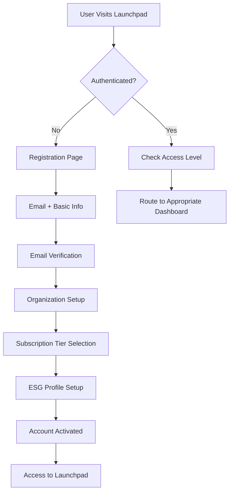
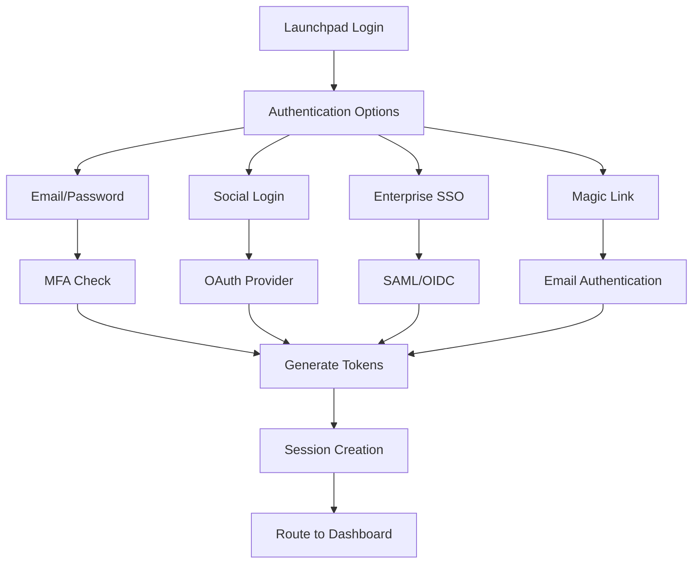
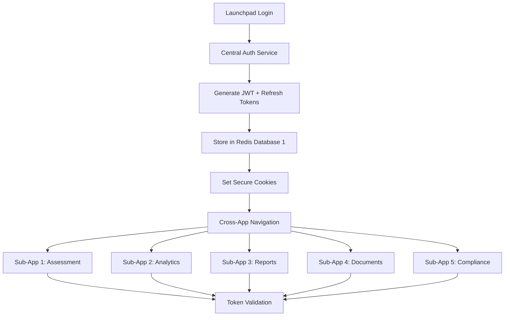
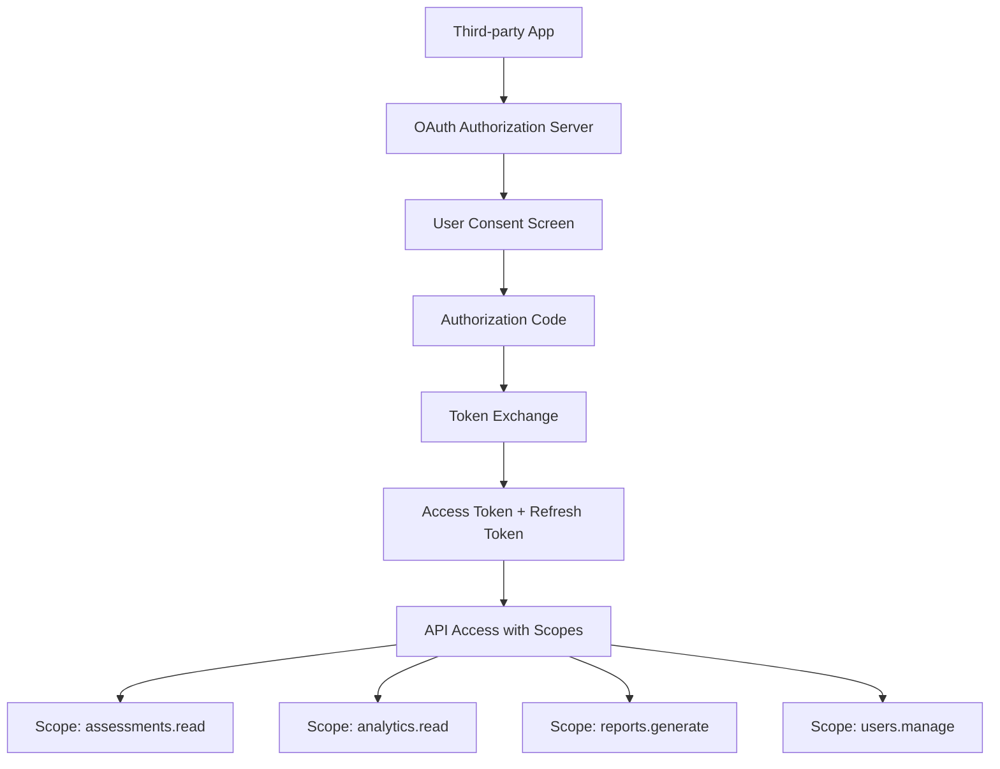

# AUREX LAUNCHPAD AUTHENTICATION ARCHITECTURE
## Comprehensive Authentication & Authorization System Design

**Document Version**: 1.0  
**Created**: August 7, 2025  
**System**: Aurex Launchpad ESG Assessment Platform  
**Port**: 3001 (Frontend) | 8001 (Backend API)

---

## 🎯 EXECUTIVE SUMMARY

This document defines a comprehensive authentication architecture for Aurex Launchpad that provides secure, seamless access across all 11 ESG sub-applications while implementing tiered access control (Free/Premium/Enterprise) and maintaining exceptional user experience aligned with the VIBE Framework principles.

### Key Authentication Features
- **Unified Single Sign-On (SSO)** across all sub-applications
- **Tiered Subscription Access Control** (Free/Premium/Enterprise)
- **Enterprise-Grade Security** with MFA and compliance standards
- **VIBE Framework Integration** (< 2s authentication, 99.99% availability)
- **Progressive Profiling** for ESG-specific user onboarding

---

## 🏗️ 1. AUTHENTICATION FLOW ARCHITECTURE

### 1.1 User Registration & Onboarding Flow



#### Progressive Onboarding Steps
1. **Basic Registration** (30 seconds)
   - Email, password, name
   - Organization identification
   - Industry selection

2. **Email Verification** (Immediate)
   - Send verification email
   - Click-to-verify with auto-login
   - Account activation

3. **Organization Setup** (2 minutes)
   - Company details and size
   - ESG maturity assessment
   - Compliance requirements

4. **Subscription Selection** (1 minute)
   - Free tier (14-day full access trial)
   - Premium tier ($99/month)
   - Enterprise tier (Custom pricing)

5. **ESG Profile Configuration** (3 minutes)
   - Sustainability goals
   - Reporting frameworks (GRI, SASB, TCFD)
   - Key stakeholders and roles

### 1.2 Sign-In Authentication Methods



#### Authentication Methods Priority
1. **Primary**: Email/Password with optional MFA
2. **Social**: Google, Microsoft 365, LinkedIn
3. **Enterprise**: SAML 2.0, OAuth 2.0, OpenID Connect
4. **Passwordless**: Magic links, biometric (mobile)

---

## 🔐 2. SESSION MANAGEMENT STRATEGY

### 2.1 Optimal Session Configuration for ESG Workflows

#### **SESSION DURATION RECOMMENDATIONS**

| User Activity | Session Type | Duration | Justification |
|---------------|-------------|----------|---------------|
| **Active ESG Assessment** | Sliding Session | 4 hours | ESG assessments can take 2-4 hours |
| **Dashboard Viewing** | Standard Session | 2 hours | Typical analytics review session |
| **Report Generation** | Extended Session | 6 hours | Complex report creation workflow |
| **Document Upload** | Activity-Based | Until completion | File upload tasks need completion |
| **Mobile Access** | Shorter Session | 1 hour | Security for mobile devices |

#### **SLIDING VS FIXED DURATION STRATEGY**
- **Sliding Sessions**: For active assessment and data entry (resets on activity)
- **Fixed Duration**: For administrative and configuration tasks
- **Hybrid Approach**: Intelligent session management based on user behavior

### 2.2 Cross-Application Session Management



#### **CROSS-BROWSER TAB HANDLING**
- **Shared Session State**: Redis-based session store
- **Tab Communication**: BroadcastChannel API for session sync
- **Idle Detection**: Combined across all tabs
- **Logout Propagation**: Instant logout across all tabs

### 2.3 Session Security & Refresh Strategy

```javascript
// Session Configuration
const SESSION_CONFIG = {
  accessToken: {
    expiresIn: '2h',           // Standard access token
    algorithm: 'HS256',
    issuer: 'aurex-launchpad'
  },
  refreshToken: {
    expiresIn: '30d',          // Long-lived refresh token
    rotation: true,            // Rotate on each use
    reuseDetection: true       // Detect token reuse attacks
  },
  slidingExpiration: {
    enabled: true,
    threshold: '30m',          // Reset if activity within 30 min
    maxDuration: '8h'          // Absolute maximum session
  }
}
```

---

## 🎭 3. TIERED ACCESS CONTROL MATRIX

### 3.1 Subscription Tier Feature Matrix

| Feature Category | Free Tier | Premium Tier | Enterprise Tier |
|-----------------|-----------|--------------|-----------------|
| **ESG Assessments** | 1 assessment/month | Unlimited | Unlimited + Custom frameworks |
| **Sub-Applications** | 3 modules | 8 modules | All 11 modules |
| **Data Storage** | 100MB | 10GB | Unlimited |
| **Users per Organization** | 3 users | 25 users | Unlimited |
| **API Rate Limiting** | 100 req/hour | 1000 req/hour | 10000 req/hour |
| **Report Generation** | Basic reports | Advanced reports | Custom branding |
| **Third-party Integrations** | None | 5 integrations | Unlimited |
| **Support Level** | Community | Email support | Dedicated success manager |
| **Audit Trail** | 30 days | 1 year | Unlimited retention |
| **Multi-factor Authentication** | Optional | Required | Enterprise SSO |

### 3.2 Sub-Application Access Control

```json
{
  "accessControl": {
    "free": {
      "modules": ["assessment", "dashboard", "basic-reports"],
      "limitations": {
        "assessments": 1,
        "dataExport": false,
        "apiAccess": false
      }
    },
    "premium": {
      "modules": [
        "assessment", "dashboard", "analytics", 
        "reports", "documents", "compliance",
        "benchmarking", "integrations"
      ],
      "limitations": {
        "assessments": "unlimited",
        "dataExport": true,
        "apiAccess": "limited"
      }
    },
    "enterprise": {
      "modules": "all",
      "customizations": true,
      "whiteLabeling": true,
      "dedicatedInstance": true
    }
  }
}
```

### 3.3 Role-Based Access Control (RBAC)

```mermaid
graph TD
    A[Organization] --> B[Admin Role]
    A --> C[Manager Role]
    A --> D[Analyst Role]
    A --> E[Viewer Role]
    A --> F[External Auditor]
    
    B --> G[All Modules + User Management]
    C --> H[Assessment + Reports + Team Management]
    D --> I[Assessment + Analytics]
    E --> J[Dashboard + Reports (Read-only)]
    F --> K[Audit Trail + Compliance (Read-only)]
```

---

## 🛡️ 4. SECURITY SPECIFICATIONS

### 4.1 Multi-Factor Authentication (MFA) Implementation

#### **MFA Methods for ESG Professionals**
1. **Authenticator Apps** (Primary)
   - Google Authenticator, Authy, Microsoft Authenticator
   - TOTP-based codes (30-second rotation)

2. **SMS-Based** (Fallback)
   - International SMS support
   - Rate limiting to prevent abuse

3. **Hardware Security Keys** (Enterprise)
   - FIDO2/WebAuthn support
   - YubiKey, Google Titan compatibility

4. **Biometric Authentication** (Mobile)
   - Fingerprint and Face ID
   - Device-based authentication

#### **MFA Enforcement Policy**
```json
{
  "mfaPolicy": {
    "free": "optional",
    "premium": "required_for_sensitive_actions",
    "enterprise": "always_required",
    "enforcement": {
      "sensitiveActions": [
        "user_management",
        "subscription_changes",
        "data_export",
        "compliance_reports"
      ],
      "gracePeriod": "7_days",
      "emergencyBypass": "admin_approval_required"
    }
  }
}
```

### 4.2 Risk-Based Authentication

```javascript
const RISK_FACTORS = {
  low: {
    knownDevice: true,
    usualLocation: true,
    businessHours: true,
    recentActivity: 'normal'
  },
  medium: {
    newDevice: true,
    unusualLocation: true,
    offHours: true,
    behaviorAnomaly: 'minor'
  },
  high: {
    unknownDevice: true,
    foreignCountry: true,
    multipleFailedAttempts: true,
    behaviorAnomaly: 'major'
  }
}
```

### 4.3 Compliance & Encryption Standards

#### **Data Protection Standards**
- **GDPR Compliance**: EU data protection
- **SOC 2 Type II**: Security controls
- **ISO 27001**: Information security management
- **CCPA**: California privacy rights

#### **Encryption Implementation**
- **In Transit**: TLS 1.3 for all communications
- **At Rest**: AES-256 for database encryption
- **JWT Signing**: RS256 for production environments
- **Password Hashing**: Bcrypt with work factor 12

---

## ⚡ 5. VIBE FRAMEWORK APPLICATION

### 5.1 Velocity (Speed) - Target: < 2 Seconds Authentication

```javascript
// Performance Optimizations
const VELOCITY_OPTIMIZATIONS = {
  tokenValidation: {
    caching: 'redis',
    cacheTTL: '5m',
    localValidation: true
  },
  sessionLookup: {
    indexing: 'hash_indexes',
    connectionPooling: 'pgbouncer',
    queryOptimization: 'prepared_statements'
  },
  frontendOptimizations: {
    bundleSize: 'code_splitting',
    authentication: 'lazy_loading',
    caching: 'service_worker'
  }
}
```

### 5.2 Intelligence (Smart Security)

```javascript
// AI-Powered Security Features
const INTELLIGENCE_FEATURES = {
  behaviorAnalysis: {
    loginPatterns: 'ml_analysis',
    deviceFingerprinting: 'browser_profiling',
    anomalyDetection: 'real_time_scoring'
  },
  adaptiveAuthentication: {
    riskScoring: 'dynamic',
    challengeEscalation: 'contextual',
    fraudPrevention: 'ml_models'
  }
}
```

### 5.3 Balance (Security vs User Experience)

| Security Level | User Experience | Use Case |
|---------------|-----------------|----------|
| **Low Security** | Seamless SSO | Dashboard viewing |
| **Medium Security** | MFA on sensitive actions | Data modification |
| **High Security** | Full re-authentication | Admin functions |

### 5.4 Excellence (99.99% Availability)

```yaml
# High Availability Configuration
availability:
  loadBalancing:
    algorithm: 'round_robin'
    healthChecks: 'continuous'
  failover:
    strategy: 'hot_standby'
    switchover: '<30s'
  monitoring:
    uptime: 'prometheus'
    alerting: 'pagerduty'
    sla: '99.99%'
```

---

## 🔧 6. IMPLEMENTATION GUIDELINES

### 6.1 Backend Authentication Service

```python
# Enhanced Authentication Service
class LaunchpadAuthService(AuthService):
    """Enhanced authentication for Launchpad with tier-based access"""
    
    async def authenticate_with_tier_check(
        self, 
        email: str, 
        password: str
    ) -> AuthResult:
        """Authenticate user and check subscription tier"""
        user = await self.authenticate_user(email, password)
        if not user:
            return AuthResult(success=False, error="Invalid credentials")
            
        # Check subscription status
        subscription = await self.get_user_subscription(user.id)
        access_level = self.determine_access_level(subscription)
        
        # Generate tier-aware token
        token = self.create_tiered_access_token(
            user_id=str(user.id),
            organization_id=str(user.organization_id),
            subscription_tier=subscription.tier,
            access_level=access_level
        )
        
        return AuthResult(
            success=True,
            token=token,
            user=user,
            subscription=subscription
        )
    
    def create_tiered_access_token(self, **kwargs) -> str:
        """Create JWT token with tier-specific claims"""
        expires_at = datetime.utcnow() + self.get_session_duration(kwargs['subscription_tier'])
        
        payload = {
            "sub": kwargs['user_id'],
            "org": kwargs['organization_id'],
            "tier": kwargs['subscription_tier'],
            "access": kwargs['access_level'],
            "modules": self.get_allowed_modules(kwargs['subscription_tier']),
            "exp": expires_at,
            "iat": datetime.utcnow(),
            "jti": str(uuid4())
        }
        
        return jwt.encode(payload, JWT_SECRET, algorithm=JWT_ALGORITHM)
```

### 6.2 Frontend Authentication Hook

```typescript
// React Hook for Launchpad Authentication
export const useLaunchpadAuth = () => {
  const [user, setUser] = useState<User | null>(null);
  const [subscription, setSubscription] = useState<Subscription | null>(null);
  const [accessLevel, setAccessLevel] = useState<AccessLevel>('free');
  
  const authenticateUser = async (credentials: LoginCredentials) => {
    const response = await api.post('/auth/login', credentials);
    
    if (response.success) {
      setUser(response.user);
      setSubscription(response.subscription);
      setAccessLevel(response.accessLevel);
      
      // Store tokens securely
      tokenService.setTokens({
        access: response.accessToken,
        refresh: response.refreshToken
      });
      
      // Setup session monitoring
      sessionService.startMonitoring();
    }
    
    return response;
  };
  
  const hasModuleAccess = (moduleId: string): boolean => {
    return subscription?.allowedModules?.includes(moduleId) || false;
  };
  
  const getRemainingQuota = (resource: string): number => {
    return subscription?.quotas?.[resource]?.remaining || 0;
  };
  
  return {
    user,
    subscription,
    accessLevel,
    authenticateUser,
    hasModuleAccess,
    getRemainingQuota,
    isAuthenticated: !!user
  };
};
```

### 6.3 Session Management Implementation

```javascript
// Intelligent Session Management
class LaunchpadSessionManager {
  constructor() {
    this.slidingThreshold = 30 * 60 * 1000; // 30 minutes
    this.maxDuration = 8 * 60 * 60 * 1000;  // 8 hours
    this.activityTypes = new Set([
      'assessment_interaction',
      'data_input',
      'navigation',
      'api_call'
    ]);
  }
  
  trackActivity(activityType, context) {
    if (this.activityTypes.has(activityType)) {
      this.lastActivity = Date.now();
      this.extendSessionIfNeeded();
      
      // Store in session context
      sessionStorage.setItem('last_activity', this.lastActivity.toString());
      sessionStorage.setItem('activity_context', JSON.stringify(context));
    }
  }
  
  extendSessionIfNeeded() {
    const sessionStart = parseInt(sessionStorage.getItem('session_start'));
    const now = Date.now();
    
    // Check if we're within sliding window
    if (now - this.lastActivity < this.slidingThreshold) {
      // Check if we haven't exceeded max duration
      if (now - sessionStart < this.maxDuration) {
        this.refreshTokens();
      } else {
        this.handleSessionExpiry('max_duration_exceeded');
      }
    }
  }
}
```

---

## 📊 7. USER EXPERIENCE OPTIMIZATION

### 7.1 Authentication Flow Optimization

#### **Friction Reduction Strategies**
1. **Smart Login Forms**
   - Email auto-completion
   - Password strength indicators
   - Progressive form validation

2. **Contextual Help**
   - Inline help text
   - Video tutorials for complex flows
   - Live chat support

3. **Error Handling**
   - Clear, actionable error messages
   - Automatic retry mechanisms
   - Alternative authentication methods

### 7.2 Mobile Authentication Experience

```javascript
// Mobile-Optimized Authentication
const MobileAuthFlow = {
  biometricAuth: {
    enabled: true,
    fallback: 'pin',
    timeout: 30000
  },
  quickLogin: {
    lastUser: 'remember',
    quickSwitch: 'enabled'
  },
  offlineSupport: {
    cachedCredentials: 'encrypted',
    syncOnReconnect: true
  }
};
```

### 7.3 Accessibility Compliance

- **WCAG 2.1 AA Compliance**: Full accessibility support
- **Screen Reader Support**: ARIA labels and descriptions
- **Keyboard Navigation**: Complete keyboard accessibility
- **High Contrast Mode**: Visual accessibility options

---

## 🔍 8. API AUTHENTICATION & INTEGRATION

### 8.1 API Authentication Methods

```yaml
# API Authentication Configuration
api_auth:
  methods:
    - name: "Bearer Token"
      description: "Standard JWT tokens for web apps"
      rate_limit: "tier_based"
    
    - name: "API Key"
      description: "Long-lived keys for integrations"
      rotation: "quarterly"
    
    - name: "OAuth 2.0"
      description: "Third-party application access"
      scopes: "granular"
    
    - name: "Service Account"
      description: "Machine-to-machine authentication"
      certificate: "mutual_tls"

  rate_limiting:
    free: "100/hour"
    premium: "1000/hour"
    enterprise: "10000/hour"
```

### 8.2 Third-Party Integration Authentication



---

## 📋 9. SPECIFIC QUESTIONS ANSWERED

### 9.1 Session Timeout for Active Users
**Recommendation**: 4-hour sliding sessions for ESG assessments
- **Justification**: ESG assessments typically take 2-4 hours to complete
- **Implementation**: Activity-based extension with 30-minute idle threshold
- **Maximum**: 8-hour absolute session limit for security

### 9.2 Sliding vs Fixed Duration
**Recommendation**: Hybrid approach
- **Sliding**: For active assessment and data entry workflows
- **Fixed**: For administrative tasks and configuration changes
- **Context-aware**: Based on user activity patterns and task types

### 9.3 Cross-Browser Tab Management
**Solution**: Centralized session state with real-time synchronization
- **Technology**: Redis for session storage + BroadcastChannel API
- **Behavior**: Logout on one tab immediately affects all tabs
- **Activity**: Combined idle detection across all tabs

### 9.4 MFA Methods for ESG Professionals
**Primary**: Authenticator apps (Google Authenticator, Authy)
**Secondary**: SMS-based authentication for international users
**Enterprise**: Hardware security keys (YubiKey) for high-security environments
**Mobile**: Biometric authentication on supported devices

### 9.5 API Access Authentication
**Multi-layered approach**:
1. **JWT Tokens**: For web application API calls
2. **API Keys**: For third-party integrations (quarterly rotation)
3. **OAuth 2.0**: For external application access with scopes
4. **Service Accounts**: For machine-to-machine communication with mTLS

---

## 🎯 10. SUCCESS METRICS & KPIs

### 10.1 Authentication Performance Metrics

| Metric | Target | Measurement |
|--------|--------|-------------|
| **Login Time** | < 2 seconds | Time to successful authentication |
| **Session Availability** | 99.99% | Uptime monitoring |
| **Failed Login Rate** | < 0.1% | Legitimate user failures |
| **MFA Adoption** | > 80% | Premium/Enterprise users |
| **Token Refresh Success** | > 99.9% | Seamless session extension |

### 10.2 User Experience Metrics

| Metric | Target | Business Impact |
|--------|--------|-----------------|
| **Registration Completion** | > 90% | User acquisition |
| **First Session Duration** | > 20 minutes | User engagement |
| **Cross-App Navigation** | < 1 second | User retention |
| **Support Tickets (Auth)** | < 2% of users | Operational efficiency |

---

## 🚀 11. IMPLEMENTATION ROADMAP

### Phase 1: Core Authentication (Weeks 1-4)
- [ ] Enhanced JWT service with tier-based claims
- [ ] Multi-factor authentication implementation
- [ ] Session management with sliding expiration
- [ ] Cross-application session synchronization

### Phase 2: Advanced Security (Weeks 5-8)
- [ ] Risk-based authentication
- [ ] Hardware security key support
- [ ] Enterprise SSO integration (SAML/OIDC)
- [ ] Audit trail and compliance features

### Phase 3: User Experience (Weeks 9-12)
- [ ] Mobile authentication optimization
- [ ] Passwordless authentication (magic links)
- [ ] Social login integration
- [ ] Accessibility compliance

### Phase 4: Enterprise Features (Weeks 13-16)
- [ ] API authentication and rate limiting
- [ ] Third-party OAuth integration
- [ ] Advanced analytics and monitoring
- [ ] White-label authentication options

---

## 📞 SUPPORT & CONTACT

For implementation support and questions regarding this authentication architecture:

**Technical Contact**: auth-experts@aurigraph.io  
**Documentation**: https://docs.aurex.com/authentication  
**Emergency Security**: security@aurigraph.io  

---

**Document Status**: Final v1.0  
**Next Review**: September 7, 2025  
**Implementation Owner**: Authentication Expert Team