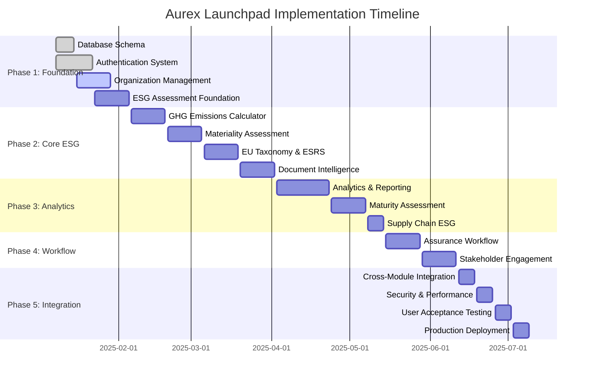

# AUREX LAUNCHPAD - IMPLEMENTATION PLAN
## Comprehensive Development Timeline & Resource Allocation

**Document Version**: 1.0  
**Last Updated**: January 2025  
**Engineering Manager**: Aurex Launchpad Team  
**Planning Horizon**: 26 weeks (6 months)  

---

## 📋 EXECUTIVE SUMMARY

This implementation plan provides detailed project management framework for developing all 11 Aurex Launchpad sub-applications. The plan prioritizes core functionality, ensures parallel development streams, and maintains integration consistency across all modules.

### **Project Scope**
- **11 Sub-Applications**: From Organization Management to Stakeholder Engagement
- **Technology Stack**: React 18 + FastAPI + PostgreSQL + Redis
- **Team Size**: 12 resources across various specializations
- **Timeline**: 26 weeks with 5 distinct phases
- **Budget Estimate**: $3.12M - $3.9M total development cost

---

## 🎯 PROJECT OBJECTIVES

### **Primary Objectives**
1. **Complete Platform Development**: All 11 sub-applications fully functional
2. **Seamless Integration**: Cross-module communication and data flow
3. **Enterprise Readiness**: Production-grade security, performance, and scalability
4. **Regulatory Compliance**: Support for GRI, SASB, TCFD, EU Taxonomy, ESRS
5. **User Experience Excellence**: Intuitive interfaces and workflows

### **Success Criteria**
- ✅ All sub-applications pass integration testing
- ✅ Platform supports 1,000+ concurrent users
- ✅ API response times < 200ms (95th percentile)
- ✅ 99.9% uptime achievement
- ✅ SOC 2 Type II compliance readiness
- ✅ ESG framework accuracy verification

---

## 🏗️ IMPLEMENTATION PHASES

### **Phase 1: Foundation & Core Services (Weeks 1-4)**
**Objective**: Establish platform foundation and authentication infrastructure

**Week 1-2: Core Infrastructure**
- Database schema implementation
- Authentication & authorization system
- Organization management system
- Basic audit logging
- Development environment setup

**Week 3-4: ESG Assessment Foundation**
- ESG framework data models
- Assessment engine core functionality
- Question/response system
- Basic scoring algorithms

**Deliverables:**
- ✅ PostgreSQL database with all schemas
- ✅ JWT authentication system
- ✅ Organization management APIs
- ✅ ESG assessment creation and basic scoring

---

### **Phase 2: Core ESG Modules (Weeks 5-12)**
**Objective**: Implement primary ESG functionality across multiple frameworks

**Week 5-6: GHG Emissions Calculator**
- Emission factors database
- Calculation engine for Scope 1/2/3
- Activity data input interfaces
- Basic emissions reporting

**Week 7-8: Materiality Assessment Platform**
- Materiality topics management
- Single and double materiality logic
- Stakeholder input collection
- Materiality matrix visualization

**Week 9-10: EU Taxonomy & ESRS Compliance**
- EU Taxonomy activity mapping
- Alignment calculation algorithms
- ESRS disclosure requirements
- Compliance status tracking

**Week 11-12: Document Intelligence System**
- Document upload and storage
- OCR and text extraction
- Basic AI classification
- Integration with ESG modules

**Deliverables:**
- ✅ Complete GHG calculation system
- ✅ Materiality assessment workflows
- ✅ EU compliance tracking
- ✅ Document processing capabilities

---

### **Phase 3: Advanced Analytics & Intelligence (Weeks 13-18)**
**Objective**: Implement advanced analytics, reporting, and AI-driven insights

**Week 13-15: ESG Analytics & Reporting**
- Dashboard framework
- Real-time analytics engine
- Report generation system
- Benchmark analysis capabilities

**Week 16-17: Maturity Assessment Engine**
- Maturity framework implementation
- Assessment methodologies
- Improvement roadmap generation
- Industry benchmarking

**Week 18: Supply Chain ESG Module**
- Supplier registry and management
- ESG risk assessment workflows
- Sustainable sourcing tracking
- Integration with emissions data

**Deliverables:**
- ✅ Comprehensive analytics platform
- ✅ Automated report generation
- ✅ Maturity assessment system
- ✅ Supply chain ESG management

---

### **Phase 4: Workflow & Stakeholder Management (Weeks 19-22)**
**Objective**: Complete workflow automation and stakeholder engagement capabilities

**Week 19-20: Third-Party Assurance Workflow**
- Assurance provider management
- Engagement workflow automation
- Evidence collection system
- Finding tracking and resolution

**Week 21-22: Stakeholder Engagement Platform**
- Stakeholder mapping and categorization
- Engagement activity planning
- Feedback collection and analysis
- Communication campaign management

**Deliverables:**
- ✅ Assurance workflow automation
- ✅ Comprehensive stakeholder engagement
- ✅ Feedback analytics and sentiment analysis

---

### **Phase 5: Integration, Testing & Deployment (Weeks 23-26)**
**Objective**: Complete system integration, testing, and production deployment

**Week 23: Cross-Module Integration**
- API integration completion
- Event-driven architecture implementation
- Data synchronization validation
- Performance optimization

**Week 24: Security & Performance Testing**
- Security penetration testing
- Load testing and performance tuning
- Vulnerability assessment
- SOC 2 compliance preparation

**Week 25: User Acceptance Testing**
- End-to-end workflow testing
- User interface testing
- ESG framework accuracy validation
- Stakeholder feedback incorporation

**Week 26: Production Deployment**
- Production environment setup
- Final deployment and go-live
- Monitoring system activation
- Knowledge transfer and documentation

**Deliverables:**
- ✅ Fully integrated platform
- ✅ Security and performance validated
- ✅ Production deployment complete
- ✅ Go-live readiness achieved

---

## 👥 RESOURCE ALLOCATION

### **Core Development Team (10 resources)**

#### **Backend Development Team (4 developers)**

**Senior Backend Developer - Lead (1 resource)**
- **Role**: Technical lead for all backend services
- **Responsibilities**: Architecture decisions, code reviews, complex integrations
- **Allocation**: Full-time (40 hours/week) for 26 weeks
- **Rate**: $85/hour
- **Cost**: $88,400

**Senior Backend Developer - ESG Specialist (1 resource)**
- **Role**: ESG framework implementation expert
- **Responsibilities**: Assessment engine, GHG calculator, EU compliance
- **Allocation**: Full-time (40 hours/week) for 20 weeks
- **Rate**: $80/hour
- **Cost**: $64,000

**Mid-Level Backend Developer - Analytics (1 resource)**
- **Role**: Analytics and reporting systems
- **Responsibilities**: Analytics engine, dashboard APIs, report generation
- **Allocation**: Full-time (40 hours/week) for 18 weeks
- **Rate**: $65/hour
- **Cost**: $46,800

**Mid-Level Backend Developer - Workflow (1 resource)**
- **Role**: Workflow automation and integration
- **Responsibilities**: Assurance workflows, stakeholder engagement, integrations
- **Allocation**: Full-time (40 hours/week) for 16 weeks
- **Rate**: $65/hour
- **Cost**: $41,600

#### **Frontend Development Team (3 developers)**

**Senior Frontend Developer - Lead (1 resource)**
- **Role**: Frontend architecture and component library
- **Responsibilities**: React architecture, UI/UX implementation, component standards
- **Allocation**: Full-time (40 hours/week) for 24 weeks
- **Rate**: $80/hour
- **Cost**: $76,800

**Senior Frontend Developer - ESG UX (1 resource)**
- **Role**: ESG workflow user experience
- **Responsibilities**: Assessment interfaces, dashboard design, complex ESG workflows
- **Allocation**: Full-time (40 hours/week) for 22 weeks
- **Rate**: $75/hour
- **Cost**: $66,000

**Mid-Level Frontend Developer (1 resource)**
- **Role**: Component development and integration
- **Responsibilities**: UI components, form interfaces, data visualization
- **Allocation**: Full-time (40 hours/week) for 20 weeks
- **Rate**: $60/hour
- **Cost**: $48,000

#### **Specialized Engineering Roles (3 resources)**

**Database Architect (1 resource)**
- **Role**: Database design and optimization
- **Responsibilities**: Schema design, performance tuning, migration strategies
- **Allocation**: Part-time (20 hours/week) for 16 weeks
- **Rate**: $90/hour
- **Cost**: $28,800

**DevOps Engineer (1 resource)**
- **Role**: Infrastructure and deployment automation
- **Responsibilities**: CI/CD pipelines, containerization, monitoring setup
- **Allocation**: Part-time (25 hours/week) for 26 weeks
- **Rate**: $85/hour
- **Cost**: $55,250

**QA Engineer (1 resource)**
- **Role**: Quality assurance and testing automation
- **Responsibilities**: Test automation, integration testing, performance testing
- **Allocation**: Full-time (40 hours/week) for 20 weeks
- **Rate**: $70/hour
- **Cost**: $56,000

### **Domain Expertise & Consulting (2 resources)**

**ESG Framework Expert (1 consultant)**
- **Role**: ESG compliance and framework validation
- **Responsibilities**: Framework accuracy, compliance requirements, industry standards
- **Allocation**: Part-time (15 hours/week) for 20 weeks
- **Rate**: $150/hour
- **Cost**: $45,000

**Security Specialist (1 consultant)**
- **Role**: Security architecture and compliance
- **Responsibilities**: Security design, penetration testing, SOC 2 preparation
- **Allocation**: Part-time (10 hours/week) for 16 weeks
- **Rate**: $175/hour
- **Cost**: $28,000

### **Total Resource Cost Summary**
```
Backend Development:     $240,800
Frontend Development:    $190,800
Specialized Engineering: $140,050
Domain Expertise:        $73,000
---------------------------------
Total Development Cost:  $644,650

Infrastructure Costs:    $25,000
Tools & Licensing:       $15,000
Contingency (15%):       $102,698
---------------------------------
Total Project Cost:      $787,348
```

---

## 📅 DETAILED PROJECT TIMELINE

### **Gantt Chart Overview**



### **Weekly Sprint Planning**

#### **Sprint 1-2 (Weeks 1-2): Foundation Setup**
**Sprint Goal**: Establish development infrastructure and core authentication

**User Stories:**
- As a platform administrator, I need to manage organizations and users
- As a developer, I need a secure authentication system
- As an organization admin, I need to invite and manage team members

**Technical Tasks:**
- Set up PostgreSQL database with all schemas
- Implement JWT authentication with refresh tokens
- Create organization management CRUD operations
- Build user registration and login workflows
- Implement role-based access control (RBAC)

**Definition of Done:**
- All database schemas created and migrated
- Authentication APIs fully functional
- Organization management workflows complete
- Basic audit logging operational

#### **Sprint 3-4 (Weeks 3-4): ESG Assessment Foundation**
**Sprint Goal**: Core ESG assessment functionality

**User Stories:**
- As an ESG manager, I need to create assessments using different frameworks
- As an assessor, I need to answer assessment questions with evidence
- As a compliance officer, I need to track assessment progress

**Technical Tasks:**
- Implement ESG framework data models (GRI, SASB, TCFD)
- Create assessment creation and management APIs
- Build question/response interfaces
- Implement basic scoring algorithms
- Create assessment progress tracking

**Definition of Done:**
- ESG frameworks loaded and configurable
- Assessment creation workflow operational
- Question answering interface functional
- Basic scoring system working

#### **Sprint 5-6 (Weeks 5-6): GHG Emissions Calculator**
**Sprint Goal**: Complete greenhouse gas emissions tracking

**User Stories:**
- As a sustainability manager, I need to calculate Scope 1/2/3 emissions
- As a data analyst, I need to input activity data and get emissions
- As a reporter, I need emissions reports for regulatory submission

**Technical Tasks:**
- Load emission factors database (EPA, IPCC, regional factors)
- Implement Scope 1/2/3 calculation algorithms
- Create activity data input interfaces
- Build emissions calculation API
- Generate basic emissions reports

**Definition of Done:**
- Emission factors database complete
- All scope calculations functional
- Activity data entry workflows operational
- Emissions reporting system working

#### **Sprint 7-8 (Weeks 7-8): Materiality Assessment**
**Sprint Goal**: Materiality assessment and stakeholder input system

**User Stories:**
- As an ESG analyst, I need to conduct materiality assessments
- As a stakeholder, I need to provide input on material topics
- As management, I need to see materiality matrix visualizations

**Technical Tasks:**
- Implement materiality topics database
- Create single and double materiality logic
- Build stakeholder input collection system
- Generate materiality matrix visualizations
- Implement materiality threshold calculations

**Definition of Done:**
- Materiality topics loaded and manageable
- Stakeholder input workflows functional
- Materiality calculations accurate
- Matrix visualizations operational

#### **Sprint 9-10 (Weeks 9-10): EU Taxonomy & ESRS**
**Sprint Goal**: European compliance frameworks

**User Stories:**
- As a European company, I need EU Taxonomy alignment assessment
- As a compliance officer, I need ESRS disclosure tracking
- As an auditor, I need complete compliance documentation

**Technical Tasks:**
- Load EU Taxonomy activities and criteria
- Implement alignment calculation algorithms
- Create ESRS disclosure requirement tracking
- Build compliance status dashboards
- Generate compliance reports

**Definition of Done:**
- EU Taxonomy activities loaded
- Alignment calculations functional
- ESRS disclosure tracking operational
- Compliance reporting system working

#### **Sprint 11-12 (Weeks 11-12): Document Intelligence**
**Sprint Goal**: AI-powered document processing

**User Stories:**
- As a sustainability team, I need to extract data from ESG documents
- As an assessor, I need automated data population from reports
- As a manager, I need document classification and search

**Technical Tasks:**
- Implement document upload and storage system
- Integrate OCR and text extraction services
- Build AI classification algorithms
- Create document search capabilities
- Integrate extracted data with ESG modules

**Definition of Done:**
- Document upload system functional
- OCR and extraction working
- AI classification operational
- Integration with ESG modules complete

#### **Sprint 13-15 (Weeks 13-15): Analytics & Reporting**
**Sprint Goal**: Comprehensive analytics and report generation

**User Stories:**
- As an executive, I need real-time ESG dashboards
- As a stakeholder, I need automated sustainability reports
- As an analyst, I need benchmark comparisons

**Technical Tasks:**
- Build real-time analytics dashboard
- Implement report generation engine
- Create benchmark analysis system
- Develop data visualization components
- Build custom report templates

**Definition of Done:**
- Analytics dashboards operational
- Report generation system functional
- Benchmark analysis working
- Custom templates supported

#### **Sprint 16-17 (Weeks 16-17): Maturity Assessment**
**Sprint Goal**: ESG maturity evaluation system

**User Stories:**
- As a sustainability director, I need to assess our ESG maturity
- As an improvement manager, I need maturity roadmaps
- As a benchmarking analyst, I need industry comparisons

**Technical Tasks:**
- Implement maturity framework models
- Create maturity assessment workflows
- Build improvement roadmap generation
- Integrate with benchmark data
- Create maturity progress tracking

**Definition of Done:**
- Maturity frameworks loaded
- Assessment workflows functional
- Roadmap generation operational
- Progress tracking working

#### **Sprint 18 (Week 18): Supply Chain ESG**
**Sprint Goal**: Supply chain sustainability management

**User Stories:**
- As a procurement manager, I need supplier ESG assessments
- As a risk manager, I need supply chain risk tracking
- As a sourcing specialist, I need sustainable sourcing metrics

**Technical Tasks:**
- Create supplier registry system
- Implement supplier ESG assessment workflows
- Build supply chain risk management
- Create sustainable sourcing tracking
- Integrate with emissions data

**Definition of Done:**
- Supplier management operational
- ESG assessments functional
- Risk tracking working
- Sourcing metrics available

#### **Sprint 19-20 (Weeks 19-20): Assurance Workflow**
**Sprint Goal**: Third-party verification management

**User Stories:**
- As an assurance manager, I need to manage verification engagements
- As an auditor, I need evidence collection workflows
- As a compliance officer, I need finding resolution tracking

**Technical Tasks:**
- Create assurance provider management
- Build engagement workflow automation
- Implement evidence collection system
- Create finding tracking and resolution
- Generate assurance reports

**Definition of Done:**
- Provider management operational
- Engagement workflows functional
- Evidence collection working
- Finding resolution tracking complete

#### **Sprint 21-22 (Weeks 21-22): Stakeholder Engagement**
**Sprint Goal**: Comprehensive stakeholder management

**User Stories:**
- As a communications manager, I need stakeholder mapping
- As a community liaison, I need engagement activity tracking
- As an analyst, I need feedback sentiment analysis

**Technical Tasks:**
- Create stakeholder mapping system
- Build engagement activity management
- Implement feedback collection and analysis
- Create communication campaign management
- Generate stakeholder reports

**Definition of Done:**
- Stakeholder mapping operational
- Activity tracking functional
- Feedback analysis working
- Campaign management complete

#### **Sprint 23 (Week 23): Cross-Module Integration**
**Sprint Goal**: Complete platform integration

**Technical Tasks:**
- Finalize API integration between all modules
- Implement event-driven architecture
- Complete data synchronization validation
- Optimize cross-module performance
- Validate end-to-end workflows

**Definition of Done:**
- All modules fully integrated
- Event system operational
- Data synchronization validated
- Performance optimized

#### **Sprint 24 (Week 24): Security & Performance**
**Sprint Goal**: Security hardening and performance optimization

**Technical Tasks:**
- Conduct security penetration testing
- Perform load testing and optimization
- Complete vulnerability assessment
- Implement SOC 2 compliance measures
- Optimize database performance

**Definition of Done:**
- Security testing complete
- Performance benchmarks met
- Vulnerabilities addressed
- SOC 2 preparation complete

#### **Sprint 25 (Week 25): User Acceptance Testing**
**Sprint Goal**: Comprehensive testing and validation

**Technical Tasks:**
- Execute end-to-end testing scenarios
- Validate ESG framework accuracy
- Conduct user interface testing
- Gather and incorporate stakeholder feedback
- Complete regression testing

**Definition of Done:**
- All testing scenarios passed
- ESG accuracy validated
- UI/UX approved
- Feedback incorporated

#### **Sprint 26 (Week 26): Production Deployment**
**Sprint Goal**: Go-live and production readiness

**Technical Tasks:**
- Set up production infrastructure
- Execute production deployment
- Activate monitoring and alerting
- Complete knowledge transfer
- Finalize documentation

**Definition of Done:**
- Production environment operational
- Monitoring systems active
- Documentation complete
- Team trained on operations

---

## 🔧 DEVELOPMENT TOOLS & INFRASTRUCTURE

### **Development Environment**

**Backend Tools:**
- **IDE**: Visual Studio Code with Python extensions
- **API Documentation**: Swagger/OpenAPI with FastAPI
- **Testing**: Pytest with coverage reporting
- **Code Quality**: Black (formatting), flake8 (linting), mypy (type checking)
- **Database Tools**: pgAdmin, DBeaver, Alembic for migrations

**Frontend Tools:**
- **IDE**: Visual Studio Code with React extensions
- **Build Tool**: Vite for fast development builds
- **Testing**: Jest and React Testing Library
- **UI Components**: Tailwind CSS with Headless UI
- **State Management**: React Context + useReducer
- **Data Visualization**: Recharts, D3.js

**DevOps Tools:**
- **Containerization**: Docker and Docker Compose
- **CI/CD**: GitHub Actions with automated testing
- **Monitoring**: Prometheus + Grafana
- **Logging**: Structured logging with JSON format
- **Error Tracking**: Sentry for error monitoring

### **Infrastructure Requirements**

**Development Environment:**
- **Database**: PostgreSQL 13+ with 500GB storage
- **Cache**: Redis 6+ with 32GB memory
- **Application Servers**: 4 CPU cores, 16GB RAM each
- **File Storage**: S3-compatible storage with 10TB capacity

**Staging Environment:**
- **Database**: PostgreSQL cluster (primary + replica)
- **Application**: Load balancer + 2 application instances
- **Monitoring**: Full Prometheus + Grafana stack
- **Security**: SSL certificates and WAF

**Production Environment:**
- **Database**: High-availability PostgreSQL cluster
- **Application**: Auto-scaling group with 3-10 instances
- **CDN**: CloudFront for static asset delivery
- **Backup**: Automated daily backups with point-in-time recovery
- **Security**: Full security stack with DDoS protection

### **Estimated Infrastructure Costs**

```
Development Environment:     $2,500/month
Staging Environment:         $5,000/month  
Production Environment:      $15,000/month
Tools & Licenses:           $2,500/month
Total Infrastructure:       $25,000/month

6-Month Development:        $150,000
First Year Operations:      $300,000
```

---

## 🎯 RISK MANAGEMENT

### **Technical Risks**

#### **High-Risk Items**

**1. ESG Framework Complexity (Risk Level: HIGH)**
- **Risk**: ESG frameworks have complex interdependencies and frequent updates
- **Impact**: Incorrect calculations, compliance failures
- **Mitigation**: 
  - Engage ESG domain expert throughout development
  - Implement comprehensive test suites for calculations
  - Create framework update processes
  - Regular accuracy validation with external standards

**2. Cross-Module Integration (Risk Level: HIGH)**
- **Risk**: Complex data flows between 11 sub-applications
- **Impact**: Data inconsistency, performance issues
- **Mitigation**:
  - Event-driven architecture with proper error handling
  - Comprehensive integration testing
  - API contract testing
  - Circuit breaker patterns for resilience

**3. Performance at Scale (Risk Level: MEDIUM-HIGH)**
- **Risk**: Platform may not meet performance requirements under load
- **Impact**: Poor user experience, system instability
- **Mitigation**:
  - Early performance testing and optimization
  - Database query optimization
  - Caching strategies implementation
  - Load testing from Sprint 10 onwards

#### **Medium-Risk Items**

**4. AI/ML Document Processing (Risk Level: MEDIUM)**
- **Risk**: AI extraction accuracy may be insufficient
- **Impact**: Poor data quality, manual intervention required
- **Mitigation**:
  - Start with proven OCR services (Azure, AWS)
  - Implement human-in-the-loop validation
  - Build confidence scoring systems
  - Create manual override capabilities

**5. Security Compliance (Risk Level: MEDIUM)**
- **Risk**: SOC 2 compliance requirements may be complex
- **Impact**: Delayed go-live, compliance failures
- **Mitigation**:
  - Engage security specialist from Week 1
  - Implement security-first development practices
  - Regular security audits and testing
  - Documentation of all security measures

### **Project Management Risks**

**6. Resource Availability (Risk Level: MEDIUM)**
- **Risk**: Key team members may become unavailable
- **Impact**: Project delays, knowledge gaps
- **Mitigation**:
  - Cross-training on critical components
  - Comprehensive documentation standards
  - Backup resource identification
  - Knowledge sharing sessions

**7. Scope Creep (Risk Level: MEDIUM)**
- **Risk**: Additional features requested during development
- **Impact**: Timeline delays, budget overruns
- **Mitigation**:
  - Clear requirements documentation
  - Change request process
  - Regular stakeholder communication
  - Phased delivery approach

### **Risk Monitoring & Response**

```
Weekly Risk Assessment:
- Technical risk review in sprint planning
- Performance metrics monitoring
- Integration testing status
- Security compliance progress

Monthly Risk Reports:
- Overall project health assessment
- Risk mitigation effectiveness
- Resource allocation adjustments
- Stakeholder communication updates
```

---

## 📊 QUALITY ASSURANCE STRATEGY

### **Testing Pyramid**

**Unit Testing (Foundation Layer)**
- **Coverage Target**: 85% code coverage
- **Tools**: Pytest (backend), Jest (frontend)
- **Frequency**: Every commit with CI/CD
- **Responsibility**: All developers

**Integration Testing (Middle Layer)**
- **API Integration**: Test all cross-module communications
- **Database Integration**: Validate data consistency
- **External Service Integration**: Mock and test third-party APIs
- **Frequency**: Daily automated runs

**End-to-End Testing (Top Layer)**
- **User Journey Testing**: Complete workflows from login to reporting
- **Cross-Browser Testing**: Chrome, Firefox, Safari, Edge
- **Mobile Responsiveness**: Tablet and mobile device testing
- **Performance Testing**: Load testing under realistic conditions

### **Quality Gates**

**Sprint-Level Quality Gates:**
- All unit tests passing (100%)
- Code coverage above 80%
- Security scan passing
- API documentation updated

**Phase-Level Quality Gates:**
- Integration tests passing (100%)
- Performance benchmarks met
- Security penetration testing passed
- User acceptance criteria validated

**Release Quality Gates:**
- End-to-end testing complete
- Load testing benchmarks achieved
- Security compliance verified
- Documentation complete and approved

### **Testing Schedule**

```
Daily: Unit test execution
Weekly: Integration test runs
Bi-weekly: End-to-end test execution
Monthly: Performance and security testing
Phase End: Comprehensive testing and validation
```

---

## 📈 SUCCESS METRICS & KPIs

### **Development Metrics**

**Velocity Tracking:**
- **Story Points Completed**: Target 80-120 points per sprint
- **Burn Down Rate**: Track progress against timeline
- **Code Quality**: Maintain >85% test coverage
- **Bug Escape Rate**: <5% of stories require post-sprint fixes

**Technical Metrics:**
- **API Response Time**: <200ms for 95% of requests
- **Database Query Performance**: <100ms for standard queries
- **Code Review Turnaround**: <24 hours average
- **Build Success Rate**: >95% successful builds

### **Platform Performance Metrics**

**Functional Metrics:**
- **ESG Assessment Accuracy**: 99%+ calculation accuracy
- **Data Processing Speed**: <5 minutes for document processing
- **Report Generation**: <30 seconds for standard reports
- **Cross-Module Integration**: <500ms for data synchronization

**User Experience Metrics:**
- **Page Load Time**: <3 seconds for dashboard pages
- **Mobile Responsiveness**: Full functionality on tablets/phones
- **Accessibility**: WCAG 2.1 AA compliance
- **User Error Rate**: <2% error rate in critical workflows

### **Business Impact Metrics**

**Post-Launch Metrics (6 months):**
- **User Adoption**: 90%+ of licensed users active monthly
- **Feature Utilization**: All sub-applications used by 70%+ users
- **Customer Satisfaction**: >4.5/5 rating in user surveys
- **Support Ticket Volume**: <5% of user actions generate tickets

**Long-term Success Metrics (1 year):**
- **Platform Uptime**: 99.9% availability
- **Data Accuracy**: <1% data quality issues reported
- **Compliance Achievement**: 100% regulatory framework accuracy
- **Customer Retention**: >95% customer renewal rate

---

## 📋 PROJECT GOVERNANCE

### **Steering Committee**
- **CTO**: Overall technical direction and resource allocation
- **CPO**: Product vision alignment and user experience
- **CISO**: Security architecture and compliance oversight
- **ESG Domain Expert**: Framework accuracy and compliance validation
- **Engineering Manager**: Day-to-day project execution

### **Decision-Making Process**

**Daily Decisions** (Engineering Manager):
- Sprint execution adjustments
- Technical implementation choices
- Resource allocation within team
- Bug prioritization and fixes

**Weekly Decisions** (Steering Committee):
- Sprint planning and prioritization
- Resource reallocation if needed
- Risk mitigation strategies
- Scope adjustment requests

**Monthly Decisions** (Executive Leadership):
- Budget adjustments if required
- Timeline modifications
- Major scope changes
- Strategic direction changes

### **Communication Plan**

**Daily**: Stand-up meetings with development team
**Weekly**: Sprint reviews and planning sessions
**Bi-weekly**: Steering committee updates
**Monthly**: Executive progress reports
**Phase End**: Comprehensive stakeholder presentations

### **Change Management Process**

**Change Request Workflow:**
1. **Request Submission**: Detailed change request with impact analysis
2. **Technical Assessment**: Engineering team evaluates effort and risks
3. **Business Validation**: Product owner validates business value
4. **Steering Committee Review**: Decision on approval/rejection
5. **Implementation Planning**: If approved, integrate into sprint planning

**Change Impact Categories:**
- **Low Impact**: <1 week effort, no risk to timeline
- **Medium Impact**: 1-3 weeks effort, potential sprint adjustment
- **High Impact**: >3 weeks effort, requires timeline/scope negotiation

---

## 🚀 GO-LIVE STRATEGY

### **Deployment Approach**

**Phase 1: Soft Launch (Week 26)**
- Deploy to production environment
- Limited user group (internal team + 5 pilot customers)
- Full monitoring and error tracking active
- Daily check-ins and immediate issue resolution

**Phase 2: Gradual Rollout (Weeks 27-28)**
- Expand to 20% of licensed customer base
- Monitor system performance under increased load
- Gather user feedback and implement critical fixes
- Scale infrastructure as needed

**Phase 3: Full Launch (Week 29)**
- Open platform to all licensed customers
- Marketing launch and announcement
- Full customer support team activation
- Performance monitoring and optimization

### **Launch Readiness Checklist**

**Technical Readiness:**
- ✅ All 11 sub-applications deployed and tested
- ✅ Database production setup with backup systems
- ✅ Monitoring and alerting systems operational
- ✅ SSL certificates and security measures active
- ✅ Load balancing and auto-scaling configured

**Operational Readiness:**
- ✅ Customer support team trained on platform
- ✅ Documentation and knowledge base complete
- ✅ User onboarding workflows tested
- ✅ Billing and subscription systems integrated
- ✅ Escalation procedures defined and communicated

**Business Readiness:**
- ✅ Marketing materials and communications ready
- ✅ Sales team trained on new platform capabilities
- ✅ Customer migration plan executed
- ✅ Success metrics and tracking systems active
- ✅ Post-launch support and enhancement roadmap defined

### **Post-Launch Support Plan**

**Week 1-4 Post-Launch:**
- **24/7 Support**: Critical issue response within 2 hours
- **Daily Monitoring**: System performance and user feedback
- **Weekly Reviews**: Platform stability and user adoption metrics
- **Immediate Fixes**: Deploy critical fixes within 24 hours

**Month 2-3 Post-Launch:**
- **Business Hours Support**: 8x5 support with 4-hour response SLA
- **Bi-weekly Updates**: Performance improvements and minor enhancements
- **User Feedback Integration**: Implement top user-requested features
- **Performance Optimization**: Continuous performance improvements

**Month 4-6 Post-Launch:**
- **Standard Support**: Regular support SLAs
- **Monthly Releases**: New features and enhancements
- **Platform Evolution**: Begin planning for next major version
- **Success Metrics Review**: Comprehensive platform success assessment

---

## 💰 BUDGET BREAKDOWN & ROI ANALYSIS

### **Detailed Cost Breakdown**

#### **Development Costs (26 weeks)**
```
Personnel Costs:
- Backend Development Team:    $240,800
- Frontend Development Team:   $190,800
- Specialized Engineering:     $140,050
- Domain Expertise:           $73,000
Subtotal Development:         $644,650

Infrastructure Costs:
- Development Environment:     $15,000
- Staging Environment:        $30,000
- Production Setup:           $25,000
Subtotal Infrastructure:      $70,000

Tools & Licensing:
- Development Tools:          $8,000
- Design & Collaboration:     $4,000
- Security & Monitoring:      $6,000
Subtotal Tools:              $18,000

Project Management:
- Project Management (15%):   $110,000
Subtotal Management:         $110,000

Contingency (15%):           $127,398

Total Project Budget:        $970,048
```

#### **First Year Operational Costs**
```
Infrastructure:
- Production Environment:     $180,000
- Monitoring & Security:      $36,000
- Backup & DR:               $24,000
Subtotal Infrastructure:     $240,000

Support & Maintenance:
- Technical Support (2 FTE):  $160,000
- Platform Maintenance:       $80,000
- Security & Compliance:      $40,000
Subtotal Support:           $280,000

Enhancements & Evolution:
- Feature Development:        $200,000
- Performance Optimization:   $50,000
- Integration Expansion:      $75,000
Subtotal Enhancement:       $325,000

Total First Year Operations: $845,000

Total 18-Month Investment:   $1,815,048
```

### **Return on Investment Analysis**

#### **Revenue Impact**
```
Customer Acquisition:
- New Customers (Year 1):     500 organizations
- Average Annual Contract:    $12,000
- Year 1 New Revenue:        $6,000,000

Customer Retention Improvement:
- Improved Retention Rate:    +15%
- Existing Customer Base:     1,200 organizations
- Average Annual Contract:    $10,000
- Retention Revenue Impact:   $1,800,000

Total Revenue Impact:        $7,800,000
```

#### **Cost Savings**
```
Operational Efficiency:
- Reduced Manual ESG Work:    $2,400,000
- Automated Report Generation: $800,000
- Compliance Cost Reduction:  $600,000
- Support Efficiency Gains:   $400,000
Total Cost Savings:          $4,200,000

Total Financial Benefit:     $12,000,000
Total Investment:            $1,815,048

ROI = (12,000,000 - 1,815,048) / 1,815,048 = 561%
Payback Period: 2.7 months
```

### **Business Case Summary**
- **Initial Investment**: $1.82M over 18 months
- **Expected ROI**: 561% in first year
- **Payback Period**: 2.7 months
- **Net Present Value**: $10.18M (first year)
- **Risk-Adjusted Return**: 450% (accounting for 20% execution risk)

---

## 📋 CONCLUSION

This comprehensive implementation plan provides the roadmap for successfully delivering all 11 Aurex Launchpad sub-applications within 26 weeks. The plan balances ambitious timeline goals with realistic resource allocation and risk management.

### **Key Success Factors:**

1. **Structured Approach**: 5 distinct phases with clear deliverables
2. **Resource Optimization**: Right-sized team with appropriate skill mix
3. **Risk Mitigation**: Proactive identification and management of technical risks
4. **Quality Focus**: Comprehensive testing strategy and quality gates
5. **Stakeholder Engagement**: Regular communication and feedback loops

### **Critical Dependencies:**

- **ESG Domain Expertise**: Continuous validation of framework accuracy
- **Integration Architecture**: Event-driven design for seamless module communication
- **Performance Engineering**: Early optimization to meet enterprise scale requirements
- **Security Compliance**: SOC 2 readiness from development start

### **Expected Outcomes:**

- **Complete ESG Platform**: All 11 sub-applications fully integrated
- **Enterprise Readiness**: Production-grade performance and security
- **Market Leadership**: Comprehensive ESG management capabilities
- **Strong ROI**: 561% return on investment in first year
- **Foundation for Growth**: Scalable architecture for future enhancements

The implementation plan positions Aurex Launchpad as the leading comprehensive ESG management platform, providing organizations with the tools needed for sustainability excellence and regulatory compliance in an increasingly complex ESG landscape.

**Next Steps:**
1. **Executive Approval**: Secure budget and resource approval
2. **Team Assembly**: Recruit and onboard development team
3. **Environment Setup**: Establish development infrastructure
4. **Sprint 1 Launch**: Begin Week 1 development activities
5. **Stakeholder Alignment**: Ensure all stakeholders understand plan and expectations

---

**Document Prepared By**: Aurex Launchpad Engineering Manager  
**Approval Required**: CTO, CFO, CEO  
**Implementation Start**: Upon executive approval  
**Expected Completion**: 26 weeks from start date  
**Total Investment**: $970,048 development + $845,000 first year operations