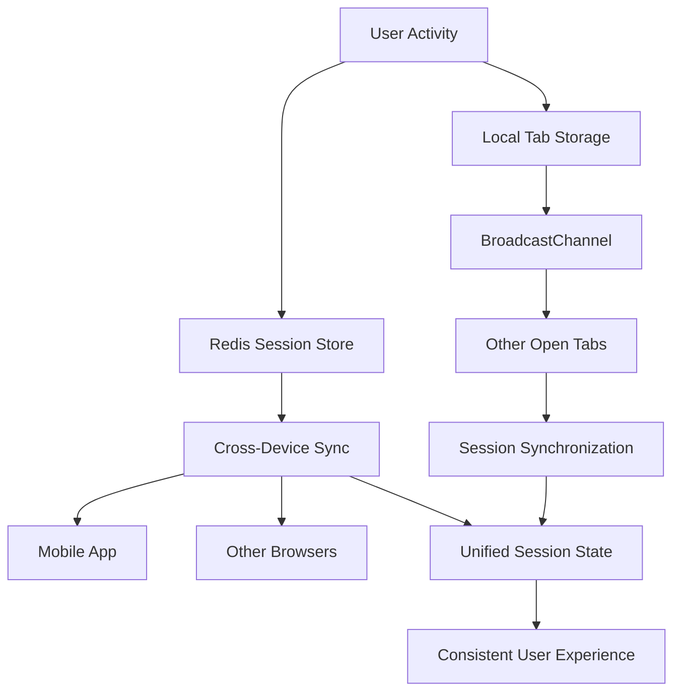

# AUREX LAUNCHPAD SESSION MANAGEMENT POLICY
## Intelligent Session Management for ESG Workflows

**Version**: 1.0  
**Created**: August 7, 2025  
**Effective**: Immediate  
**Review Date**: November 7, 2025

---

## 📋 POLICY OVERVIEW

This policy defines the session management strategy for Aurex Launchpad, optimized for ESG assessment workflows while maintaining enterprise-grade security and exceptional user experience aligned with VIBE Framework principles.

### Key Principles
- **Velocity**: < 2 second session validation
- **Intelligence**: Context-aware session management
- **Balance**: Security without workflow disruption
- **Excellence**: 99.99% session availability

---

## ⏱️ SESSION DURATION MATRIX

### ESG Workflow-Optimized Timeouts

| Workflow Type | Session Type | Base Duration | Max Extension | Idle Timeout | Justification |
|---------------|-------------|---------------|---------------|--------------|---------------|
| **ESG Assessment** | Sliding | 4 hours | 8 hours | 30 minutes | Complex assessments require sustained focus |
| **Data Input Forms** | Sliding | 2 hours | 4 hours | 15 minutes | Prevent data loss during form completion |
| **Dashboard Analytics** | Standard | 2 hours | 2 hours | 30 minutes | Typical analysis sessions |
| **Report Generation** | Extended | 6 hours | 12 hours | 45 minutes | Complex report creation workflows |
| **Document Upload** | Activity-Based | Until completion | 2 hours | 10 minutes | Task must complete without interruption |
| **Administrative Tasks** | Fixed | 1 hour | 1 hour | 10 minutes | Security-sensitive operations |
| **Mobile Access** | Standard | 1 hour | 2 hours | 15 minutes | Mobile security considerations |
| **API Access** | Token-Based | 1 hour | N/A | N/A | Programmatic access |

---

## 🔄 SESSION EXTENSION STRATEGIES

### Sliding Session Implementation

```javascript
// Intelligent Session Extension Algorithm
class LaunchpadSessionManager {
  constructor() {
    this.config = {
      sliding: {
        threshold: 30 * 60 * 1000,      // 30 minutes
        maxDuration: 8 * 60 * 60 * 1000, // 8 hours
        activities: [
          'form_interaction',
          'assessment_progress',
          'data_modification',
          'navigation',
          'api_calls'
        ]
      },
      warnings: {
        first: 5 * 60 * 1000,           // 5 minutes before expiry
        final: 1 * 60 * 1000,          // 1 minute before expiry
        grace: 30 * 1000                // 30 seconds grace period
      }
    };
  }

  trackActivity(activityType, context = {}) {
    if (this.config.sliding.activities.includes(activityType)) {
      const now = Date.now();
      const sessionStart = this.getSessionStart();
      
      // Update last activity
      this.lastActivity = now;
      sessionStorage.setItem('aurex_last_activity', now.toString());
      
      // Check if session can be extended
      if (now - sessionStart < this.config.sliding.maxDuration) {
        this.extendSession(context);
      } else {
        this.handleMaxDurationReached();
      }
    }
  }

  extendSession(context) {
    const timeSinceActivity = Date.now() - this.lastActivity;
    
    if (timeSinceActivity < this.config.sliding.threshold) {
      // Extend session silently
      this.refreshAccessToken();
      
      // Log extension for analytics
      this.logSessionEvent('session_extended', {
        reason: 'user_activity',
        context: context,
        newExpiry: this.calculateNewExpiry()
      });
    }
  }
}
```

### Context-Aware Session Management

```yaml
# Session Context Configuration
session_contexts:
  assessment_in_progress:
    base_duration: 4h
    extension_strategy: "aggressive"
    warning_threshold: 10m
    auto_save: true
    
  form_completion:
    base_duration: 2h
    extension_strategy: "moderate"
    warning_threshold: 5m
    draft_saving: true
    
  report_generation:
    base_duration: 6h
    extension_strategy: "conservative"
    warning_threshold: 15m
    progress_tracking: true
    
  administrative:
    base_duration: 1h
    extension_strategy: "none"
    warning_threshold: 2m
    immediate_logout: true
```

---

## 🖥️ CROSS-BROWSER TAB MANAGEMENT

### Multi-Tab Session Synchronization

```javascript
// Cross-Tab Session Manager
class CrossTabSessionManager {
  constructor() {
    this.broadcastChannel = new BroadcastChannel('aurex_session');
    this.tabId = this.generateTabId();
    this.setupEventListeners();
  }

  setupEventListeners() {
    // Listen for session events from other tabs
    this.broadcastChannel.addEventListener('message', (event) => {
      this.handleCrossTabEvent(event.data);
    });

    // Handle tab focus/blur for activity tracking
    window.addEventListener('focus', () => {
      this.trackActivity('tab_focus');
    });

    window.addEventListener('beforeunload', () => {
      this.broadcastSessionEvent('tab_closing', { tabId: this.tabId });
    });

    // Detect idle state across tabs
    this.setupIdleDetection();
  }

  handleCrossTabEvent(event) {
    switch (event.type) {
      case 'logout':
        this.performCrossTabLogout();
        break;
        
      case 'session_extended':
        this.synchronizeSession(event.data);
        break;
        
      case 'warning_shown':
        // Prevent duplicate warnings
        this.dismissWarnings();
        break;
        
      case 'tab_activity':
        this.updateLastActivity(event.timestamp);
        break;
    }
  }

  performCrossTabLogout() {
    // Immediately clear all authentication data
    this.clearTokens();
    this.clearSessionData();
    
    // Redirect to login page
    window.location.href = '/signin?reason=session_ended';
  }

  setupIdleDetection() {
    let idleTimer;
    const idleThreshold = 30 * 60 * 1000; // 30 minutes

    const resetIdleTimer = () => {
      clearTimeout(idleTimer);
      this.broadcastSessionEvent('tab_activity', {
        tabId: this.tabId,
        timestamp: Date.now()
      });
      
      idleTimer = setTimeout(() => {
        this.handleIdleTimeout();
      }, idleThreshold);
    };

    // Track user interactions
    ['mousedown', 'mousemove', 'keypress', 'scroll', 'touchstart']
      .forEach(event => {
        document.addEventListener(event, resetIdleTimer, true);
      });

    resetIdleTimer();
  }
}
```

### Session Storage Strategy



---

## 🔔 SESSION WARNING SYSTEM

### Progressive Warning Strategy

```typescript
interface SessionWarning {
  level: 'info' | 'warning' | 'critical';
  timeRemaining: number;
  action: 'extend' | 'save_work' | 'logout_imminent';
  context: SessionContext;
}

class SessionWarningManager {
  private warningLevels = [
    { threshold: 5 * 60 * 1000, level: 'info', message: 'Session expires in 5 minutes' },
    { threshold: 2 * 60 * 1000, level: 'warning', message: 'Session expires in 2 minutes' },
    { threshold: 1 * 60 * 1000, level: 'critical', message: 'Session expires in 1 minute' }
  ];

  showSessionWarning(timeRemaining: number, context: SessionContext) {
    const warning = this.warningLevels.find(w => timeRemaining <= w.threshold);
    
    if (warning && !this.isWarningSuppressed(warning.level)) {
      this.displayWarningUI({
        ...warning,
        timeRemaining,
        context,
        actions: this.getAvailableActions(context)
      });
    }
  }

  getAvailableActions(context: SessionContext): SessionAction[] {
    const actions: SessionAction[] = ['extend_session'];
    
    if (context.hasUnsavedChanges) {
      actions.push('save_work');
    }
    
    if (context.workflowType === 'assessment') {
      actions.push('save_draft');
    }
    
    return actions;
  }
}
```

### Warning UI Component

```jsx
// Session Warning Toast Component
const SessionWarningToast = ({ warning, onExtend, onSave, onDismiss }) => {
  const formatTimeRemaining = (ms) => {
    const minutes = Math.floor(ms / 60000);
    const seconds = Math.floor((ms % 60000) / 1000);
    return `${minutes}:${seconds.toString().padStart(2, '0')}`;
  };

  return (
    <div className={`session-warning ${warning.level}`}>
      <div className="warning-content">
        <AlertTriangle className="warning-icon" />
        <div className="warning-text">
          <h4>Session Expiring Soon</h4>
          <p>Your session will expire in {formatTimeRemaining(warning.timeRemaining)}</p>
          {warning.context.hasUnsavedChanges && (
            <p className="unsaved-warning">You have unsaved changes that will be lost.</p>
          )}
        </div>
      </div>
      
      <div className="warning-actions">
        <button onClick={onExtend} className="extend-btn">
          Extend Session
        </button>
        {warning.context.hasUnsavedChanges && (
          <button onClick={onSave} className="save-btn">
            Save Work
          </button>
        )}
        <button onClick={onDismiss} className="dismiss-btn">
          Continue Working
        </button>
      </div>
    </div>
  );
};
```

---

## 🔒 SECURITY CONSIDERATIONS

### Session Security Measures

```yaml
security_measures:
  token_rotation:
    frequency: "on_activity"
    max_age: "24h"
    revocation: "immediate_on_compromise"
    
  session_binding:
    ip_validation: "loose"  # Allow corporate NAT
    user_agent: "strict"
    device_fingerprint: "enabled"
    
  concurrent_sessions:
    max_per_user: 5
    max_per_device: 3
    conflict_resolution: "last_login_wins"
    
  abuse_prevention:
    max_extensions: 10
    rate_limiting: "per_user"
    anomaly_detection: "ml_based"
```

### Session Hijacking Prevention

```javascript
// Session Security Validator
class SessionSecurityValidator {
  constructor() {
    this.securityChecks = [
      this.validateIPConsistency,
      this.validateUserAgent,
      this.validateDeviceFingerprint,
      this.checkConcurrentSessions,
      this.detectAnomalousActivity
    ];
  }

  async validateSession(sessionToken, requestContext) {
    const session = await this.getSessionFromToken(sessionToken);
    
    for (const check of this.securityChecks) {
      const result = await check(session, requestContext);
      if (!result.valid) {
        await this.handleSecurityViolation(result);
        throw new SecurityError(result.reason);
      }
    }
    
    return session;
  }

  validateIPConsistency(session, context) {
    const currentIP = context.clientIP;
    const sessionIP = session.metadata.lastIP;
    
    // Allow reasonable IP changes (corporate NAT, mobile switching)
    if (this.isIPChangeReasonable(sessionIP, currentIP)) {
      return { valid: true };
    }
    
    return { 
      valid: false, 
      reason: 'suspicious_ip_change',
      details: { old: sessionIP, new: currentIP }
    };
  }

  async handleSecurityViolation(violation) {
    // Log security event
    await this.auditLogger.logSecurityEvent({
      type: 'session_security_violation',
      severity: 'high',
      details: violation,
      timestamp: Date.now()
    });
    
    // Trigger additional security measures
    if (violation.reason === 'suspicious_ip_change') {
      await this.triggerMFAChallenge(violation.session);
    }
  }
}
```

---

## 📊 SESSION ANALYTICS & MONITORING

### Session Metrics Collection

```typescript
interface SessionMetrics {
  sessionId: string;
  userId: string;
  organizationId: string;
  startTime: Date;
  endTime?: Date;
  duration: number;
  activities: ActivityEvent[];
  extensions: SessionExtension[];
  warnings: WarningEvent[];
  endReason: 'logout' | 'timeout' | 'forced' | 'expired';
}

class SessionAnalytics {
  async trackSessionEvent(event: SessionEvent) {
    const metrics = {
      timestamp: Date.now(),
      sessionId: event.sessionId,
      eventType: event.type,
      context: event.context,
      userAgent: navigator.userAgent,
      viewport: this.getViewportData()
    };

    // Send to analytics service
    await this.analyticsService.track('session_event', metrics);
  }

  async generateSessionReport(timeRange: DateRange) {
    const metrics = await this.getSessionMetrics(timeRange);
    
    return {
      totalSessions: metrics.length,
      averageDuration: this.calculateAverageDuration(metrics),
      extensionRate: this.calculateExtensionRate(metrics),
      timeoutRate: this.calculateTimeoutRate(metrics),
      workflowBreakdown: this.analyzeWorkflowPatterns(metrics),
      userSatisfaction: this.calculateSatisfactionScore(metrics)
    };
  }
}
```

### Performance Monitoring

```yaml
# Session Performance SLAs
performance_slas:
  validation_time:
    target: "<100ms"
    alert_threshold: "200ms"
    
  extension_time:
    target: "<50ms"
    alert_threshold: "100ms"
    
  cross_tab_sync:
    target: "<10ms"
    alert_threshold: "50ms"
    
  session_availability:
    target: "99.99%"
    measurement: "monthly"
```

---

## 🔧 IMPLEMENTATION CHECKLIST

### Backend Implementation
- [ ] Enhanced JWT service with context-aware expiration
- [ ] Redis-based session storage with clustering
- [ ] Cross-device session synchronization
- [ ] Session security validation middleware
- [ ] Analytics and monitoring integration
- [ ] Automated session cleanup processes

### Frontend Implementation
- [ ] Cross-tab communication via BroadcastChannel
- [ ] Intelligent activity tracking
- [ ] Progressive warning system
- [ ] Graceful session extension UI
- [ ] Offline session handling
- [ ] Mobile-optimized session management

### Security Features
- [ ] IP validation with geographic analysis
- [ ] Device fingerprinting integration
- [ ] Anomaly detection algorithms
- [ ] Session hijacking prevention
- [ ] Audit logging for all session events
- [ ] Emergency session termination

### Monitoring & Analytics
- [ ] Real-time session monitoring dashboards
- [ ] Session performance metrics
- [ ] User experience analytics
- [ ] Security event alerting
- [ ] Capacity planning metrics

---

## 📈 SUCCESS METRICS

### Technical Metrics
- **Session Validation Time**: < 100ms (Target: 50ms)
- **Extension Success Rate**: > 99.9%
- **Cross-Tab Sync Latency**: < 10ms
- **Session Availability**: 99.99%

### User Experience Metrics
- **Unwanted Session Timeouts**: < 0.5% of sessions
- **Successful Extensions**: > 95% of requests
- **Warning Acknowledgment**: > 80% of users
- **User Satisfaction**: > 4.5/5.0

### Security Metrics
- **Session Hijacking Attempts**: 0 successful
- **Anomaly Detection Accuracy**: > 98%
- **False Positive Rate**: < 2%
- **Mean Time to Detection**: < 5 minutes

---

## 🚨 INCIDENT RESPONSE

### Session-Related Incidents

| Incident Type | Severity | Response Time | Actions |
|---------------|----------|---------------|---------|
| **Mass Session Failures** | Critical | < 5 minutes | Immediate failover, user notification |
| **Security Breach** | High | < 15 minutes | Force logout all sessions, investigate |
| **Performance Degradation** | Medium | < 30 minutes | Scale resources, analyze bottlenecks |
| **Individual Session Issues** | Low | < 2 hours | User support, log analysis |

### Escalation Procedures
1. **L1 Support**: User-facing session issues
2. **L2 Engineering**: Technical session problems
3. **L3 Security**: Security-related incidents
4. **Executive**: Mass outages or breaches

---

**Policy Owner**: Authentication Expert Team  
**Approved By**: CTO, CISO  
**Next Review**: November 7, 2025  
**Emergency Contact**: session-support@aurigraph.io