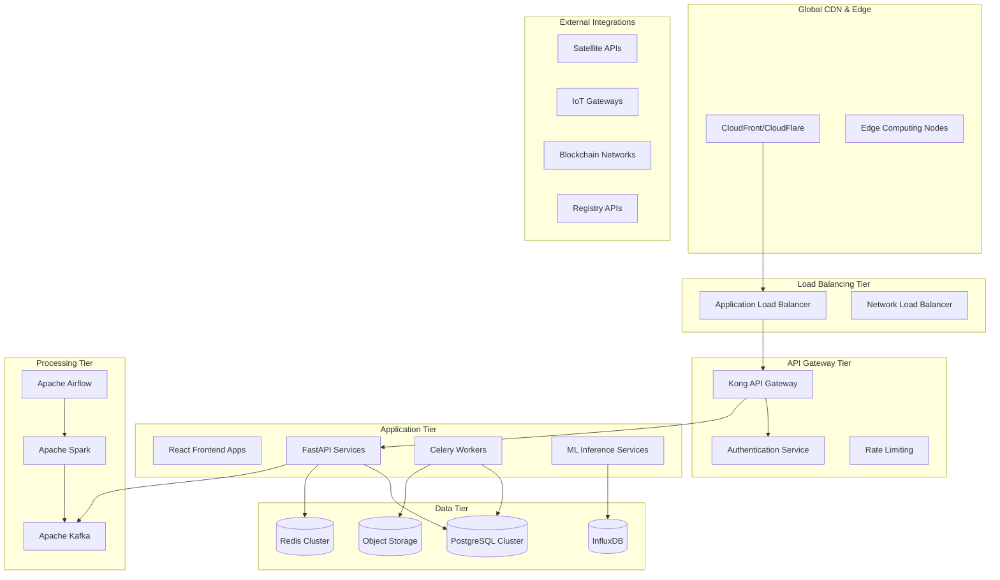

# PRD: Sylvagraph Platform - Architecture-Enhanced Requirements

**Document Version:** 2.0 (Architecture-Enhanced)  
**Date:** August 11, 2025  
**Status:** 🏗️ **ARCHITECTURE-READY FOR DEVELOPMENT**  
**Owner:** Architecture & Engineering Team  
**Reviewed by:** Principal Architect, Senior DevOps Engineer, Security Architect

---

## 📋 Executive Summary

### Project Overview
Develop a production-grade, enterprise-scale **Sylvagraph Platform** - a comprehensive DMRV (Digital Monitoring, Reporting, and Verification) system for agroforestry sustainability and tokenized carbon credits. This platform serves as a mission-critical component of the Aurex Platform ecosystem, requiring enterprise architecture patterns, high availability, and global scalability.

### Strategic Alignment
- **Platform Integration**: Microservices architecture with Aurex Platform ecosystem
- **Enterprise Scale**: Support 10,000+ concurrent users, 1PB+ data processing
- **Global Reach**: Multi-region deployment with edge computing capabilities
- **Compliance Ready**: Built-in audit trails, regulatory reporting, and data sovereignty
- **Future-Proof**: Cloud-native, API-first, event-driven architecture

---

## 🏗️ Enterprise Architecture Framework

### Architecture Principles

#### 1. **Scalability First**
```typescript
interface ScalabilityRequirements {
  horizontal: {
    frontend: "Auto-scaling CDN + edge locations"
    backend: "Kubernetes HPA: 2-50 pods per service"
    database: "Sharding + read replicas across regions"
    storage: "Object storage with CDN distribution"
  }
  vertical: {
    compute: "Burstable instances for peak loads"
    memory: "Memory-optimized for ML workloads"
    storage: "NVMe SSD for high IOPS requirements"
  }
}
```

#### 2. **Resilience & Fault Tolerance**
```typescript
interface ResiliencePattern {
  availability: "99.99% SLA (4.32 minutes downtime/month)"
  redundancy: "Multi-AZ deployment with automatic failover"
  backups: "RPO: 15 minutes, RTO: 30 minutes"
  disasterRecovery: "Cross-region replication with blue-green deployment"
  circuitBreaker: "Hystrix pattern for external service calls"
}
```

#### 3. **Security by Design**
```typescript
interface SecurityArchitecture {
  zeroTrust: "Never trust, always verify network model"
  encryption: {
    atRest: "AES-256 database and storage encryption"
    inTransit: "TLS 1.3 for all communications"
    application: "Field-level encryption for PII data"
  }
  identity: {
    authentication: "Multi-factor authentication with hardware tokens"
    authorization: "RBAC + ABAC with fine-grained permissions"
    federation: "SAML 2.0 / OAuth 2.0 / OpenID Connect"
  }
  compliance: "SOC 2 Type II, ISO 27001, GDPR, CCPA ready"
}
```

#### 4. **Observability & Monitoring**
```typescript
interface ObservabilityStack {
  metrics: "Prometheus + Grafana with custom dashboards"
  logging: "ELK Stack with structured logging"
  tracing: "Jaeger for distributed tracing"
  apm: "Application Performance Monitoring"
  alerting: "PagerDuty integration with escalation policies"
  sli_slo: "Service Level Indicators and Objectives defined"
}
```

---

## 🎯 System Architecture Overview

### High-Level Architecture Diagram



### Service Decomposition Strategy

#### Core Domain Services
```typescript
interface CoreServices {
  userManagement: {
    responsibility: "Identity, authentication, authorization"
    database: "PostgreSQL (users, roles, permissions)"
    scaling: "Stateless, horizontally scalable"
    sla: "99.99% availability"
  }
  
  projectManagement: {
    responsibility: "Forest projects, parcels, metadata"
    database: "PostgreSQL + PostGIS for geospatial data"
    scaling: "Read replicas for analytics queries"
    sla: "99.95% availability"
  }
  
  dmrvEngine: {
    responsibility: "Digital monitoring, reporting, verification"
    database: "InfluxDB for time-series + PostgreSQL for metadata"
    scaling: "Auto-scaling based on data ingestion rate"
    sla: "99.99% availability"
  }
  
  carbonCredits: {
    responsibility: "Tokenization, registry, marketplace"
    database: "PostgreSQL with blockchain state sync"
    scaling: "Event-driven with CQRS pattern"
    sla: "99.99% availability"
  }
}
```

#### Supporting Services
```typescript
interface SupportingServices {
  notificationService: {
    responsibility: "Email, SMS, push notifications"
    technology: "Amazon SES, Twilio, Firebase"
    scaling: "Queue-based with dead letter queues"
  }
  
  fileStorageService: {
    responsibility: "Document, image, video storage"
    technology: "Amazon S3 with CDN distribution"
    scaling: "Auto-scaling with lifecycle policies"
  }
  
  analyticsService: {
    responsibility: "Business intelligence, reporting"
    technology: "Apache Spark + DataLake architecture"
    scaling: "Elastic compute for batch processing"
  }
  
  auditService: {
    responsibility: "Compliance logging, audit trails"
    technology: "Immutable log store with retention policies"
    scaling: "Append-only architecture with partitioning"
  }
}
```

---

## 🗄️ Data Architecture & Management

### Database Architecture Strategy

#### Multi-Database Approach
```typescript
interface DatabaseArchitecture {
  transactional: {
    technology: "PostgreSQL 15+ with PostGIS"
    purpose: "ACID transactions, relational data"
    scaling: "Master-slave replication + read replicas"
    backup: "WAL-E continuous archiving + point-in-time recovery"
  }
  
  timeSeries: {
    technology: "InfluxDB 2.0"
    purpose: "IoT sensor data, satellite telemetry"
    scaling: "Clustering with automatic retention policies"
    backup: "Incremental backups with compression"
  }
  
  documentStore: {
    technology: "MongoDB Atlas"
    purpose: "Unstructured documents, reports"
    scaling: "Sharding with zone-aware replica sets"
    backup: "Continuous cloud backups"
  }
  
  cache: {
    technology: "Redis Cluster"
    purpose: "Session store, application cache"
    scaling: "Cluster mode with automatic failover"
    backup: "RDB + AOF persistence"
  }
  
  searchEngine: {
    technology: "Elasticsearch"
    purpose: "Full-text search, log analytics"
    scaling: "Multi-node cluster with data tiers"
    backup: "Snapshot repository with lifecycle management"
  }
}
```

#### Data Partitioning Strategy
```typescript
interface PartitioningStrategy {
  geospatial: {
    method: "Geographic partitioning by region/country"
    reason: "Data sovereignty compliance"
    implementation: "PostgreSQL native partitioning"
  }
  
  temporal: {
    method: "Time-based partitioning (monthly/yearly)"
    reason: "Query performance + archival strategy"
    implementation: "Automated partition management"
  }
  
  tenant: {
    method: "Tenant-based isolation"
    reason: "Multi-tenancy with data isolation"
    implementation: "Schema-per-tenant approach"
  }
}
```

### Data Pipeline Architecture

#### Stream Processing
```typescript
interface StreamProcessingArchitecture {
  ingestion: {
    technology: "Apache Kafka + Kafka Connect"
    partitioning: "By tenant_id and data_type"
    retention: "7 days for hot data, 90 days for warm"
    throughput: "1M+ messages per second"
  }
  
  processing: {
    technology: "Apache Kafka Streams + KSQL"
    patterns: ["Event sourcing", "CQRS", "Saga pattern"]
    windowing: "Tumbling and sliding windows for aggregations"
    stateStore: "RocksDB with changelog topics"
  }
  
  delivery: {
    technology: "Apache Kafka + Schema Registry"
    serialization: "Avro with schema evolution"
    delivery: "At-least-once delivery semantics"
    monitoring: "Kafka lag monitoring with alerts"
  }
}
```

#### Batch Processing
```typescript
interface BatchProcessingArchitecture {
  orchestration: {
    technology: "Apache Airflow"
    scheduling: "Cron-based with dependency management"
    monitoring: "DAG success/failure alerting"
    scaling: "CeleryExecutor with worker auto-scaling"
  }
  
  processing: {
    technology: "Apache Spark on Kubernetes"
    storage: "Delta Lake for ACID transactions"
    optimization: "Adaptive query execution, dynamic partition pruning"
    scaling: "Dynamic resource allocation based on workload"
  }
  
  dataLake: {
    technology: "Amazon S3 with data partitioning"
    format: "Parquet with Snappy compression"
    catalog: "Apache Hive Metastore"
    lifecycle: "Automated tiering (Standard -> IA -> Glacier)"
  }
}
```

---

## 🔧 Technology Stack & Infrastructure

### Frontend Architecture

#### Micro-Frontend Strategy
```typescript
interface MicrofrontendArchitecture {
  framework: {
    technology: "Single-SPA with React 18"
    routing: "Browser-based routing with history API"
    stateManagement: "Redux Toolkit with RTK Query"
    communication: "Custom events + shared state store"
  }
  
  buildSystem: {
    bundler: "Webpack 5 with Module Federation"
    optimization: "Tree shaking, code splitting, lazy loading"
    deployment: "Independent deployment per micro-frontend"
    cdn: "CloudFront with edge caching"
  }
  
  testing: {
    unit: "Jest + React Testing Library"
    integration: "Cypress for end-to-end testing"
    visual: "Chromatic for visual regression testing"
    performance: "Lighthouse CI in build pipeline"
  }
}
```

#### Progressive Web App Features
```typescript
interface PWAArchitecture {
  serviceWorker: {
    caching: "Workbox with runtime caching strategies"
    offline: "Network-first with cache fallback"
    updates: "Background updates with user notification"
  }
  
  manifest: {
    installation: "Add to home screen capability"
    orientation: "Portrait with landscape support"
    theme: "Dynamic theme color based on user preference"
  }
  
  performance: {
    metrics: "Core Web Vitals monitoring"
    optimization: "Resource hints, preloading, prefetching"
    monitoring: "Real User Monitoring (RUM) with alerts"
  }
}
```

### Backend Architecture

#### Microservices Design Patterns
```typescript
interface MicroservicesPatterns {
  apiGateway: {
    technology: "Kong Gateway with custom plugins"
    features: ["Rate limiting", "Authentication", "Request transformation"]
    routing: "Path-based and header-based routing"
    monitoring: "Request tracing with correlation IDs"
  }
  
  serviceDiscovery: {
    technology: "Consul with health checking"
    registration: "Automatic service registration"
    loadBalancing: "Client-side load balancing with Envoy"
    failover: "Circuit breaker pattern implementation"
  }
  
  configuration: {
    technology: "Consul KV store + Vault for secrets"
    distribution: "Push-based configuration updates"
    encryption: "Encrypted configuration at rest"
    audit: "Configuration change audit logging"
  }
  
  messaging: {
    synchronous: "gRPC for service-to-service communication"
    asynchronous: "Apache Kafka for event streaming"
    patterns: ["Request-Reply", "Publish-Subscribe", "Event Sourcing"]
  }
}
```

#### API Design Standards
```typescript
interface APIDesignStandards {
  restful: {
    versioning: "URI versioning (/api/v1/, /api/v2/)"
    methods: "Standard HTTP methods with proper status codes"
    pagination: "Cursor-based pagination for large datasets"
    filtering: "Query parameter-based filtering with validation"
  }
  
  graphql: {
    technology: "Apollo GraphQL with federation"
    schema: "Schema-first design with code generation"
    caching: "Query-level caching with Redis"
    subscriptions: "WebSocket-based real-time subscriptions"
  }
  
  documentation: {
    technology: "OpenAPI 3.0 with automated generation"
    testing: "Contract testing with Pact"
    validation: "Request/response validation with JSON Schema"
    monitoring: "API performance and error rate monitoring"
  }
}
```

### Infrastructure Architecture

#### Container Orchestration
```typescript
interface KubernetesArchitecture {
  cluster: {
    distribution: "Amazon EKS with managed node groups"
    networking: "Calico CNI with network policies"
    storage: "EBS CSI driver with GP3 volumes"
    monitoring: "Prometheus + Grafana with custom dashboards"
  }
  
  workloads: {
    deployments: "Rolling updates with health checks"
    services: "ClusterIP with ingress controllers"
    jobs: "CronJobs for batch processing"
    scaling: "HPA + VPA + Cluster Autoscaler"
  }
  
  security: {
    rbac: "Role-based access control with least privilege"
    networkPolicies: "Zero-trust networking model"
    podSecurityStandards: "Restricted security context"
    secrets: "External Secrets Operator with Vault"
  }
}
```

#### CI/CD Pipeline Architecture
```typescript
interface CICDArchitecture {
  source: {
    repository: "Git with feature branch workflow"
    triggers: "Webhook-based build triggers"
    validation: "Pre-commit hooks with quality gates"
  }
  
  build: {
    technology: "GitHub Actions with self-hosted runners"
    stages: ["Lint", "Test", "Security scan", "Build", "Deploy"]
    artifacts: "Container images with vulnerability scanning"
    caching: "Multi-layer caching for faster builds"
  }
  
  deployment: {
    strategy: "GitOps with ArgoCD"
    environments: ["Development", "Staging", "Production"]
    promotion: "Automated promotion with approval gates"
    rollback: "Instant rollback capability"
  }
  
  testing: {
    unit: "Parallel test execution with coverage reporting"
    integration: "Contract testing with service virtualization"
    performance: "Automated load testing with k6"
    security: "SAST/DAST scanning with OWASP ZAP"
  }
}
```

---

## 🔐 Security Architecture

### Zero Trust Security Model

#### Identity & Access Management
```typescript
interface IdentityArchitecture {
  authentication: {
    primary: "Multi-factor authentication with TOTP"
    fallback: "Hardware security keys (FIDO2/WebAuthn)"
    session: "JWT tokens with short expiration"
    federation: "SAML 2.0 for enterprise SSO"
  }
  
  authorization: {
    model: "Attribute-based access control (ABAC)"
    policy: "Open Policy Agent (OPA) for policy enforcement"
    tokens: "OAuth 2.0 with PKCE for mobile clients"
    audit: "All access decisions logged and monitored"
  }
  
  privileged: {
    access: "Just-in-time access with approval workflow"
    monitoring: "Privileged session recording"
    rotation: "Automatic credential rotation"
    break_glass: "Emergency access procedures"
  }
}
```

#### Data Protection Strategy
```typescript
interface DataProtectionArchitecture {
  classification: {
    levels: ["Public", "Internal", "Confidential", "Restricted"]
    labeling: "Automated data classification with ML"
    handling: "Data handling policies per classification"
  }
  
  encryption: {
    atRest: "AES-256 with customer-managed keys (CMK)"
    inTransit: "TLS 1.3 with certificate pinning"
    application: "Field-level encryption for PII"
    keyManagement: "AWS KMS with key rotation"
  }
  
  privacy: {
    consent: "Granular consent management"
    rightToErasure: "Automated data deletion workflows"
    portability: "Data export in standard formats"
    breach: "Automated breach detection and notification"
  }
}
```

### Compliance Framework
```typescript
interface ComplianceArchitecture {
  frameworks: {
    soc2: "SOC 2 Type II compliance program"
    iso27001: "ISO 27001 information security management"
    gdpr: "GDPR compliance with data protection officer"
    ccpa: "CCPA compliance for California residents"
  }
  
  monitoring: {
    continuous: "Automated compliance monitoring"
    reporting: "Automated compliance report generation"
    audit: "Immutable audit log with retention policies"
    alerting: "Compliance violation alerts"
  }
  
  controls: {
    access: "Role-based access controls with segregation"
    change: "Change management with approval workflows"
    backup: "Encrypted backups with testing procedures"
    incident: "Incident response plan with runbooks"
  }
}
```

---

## 📊 Performance & Scalability Requirements

### Performance Targets

#### Application Performance
```typescript
interface PerformanceTargets {
  frontend: {
    firstContentfulPaint: "< 1.5 seconds"
    largestContentfulPaint: "< 2.5 seconds"
    firstInputDelay: "< 100 milliseconds"
    cumulativeLayoutShift: "< 0.1"
    timeToInteractive: "< 3.5 seconds"
  }
  
  backend: {
    apiResponseTime: "< 200ms (95th percentile)"
    databaseQueryTime: "< 50ms (95th percentile)"
    messageProcessingLatency: "< 1 second"
    batchJobExecutionTime: "< 30 minutes (large datasets)"
  }
  
  availability: {
    uptime: "99.99% SLA (4.32 minutes downtime/month)"
    rpo: "15 minutes (Recovery Point Objective)"
    rto: "30 minutes (Recovery Time Objective)"
    mttr: "< 60 minutes (Mean Time To Recovery)"
  }
}
```

#### Scalability Specifications
```typescript
interface ScalabilitySpecs {
  concurrent_users: "10,000+ active users"
  peak_throughput: "50,000 requests per second"
  data_storage: "100TB+ with 20% annual growth"
  data_processing: "1PB+ annual data processing volume"
  geographic_distribution: "5+ regions worldwide"
  
  auto_scaling: {
    frontend: "CDN edge scaling based on traffic"
    backend: "HPA scaling 2-50 pods per service"
    database: "Read replica scaling based on load"
    storage: "Auto-tiering with lifecycle policies"
  }
}
```

### Monitoring & Observability

#### Application Performance Monitoring
```typescript
interface APMStrategy {
  metrics: {
    business: ["User registrations", "Project creations", "Carbon credits issued"]
    technical: ["Response time", "Error rate", "Throughput", "Saturation"]
    infrastructure: ["CPU utilization", "Memory usage", "Disk I/O", "Network latency"]
  }
  
  logging: {
    structured: "JSON formatted logs with correlation IDs"
    centralized: "ELK Stack with log aggregation"
    retention: "30 days for application logs, 1 year for audit logs"
    alerting: "Log-based alerts for error patterns"
  }
  
  tracing: {
    distributed: "Jaeger tracing across microservices"
    sampling: "Adaptive sampling based on traffic volume"
    correlation: "Request correlation across service boundaries"
    analysis: "Trace analysis for performance bottlenecks"
  }
}
```

---

## 🌐 Integration Architecture

### External System Integrations

#### Satellite Data Providers
```typescript
interface SatelliteIntegrations {
  providers: {
    landsat: "NASA Landsat Program via USGS API"
    sentinel: "Copernicus Sentinel Hub API"
    planet: "Planet Labs API with commercial imagery"
    modis: "MODIS Terra/Aqua via NASA EarthData"
  }
  
  integration_patterns: {
    data_ingestion: "Event-driven ingestion with retry logic"
    rate_limiting: "Adaptive rate limiting per provider"
    caching: "Intelligent caching with TTL policies"
    fallback: "Provider failover for high availability"
  }
  
  data_processing: {
    formats: ["GeoTIFF", "NetCDF", "HDF5", "COG"]
    transformation: "GDAL-based processing pipeline"
    storage: "Object storage with geospatial indexing"
    analysis: "ML-based analysis for change detection"
  }
}
```

#### Blockchain Network Integration
```typescript
interface BlockchainArchitecture {
  networks: {
    ethereum: "Ethereum mainnet for carbon credit tokens"
    polygon: "Polygon for cost-effective transactions"
    arbitrum: "Arbitrum for faster settlement"
    private: "Private blockchain for internal operations"
  }
  
  smart_contracts: {
    standard: "ERC-1155 for semi-fungible tokens"
    governance: "DAO contracts for platform governance"
    registry: "Registry contracts for credit tracking"
    marketplace: "DEX integration for trading"
  }
  
  integration: {
    libraries: "Web3.js + Ethers.js for blockchain interaction"
    wallet: "MetaMask + WalletConnect for user wallets"
    indexing: "The Graph for blockchain data indexing"
    monitoring: "Blockchain transaction monitoring"
  }
}
```

#### Carbon Registry APIs
```typescript
interface CarbonRegistryIntegrations {
  registries: {
    vcs: "Verra Verified Carbon Standard API"
    goldStandard: "Gold Standard Registry API"
    americanCarbonRegistry: "ACR Registry API"
    climateActionReserve: "CAR Registry API"
  }
  
  operations: {
    registration: "Automated project registration"
    issuance: "Credit issuance workflow integration"
    retirement: "Credit retirement processing"
    transfer: "Credit transfer between registries"
  }
  
  compliance: {
    double_counting: "Automatic double counting prevention"
    additionality: "Additionality verification workflows"
    permanence: "Permanence monitoring and reporting"
    leakage: "Leakage assessment integration"
  }
}
```

---

## 🚀 Deployment & DevOps Architecture

### Multi-Environment Strategy

#### Environment Configuration
```typescript
interface EnvironmentArchitecture {
  development: {
    purpose: "Feature development and unit testing"
    resources: "Minimal resource allocation"
    data: "Synthetic data with privacy compliance"
    integration: "Mock external services"
  }
  
  staging: {
    purpose: "Integration testing and performance validation"
    resources: "Production-like resource allocation"
    data: "Sanitized production data subset"
    integration: "Real external service integration"
  }
  
  production: {
    purpose: "Live customer traffic"
    resources: "Auto-scaling with performance monitoring"
    data: "Full production dataset with encryption"
    integration: "Full external service integration"
  }
  
  disaster_recovery: {
    purpose: "Business continuity during outages"
    resources: "Standby resources in alternate region"
    data: "Real-time data replication"
    activation: "Automated failover with manual override"
  }
}
```

### Infrastructure as Code
```typescript
interface IaCArchitecture {
  provisioning: {
    technology: "Terraform with remote state management"
    modules: "Reusable modules for common resources"
    validation: "Automated validation with testing"
    drift_detection: "Continuous drift detection and correction"
  }
  
  configuration: {
    technology: "Ansible for configuration management"
    idempotency: "Idempotent playbooks with change detection"
    secrets: "Encrypted secrets with rotation"
    compliance: "Configuration compliance scanning"
  }
  
  gitops: {
    technology: "ArgoCD for GitOps deployment"
    branching: "Git flow with environment promotion"
    approval: "Pull request-based change approval"
    rollback: "Instant rollback to previous versions"
  }
}
```

---

## 📈 Capacity Planning & Cost Optimization

### Resource Planning
```typescript
interface CapacityPlanning {
  compute: {
    baseline: "40% CPU utilization target"
    scaling_triggers: "70% CPU for scale-up, 30% for scale-down"
    instance_types: "Balanced compute with burstable options"
    reserved_capacity: "60% reserved instances for cost optimization"
  }
  
  storage: {
    hot_tier: "NVMe SSD for active data (< 30 days)"
    warm_tier: "Standard SSD for recent data (30-90 days)"
    cold_tier: "HDD for archival data (> 90 days)"
    backup: "Cross-region backup with lifecycle policies"
  }
  
  network: {
    bandwidth: "10 Gbps baseline with burst capacity"
    cdn: "Global CDN with edge caching"
    private_connectivity: "VPC peering for service communication"
    monitoring: "Network performance monitoring"
  }
}
```

### Cost Optimization Strategy
```typescript
interface CostOptimization {
  compute: {
    spot_instances: "50% spot instances for batch workloads"
    right_sizing: "Automated right-sizing recommendations"
    scheduling: "Auto-shutdown for non-production environments"
    reserved_instances: "Long-term commitments for predictable workloads"
  }
  
  storage: {
    lifecycle_policies: "Automated data tiering"
    compression: "Data compression for archived data"
    deduplication: "Storage deduplication for backups"
    unused_resources: "Automated cleanup of unused resources"
  }
  
  monitoring: {
    cost_alerts: "Budget alerts with threshold notifications"
    resource_tagging: "Comprehensive resource tagging"
    cost_allocation: "Cost allocation per service/team"
    optimization_reports: "Monthly cost optimization reports"
  }
}
```

---

## 🧪 Testing Architecture

### Comprehensive Testing Strategy
```typescript
interface TestingArchitecture {
  unit_testing: {
    coverage: "Minimum 80% code coverage"
    frameworks: ["Jest (Frontend)", "Pytest (Backend)"]
    mocking: "Service mocking with test doubles"
    parallel_execution: "Parallel test execution for speed"
  }
  
  integration_testing: {
    api_testing: "Contract testing with Pact"
    database_testing: "Database integration with test containers"
    service_testing: "Service-to-service integration testing"
    end_to_end: "Full workflow testing with real services"
  }
  
  performance_testing: {
    load_testing: "Gradual load increase with k6"
    stress_testing: "Breaking point identification"
    spike_testing: "Sudden load spike simulation"
    volume_testing: "Large dataset processing validation"
  }
  
  security_testing: {
    static_analysis: "SAST with SonarQube"
    dynamic_analysis: "DAST with OWASP ZAP"
    dependency_scanning: "Vulnerability scanning with Snyk"
    penetration_testing: "Annual third-party pen testing"
  }
}
```

---

## 📚 Architecture Documentation Requirements

### Technical Documentation
```typescript
interface ArchitectureDocumentation {
  architecture_decision_records: {
    format: "ADR format with context, decision, consequences"
    storage: "Git repository with versioning"
    review: "Architecture review board approval required"
    maintenance: "Regular review and update cycles"
  }
  
  api_documentation: {
    format: "OpenAPI 3.0 with interactive examples"
    generation: "Automated generation from code annotations"
    versioning: "API versioning with deprecation notices"
    testing: "Automated API documentation testing"
  }
  
  runbooks: {
    operational: "Step-by-step operational procedures"
    troubleshooting: "Common issue resolution guides"
    disaster_recovery: "Disaster recovery procedures"
    security_incident: "Security incident response procedures"
  }
}
```

---

## ✅ Architecture Review Checklist

### Pre-Development Review
- [ ] **Scalability**: Architecture supports 10x current requirements
- [ ] **Security**: Zero-trust security model implemented
- [ ] **Reliability**: 99.99% availability SLA achievable
- [ ] **Performance**: Sub-200ms API response times
- [ ] **Compliance**: SOC 2 Type II compliance ready
- [ ] **Cost**: Cost optimization strategies defined
- [ ] **Monitoring**: Comprehensive observability stack
- [ ] **Integration**: External API integration patterns defined
- [ ] **Data**: Data architecture supports GDPR compliance
- [ ] **Testing**: Comprehensive testing strategy in place

### Post-Development Review
- [ ] **Load Testing**: Performance validated under load
- [ ] **Security Scan**: Security vulnerabilities addressed
- [ ] **Disaster Recovery**: DR procedures tested
- [ ] **Documentation**: Architecture documentation complete
- [ ] **Monitoring**: Alerts and dashboards configured
- [ ] **Cost Validation**: Actual costs within budget
- [ ] **Compliance**: Compliance controls validated
- [ ] **Performance**: SLAs met under realistic conditions

---

## 🔮 Future Architecture Evolution

### Technology Roadmap
```typescript
interface TechnologyRoadmap {
  year_1: {
    focus: "Foundation and core functionality"
    technologies: ["Current stack maturation", "Observability enhancement"]
    goals: ["99.99% availability", "10,000 concurrent users"]
  }
  
  year_2: {
    focus: "AI/ML integration and automation"
    technologies: ["MLOps pipeline", "Automated decision making"]
    goals: ["Predictive analytics", "Automated compliance"]
  }
  
  year_3: {
    focus: "Edge computing and global expansion"
    technologies: ["Edge computing nodes", "5G integration"]
    goals: ["Global deployment", "Real-time processing"]
  }
  
  continuous: {
    security: "Continuous security posture improvement"
    performance: "Performance optimization and cost reduction"
    compliance: "Emerging regulation compliance preparation"
  }
}
```

---

**PRD Status:** ✅ **ARCHITECTURE-APPROVED FOR DEVELOPMENT**  
**Next Step:** Infrastructure provisioning and service scaffolding  
**Timeline:** 60 development days (including infrastructure)  
**Priority:** Critical - Enterprise platform foundation  

---

*This architecture-enhanced PRD serves as the definitive technical blueprint for Sylvagraph platform development. All implementation decisions must align with these architectural requirements and undergo architecture review board approval for deviations.*