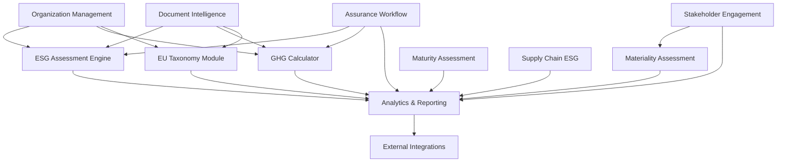

# AUREX LAUNCHPAD - TECHNICAL SPECIFICATIONS
## Comprehensive Sub-Application Architecture

**Document Version**: 1.0  
**Last Updated**: January 2025  
**Engineering Manager**: Aurex Launchpad Team  

---

## 📋 OVERVIEW

This document provides detailed technical specifications for all 11 Aurex Launchpad sub-applications, including architecture, database models, API endpoints, frontend components, and integration patterns. Each sub-application is designed to work independently while maintaining seamless integration with the overall platform.

### **Sub-Application Portfolio**

**Core ESG Modules (8):**
1. ESG Assessment Engine (GRI/SASB/TCFD/CDP)
2. GHG Emissions Calculator (Scope 1/2/3)
3. EU Taxonomy & ESRS Compliance Module
4. Materiality Assessment Platform
5. Document Intelligence System
6. ESG Analytics & Reporting
7. Maturity Assessment Engine
8. Supply Chain ESG Module

**Supporting Modules (3):**
9. Organization & User Management
10. Third-Party Assurance Workflow
11. Stakeholder Engagement Platform

---

## 🏗️ ARCHITECTURE OVERVIEW

### **Technology Stack**
- **Backend**: Python 3.10+, FastAPI, SQLAlchemy ORM, PostgreSQL
- **Frontend**: React 18, TypeScript, Tailwind CSS, Recharts
- **Database**: PostgreSQL (Schema: `launchpad_schema`)
- **Cache**: Redis (Database 1)
- **Authentication**: JWT with RBAC
- **API**: RESTful with OpenAPI documentation

### **Port Allocation**
- **Frontend**: Port 3001 (aurex-launchpad)
- **Backend API**: Port 8001 (aurex-launchpad-api)

### **Database Schema Structure**
```sql
-- Schema for Aurex Launchpad
CREATE SCHEMA launchpad_schema;

-- Core tables shared across sub-applications
-- Individual sub-app tables detailed in each specification
```

---

## 1️⃣ ESG ASSESSMENT ENGINE

### **Purpose**
Comprehensive ESG assessment platform supporting multiple frameworks (GRI, SASB, TCFD, CDP) with dynamic questionnaire generation and intelligent scoring.

### **Database Models**

```python
# models/esg_assessment_models.py
from sqlalchemy import Column, String, Integer, Float, DateTime, Text, Boolean, ForeignKey, JSON
from sqlalchemy.dialects.postgresql import UUID
from models.base_models import BaseModel

class ESGFramework(BaseModel):
    __tablename__ = "esg_frameworks"
    
    id = Column(UUID(as_uuid=True), primary_key=True)
    name = Column(String(100), nullable=False)  # GRI, SASB, TCFD, CDP
    version = Column(String(20), nullable=False)
    description = Column(Text)
    total_questions = Column(Integer)
    scoring_method = Column(String(50))  # weighted_average, linear, custom
    is_active = Column(Boolean, default=True)
    framework_config = Column(JSON)  # Dynamic configuration

class ESGAssessment(BaseModel):
    __tablename__ = "esg_assessments"
    
    id = Column(UUID(as_uuid=True), primary_key=True)
    name = Column(String(200), nullable=False)
    description = Column(Text)
    framework_id = Column(UUID(as_uuid=True), ForeignKey("esg_frameworks.id"))
    organization_id = Column(UUID(as_uuid=True), ForeignKey("organizations.id"))
    status = Column(String(50))  # draft, in_progress, completed, approved
    overall_score = Column(Float)
    environmental_score = Column(Float)
    social_score = Column(Float)
    governance_score = Column(Float)
    completion_percentage = Column(Float, default=0.0)
    questions_total = Column(Integer)
    questions_answered = Column(Integer, default=0)
    target_completion_date = Column(DateTime)
    assessment_metadata = Column(JSON)

class ESGQuestion(BaseModel):
    __tablename__ = "esg_questions"
    
    id = Column(UUID(as_uuid=True), primary_key=True)
    framework_id = Column(UUID(as_uuid=True), ForeignKey("esg_frameworks.id"))
    section_name = Column(String(100))  # Environmental, Social, Governance
    question_code = Column(String(50))  # GRI-305-1, SASB-TC-0101
    question_text = Column(Text, nullable=False)
    question_type = Column(String(50))  # multiple_choice, text, numeric, boolean
    weight = Column(Float, default=1.0)
    is_mandatory = Column(Boolean, default=False)
    scoring_criteria = Column(JSON)
    guidance_text = Column(Text)
    evidence_required = Column(Boolean, default=False)

class ESGResponse(BaseModel):
    __tablename__ = "esg_responses"
    
    id = Column(UUID(as_uuid=True), primary_key=True)
    assessment_id = Column(UUID(as_uuid=True), ForeignKey("esg_assessments.id"))
    question_id = Column(UUID(as_uuid=True), ForeignKey("esg_questions.id"))
    response_value = Column(Text)
    numeric_value = Column(Float)
    confidence_score = Column(Float)
    evidence_text = Column(Text)
    score = Column(Float)
    notes = Column(Text)
    responded_by = Column(UUID(as_uuid=True), ForeignKey("users.id"))
```

### **API Endpoints**

```python
# routers/esg_assessment_router.py
from fastapi import APIRouter, Depends, HTTPException, Query
from typing import List, Optional

router = APIRouter(prefix="/api/v1/esg-assessments", tags=["ESG Assessments"])

@router.get("/frameworks", response_model=List[ESGFrameworkResponse])
async def list_frameworks(active_only: bool = True):
    """List all available ESG frameworks"""
    
@router.post("/", response_model=ESGAssessmentResponse)
async def create_assessment(assessment: ESGAssessmentCreate, current_user: User = Depends(get_current_user)):
    """Create new ESG assessment"""
    
@router.get("/{assessment_id}", response_model=ESGAssessmentDetailResponse)
async def get_assessment(assessment_id: str, current_user: User = Depends(get_current_user)):
    """Get detailed assessment with questions and responses"""
    
@router.post("/{assessment_id}/responses", response_model=ESGResponseResponse)
async def submit_response(assessment_id: str, response: ESGResponseCreate):
    """Submit response to assessment question"""
    
@router.put("/{assessment_id}/calculate-scores")
async def calculate_assessment_scores(assessment_id: str):
    """Recalculate assessment scores based on current responses"""
    
@router.get("/{assessment_id}/progress", response_model=AssessmentProgressResponse)
async def get_assessment_progress(assessment_id: str):
    """Get detailed progress tracking"""
```

### **Frontend Components**

```typescript
// components/ESGAssessment/AssessmentDashboard.tsx
import React, { useState, useEffect } from 'react';
import { AssessmentCard, ProgressTracker, ScoreDisplay } from './components';

interface AssessmentDashboardProps {
  organizationId: string;
}

export const AssessmentDashboard: React.FC<AssessmentDashboardProps> = ({ organizationId }) => {
  const [assessments, setAssessments] = useState([]);
  const [loading, setLoading] = useState(true);
  
  return (
    <div className="assessment-dashboard">
      <div className="grid grid-cols-1 lg:grid-cols-3 gap-6">
        <AssessmentOverview />
        <ActiveAssessments />
        <RecentActivity />
      </div>
    </div>
  );
};

// components/ESGAssessment/QuestionnaireInterface.tsx
export const QuestionnaireInterface: React.FC<QuestionnaireProps> = ({ assessmentId }) => {
  return (
    <div className="questionnaire-interface">
      <QuestionProgress />
      <QuestionDisplay />
      <ResponseInput />
      <EvidenceUpload />
      <NavigationControls />
    </div>
  );
};
```

### **Performance Requirements**
- **Response Time**: < 200ms for question loading
- **Concurrent Users**: 500+ simultaneous assessments
- **Data Volume**: 10M+ assessment responses
- **Availability**: 99.9% uptime

---

## 2️⃣ GHG EMISSIONS CALCULATOR

### **Purpose**
Comprehensive greenhouse gas emissions tracking and calculation supporting Scope 1, 2, and 3 emissions with industry-specific emission factors and carbon accounting standards.

### **Database Models**

```python
# models/ghg_calculator_models.py
class EmissionFactor(BaseModel):
    __tablename__ = "emission_factors"
    
    id = Column(UUID(as_uuid=True), primary_key=True)
    factor_name = Column(String(200), nullable=False)
    category = Column(String(50))  # energy, transport, waste, etc.
    scope = Column(Integer)  # 1, 2, or 3
    unit = Column(String(50))  # kg CO2e/kWh, kg CO2e/km, etc.
    factor_value = Column(Float, nullable=False)
    region = Column(String(100))  # geographic applicability
    source = Column(String(200))  # EPA, IPCC, etc.
    valid_from = Column(DateTime)
    valid_to = Column(DateTime)
    uncertainty_percentage = Column(Float)

class GHGCalculation(BaseModel):
    __tablename__ = "ghg_calculations"
    
    id = Column(UUID(as_uuid=True), primary_key=True)
    organization_id = Column(UUID(as_uuid=True), ForeignKey("organizations.id"))
    calculation_name = Column(String(200))
    reporting_period_start = Column(DateTime)
    reporting_period_end = Column(DateTime)
    methodology = Column(String(100))  # GHG Protocol, ISO 14064, etc.
    total_scope1_emissions = Column(Float)
    total_scope2_emissions = Column(Float)
    total_scope3_emissions = Column(Float)
    total_emissions = Column(Float)
    calculation_status = Column(String(50))
    verification_status = Column(String(50))

class EmissionEntry(BaseModel):
    __tablename__ = "emission_entries"
    
    id = Column(UUID(as_uuid=True), primary_key=True)
    calculation_id = Column(UUID(as_uuid=True), ForeignKey("ghg_calculations.id"))
    emission_factor_id = Column(UUID(as_uuid=True), ForeignKey("emission_factors.id"))
    activity_data = Column(Float, nullable=False)  # kWh, km, tonnes, etc.
    emissions_co2e = Column(Float, nullable=False)
    uncertainty_range = Column(JSON)  # {"min": 0.95, "max": 1.05}
    data_quality_score = Column(Float)
    facility_location = Column(String(200))
    entry_metadata = Column(JSON)
```

### **API Endpoints**

```python
# routers/ghg_calculator_router.py
@router.post("/calculations", response_model=GHGCalculationResponse)
async def create_calculation(calculation: GHGCalculationCreate):
    """Create new GHG calculation"""
    
@router.get("/emission-factors", response_model=List[EmissionFactorResponse])
async def list_emission_factors(
    category: Optional[str] = None,
    scope: Optional[int] = None,
    region: Optional[str] = None
):
    """List emission factors with filtering"""
    
@router.post("/calculations/{calculation_id}/entries", response_model=EmissionEntryResponse)
async def add_emission_entry(calculation_id: str, entry: EmissionEntryCreate):
    """Add emission data entry"""
    
@router.post("/calculations/{calculation_id}/calculate")
async def calculate_emissions(calculation_id: str):
    """Calculate total emissions for all entries"""
    
@router.get("/calculations/{calculation_id}/carbon-footprint")
async def get_carbon_footprint(calculation_id: str):
    """Get detailed carbon footprint breakdown"""
```

### **Frontend Components**

```typescript
// components/GHGCalculator/EmissionsCalculator.tsx
export const EmissionsCalculator: React.FC = () => {
  return (
    <div className="emissions-calculator">
      <div className="calculation-steps">
        <Step1_DataCollection />
        <Step2_EmissionFactors />
        <Step3_Calculation />
        <Step4_Results />
      </div>
    </div>
  );
};

// components/GHGCalculator/CarbonFootprintDashboard.tsx
export const CarbonFootprintDashboard: React.FC = () => {
  return (
    <div className="carbon-dashboard">
      <EmissionSummaryCards />
      <ScopeBreakdownChart />
      <EmissionTrends />
      <VerificationStatus />
    </div>
  );
};
```

---

## 3️⃣ EU TAXONOMY & ESRS COMPLIANCE MODULE

### **Purpose**
Specialized module for European sustainability regulations including EU Taxonomy alignment assessment and European Sustainability Reporting Standards (ESRS) compliance.

### **Database Models**

```python
# models/eu_compliance_models.py
class EUTaxonomyActivity(BaseModel):
    __tablename__ = "eu_taxonomy_activities"
    
    id = Column(UUID(as_uuid=True), primary_key=True)
    activity_code = Column(String(20), unique=True)  # 4.1, 7.3, etc.
    activity_name = Column(String(300), nullable=False)
    environmental_objective = Column(String(100))  # Climate mitigation, adaptation, etc.
    sector = Column(String(100))
    substantial_contribution_criteria = Column(JSON)
    dnsh_criteria = Column(JSON)  # Do No Significant Harm
    minimum_safeguards = Column(JSON)
    technical_screening_criteria = Column(JSON)

class EUTaxonomyAssessment(BaseModel):
    __tablename__ = "eu_taxonomy_assessments"
    
    id = Column(UUID(as_uuid=True), primary_key=True)
    organization_id = Column(UUID(as_uuid=True), ForeignKey("organizations.id"))
    assessment_year = Column(Integer, nullable=False)
    revenue_alignment_percentage = Column(Float)
    capex_alignment_percentage = Column(Float)
    opex_alignment_percentage = Column(Float)
    taxonomy_eligible_revenue = Column(Float)
    taxonomy_aligned_revenue = Column(Float)
    assessment_status = Column(String(50))

class ESRSDisclosure(BaseModel):
    __tablename__ = "esrs_disclosures"
    
    id = Column(UUID(as_uuid=True), primary_key=True)
    organization_id = Column(UUID(as_uuid=True), ForeignKey("organizations.id"))
    esrs_standard = Column(String(20))  # ESRS E1, ESRS S1, etc.
    disclosure_requirement = Column(String(50))  # DR E1-1, DR S1-2, etc.
    materiality_assessment = Column(String(50))  # material, not_material
    disclosure_content = Column(Text)
    compliance_status = Column(String(50))
    reporting_period = Column(String(20))  # 2024, 2025
```

### **API Endpoints**

```python
# routers/eu_compliance_router.py
@router.get("/taxonomy/activities", response_model=List[EUTaxonomyActivityResponse])
async def list_taxonomy_activities(
    environmental_objective: Optional[str] = None,
    sector: Optional[str] = None
):
    """List EU Taxonomy activities"""
    
@router.post("/taxonomy/assessments", response_model=EUTaxonomyAssessmentResponse)
async def create_taxonomy_assessment(assessment: EUTaxonomyAssessmentCreate):
    """Create EU Taxonomy alignment assessment"""
    
@router.get("/esrs/standards", response_model=List[ESRSStandardResponse])
async def list_esrs_standards():
    """List all ESRS standards and disclosure requirements"""
    
@router.post("/esrs/disclosures", response_model=ESRSDisclosureResponse)
async def create_esrs_disclosure(disclosure: ESRSDisclosureCreate):
    """Create ESRS disclosure"""
    
@router.get("/compliance-dashboard/{org_id}")
async def get_compliance_dashboard(org_id: str):
    """Get comprehensive EU compliance dashboard"""
```

---

## 4️⃣ MATERIALITY ASSESSMENT PLATFORM

### **Purpose**
Advanced materiality assessment platform supporting single and double materiality analysis with stakeholder input integration and impact prioritization.

### **Database Models**

```python
# models/materiality_models.py
class MaterialityTopic(BaseModel):
    __tablename__ = "materiality_topics"
    
    id = Column(UUID(as_uuid=True), primary_key=True)
    topic_name = Column(String(200), nullable=False)
    topic_category = Column(String(100))  # Environmental, Social, Governance
    description = Column(Text)
    industry_relevance = Column(JSON)  # {"technology": "high", "retail": "medium"}
    esrs_reference = Column(String(50))  # ESRS E1, ESRS S2, etc.
    gri_reference = Column(String(50))
    sasb_reference = Column(String(50))

class MaterialityAssessment(BaseModel):
    __tablename__ = "materiality_assessments"
    
    id = Column(UUID(as_uuid=True), primary_key=True)
    organization_id = Column(UUID(as_uuid=True), ForeignKey("organizations.id"))
    assessment_name = Column(String(200))
    assessment_type = Column(String(50))  # single, double
    reporting_period = Column(String(20))
    methodology = Column(String(100))
    assessment_status = Column(String(50))
    stakeholder_groups_included = Column(JSON)

class MaterialityScore(BaseModel):
    __tablename__ = "materiality_scores"
    
    id = Column(UUID(as_uuid=True), primary_key=True)
    assessment_id = Column(UUID(as_uuid=True), ForeignKey("materiality_assessments.id"))
    topic_id = Column(UUID(as_uuid=True), ForeignKey("materiality_topics.id"))
    impact_score = Column(Float)  # Impact materiality (0-5)
    financial_score = Column(Float)  # Financial materiality (0-5)
    combined_score = Column(Float)  # Calculated combined score
    materiality_threshold = Column(Float)
    is_material = Column(Boolean)
    rationale = Column(Text)

class StakeholderInput(BaseModel):
    __tablename__ = "stakeholder_inputs"
    
    id = Column(UUID(as_uuid=True), primary_key=True)
    assessment_id = Column(UUID(as_uuid=True), ForeignKey("materiality_assessments.id"))
    stakeholder_group = Column(String(100))  # investors, employees, customers, etc.
    topic_id = Column(UUID(as_uuid=True), ForeignKey("materiality_topics.id"))
    importance_rating = Column(Integer)  # 1-5 scale
    input_method = Column(String(50))  # survey, interview, workshop
    feedback_text = Column(Text)
    weight = Column(Float, default=1.0)
```

### **API Endpoints**

```python
# routers/materiality_router.py
@router.post("/assessments", response_model=MaterialityAssessmentResponse)
async def create_materiality_assessment(assessment: MaterialityAssessmentCreate):
    """Create new materiality assessment"""
    
@router.get("/topics", response_model=List[MaterialityTopicResponse])
async def list_materiality_topics(
    category: Optional[str] = None,
    industry: Optional[str] = None
):
    """List materiality topics"""
    
@router.post("/assessments/{assessment_id}/scores", response_model=MaterialityScoreResponse)
async def submit_materiality_score(assessment_id: str, score: MaterialityScoreCreate):
    """Submit materiality score for topic"""
    
@router.get("/assessments/{assessment_id}/matrix")
async def get_materiality_matrix(assessment_id: str):
    """Get materiality matrix visualization data"""
    
@router.post("/assessments/{assessment_id}/stakeholder-input")
async def submit_stakeholder_input(assessment_id: str, input_data: StakeholderInputCreate):
    """Submit stakeholder input for materiality assessment"""
```

---

## 5️⃣ DOCUMENT INTELLIGENCE SYSTEM

### **Purpose**
AI-powered document processing system for automated ESG data extraction, policy analysis, and sustainability report processing with OCR and NLP capabilities.

### **Database Models**

```python
# models/document_intelligence_models.py
class Document(BaseModel):
    __tablename__ = "documents"
    
    id = Column(UUID(as_uuid=True), primary_key=True)
    organization_id = Column(UUID(as_uuid=True), ForeignKey("organizations.id"))
    document_name = Column(String(300), nullable=False)
    document_type = Column(String(100))  # sustainability_report, policy, certificate
    file_path = Column(String(500))
    file_size = Column(Integer)
    upload_timestamp = Column(DateTime, default=datetime.utcnow)
    processing_status = Column(String(50))  # uploaded, processing, completed, failed
    extraction_confidence = Column(Float)
    language = Column(String(10), default='en')

class DocumentExtraction(BaseModel):
    __tablename__ = "document_extractions"
    
    id = Column(UUID(as_uuid=True), primary_key=True)
    document_id = Column(UUID(as_uuid=True), ForeignKey("documents.id"))
    extraction_type = Column(String(100))  # esg_metrics, policies, targets, achievements
    extracted_data = Column(JSON)
    confidence_score = Column(Float)
    extraction_method = Column(String(50))  # ocr, nlp, manual
    page_number = Column(Integer)
    coordinates = Column(JSON)  # {"x": 100, "y": 200, "width": 300, "height": 50}
    review_status = Column(String(50))  # pending, approved, rejected

class DocumentClassification(BaseModel):
    __tablename__ = "document_classifications"
    
    id = Column(UUID(as_uuid=True), primary_key=True)
    document_id = Column(UUID(as_uuid=True), ForeignKey("documents.id"))
    classification_category = Column(String(100))
    classification_subcategory = Column(String(100))
    confidence_score = Column(Float)
    classification_tags = Column(JSON)  # ["ghg_emissions", "water_usage", "diversity"]
    ai_model_used = Column(String(100))
    classification_timestamp = Column(DateTime, default=datetime.utcnow)
```

### **API Endpoints**

```python
# routers/document_intelligence_router.py
@router.post("/upload", response_model=DocumentUploadResponse)
async def upload_document(
    file: UploadFile = File(...),
    document_type: str = Form(...),
    organization_id: str = Form(...)
):
    """Upload document for processing"""
    
@router.post("/documents/{document_id}/process")
async def process_document(document_id: str, processing_options: DocumentProcessingOptions):
    """Trigger AI processing for document"""
    
@router.get("/documents/{document_id}/extractions")
async def get_document_extractions(document_id: str):
    """Get all extractions from document"""
    
@router.put("/extractions/{extraction_id}/review")
async def review_extraction(extraction_id: str, review: ExtractionReview):
    """Review and approve/reject extraction"""
    
@router.get("/documents/search")
async def search_documents(
    query: str,
    document_type: Optional[str] = None,
    classification: Optional[str] = None
):
    """Search documents by content and metadata"""
```

---

## 6️⃣ ESG ANALYTICS & REPORTING

### **Purpose**
Comprehensive analytics and automated reporting engine with customizable dashboards, benchmark analysis, and multi-format report generation.

### **Database Models**

```python
# models/analytics_reporting_models.py
class AnalyticsDashboard(BaseModel):
    __tablename__ = "analytics_dashboards"
    
    id = Column(UUID(as_uuid=True), primary_key=True)
    organization_id = Column(UUID(as_uuid=True), ForeignKey("organizations.id"))
    dashboard_name = Column(String(200), nullable=False)
    dashboard_type = Column(String(100))  # executive, operational, compliance
    layout_config = Column(JSON)  # Widget positions, sizes, types
    data_filters = Column(JSON)  # Date ranges, departments, metrics
    refresh_frequency = Column(String(50))  # real_time, hourly, daily
    access_permissions = Column(JSON)  # Role-based access control
    is_default = Column(Boolean, default=False)

class ReportTemplate(BaseModel):
    __tablename__ = "report_templates"
    
    id = Column(UUID(as_uuid=True), primary_key=True)
    template_name = Column(String(200), nullable=False)
    report_type = Column(String(100))  # annual_report, quarterly_update, stakeholder
    framework_compliance = Column(JSON)  # ["GRI", "SASB", "TCFD"]
    sections_config = Column(JSON)  # Report structure and content
    styling_config = Column(JSON)  # Colors, fonts, logos
    is_public_template = Column(Boolean, default=False)
    created_by = Column(UUID(as_uuid=True), ForeignKey("users.id"))

class GeneratedReport(BaseModel):
    __tablename__ = "generated_reports"
    
    id = Column(UUID(as_uuid=True), primary_key=True)
    organization_id = Column(UUID(as_uuid=True), ForeignKey("organizations.id"))
    template_id = Column(UUID(as_uuid=True), ForeignKey("report_templates.id"))
    report_name = Column(String(200))
    reporting_period_start = Column(DateTime)
    reporting_period_end = Column(DateTime)
    generation_status = Column(String(50))  # generating, completed, failed
    file_path = Column(String(500))
    file_format = Column(String(20))  # pdf, html, docx
    generation_parameters = Column(JSON)
    download_count = Column(Integer, default=0)

class BenchmarkAnalysis(BaseModel):
    __tablename__ = "benchmark_analyses"
    
    id = Column(UUID(as_uuid=True), primary_key=True)
    organization_id = Column(UUID(as_uuid=True), ForeignKey("organizations.id"))
    benchmark_type = Column(String(100))  # industry, size, region
    comparison_group = Column(String(200))
    metrics_compared = Column(JSON)  # List of ESG metrics
    organization_percentile = Column(Float)
    peer_group_stats = Column(JSON)  # {"mean": 75.2, "median": 74.0, "std_dev": 12.5}
    analysis_timestamp = Column(DateTime, default=datetime.utcnow)
    data_source = Column(String(100))
```

### **API Endpoints**

```python
# routers/analytics_reporting_router.py
@router.get("/dashboards/{dashboard_id}", response_model=DashboardResponse)
async def get_dashboard(dashboard_id: str, date_range: Optional[str] = None):
    """Get dashboard with all widgets and data"""
    
@router.post("/reports/generate", response_model=ReportGenerationResponse)
async def generate_report(report_request: ReportGenerationRequest):
    """Generate ESG report from template"""
    
@router.get("/analytics/trends")
async def get_esg_trends(
    metric: str,
    period: str = "monthly",
    duration: int = 12
):
    """Get ESG metric trends over time"""
    
@router.get("/benchmarks/{org_id}")
async def get_benchmark_analysis(
    org_id: str,
    industry: Optional[str] = None,
    company_size: Optional[str] = None
):
    """Get benchmark analysis for organization"""
    
@router.post("/reports/customize")
async def customize_report_template(template: ReportTemplateCreate):
    """Create custom report template"""
```

---

## 7️⃣ MATURITY ASSESSMENT ENGINE

### **Purpose**
ESG maturity assessment framework evaluating organizational sustainability capability, governance maturity, and implementation effectiveness across ESG dimensions.

### **Database Models**

```python
# models/maturity_assessment_models.py
class MaturityFramework(BaseModel):
    __tablename__ = "maturity_frameworks"
    
    id = Column(UUID(as_uuid=True), primary_key=True)
    framework_name = Column(String(200), nullable=False)
    version = Column(String(20))
    description = Column(Text)
    maturity_levels = Column(JSON)  # ["Initial", "Developing", "Defined", "Managed", "Optimized"]
    assessment_dimensions = Column(JSON)  # ["strategy", "governance", "operations", "reporting"]
    scoring_methodology = Column(JSON)
    industry_adaptations = Column(JSON)

class MaturityAssessment(BaseModel):
    __tablename__ = "maturity_assessments"
    
    id = Column(UUID(as_uuid=True), primary_key=True)
    organization_id = Column(UUID(as_uuid=True), ForeignKey("organizations.id"))
    framework_id = Column(UUID(as_uuid=True), ForeignKey("maturity_frameworks.id"))
    assessment_name = Column(String(200))
    assessment_date = Column(DateTime, default=datetime.utcnow)
    overall_maturity_level = Column(String(50))
    overall_maturity_score = Column(Float)  # 0-5 scale
    strategy_maturity = Column(Float)
    governance_maturity = Column(Float)
    operations_maturity = Column(Float)
    reporting_maturity = Column(Float)
    assessment_status = Column(String(50))
    recommendations = Column(JSON)

class MaturityIndicator(BaseModel):
    __tablename__ = "maturity_indicators"
    
    id = Column(UUID(as_uuid=True), primary_key=True)
    framework_id = Column(UUID(as_uuid=True), ForeignKey("maturity_frameworks.id"))
    dimension = Column(String(100))  # strategy, governance, operations, reporting
    indicator_name = Column(String(200))
    indicator_description = Column(Text)
    measurement_criteria = Column(JSON)  # Level-specific criteria
    evidence_requirements = Column(JSON)
    weight = Column(Float, default=1.0)

class MaturityEvidence(BaseModel):
    __tablename__ = "maturity_evidence"
    
    id = Column(UUID(as_uuid=True), primary_key=True)
    assessment_id = Column(UUID(as_uuid=True), ForeignKey("maturity_assessments.id"))
    indicator_id = Column(UUID(as_uuid=True), ForeignKey("maturity_indicators.id"))
    evidence_type = Column(String(100))  # policy, procedure, training, metrics
    evidence_description = Column(Text)
    maturity_level_achieved = Column(String(50))
    assessor_notes = Column(Text)
    document_references = Column(JSON)
```

### **API Endpoints**

```python
# routers/maturity_assessment_router.py
@router.get("/frameworks", response_model=List[MaturityFrameworkResponse])
async def list_maturity_frameworks():
    """List all maturity assessment frameworks"""
    
@router.post("/assessments", response_model=MaturityAssessmentResponse)
async def create_maturity_assessment(assessment: MaturityAssessmentCreate):
    """Create new maturity assessment"""
    
@router.get("/assessments/{assessment_id}/roadmap")
async def get_improvement_roadmap(assessment_id: str):
    """Get maturity improvement roadmap"""
    
@router.post("/assessments/{assessment_id}/evidence")
async def submit_maturity_evidence(assessment_id: str, evidence: MaturityEvidenceCreate):
    """Submit evidence for maturity indicator"""
    
@router.get("/assessments/{assessment_id}/benchmark")
async def get_maturity_benchmark(assessment_id: str, industry: Optional[str] = None):
    """Compare maturity assessment with industry benchmarks"""
```

---

## 8️⃣ SUPPLY CHAIN ESG MODULE

### **Purpose**
Comprehensive supply chain ESG management including supplier assessments, risk monitoring, and sustainable sourcing with third-party data integration.

### **Database Models**

```python
# models/supply_chain_esg_models.py
class Supplier(BaseModel):
    __tablename__ = "suppliers"
    
    id = Column(UUID(as_uuid=True), primary_key=True)
    organization_id = Column(UUID(as_uuid=True), ForeignKey("organizations.id"))
    supplier_name = Column(String(300), nullable=False)
    supplier_code = Column(String(100), unique=True)
    contact_information = Column(JSON)
    business_relationship = Column(String(100))  # direct, indirect, service_provider
    spend_category = Column(String(100))
    annual_spend = Column(Float)
    countries_of_operation = Column(JSON)
    industry_sectors = Column(JSON)
    risk_tier = Column(String(50))  # high, medium, low
    onboarding_date = Column(DateTime)
    supplier_status = Column(String(50))  # active, inactive, suspended

class SupplierESGAssessment(BaseModel):
    __tablename__ = "supplier_esg_assessments"
    
    id = Column(UUID(as_uuid=True), primary_key=True)
    supplier_id = Column(UUID(as_uuid=True), ForeignKey("suppliers.id"))
    assessment_type = Column(String(100))  # initial, annual, incident_triggered
    assessment_date = Column(DateTime, default=datetime.utcnow)
    overall_esg_score = Column(Float)
    environmental_score = Column(Float)
    social_score = Column(Float)
    governance_score = Column(Float)
    assessment_method = Column(String(100))  # self_assessment, third_party, audit
    certification_status = Column(JSON)  # ISO14001, SA8000, etc.
    risk_flags = Column(JSON)

class SupplyChainRisk(BaseModel):
    __tablename__ = "supply_chain_risks"
    
    id = Column(UUID(as_uuid=True), primary_key=True)
    supplier_id = Column(UUID(as_uuid=True), ForeignKey("suppliers.id"))
    risk_type = Column(String(100))  # environmental, social, governance, operational
    risk_category = Column(String(100))  # human_rights, climate, corruption, etc.
    risk_description = Column(Text)
    probability = Column(String(50))  # low, medium, high, very_high
    impact = Column(String(50))  # low, medium, high, critical
    risk_score = Column(Float)  # Calculated risk score
    mitigation_measures = Column(JSON)
    risk_status = Column(String(50))  # identified, monitoring, mitigating, closed
    identified_date = Column(DateTime, default=datetime.utcnow)

class SustainableSourcing(BaseModel):
    __tablename__ = "sustainable_sourcing"
    
    id = Column(UUID(as_uuid=True), primary_key=True)
    organization_id = Column(UUID(as_uuid=True), ForeignKey("organizations.id"))
    sourcing_category = Column(String(200))
    sustainability_criteria = Column(JSON)  # Specific requirements
    preferred_suppliers = Column(JSON)  # List of approved suppliers
    sourcing_targets = Column(JSON)  # % sustainable sourcing targets
    current_performance = Column(JSON)  # Current achievement levels
    certification_requirements = Column(JSON)  # Required certifications
    monitoring_frequency = Column(String(50))
```

### **API Endpoints**

```python
# routers/supply_chain_esg_router.py
@router.post("/suppliers", response_model=SupplierResponse)
async def create_supplier(supplier: SupplierCreate):
    """Add new supplier to registry"""
    
@router.get("/suppliers/{supplier_id}/assessment")
async def get_supplier_assessment(supplier_id: str, latest: bool = True):
    """Get supplier ESG assessment"""
    
@router.post("/suppliers/{supplier_id}/assess")
async def conduct_supplier_assessment(supplier_id: str, assessment: SupplierAssessmentCreate):
    """Conduct ESG assessment for supplier"""
    
@router.get("/supply-chain/risks")
async def get_supply_chain_risks(
    risk_level: Optional[str] = None,
    risk_type: Optional[str] = None
):
    """Get supply chain risk dashboard"""
    
@router.post("/sustainable-sourcing/targets")
async def set_sourcing_targets(targets: SustainableSourcingTargets):
    """Set sustainable sourcing targets"""
    
@router.get("/supply-chain/dashboard/{org_id}")
async def get_supply_chain_dashboard(org_id: str):
    """Get comprehensive supply chain ESG dashboard"""
```

---

## 9️⃣ ORGANIZATION & USER MANAGEMENT

### **Purpose**
Core organizational structure management with role-based access control, multi-tenant architecture, and user lifecycle management.

### **Database Models**

```python
# models/organization_models.py
class Organization(BaseModel):
    __tablename__ = "organizations"
    
    id = Column(UUID(as_uuid=True), primary_key=True)
    name = Column(String(300), nullable=False)
    display_name = Column(String(300))
    industry = Column(String(100))
    sector = Column(String(100))
    employee_count_range = Column(String(50))  # 1-50, 51-200, etc.
    annual_revenue_range = Column(String(50))
    headquarters_country = Column(String(100))
    headquarters_city = Column(String(100))
    website = Column(String(500))
    description = Column(Text)
    subscription_tier = Column(String(50))  # basic, professional, enterprise
    subscription_status = Column(String(50))  # active, suspended, cancelled
    subscription_expires = Column(DateTime)
    organization_settings = Column(JSON)

class UserRole(BaseModel):
    __tablename__ = "user_roles"
    
    id = Column(UUID(as_uuid=True), primary_key=True)
    role_name = Column(String(100), unique=True, nullable=False)
    role_description = Column(Text)
    permissions = Column(JSON)  # Detailed permission structure
    is_system_role = Column(Boolean, default=False)  # System vs custom roles
    created_by = Column(UUID(as_uuid=True), ForeignKey("users.id"))

class OrganizationMembership(BaseModel):
    __tablename__ = "organization_memberships"
    
    id = Column(UUID(as_uuid=True), primary_key=True)
    user_id = Column(UUID(as_uuid=True), ForeignKey("users.id"))
    organization_id = Column(UUID(as_uuid=True), ForeignKey("organizations.id"))
    role_id = Column(UUID(as_uuid=True), ForeignKey("user_roles.id"))
    membership_status = Column(String(50))  # active, inactive, pending
    joined_date = Column(DateTime, default=datetime.utcnow)
    permissions_override = Column(JSON)  # User-specific permission overrides
    department = Column(String(100))
    job_title = Column(String(200))
    is_primary_organization = Column(Boolean, default=True)

class AuditLog(BaseModel):
    __tablename__ = "audit_logs"
    
    id = Column(UUID(as_uuid=True), primary_key=True)
    user_id = Column(UUID(as_uuid=True), ForeignKey("users.id"))
    organization_id = Column(UUID(as_uuid=True), ForeignKey("organizations.id"))
    action = Column(String(200), nullable=False)
    resource_type = Column(String(100))  # assessment, user, organization
    resource_id = Column(String(100))
    details = Column(JSON)  # Action-specific details
    ip_address = Column(String(50))
    user_agent = Column(String(500))
    timestamp = Column(DateTime, default=datetime.utcnow)
```

### **API Endpoints**

```python
# routers/organization_router.py
@router.post("/organizations", response_model=OrganizationResponse)
async def create_organization(organization: OrganizationCreate):
    """Create new organization"""
    
@router.post("/organizations/{org_id}/invite")
async def invite_user(org_id: str, invitation: UserInvitation):
    """Invite user to organization"""
    
@router.put("/organizations/{org_id}/members/{user_id}/role")
async def update_member_role(org_id: str, user_id: str, role_update: RoleUpdate):
    """Update organization member role"""
    
@router.get("/organizations/{org_id}/audit-log")
async def get_audit_log(
    org_id: str,
    date_range: Optional[str] = None,
    action_type: Optional[str] = None
):
    """Get organization audit log"""
    
@router.post("/roles", response_model=UserRoleResponse)
async def create_custom_role(role: UserRoleCreate):
    """Create custom role with specific permissions"""
```

---

## 🔟 THIRD-PARTY ASSURANCE WORKFLOW

### **Purpose**
Comprehensive workflow management for third-party ESG verification and assurance processes including auditor collaboration and evidence management.

### **Database Models**

```python
# models/assurance_workflow_models.py
class AssuranceProvider(BaseModel):
    __tablename__ = "assurance_providers"
    
    id = Column(UUID(as_uuid=True), primary_key=True)
    provider_name = Column(String(300), nullable=False)
    provider_type = Column(String(100))  # audit_firm, certification_body, consultant
    accreditations = Column(JSON)  # List of relevant accreditations
    specializations = Column(JSON)  # ESG areas of expertise
    contact_information = Column(JSON)
    service_offerings = Column(JSON)
    quality_ratings = Column(JSON)
    is_approved = Column(Boolean, default=False)

class AssuranceEngagement(BaseModel):
    __tablename__ = "assurance_engagements"
    
    id = Column(UUID(as_uuid=True), primary_key=True)
    organization_id = Column(UUID(as_uuid=True), ForeignKey("organizations.id"))
    provider_id = Column(UUID(as_uuid=True), ForeignKey("assurance_providers.id"))
    engagement_name = Column(String(300))
    assurance_type = Column(String(100))  # limited, reasonable, agreed_upon_procedures
    scope_description = Column(Text)
    reporting_period_start = Column(DateTime)
    reporting_period_end = Column(DateTime)
    planned_start_date = Column(DateTime)
    planned_completion_date = Column(DateTime)
    actual_completion_date = Column(DateTime)
    engagement_status = Column(String(50))  # planning, fieldwork, reporting, completed
    assurance_standard = Column(String(100))  # ISAE 3000, AA1000AS, etc.

class AssuranceEvidence(BaseModel):
    __tablename__ = "assurance_evidence"
    
    id = Column(UUID(as_uuid=True), primary_key=True)
    engagement_id = Column(UUID(as_uuid=True), ForeignKey("assurance_engagements.id"))
    evidence_category = Column(String(100))  # policies, procedures, records, interviews
    evidence_description = Column(Text)
    document_references = Column(JSON)
    collection_method = Column(String(100))  # document_review, observation, inquiry
    evidence_quality = Column(String(50))  # high, medium, low
    relevance_score = Column(Float)
    collected_by = Column(UUID(as_uuid=True), ForeignKey("users.id"))
    collection_date = Column(DateTime, default=datetime.utcnow)

class AssuranceFindings(BaseModel):
    __tablename__ = "assurance_findings"
    
    id = Column(UUID(as_uuid=True), primary_key=True)
    engagement_id = Column(UUID(as_uuid=True), ForeignKey("assurance_engagements.id"))
    finding_type = Column(String(100))  # observation, recommendation, exception
    finding_category = Column(String(100))  # data_quality, process, disclosure
    finding_description = Column(Text)
    severity = Column(String(50))  # low, medium, high, critical
    management_response = Column(Text)
    corrective_actions = Column(JSON)
    resolution_status = Column(String(50))  # open, in_progress, resolved
    identified_date = Column(DateTime, default=datetime.utcnow)
```

### **API Endpoints**

```python
# routers/assurance_workflow_router.py
@router.post("/engagements", response_model=AssuranceEngagementResponse)
async def create_assurance_engagement(engagement: AssuranceEngagementCreate):
    """Create new assurance engagement"""
    
@router.get("/providers", response_model=List[AssuranceProviderResponse])
async def list_assurance_providers(specialization: Optional[str] = None):
    """List approved assurance providers"""
    
@router.post("/engagements/{engagement_id}/evidence")
async def submit_assurance_evidence(engagement_id: str, evidence: AssuranceEvidenceCreate):
    """Submit evidence for assurance engagement"""
    
@router.get("/engagements/{engagement_id}/progress")
async def get_engagement_progress(engagement_id: str):
    """Get detailed engagement progress and timeline"""
    
@router.post("/engagements/{engagement_id}/findings")
async def record_assurance_finding(engagement_id: str, finding: AssuranceFindingCreate):
    """Record assurance finding or observation"""
    
@router.get("/assurance-dashboard/{org_id}")
async def get_assurance_dashboard(org_id: str):
    """Get comprehensive assurance dashboard"""
```

---

## 1️⃣1️⃣ STAKEHOLDER ENGAGEMENT PLATFORM

### **Purpose**
Comprehensive stakeholder engagement management including communication workflows, feedback collection, and stakeholder relationship tracking for ESG initiatives.

### **Database Models**

```python
# models/stakeholder_engagement_models.py
class StakeholderGroup(BaseModel):
    __tablename__ = "stakeholder_groups"
    
    id = Column(UUID(as_uuid=True), primary_key=True)
    organization_id = Column(UUID(as_uuid=True), ForeignKey("organizations.id"))
    group_name = Column(String(200), nullable=False)
    group_type = Column(String(100))  # internal, external
    group_category = Column(String(100))  # investors, employees, customers, suppliers, community
    description = Column(Text)
    influence_level = Column(String(50))  # high, medium, low
    interest_level = Column(String(50))  # high, medium, low
    engagement_strategy = Column(Text)
    primary_concerns = Column(JSON)  # List of key ESG concerns
    preferred_communication_channels = Column(JSON)

class Stakeholder(BaseModel):
    __tablename__ = "stakeholders"
    
    id = Column(UUID(as_uuid=True), primary_key=True)
    stakeholder_group_id = Column(UUID(as_uuid=True), ForeignKey("stakeholder_groups.id"))
    name = Column(String(300))
    organization_name = Column(String(300))
    role_title = Column(String(200))
    contact_information = Column(JSON)
    relationship_type = Column(String(100))
    engagement_history = Column(JSON)
    feedback_preferences = Column(JSON)
    is_key_stakeholder = Column(Boolean, default=False)

class EngagementActivity(BaseModel):
    __tablename__ = "engagement_activities"
    
    id = Column(UUID(as_uuid=True), primary_key=True)
    organization_id = Column(UUID(as_uuid=True), ForeignKey("organizations.id"))
    activity_name = Column(String(300))
    activity_type = Column(String(100))  # survey, meeting, webinar, workshop, report
    target_stakeholder_groups = Column(JSON)
    activity_description = Column(Text)
    scheduled_date = Column(DateTime)
    completion_date = Column(DateTime)
    activity_status = Column(String(50))  # planned, active, completed, cancelled
    participation_rate = Column(Float)
    outcomes_summary = Column(Text)
    follow_up_actions = Column(JSON)

class StakeholderFeedback(BaseModel):
    __tablename__ = "stakeholder_feedback"
    
    id = Column(UUID(as_uuid=True), primary_key=True)
    activity_id = Column(UUID(as_uuid=True), ForeignKey("engagement_activities.id"))
    stakeholder_id = Column(UUID(as_uuid=True), ForeignKey("stakeholders.id"))
    feedback_type = Column(String(100))  # survey_response, comment, suggestion, concern
    feedback_content = Column(Text)
    esg_topics_mentioned = Column(JSON)
    sentiment_score = Column(Float)  # -1 to 1
    priority_level = Column(String(50))  # low, medium, high, urgent
    response_required = Column(Boolean, default=False)
    response_status = Column(String(50))  # pending, responded, escalated
    received_date = Column(DateTime, default=datetime.utcnow)

class CommunicationCampaign(BaseModel):
    __tablename__ = "communication_campaigns"
    
    id = Column(UUID(as_uuid=True), primary_key=True)
    organization_id = Column(UUID(as_uuid=True), ForeignKey("organizations.id"))
    campaign_name = Column(String(300))
    campaign_purpose = Column(Text)
    target_audiences = Column(JSON)  # Stakeholder groups to target
    communication_channels = Column(JSON)  # email, website, social, meetings
    key_messages = Column(JSON)
    campaign_timeline = Column(JSON)
    success_metrics = Column(JSON)
    campaign_status = Column(String(50))
    actual_results = Column(JSON)
```

### **API Endpoints**

```python
# routers/stakeholder_engagement_router.py
@router.post("/stakeholder-groups", response_model=StakeholderGroupResponse)
async def create_stakeholder_group(group: StakeholderGroupCreate):
    """Create new stakeholder group"""
    
@router.get("/stakeholders/mapping/{org_id}")
async def get_stakeholder_mapping(org_id: str):
    """Get stakeholder influence/interest mapping"""
    
@router.post("/activities", response_model=EngagementActivityResponse)
async def create_engagement_activity(activity: EngagementActivityCreate):
    """Create new engagement activity"""
    
@router.post("/feedback", response_model=StakeholderFeedbackResponse)
async def submit_stakeholder_feedback(feedback: StakeholderFeedbackCreate):
    """Submit stakeholder feedback"""
    
@router.get("/feedback/analytics/{org_id}")
async def get_feedback_analytics(
    org_id: str,
    date_range: Optional[str] = None,
    stakeholder_group: Optional[str] = None
):
    """Get stakeholder feedback analytics and sentiment analysis"""
    
@router.post("/campaigns", response_model=CommunicationCampaignResponse)
async def create_communication_campaign(campaign: CommunicationCampaignCreate):
    """Create stakeholder communication campaign"""
```

---

## 🔗 API INTEGRATION MAP

### **Data Flow Architecture**



### **Shared Services Integration**

```python
# Core shared services used across sub-applications
class SharedServices:
    authentication_service = "AuthenticationService"
    notification_service = "NotificationService" 
    document_storage = "DocumentStorageService"
    analytics_engine = "AnalyticsEngineService"
    reporting_engine = "ReportingEngineService"
    audit_logging = "AuditLoggingService"
    data_validation = "DataValidationService"
    cache_service = "RedisCache"
```

---

## 🔐 SECURITY & ACCESS CONTROL

### **Role-Based Access Control (RBAC)**

```python
# Security model for all sub-applications
class PermissionModel:
    organization_permissions = [
        "org:read", "org:write", "org:admin",
        "org:invite_users", "org:manage_roles"
    ]
    
    assessment_permissions = [
        "assessment:read", "assessment:write", "assessment:delete",
        "assessment:submit", "assessment:approve", "assessment:export"
    ]
    
    analytics_permissions = [
        "analytics:view_basic", "analytics:view_advanced",
        "analytics:export", "analytics:configure_dashboards"
    ]
    
    admin_permissions = [
        "admin:manage_system", "admin:view_logs",
        "admin:manage_integrations", "admin:backup_restore"
    ]
```

### **Data Security Standards**
- **Encryption**: AES-256 for data at rest, TLS 1.3 for data in transit
- **Access Control**: JWT tokens with 1-hour expiration, refresh token rotation
- **Audit Logging**: All user actions logged with detailed metadata
- **Data Privacy**: GDPR/CCPA compliant with data retention policies
- **Input Validation**: Comprehensive validation for all API inputs

---

## 📊 PERFORMANCE REQUIREMENTS

### **Response Time Targets**
- **API Response Time**: < 200ms (95th percentile)
- **Dashboard Loading**: < 3 seconds
- **Report Generation**: < 30 seconds (standard), < 2 minutes (complex)
- **Document Processing**: < 5 minutes per document
- **Assessment Completion**: < 500ms per question save

### **Scalability Targets**
- **Concurrent Users**: 1,000+ simultaneous users
- **Database Operations**: 10,000+ queries per second
- **Document Storage**: 100TB+ capacity
- **Assessment Data**: 50M+ assessment responses
- **Organizations**: 10,000+ organizations

### **Availability Requirements**
- **System Uptime**: 99.9% availability (< 8.76 hours downtime/year)
- **Database Availability**: 99.95% with automated failover
- **Backup Recovery**: < 4 hour RTO, < 1 hour RPO
- **Load Balancing**: Auto-scaling based on demand

---

## 🚀 IMPLEMENTATION TIMELINE

### **Phase 1: Foundation (Weeks 1-4)**
1. **Organization & User Management** (Week 1-2)
   - Core authentication and RBAC
   - Organization setup and user lifecycle
   - Basic audit logging

2. **ESG Assessment Engine** (Week 3-4)
   - Framework setup (GRI, SASB, TCFD)
   - Question/response models
   - Basic scoring engine

### **Phase 2: Core ESG Modules (Weeks 5-12)**
3. **GHG Emissions Calculator** (Week 5-6)
   - Emission factor database
   - Scope 1/2/3 calculations
   - Basic reporting

4. **Materiality Assessment Platform** (Week 7-8)
   - Materiality topics and scoring
   - Stakeholder input collection
   - Materiality matrix generation

5. **EU Taxonomy & ESRS Module** (Week 9-10)
   - EU Taxonomy activity mapping
   - ESRS disclosure requirements
   - Compliance tracking

6. **Document Intelligence System** (Week 11-12)
   - Document upload and storage
   - Basic OCR and text extraction
   - Classification algorithms

### **Phase 3: Advanced Analytics (Weeks 13-18)**
7. **ESG Analytics & Reporting** (Week 13-15)
   - Dashboard framework
   - Report generation engine
   - Benchmark analysis

8. **Maturity Assessment Engine** (Week 16-17)
   - Maturity framework setup
   - Assessment methodology
   - Improvement roadmaps

9. **Supply Chain ESG Module** (Week 18)
   - Supplier registry
   - Risk assessment workflows
   - Sustainable sourcing tracking

### **Phase 4: Workflow & Engagement (Weeks 19-22)**
10. **Third-Party Assurance Workflow** (Week 19-20)
    - Assurance provider management
    - Evidence collection workflows
    - Finding tracking

11. **Stakeholder Engagement Platform** (Week 21-22)
    - Stakeholder mapping
    - Engagement activity tracking
    - Feedback collection and analysis

### **Phase 5: Integration & Testing (Weeks 23-26)**
- **Cross-module Integration** (Week 23)
- **Performance Optimization** (Week 24)
- **Security Testing** (Week 25)
- **User Acceptance Testing** (Week 26)

---

## 💼 RESOURCE ALLOCATION

### **Development Team Requirements**

**Backend Developers (4 developers)**
- 2x Senior Python/FastAPI developers
- 2x Mid-level developers for API implementation

**Frontend Developers (3 developers)**
- 2x Senior React/TypeScript developers
- 1x Mid-level developer for component development

**Specialized Roles (3 resources)**
- 1x Database Architect (PostgreSQL optimization)
- 1x DevOps Engineer (deployment and monitoring)
- 1x QA Engineer (automated testing)

**Domain Experts (2 consultants)**
- 1x ESG Framework Expert
- 1x Security Specialist

### **Infrastructure Requirements**

**Database Infrastructure**
- PostgreSQL cluster (primary + 2 replicas)
- Redis cluster for caching
- 10TB initial storage capacity

**Application Infrastructure**
- Docker containers with Kubernetes orchestration
- Load balancers and API gateways
- CDN for static assets and documents

**Security Infrastructure**
- WAF and DDoS protection
- SSL certificates and HSM for key management
- SIEM for security monitoring

### **Estimated Development Effort**
- **Total Development Time**: 26 weeks
- **Team Size**: 10 resources
- **Total Effort**: ~520 person-weeks
- **Monthly Cost Estimate**: $120,000 - $150,000

---

## 📋 CONCLUSION

This comprehensive technical specification provides the engineering foundation for building all 11 Aurex Launchpad sub-applications. The modular architecture ensures each sub-application can be developed independently while maintaining seamless integration through shared services and standardized APIs.

**Key Success Factors:**
1. **Modular Architecture**: Independent development and deployment
2. **Shared Services**: Consistent authentication, logging, and data management
3. **Standardized APIs**: RESTful design with comprehensive documentation
4. **Scalable Database Design**: Schema-based separation with optimized queries
5. **Security-First Approach**: RBAC, encryption, and comprehensive audit trails
6. **Performance Optimization**: Caching, connection pooling, and efficient queries

The implementation timeline provides a structured approach to delivering a comprehensive ESG management platform that meets enterprise requirements while maintaining the flexibility to adapt to evolving ESG standards and regulations.

**Next Steps:**
1. Review and approve technical specifications
2. Finalize development team assignments
3. Set up development environment and CI/CD pipelines
4. Begin Phase 1 implementation with Organization & User Management
5. Establish regular progress reviews and quality gates

---

**Document Prepared By**: Aurex Launchpad Engineering Manager  
**Review Required By**: CTO, Security Team, ESG Domain Experts  
**Implementation Start Date**: TBD  
**Target Completion Date**: 26 weeks from start