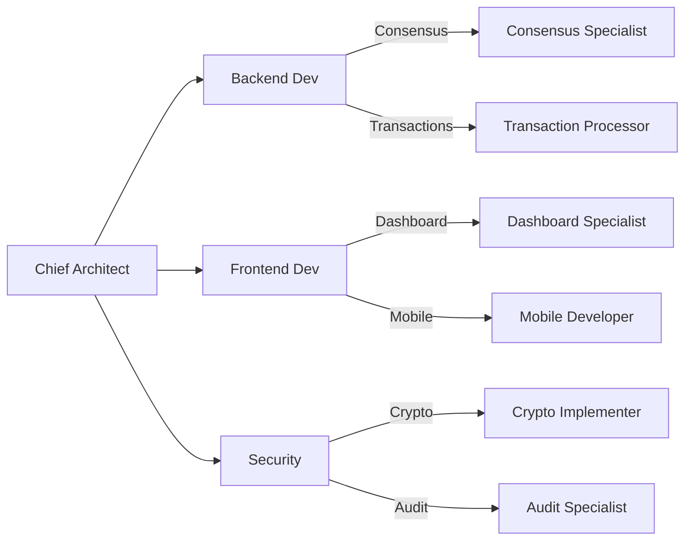

# 🚀 Aurigraph Development Team - Enhanced Agent Architecture

## Executive Summary
This document defines the enhanced agent and subagent architecture for parallel development and deployment of Aurigraph DLT platform. Each agent specializes in specific domains with coordinated workflows for maximum efficiency.

---

## 🎯 Core Development Team Structure

### 1. 🧠 **Chief Architect Agent (CAA)**
**Role**: Overall system architecture and strategic decisions  
**Capabilities**:
- System design and architecture planning
- Technology stack decisions
- Performance optimization strategies
- Cross-team coordination

**Subagents**:
- **Architecture Validator**: Reviews all architectural changes
- **Performance Analyzer**: Monitors system performance metrics
- **Tech Debt Manager**: Tracks and prioritizes technical debt

**Parallel Tasks**:
```yaml
tasks:
  - Review V11 migration architecture
  - Optimize consensus algorithm design
  - Plan cross-chain integration
  - Define microservices boundaries
```

---

### 2. 💻 **Backend Development Agent (BDA)**
**Role**: Core blockchain platform development  
**Capabilities**:
- Java/Quarkus development
- Consensus implementation
- Smart contract integration
- Database optimization

**Subagents**:
- **Consensus Specialist**: HyperRAFT++ implementation
- **Transaction Processor**: High-throughput transaction handling
- **State Manager**: Blockchain state management
- **Network Protocol Expert**: P2P networking and gRPC

**Parallel Tasks**:
```yaml
tasks:
  - Implement HyperRAFT++ in Java
  - Optimize transaction processing pipeline
  - Build gRPC service layer
  - Integrate quantum-resistant cryptography
```

---

### 3. 🎨 **Frontend Development Agent (FDA)**
**Role**: User interfaces and dashboards  
**Capabilities**:
- React/Vue.js development
- Real-time data visualization
- WebSocket integration
- Responsive design

**Subagents**:
- **UI Designer**: Interface design and UX
- **Dashboard Specialist**: Real-time monitoring dashboards
- **Mobile Developer**: Mobile app development
- **Visualization Expert**: Charts and data visualization

**Parallel Tasks**:
```yaml
tasks:
  - Build Vizro advanced dashboards
  - Create mobile wallet interface
  - Implement real-time transaction viewer
  - Design admin control panel
```

---

### 4. 🔒 **Security & Cryptography Agent (SCA)**
**Role**: Security implementation and auditing  
**Capabilities**:
- Quantum-resistant cryptography
- Security auditing
- Vulnerability assessment
- Key management

**Subagents**:
- **Crypto Implementer**: CRYSTALS-Dilithium/Kyber
- **Penetration Tester**: Security testing
- **Audit Specialist**: Code security review
- **Key Manager**: HSM and key infrastructure

**Parallel Tasks**:
```yaml
tasks:
  - Implement NIST Level 5 quantum resistance
  - Conduct security audit of consensus
  - Build key management system
  - Create security monitoring dashboard
```

---

### 5. 🤖 **AI/ML Development Agent (ADA)**
**Role**: AI-driven optimization and analytics  
**Capabilities**:
- ML model development
- Predictive analytics
- Anomaly detection
- Performance optimization

**Subagents**:
- **Model Trainer**: ML model training and optimization
- **Anomaly Detector**: Transaction anomaly detection
- **Predictor**: Performance prediction models
- **Optimizer**: AI-driven consensus optimization

**Parallel Tasks**:
```yaml
tasks:
  - Train transaction prediction models
  - Implement anomaly detection system
  - Optimize consensus with ML
  - Build predictive maintenance system
```

---

### 6. 🌉 **Integration & Bridge Agent (IBA)**
**Role**: Cross-chain and external integrations  
**Capabilities**:
- Cross-chain bridge development
- API integration
- Third-party connectors
- Legacy system integration

**Subagents**:
- **Bridge Builder**: Cross-chain bridge implementation
- **API Developer**: REST/GraphQL APIs
- **Connector Specialist**: External system connectors
- **Migration Expert**: Legacy system migration

**Parallel Tasks**:
```yaml
tasks:
  - Build Ethereum bridge
  - Implement Polkadot connector
  - Create enterprise API gateway
  - Migrate V10 to V11 components
```

---

### 7. 🧪 **Quality Assurance Agent (QAA)**
**Role**: Testing and quality control  
**Capabilities**:
- Automated testing
- Performance testing
- Integration testing
- Test coverage analysis

**Subagents**:
- **Unit Tester**: Component-level testing
- **Integration Tester**: System integration testing
- **Performance Tester**: Load and stress testing
- **Coverage Analyst**: Test coverage optimization

**Parallel Tasks**:
```yaml
tasks:
  - Write unit tests for V11 components
  - Conduct 2M TPS load testing
  - Test cross-chain transactions
  - Validate quantum cryptography
```

---

### 8. 🚀 **DevOps & Deployment Agent (DDA)**
**Role**: CI/CD and infrastructure management  
**Capabilities**:
- Kubernetes orchestration
- CI/CD pipeline management
- Infrastructure as Code
- Monitoring and logging

**Subagents**:
- **Pipeline Manager**: CI/CD pipeline optimization
- **Container Specialist**: Docker/Kubernetes management
- **Infrastructure Coder**: Terraform/Ansible automation
- **Monitor**: System monitoring and alerting

**Parallel Tasks**:
```yaml
tasks:
  - Setup Kubernetes cluster
  - Implement CI/CD for V11
  - Deploy monitoring stack
  - Automate rollback procedures
```

---

### 9. 📚 **Documentation Agent (DOA)**
**Role**: Technical documentation and knowledge management  
**Capabilities**:
- API documentation
- Architecture documentation
- Tutorial creation
- Knowledge base management

**Subagents**:
- **API Documenter**: OpenAPI/Swagger specs
- **Tutorial Writer**: Step-by-step guides
- **Diagram Creator**: Architecture diagrams
- **Knowledge Curator**: Wiki and knowledge base

**Parallel Tasks**:
```yaml
tasks:
  - Document V11 architecture
  - Create API reference
  - Write deployment guides
  - Maintain CLAUDE.md updates
```

---

### 10. 📊 **Project Management Agent (PMA)**
**Role**: Sprint planning and task coordination  
**Capabilities**:
- Sprint planning
- Task allocation
- Progress tracking
- Risk management

**Subagents**:
- **Sprint Planner**: Sprint organization
- **Task Allocator**: Work distribution
- **Progress Tracker**: Milestone monitoring
- **Risk Analyzer**: Risk assessment and mitigation

**Parallel Tasks**:
```yaml
tasks:
  - Plan Sprint 2 activities
  - Allocate V11 migration tasks
  - Track 2M TPS milestone
  - Identify critical path items
```

---

## 🔄 Parallel Development Workflow

### Phase 1: Foundation (Week 1-2)


### Phase 2: Integration (Week 3-4)
```yaml
parallel_tasks:
  team_1:
    - BDA: Complete consensus implementation
    - QAA: Test consensus algorithms
    - DDA: Setup test environment
    
  team_2:
    - FDA: Build monitoring dashboard
    - ADA: Implement ML optimization
    - DOA: Document APIs
    
  team_3:
    - IBA: Build cross-chain bridges
    - SCA: Security audit bridges
    - PMA: Track integration progress
```

### Phase 3: Optimization (Week 5-6)
```yaml
optimization_focus:
  performance:
    - BDA: Optimize transaction throughput
    - ADA: ML-based performance tuning
    - QAA: Load testing at 2M TPS
    
  security:
    - SCA: Penetration testing
    - QAA: Security test suite
    - DOA: Security documentation
    
  deployment:
    - DDA: Production deployment
    - IBA: External integrations
    - PMA: Launch coordination
```

---

## 🎭 Agent Communication Protocol

### Message Format
```json
{
  "from": "agent_id",
  "to": "agent_id",
  "priority": "high|medium|low",
  "type": "task|query|update|alert",
  "payload": {
    "action": "specific_action",
    "data": {},
    "deadline": "ISO8601"
  }
}
```

### Coordination Rules
1. **Daily Sync**: All agents sync at 09:00 UTC
2. **Priority Handling**: High priority tasks interrupt current work
3. **Dependency Management**: Agents wait for dependencies
4. **Conflict Resolution**: CAA resolves conflicts
5. **Progress Reporting**: Hourly updates to PMA

---

## 🚦 Task Prioritization Matrix

| Priority | Type | Agents | Timeline |
|----------|------|--------|----------|
| P0 | Critical Security | SCA, QAA | Immediate |
| P1 | Consensus Implementation | BDA, ADA | 24 hours |
| P2 | Performance Optimization | BDA, ADA, QAA | 48 hours |
| P3 | UI/UX Development | FDA, DOA | 72 hours |
| P4 | Documentation | DOA, PMA | 1 week |

---

## 📈 Performance Metrics

### Agent KPIs
```yaml
metrics:
  BDA:
    - Lines of code: 1000+ daily
    - Bug fix rate: < 24 hours
    - Test coverage: > 95%
    
  FDA:
    - UI components: 5+ daily
    - Response time: < 100ms
    - Accessibility: WCAG 2.1 AA
    
  QAA:
    - Test cases: 50+ daily
    - Bug detection: > 90%
    - Automation rate: > 80%
    
  DDA:
    - Deployment frequency: 4+ daily
    - MTTR: < 30 minutes
    - Uptime: > 99.99%
```

---

## 🔧 Development Environment Setup

### Agent Workspaces
```bash
# Backend Development
/aurigraph-v11/
  ├── consensus/     # BDA - Consensus implementation
  ├── crypto/        # SCA - Cryptography
  ├── bridge/        # IBA - Cross-chain
  └── ai/            # ADA - ML models

# Frontend Development  
/aurigraph-ui/
  ├── dashboard/     # FDA - Dashboards
  ├── mobile/        # FDA - Mobile app
  └── admin/         # FDA - Admin panel

# Testing & QA
/aurigraph-tests/
  ├── unit/          # QAA - Unit tests
  ├── integration/   # QAA - Integration tests
  └── performance/   # QAA - Load tests

# DevOps
/aurigraph-ops/
  ├── k8s/           # DDA - Kubernetes
  ├── terraform/     # DDA - Infrastructure
  └── monitoring/    # DDA - Observability
```

---

## 🎯 Sprint 1 Agent Assignments

### Week 1 (Jan 6-10, 2025)
```yaml
assignments:
  CAA:
    - Review V11 architecture
    - Define performance targets
    
  BDA:
    primary: "John-Agent"
    tasks:
      - Implement HyperRAFT++ leader election
      - Build transaction pool manager
    
  FDA:
    primary: "Sarah-Agent"
    tasks:
      - Create Vizro dashboard v2
      - Build transaction explorer
    
  SCA:
    primary: "Security-Bot"
    tasks:
      - Implement Dilithium signatures
      - Audit consensus code
    
  QAA:
    primary: "Test-Runner"
    tasks:
      - Write consensus unit tests
      - Setup load testing framework
```

### Week 2 (Jan 13-17, 2025)
```yaml
assignments:
  ADA:
    - Train transaction prediction model
    - Implement anomaly detection
    
  IBA:
    - Build Ethereum bridge prototype
    - Create REST API gateway
    
  DDA:
    - Setup Kubernetes cluster
    - Implement CI/CD pipeline
    
  DOA:
    - Document V11 architecture
    - Create API documentation
    
  PMA:
    - Track sprint progress
    - Prepare Sprint 2 planning
```

---

## 💡 Intelligence Sharing

### Knowledge Base
- **Central Repository**: `/docs/knowledge-base/`
- **Update Frequency**: Real-time
- **Access Control**: Role-based

### Learning Loop
```python
class AgentLearning:
    def capture_insight(self, agent_id, insight):
        # Store in knowledge base
        self.kb.store(agent_id, insight)
        
    def share_knowledge(self, insight):
        # Broadcast to relevant agents
        for agent in self.relevant_agents(insight):
            agent.notify(insight)
            
    def apply_learning(self, context):
        # Apply previous learnings
        insights = self.kb.query(context)
        return self.optimize_approach(insights)
```

---

## 🚀 Deployment Strategy

### Progressive Rollout
```yaml
stages:
  - alpha:
      agents: [BDA, QAA]
      environment: dev
      duration: 1 week
      
  - beta:
      agents: [All]
      environment: staging
      duration: 2 weeks
      
  - production:
      agents: [All]
      environment: prod
      strategy: blue-green
```

---

## 📞 Emergency Protocol

### Incident Response
```yaml
severity_levels:
  P0_Critical:
    responders: [CAA, SCA, DDA]
    response_time: < 5 minutes
    escalation: CTO
    
  P1_High:
    responders: [BDA, QAA, DDA]
    response_time: < 15 minutes
    escalation: Team Lead
    
  P2_Medium:
    responders: [Assigned Agent]
    response_time: < 1 hour
    escalation: Senior Dev
```

---

## 🎓 Training & Onboarding

### New Agent Onboarding
1. **Day 1**: Architecture overview by CAA
2. **Day 2**: Codebase walkthrough by BDA
3. **Day 3**: Testing framework by QAA
4. **Day 4**: Deployment process by DDA
5. **Day 5**: First task assignment by PMA

---

## 📊 Success Metrics

### Q1 2025 Targets
- **Performance**: Achieve 2M+ TPS
- **Reliability**: 99.99% uptime
- **Security**: Zero critical vulnerabilities
- **Development**: 100% test coverage
- **Deployment**: < 10 minute rollouts

---

## 🔄 Continuous Improvement

### Weekly Retrospectives
- What worked well?
- What needs improvement?
- Action items for next week
- Knowledge sharing session

### Monthly Reviews
- Architecture evolution
- Performance benchmarks
- Security assessments
- Team efficiency metrics

---

## 📝 CLAUDE.md Integration

This agent architecture should be referenced in CLAUDE.md for all future Aurigraph development. Each agent has specific capabilities and can be invoked for parallel task execution.

```markdown
# Agent Invocation Examples

## Backend Development
"Invoke BDA to implement new consensus feature"

## Security Audit  
"Invoke SCA to audit smart contract code"

## Performance Testing
"Invoke QAA to run 2M TPS load test"

## Deployment
"Invoke DDA to deploy to production"
```

---

*Last Updated: 2025-09-10*  
*Version: 1.0.0*  
*Status: Active Development*