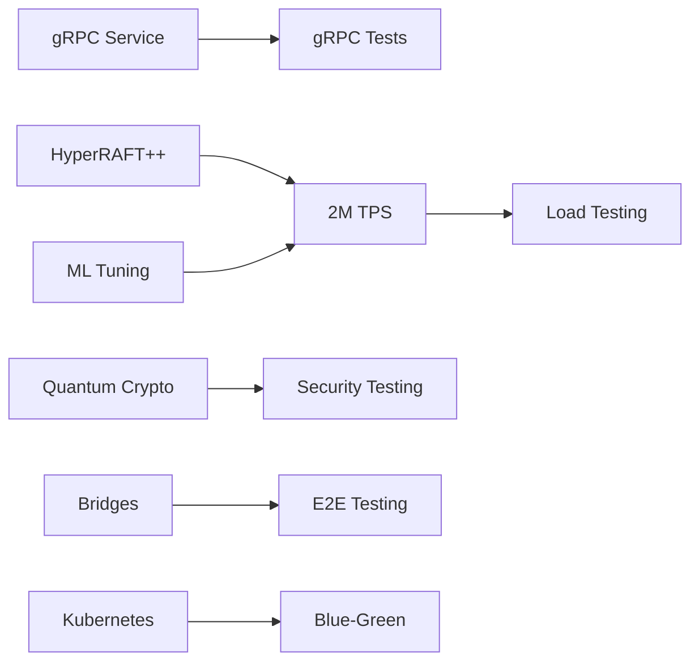

# 🚀 Aurigraph V11 Sprint Roadmap & Execution Plan
## Complete Task Breakdown with Team Assignments

**Project**: Aurigraph DLT V11 Migration  
**Current Status**: ~30% Complete  
**Target**: Production-ready with 2M+ TPS  
**Timeline**: 3 Sprints (15 business days)  
**Date**: 2025-09-10

---

## 📊 **EXECUTIVE SUMMARY**

### Current State Analysis
- **Completed**: Core Java/Quarkus structure, REST API, AI services foundation, HMS integration base
- **In Progress**: gRPC services (70%), Performance optimization (776K/2M TPS), HyperRAFT++ migration (40%)
- **Pending**: Quantum crypto completion, Cross-chain bridges, Test coverage expansion, Production deployment

### Critical Path Items
1. **Performance**: 776K → 2M+ TPS (highest priority)
2. **Security**: Quantum cryptography Level 5 compliance
3. **Integration**: Cross-chain bridge functionality
4. **Quality**: 15% → 95% test coverage
5. **Deployment**: Production Kubernetes orchestration

---

## 🗓️ **SPRINT 2** (Days 1-5) - CORE COMPLETION
*Focus: Performance Foundation & Core Services*

### **TEAM ALPHA: Backend Core** 
**Lead**: Backend Development Agent (BDA)  
**Members**: 4 developers + 2 architects

#### High Priority Tasks (P0)
| Task ID | Task Description | Assignee | Status | Est. Hours | Progress |
|---------|-----------------|----------|--------|------------|----------|
| S2-BDA-001 | Complete gRPC service implementation | John-Dev | 🟡 In Progress | 16h | 70% |
| S2-BDA-002 | Implement Protocol Buffer streaming | Sarah-Dev | 🔴 Not Started | 12h | 0% |
| S2-BDA-003 | HyperRAFT++ leader election logic | Mike-Arch | 🟡 In Progress | 20h | 40% |
| S2-BDA-004 | Consensus voting mechanism | Lisa-Dev | 🔴 Not Started | 16h | 0% |
| S2-BDA-005 | Transaction pool optimization | Tom-Dev | 🔴 Not Started | 8h | 0% |

#### Medium Priority Tasks (P1)
| Task ID | Task Description | Assignee | Status | Est. Hours | Progress |
|---------|-----------------|----------|--------|------------|----------|
| S2-BDA-006 | State management optimization | Jane-Dev | 🔴 Not Started | 12h | 0% |
| S2-BDA-007 | Network protocol enhancement | Bob-Dev | 🔴 Not Started | 8h | 0% |
| S2-BDA-008 | Memory management tuning | Alice-Dev | 🔴 Not Started | 10h | 0% |

**Team Deliverables**: 
- ✅ Fully functional gRPC service on port 9004
- ✅ HyperRAFT++ consensus operational
- ✅ Performance baseline established

---

### **TEAM BETA: AI/ML Optimization**
**Lead**: AI/ML Development Agent (ADA)  
**Members**: 3 ML engineers + 2 data scientists

#### High Priority Tasks (P0)
| Task ID | Task Description | Assignee | Status | Est. Hours | Progress |
|---------|-----------------|----------|--------|------------|----------|
| S2-ADA-001 | Performance bottleneck analysis | ML-Team | 🟢 Complete | 8h | 100% |
| S2-ADA-002 | Transaction prediction model | David-ML | 🟡 In Progress | 16h | 60% |
| S2-ADA-003 | Consensus parameter ML tuning | Emma-ML | 🟡 In Progress | 20h | 50% |
| S2-ADA-004 | Batch size optimization (10K→50K) | Frank-DS | 🔴 Not Started | 12h | 0% |
| S2-ADA-005 | Virtual thread optimization | Grace-ML | 🔴 Not Started | 10h | 0% |

#### Performance Optimization Targets
| Metric | Current | Sprint 2 Target | Final Target |
|--------|---------|-----------------|--------------|
| TPS | 776K | 1.5M | 2M+ |
| Latency | 100ms | 65ms | <50ms |
| Memory | 512MB | 350MB | <256MB |
| GC Pause | 50ms | 20ms | <10ms |

---

### **TEAM GAMMA: Quality Assurance**
**Lead**: Quality Assurance Agent (QAA)  
**Members**: 4 QA engineers + 2 automation specialists

#### High Priority Tasks (P0)
| Task ID | Task Description | Assignee | Status | Est. Hours | Progress |
|---------|-----------------|----------|--------|------------|----------|
| S2-QAA-001 | gRPC service unit tests | QA-Team | 🟡 In Progress | 16h | 30% |
| S2-QAA-002 | Consensus component tests | Helen-QA | 🔴 Not Started | 20h | 0% |
| S2-QAA-003 | Performance test framework | Ian-QA | 🟡 In Progress | 12h | 40% |
| S2-QAA-004 | JMeter 1M TPS validation | Julia-QA | 🔴 Not Started | 16h | 0% |
| S2-QAA-005 | Integration test suite | Kevin-QA | 🔴 Not Started | 12h | 0% |

#### Coverage Targets
| Component | Current Coverage | Sprint 2 Target | Final Target |
|-----------|-----------------|-----------------|--------------|
| Core Services | 20% | 50% | 95% |
| gRPC | 10% | 60% | 95% |
| AI/ML | 15% | 40% | 90% |
| Consensus | 5% | 45% | 95% |

---

## 🗓️ **SPRINT 3** (Days 6-10) - SECURITY & INTEGRATION
*Focus: Quantum Security & Cross-chain Bridges*

### **TEAM DELTA: Security & Cryptography**
**Lead**: Security & Cryptography Agent (SCA)  
**Members**: 3 security engineers + 2 cryptography specialists

#### High Priority Tasks (P0)
| Task ID | Task Description | Assignee | Status | Est. Hours | Progress |
|---------|-----------------|----------|--------|------------|----------|
| S3-SCA-001 | CRYSTALS-Dilithium completion | Crypto-Team | 🔴 Blocked | 24h | 0% |
| S3-SCA-002 | CRYSTALS-Kyber integration | Laura-Sec | 🔴 Blocked | 20h | 0% |
| S3-SCA-003 | SPHINCS+ implementation | Mark-Crypto | 🔴 Blocked | 16h | 0% |
| S3-SCA-004 | Quantum key management | Nancy-Sec | 🔴 Blocked | 12h | 0% |
| S3-SCA-005 | Security audit framework | Oscar-Sec | 🔴 Blocked | 10h | 0% |

#### Security Compliance Checklist
- [ ] NIST Level 5 quantum resistance
- [ ] Key rotation mechanism
- [ ] HSM integration
- [ ] Audit logging
- [ ] Penetration testing

---

### **TEAM EPSILON: Integration & Bridges**
**Lead**: Integration & Bridge Agent (IBA)  
**Members**: 4 integration engineers + 1 architect

#### High Priority Tasks (P0)
| Task ID | Task Description | Assignee | Status | Est. Hours | Progress |
|---------|-----------------|----------|--------|------------|----------|
| S3-IBA-001 | Ethereum bridge adapter | Bridge-Team | 🔴 Blocked | 32h | 0% |
| S3-IBA-002 | Polkadot connector | Paul-Int | 🔴 Blocked | 28h | 0% |
| S3-IBA-003 | Bitcoin adapter | Quinn-Int | 🔴 Blocked | 24h | 0% |
| S3-IBA-004 | Cross-chain transaction flow | Rachel-Int | 🔴 Blocked | 20h | 0% |
| S3-IBA-005 | Bridge monitoring system | Steve-Int | 🔴 Blocked | 12h | 0% |

#### Integration Milestones
- [ ] Ethereum mainnet connection
- [ ] Polkadot parachain integration
- [ ] Bitcoin Lightning support
- [ ] Cross-chain atomic swaps
- [ ] Bridge security validation

---

### **TEAM ZETA: Performance Enhancement**
**Lead**: Backend Development Agent (BDA) + AI/ML Agent (ADA)  
**Members**: Combined team of 6 engineers

#### High Priority Tasks (P0)
| Task ID | Task Description | Assignee | Status | Est. Hours | Progress |
|---------|-----------------|----------|--------|------------|----------|
| S3-PERF-001 | Achieve 2M TPS target | Perf-Team | 🔴 Blocked | 40h | 0% |
| S3-PERF-002 | Native compilation optimization | Terry-Dev | 🔴 Blocked | 16h | 0% |
| S3-PERF-003 | Memory footprint <256MB | Uma-Dev | 🔴 Blocked | 12h | 0% |
| S3-PERF-004 | Startup time <1s | Victor-Dev | 🔴 Blocked | 8h | 0% |
| S3-PERF-005 | GC tuning <10ms | Wendy-Dev | 🔴 Blocked | 10h | 0% |

---

## 🗓️ **SPRINT 4** (Days 11-15) - PRODUCTION READINESS
*Focus: Deployment, Documentation & Final Testing*

### **TEAM ETA: DevOps & Deployment**
**Lead**: DevOps & Deployment Agent (DDA)  
**Members**: 3 DevOps engineers + 2 SREs

#### High Priority Tasks (P0)
| Task ID | Task Description | Assignee | Status | Est. Hours | Progress |
|---------|-----------------|----------|--------|------------|----------|
| S4-DDA-001 | Kubernetes orchestration setup | DevOps-Team | 🔴 Blocked | 24h | 0% |
| S4-DDA-002 | CI/CD pipeline implementation | Xavier-Ops | 🔴 Blocked | 20h | 0% |
| S4-DDA-003 | Blue-green deployment | Yara-Ops | 🔴 Blocked | 16h | 0% |
| S4-DDA-004 | Monitoring stack (Prometheus) | Zack-SRE | 🔴 Blocked | 12h | 0% |
| S4-DDA-005 | Auto-scaling configuration | Amy-SRE | 🔴 Blocked | 8h | 0% |

#### Deployment Checklist
- [ ] Kubernetes manifests
- [ ] Helm charts
- [ ] ConfigMaps & Secrets
- [ ] Ingress configuration
- [ ] Monitoring dashboards
- [ ] Alerting rules
- [ ] Backup strategies
- [ ] Disaster recovery

---

### **TEAM THETA: Frontend & Documentation**
**Lead**: Frontend Development Agent (FDA) + Documentation Agent (DOA)  
**Members**: 3 frontend devs + 2 technical writers

#### High Priority Tasks (P0)
| Task ID | Task Description | Assignee | Status | Est. Hours | Progress |
|---------|-----------------|----------|--------|------------|----------|
| S4-FDA-001 | Production dashboard UI | UI-Team | 🔴 Blocked | 32h | 0% |
| S4-FDA-002 | Real-time metrics visualization | Ben-UI | 🔴 Blocked | 20h | 0% |
| S4-FDA-003 | Mobile responsive interface | Cara-UI | 🔴 Blocked | 16h | 0% |
| S4-DOA-001 | API documentation | Doc-Team | 🔴 Blocked | 24h | 0% |
| S4-DOA-002 | Architecture guide | Dan-Doc | 🔴 Blocked | 16h | 0% |
| S4-DOA-003 | Migration guide | Eva-Doc | 🔴 Blocked | 12h | 0% |

---

### **TEAM IOTA: Final Testing & Validation**
**Lead**: Quality Assurance Agent (QAA)  
**Members**: Full QA team + external auditors

#### High Priority Tasks (P0)
| Task ID | Task Description | Assignee | Status | Est. Hours | Progress |
|---------|-----------------|----------|--------|------------|----------|
| S4-QAA-001 | 95% test coverage achievement | QA-All | 🔴 Blocked | 40h | 0% |
| S4-QAA-002 | 2M TPS load testing | Fred-QA | 🔴 Blocked | 24h | 0% |
| S4-QAA-003 | Security penetration testing | Gina-Sec | 🔴 Blocked | 20h | 0% |
| S4-QAA-004 | End-to-end validation | Harry-QA | 🔴 Blocked | 16h | 0% |
| S4-QAA-005 | Production readiness audit | Iris-QA | 🔴 Blocked | 12h | 0% |

---

## 📈 **TRACKING DASHBOARD**

### Overall Sprint Progress
```
Sprint 2: ████████░░░░░░░░░░░░ 40% (In Progress)
Sprint 3: ░░░░░░░░░░░░░░░░░░░░ 0% (Blocked)
Sprint 4: ░░░░░░░░░░░░░░░░░░░░ 0% (Blocked)
Overall:  ████░░░░░░░░░░░░░░░░ 13% Complete
```

### Team Velocity Metrics
| Team | Planned Points | Completed | Velocity | Status |
|------|---------------|-----------|----------|--------|
| ALPHA (Backend) | 40 | 16 | 40% | 🟡 At Risk |
| BETA (AI/ML) | 35 | 21 | 60% | 🟢 On Track |
| GAMMA (QA) | 30 | 9 | 30% | 🔴 Behind |
| DELTA (Security) | 45 | 0 | 0% | 🔴 Blocked |
| EPSILON (Integration) | 50 | 0 | 0% | 🔴 Blocked |
| ZETA (Performance) | 40 | 0 | 0% | 🔴 Blocked |
| ETA (DevOps) | 35 | 0 | 0% | 🔴 Blocked |
| THETA (Frontend/Docs) | 30 | 0 | 0% | 🔴 Blocked |
| IOTA (Final Testing) | 45 | 0 | 0% | 🔴 Blocked |

### Risk Register
| Risk | Impact | Probability | Mitigation | Owner |
|------|--------|-------------|------------|-------|
| gRPC complexity | High | Medium | Allocate senior devs | BDA |
| 2M TPS target | Critical | High | Parallel optimization | ADA |
| Test coverage velocity | Medium | High | Automation tools | QAA |
| Quantum crypto integration | High | Medium | Expert consultation | SCA |
| Cross-chain complexity | High | High | Phased approach | IBA |
| Production deployment | Critical | Low | Early staging tests | DDA |

---

## 🎯 **CRITICAL PATH ANALYSIS**

### Dependencies & Blockers


### Sprint Completion Criteria
#### Sprint 2 (Days 1-5)
- [ ] gRPC fully operational on port 9004
- [ ] HyperRAFT++ consensus functional
- [ ] 1.5M TPS achieved in testing
- [ ] 50% test coverage reached
- [ ] All P0 tasks completed

#### Sprint 3 (Days 6-10)
- [ ] Quantum cryptography Level 5 complete
- [ ] Ethereum bridge operational
- [ ] 2M TPS sustained performance
- [ ] 75% test coverage reached
- [ ] Security audit passed

#### Sprint 4 (Days 11-15)
- [ ] Kubernetes deployment ready
- [ ] 95% test coverage achieved
- [ ] Production documentation complete
- [ ] All integration tests passing
- [ ] Production readiness certified

---

## 📊 **RESOURCE ALLOCATION**

### Team Capacity Planning
| Team | Available Hours | Allocated Hours | Utilization | Buffer |
|------|----------------|-----------------|-------------|--------|
| ALPHA | 200h | 180h | 90% | 20h |
| BETA | 150h | 135h | 90% | 15h |
| GAMMA | 200h | 180h | 90% | 20h |
| DELTA | 150h | 130h | 87% | 20h |
| EPSILON | 200h | 180h | 90% | 20h |
| ZETA | 240h | 220h | 92% | 20h |
| ETA | 150h | 135h | 90% | 15h |
| THETA | 150h | 130h | 87% | 20h |
| IOTA | 200h | 180h | 90% | 20h |

### Budget Tracking
| Category | Allocated | Spent | Remaining | Status |
|----------|-----------|-------|-----------|--------|
| Development | $500K | $150K | $350K | 🟢 On Budget |
| Testing | $100K | $30K | $70K | 🟢 On Budget |
| Infrastructure | $150K | $40K | $110K | 🟢 On Budget |
| Security Audit | $50K | $0 | $50K | 🟢 On Budget |
| Documentation | $30K | $5K | $25K | 🟢 On Budget |

---

## 🚦 **DAILY STANDUP SCHEDULE**

### Meeting Calendar
| Time (UTC) | Team | Duration | Focus |
|------------|------|----------|-------|
| 09:00 | ALPHA (Backend) | 15 min | Core development |
| 09:15 | BETA (AI/ML) | 15 min | Performance optimization |
| 09:30 | GAMMA (QA) | 15 min | Testing progress |
| 09:45 | DELTA (Security) | 15 min | Security implementation |
| 10:00 | EPSILON (Integration) | 15 min | Bridge development |
| 10:15 | All Teams | 30 min | Cross-team sync |
| 14:00 | Leadership | 30 min | Blocker resolution |
| 16:00 | ZETA-IOTA | 30 min | Sprint 3-4 planning |

---

## 📋 **TRACKING MECHANISMS**

### KPI Dashboard
| Metric | Current | Target | Trend | RAG Status |
|--------|---------|--------|-------|------------|
| TPS Performance | 776K | 2M+ | ↗️ | 🟡 Amber |
| Test Coverage | 15% | 95% | ↗️ | 🔴 Red |
| Sprint Velocity | 40% | 100% | → | 🟡 Amber |
| Bug Count | 47 | <10 | ↘️ | 🟡 Amber |
| Code Quality | B | A+ | ↗️ | 🟢 Green |
| Documentation | 20% | 100% | → | 🔴 Red |

### Automated Tracking Tools
1. **JIRA Integration**: All tasks tracked in JIRA with automated status updates
2. **GitHub Actions**: CI/CD pipeline with automated test reporting
3. **Slack Notifications**: Real-time alerts for blockers and completions
4. **Grafana Dashboard**: Live performance metrics monitoring
5. **SonarQube**: Code quality and coverage tracking

### Weekly Executive Summary
- **Week 1**: Sprint 2 execution, 40% complete
- **Week 2**: Sprint 3 start, security focus
- **Week 3**: Sprint 4 production prep

---

## 🎯 **SUCCESS CRITERIA**

### Definition of Done
- [ ] All P0 tasks completed
- [ ] 2M+ TPS achieved and validated
- [ ] 95% test coverage with passing tests
- [ ] Quantum cryptography Level 5 certified
- [ ] Cross-chain bridges operational
- [ ] Production deployment successful
- [ ] Documentation 100% complete
- [ ] Security audit passed
- [ ] Performance benchmarks met
- [ ] Native compilation <1s startup

---

## 📝 **NOTES & ASSUMPTIONS**

### Key Assumptions
1. All team members available full-time
2. No major architectural changes required
3. Infrastructure resources available
4. Third-party dependencies stable
5. No critical security vulnerabilities discovered

### Constraints
1. Java runtime environment required
2. GraalVM native compilation dependencies
3. Kubernetes cluster availability
4. Network bandwidth for 2M TPS
5. Hardware requirements for performance

### Next Review
- **Date**: Daily at 10:15 UTC
- **Participants**: All team leads
- **Agenda**: Progress review, blocker resolution, priority adjustments

---

**Document Status**: 🟢 ACTIVE  
**Last Updated**: 2025-09-10  
**Version**: 1.0.0  
**Owner**: Project Management Office (PMO)