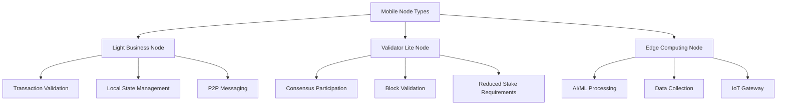

# Aurigraph Mobile Business Node - Deployment Roadmap

## Executive Summary

Yes, deploying Aurigraph Business nodes on Android/iOS mobile devices is **technically feasible** and would create a truly distributed and decentralized computing infrastructure. This document outlines a comprehensive roadmap for implementing mobile nodes that can participate in the Aurigraph network.

## Feasibility Analysis

### ✅ **Why It's Possible**

1. **Modern Mobile Hardware Capabilities**
   - **Processing Power**: Modern smartphones (iPhone 15 Pro, Samsung S24) have 6-8 core processors comparable to desktop CPUs
   - **Memory**: 8-16GB RAM standard in flagship devices
   - **Storage**: 256GB-1TB storage with fast NVMe speeds
   - **Connectivity**: 5G networks provide <10ms latency, 1Gbps+ speeds
   - **Neural Engines**: Dedicated AI processors for ML workloads

2. **Technical Enablers**
   - **Java/Kotlin on Android**: Native support for JVM-based applications
   - **Swift/Objective-C on iOS**: Can run compiled native code
   - **WebAssembly**: Cross-platform execution environment
   - **React Native/Flutter**: Unified development frameworks
   - **GraalVM Native Image**: Compile Java to native ARM64 binaries

3. **Precedents**
   - **Bitcoin/Ethereum mobile wallets**: Already run light nodes
   - **IPFS mobile**: Distributed storage on mobile
   - **Helium Network**: IoT nodes on mobile devices
   - **Folding@home**: Distributed computing on mobile

### ⚠️ **Challenges to Address**

1. **Battery Consumption**: Continuous processing drains battery
2. **Network Costs**: Data usage on cellular networks
3. **Storage Limitations**: Full blockchain storage requirements
4. **Background Processing**: OS restrictions on background tasks
5. **Security**: Mobile devices more vulnerable to physical access

## Architecture Design

### Mobile Node Types



### 1. **Light Business Node** (Recommended Starting Point)
- Validates transactions without storing full blockchain
- Participates in transaction relay
- Provides wallet functionality
- Executes smart contracts locally

### 2. **Validator Lite Node**
- Participates in consensus with reduced stake
- Validates blocks using SPV (Simplified Payment Verification)
- Earns reduced rewards proportional to contribution

### 3. **Edge Computing Node**
- Processes AI/ML workloads
- Acts as IoT data gateway
- Provides local caching and CDN services

## Implementation Roadmap

### Phase 1: Foundation (Months 1-3)

#### 1.1 Core Library Development
```kotlin
// Android Implementation
class AurigraphMobileNode {
    private val lightNode: LightNode
    private val p2pNetwork: P2PNetwork
    private val consensusClient: ConsensusClient
    
    fun initialize(config: NodeConfig) {
        // Initialize mobile-optimized components
        lightNode = LightNode.Builder()
            .setStorageLimit(1_000_000) // 1GB limit
            .setNetworkMode(NetworkMode.WIFI_PREFERRED)
            .setBatteryOptimized(true)
            .build()
    }
}
```

```swift
// iOS Implementation
class AurigraphMobileNode {
    private let lightNode: LightNode
    private let p2pNetwork: P2PNetwork
    private let consensusClient: ConsensusClient
    
    func initialize(config: NodeConfig) {
        // Initialize iOS-optimized components
        lightNode = LightNode.Builder()
            .storageLimit(1_000_000_000) // 1GB
            .networkMode(.wifiPreferred)
            .batteryOptimized(true)
            .build()
    }
}
```

#### 1.2 Technology Stack

**Android Stack:**
- Language: Kotlin/Java
- Framework: Android Native + JNI for performance-critical code
- Networking: OkHttp + gRPC
- Database: Room (SQLite) or Realm
- Cryptography: BouncyCastle + Android Keystore

**iOS Stack:**
- Language: Swift
- Framework: iOS Native + Metal for GPU acceleration
- Networking: URLSession + gRPC-Swift
- Database: Core Data or Realm
- Cryptography: CryptoKit + Secure Enclave

**Cross-Platform Options:**
- React Native with native modules
- Flutter with platform channels
- Xamarin for C# ecosystem
- GraalVM Native Image for Java → Native

### Phase 2: Light Node Implementation (Months 4-6)

#### 2.1 Blockchain Light Client
```yaml
Light Client Features:
  - Header-only sync (Merkle proofs)
  - Transaction verification via SPV
  - State channels for off-chain transactions
  - Selective block downloading
  - Pruning old data automatically
```

#### 2.2 Mobile-Optimized Consensus
```java
public class MobileConsensus {
    // Reduced Proof-of-Stake for mobile
    private static final long MIN_STAKE = 100; // Lower stake requirement
    private static final int VALIDATION_FREQUENCY = 10; // Validate every 10th block
    
    public boolean participateInConsensus() {
        if (BatteryManager.getBatteryLevel() < 30) {
            return false; // Skip if battery low
        }
        if (NetworkManager.isOnCellular()) {
            return false; // Skip on cellular data
        }
        return true;
    }
}
```

### Phase 3: Mobile-Specific Optimizations (Months 7-9)

#### 3.1 Battery Optimization
```kotlin
class BatteryAwareScheduler {
    fun scheduleTask(task: BlockchainTask) {
        when (getBatteryStatus()) {
            BatteryStatus.CHARGING -> {
                // Full performance mode
                task.execute(Priority.HIGH)
            }
            BatteryStatus.HIGH -> {
                // Normal operation
                task.execute(Priority.NORMAL)
            }
            BatteryStatus.LOW -> {
                // Minimal operation
                task.defer()
            }
        }
    }
}
```

#### 3.2 Network Optimization
```swift
class NetworkOptimizer {
    func optimizeDataUsage() {
        // Use Wi-Fi for blockchain sync
        if NetworkMonitor.isWiFiAvailable() {
            syncBlockchain()
        }
        
        // Use cellular only for critical transactions
        if NetworkMonitor.isCellularOnly() {
            processOnlyHighPriorityTransactions()
        }
        
        // Compress all network traffic
        enableCompression(algorithm: .zstd)
    }
}
```

#### 3.3 Storage Management
```java
public class StorageManager {
    private static final long MAX_STORAGE = 2_000_000_000L; // 2GB max
    
    public void manageStorage() {
        // Store only recent blocks
        pruneBlocksOlderThan(Days.of(30));
        
        // Use external storage if available
        if (isSDCardAvailable()) {
            moveDataToSDCard();
        }
        
        // Compress stored data
        compressHistoricalData();
    }
}
```

### Phase 4: Advanced Features (Months 10-12)

#### 4.1 Edge AI Integration
```kotlin
class EdgeAIProcessor {
    private val tensorFlowLite: TensorFlowLite
    
    fun processAIWorkload(model: AIModel, data: ByteArray): Result {
        return if (hasNeuralEngine()) {
            // Use dedicated AI hardware
            processOnNeuralEngine(model, data)
        } else {
            // Fallback to CPU/GPU
            processOnCPU(model, data)
        }
    }
}
```

#### 4.2 Incentive Mechanism
```swift
struct MobileNodeIncentives {
    let baseReward: Decimal = 0.1 // Base reward per validated block
    let uptimeBonus: Decimal = 0.05 // Bonus for continuous operation
    let dataContribution: Decimal = 0.02 // Reward for data relay
    
    func calculateRewards(node: MobileNode) -> Decimal {
        var rewards = baseReward * node.validatedBlocks
        rewards += uptimeBonus * node.uptimeHours
        rewards += dataContribution * node.dataRelayed
        return rewards
    }
}
```

### Phase 5: Production Deployment (Months 13-15)

#### 5.1 App Store Distribution
- **Google Play Store**: Standard APK/AAB distribution
- **Apple App Store**: Requires approval for cryptocurrency apps
- **Alternative**: Direct APK distribution, TestFlight for iOS

#### 5.2 Security Hardening
```java
public class SecurityManager {
    // Biometric authentication
    public boolean authenticateUser() {
        return BiometricPrompt.authenticate();
    }
    
    // Secure key storage
    public void storePrivateKey(PrivateKey key) {
        if (Build.VERSION.SDK_INT >= Build.VERSION_CODES.M) {
            // Use Android Keystore
            AndroidKeyStore.store(key);
        } else {
            // Encrypted storage fallback
            EncryptedPreferences.store(key);
        }
    }
    
    // Anti-tampering
    public boolean verifyAppIntegrity() {
        return SafetyNet.attestDevice() && 
               AppSignature.verify();
    }
}
```

## Technical Requirements

### Minimum Device Specifications

**Android:**
- OS: Android 8.0 (API 26) or higher
- RAM: 4GB minimum, 8GB recommended
- Storage: 4GB free space
- Processor: Snapdragon 665 or equivalent
- Network: 4G LTE or Wi-Fi

**iOS:**
- OS: iOS 14.0 or higher
- Device: iPhone 8 or newer
- RAM: 3GB minimum (iPhone 8+)
- Storage: 4GB free space
- Network: 4G LTE or Wi-Fi

### Performance Targets

| Metric | Target | Mobile Constraint |
|--------|--------|------------------|
| TPS | 100-1000 | Battery-dependent |
| Latency | <100ms | Network-dependent |
| Storage | <2GB | Configurable |
| Battery Impact | <5%/hour | When active |
| Data Usage | <100MB/day | Wi-Fi preferred |

## Implementation Architecture

### System Architecture
```
┌─────────────────────────────────────┐
│         Mobile Application          │
├─────────────────────────────────────┤
│         Aurigraph SDK               │
├─────────────────────────────────────┤
│    Light Node Implementation        │
├──────────────┬──────────────────────┤
│   Network    │   Consensus          │
│   Layer      │   Layer              │
├──────────────┼──────────────────────┤
│   Storage    │   Cryptography       │
│   Layer      │   Layer              │
├──────────────┴──────────────────────┤
│      Operating System (iOS/Android) │
└─────────────────────────────────────┘
```

### Component Breakdown

#### 1. Network Layer
- P2P communication using libp2p
- WebRTC for NAT traversal
- Compression (zstd) for bandwidth optimization
- Adaptive bitrate based on connection type

#### 2. Consensus Layer
- Light client consensus participation
- Merkle proof verification
- Reduced stake requirements for mobile
- Delegated validation options

#### 3. Storage Layer
- LevelDB/RocksDB for blockchain data
- SQLite for application data
- IPFS integration for distributed storage
- Automatic pruning and compression

#### 4. Cryptography Layer
- Hardware security module integration
- Biometric authentication
- Secure enclave utilization (iOS)
- Hardware-backed keystore (Android)

## Development Timeline

### Year 1: MVP Development
- **Q1**: Research & Architecture Design
- **Q2**: Core Library Development
- **Q3**: Light Node Implementation
- **Q4**: Alpha Testing & Optimization

### Year 2: Production Release
- **Q1**: Beta Testing Program
- **Q2**: Security Audit & Hardening
- **Q3**: App Store Submission
- **Q4**: Mainnet Launch

## Budget Estimation

| Component | Cost (USD) | Timeline |
|-----------|------------|----------|
| Research & Design | $150,000 | 3 months |
| Core Development | $500,000 | 9 months |
| Testing & QA | $200,000 | 6 months |
| Security Audit | $100,000 | 2 months |
| Marketing & Launch | $150,000 | 3 months |
| **Total** | **$1,100,000** | **15 months** |

## Success Metrics

### Technical KPIs
- Mobile nodes active: 10,000+ in first year
- Network contribution: 5% of total network capacity
- Uptime: 95%+ when device is active
- Transaction validation: 1000+ TPS collectively

### Business KPIs
- User adoption: 100,000+ downloads
- Daily active nodes: 10,000+
- Revenue from mobile nodes: $1M+ annually
- Geographic distribution: 50+ countries

## Risk Mitigation

### Technical Risks
1. **Battery Drain**: Implement aggressive power management
2. **Network Costs**: Wi-Fi-only mode, data usage caps
3. **Storage Limits**: Cloud backup, external storage support
4. **OS Restrictions**: Work with platform providers

### Security Risks
1. **Device Compromise**: Hardware security modules
2. **Network Attacks**: TLS 1.3, certificate pinning
3. **Physical Access**: Biometric locks, remote wipe

### Regulatory Risks
1. **App Store Policies**: Comply with cryptocurrency guidelines
2. **Data Privacy**: GDPR/CCPA compliance
3. **Financial Regulations**: KYC/AML where required

## Competitive Advantages

1. **True Decentralization**: Every smartphone becomes a node
2. **Geographic Distribution**: Nodes in every country
3. **Reduced Infrastructure Costs**: Leverage existing devices
4. **Enhanced Privacy**: Local processing of transactions
5. **Disaster Resilience**: No single point of failure

## Next Steps

1. **Prototype Development** (Month 1)
   - Build proof-of-concept Android app
   - Test basic P2P connectivity
   - Measure battery and data usage

2. **Community Feedback** (Month 2)
   - Survey potential users
   - Gather device specifications
   - Identify key use cases

3. **Technical Specification** (Month 3)
   - Finalize architecture
   - Define APIs and protocols
   - Create development roadmap

4. **Team Formation** (Month 4)
   - Hire mobile developers
   - Recruit blockchain engineers
   - Engage security auditors

## Conclusion

Deploying Aurigraph Business nodes on mobile devices is not only feasible but represents a paradigm shift toward true decentralization. By leveraging the billions of smartphones worldwide, Aurigraph can create the most distributed blockchain network ever built.

The key to success lies in:
- **Optimization**: Battery, network, and storage efficiency
- **Incentivization**: Rewarding mobile node operators
- **User Experience**: Seamless, invisible blockchain integration
- **Security**: Protecting users and the network

With proper implementation, mobile nodes can contribute significantly to the Aurigraph network while providing users with direct participation in the blockchain ecosystem.

---

**Ready to start?** Begin with the Android prototype and validate the core assumptions. The future of truly decentralized computing is in everyone's pocket! 📱🚀