# Aurigraph V12 Architecture Diagrams

**Version**: 12.0.0
**Date**: December 12, 2025
**Author**: J4C Architecture Agent
**Status**: Production

---

## Table of Contents

1. [System Overview](#1-system-overview)
2. [Backend Services Architecture](#2-backend-services-architecture)
3. [File Storage & CDN Architecture](#3-file-storage--cdn-architecture)
4. [Asset Tokenization Flow](#4-asset-tokenization-flow)
5. [External Verification Integration](#5-external-verification-integration)
6. [Database Schema (ER Diagram)](#6-database-schema-er-diagram)
7. [CI/CD Pipeline](#7-cicd-pipeline)
8. [Infrastructure Deployment](#8-infrastructure-deployment)
9. [Security Architecture](#9-security-architecture)

---

## 1. System Overview

### 1.1 High-Level Architecture

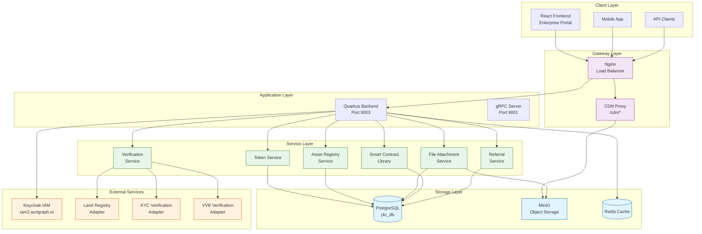

### 1.2 Component Summary

| Component | Technology | Port | Description |
|-----------|------------|------|-------------|
| **Frontend** | React 18 + TypeScript | 3000 | Enterprise Portal Dashboard |
| **Backend** | Quarkus 3.29 + Java 21 | 9003 | REST API Services |
| **gRPC** | gRPC-Java | 9001 | High-performance RPC |
| **Database** | PostgreSQL 16 | 5432 | Primary Data Store |
| **Object Storage** | MinIO | 9000/9090 | File/Document Storage |
| **CDN** | Nginx | 443 | CDN Proxy at /cdn/* |
| **Cache** | Redis 7 | 6379 | Session & Query Cache |
| **IAM** | Keycloak 23 | 8080 | Identity Management |

---

## 2. Backend Services Architecture

### 2.1 Service Class Diagram

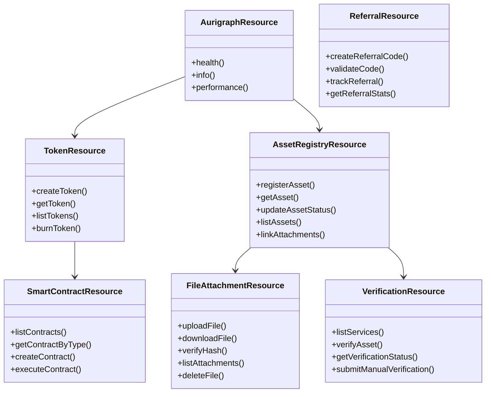

### 2.2 Service Layer Sequence

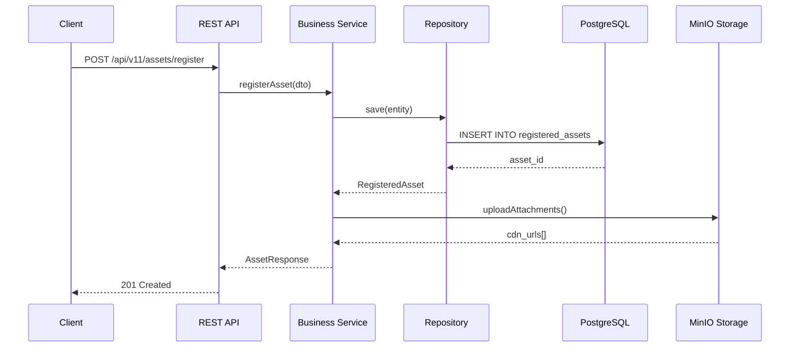

---

## 3. File Storage & CDN Architecture

### 3.1 MinIO CDN Integration

```mermaid
graph LR
    subgraph "Client"
        BROWSER[Web Browser]
        FORM[Upload Form]
    end

    subgraph "Nginx Proxy"
        NGINX[Nginx<br/>dlt.aurigraph.io]
        CDN_ROUTE[/cdn/* Route]
    end

    subgraph "MinIO Cluster"
        MINIO_API[MinIO API<br/>Port 9000]
        MINIO_CONSOLE[Console<br/>Port 9090]
        BUCKET_ATT[attachments<br/>Bucket]
        BUCKET_DOC[documents<br/>Bucket]
        BUCKET_ASSET[assets<br/>Bucket]
    end

    subgraph "Backend"
        QUARKUS[Quarkus<br/>FileAttachmentResource]
        HASH_SVC[FileHashService<br/>SHA256]
    end

    subgraph "Storage"
        DISK[/home/subbu/minio-data<br/>Persistent Volume]
    end

    BROWSER --> NGINX
    FORM --> NGINX
    NGINX --> QUARKUS
    NGINX --> CDN_ROUTE
    CDN_ROUTE --> MINIO_API

    QUARKUS --> HASH_SVC
    QUARKUS --> MINIO_API

    MINIO_API --> BUCKET_ATT
    MINIO_API --> BUCKET_DOC
    MINIO_API --> BUCKET_ASSET

    BUCKET_ATT --> DISK
    BUCKET_DOC --> DISK
    BUCKET_ASSET --> DISK

    classDef storage fill:#ffecb3,stroke:#ff6f00
    classDef service fill:#e8f5e9,stroke:#2e7d32

    class DISK,BUCKET_ATT,BUCKET_DOC,BUCKET_ASSET storage
    class QUARKUS,HASH_SVC service
```

### 3.2 File Upload Sequence

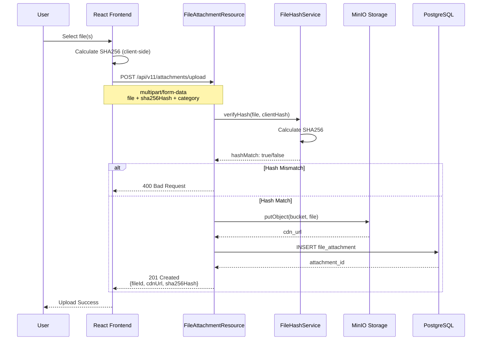

### 3.3 CDN URL Structure

```
Production CDN URLs:
├── https://dlt.aurigraph.io/cdn/attachments/{hash}_{filename}
├── https://dlt.aurigraph.io/cdn/documents/{hash}_{filename}
└── https://dlt.aurigraph.io/cdn/assets/{hash}_{filename}

MinIO Internal URLs:
├── http://localhost:9000/attachments/{hash}_{filename}
├── http://localhost:9000/documents/{hash}_{filename}
└── http://localhost:9000/assets/{hash}_{filename}
```

---

## 4. Asset Tokenization Flow

### 4.1 Complete Tokenization Process

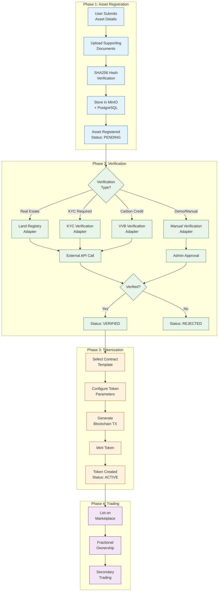

### 4.2 Asset Categories (12 Types)

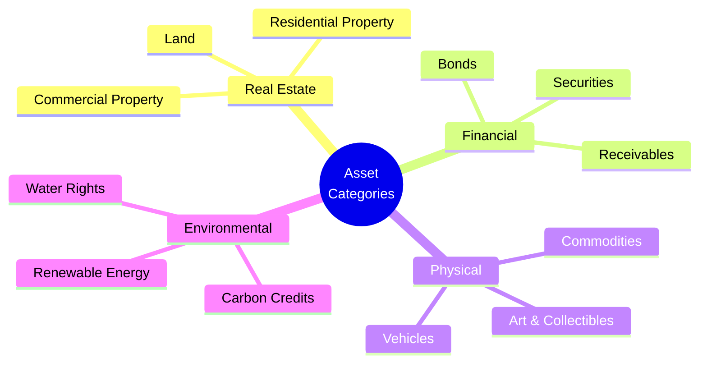

---

## 5. External Verification Integration

### 5.1 Verification Adapter Architecture

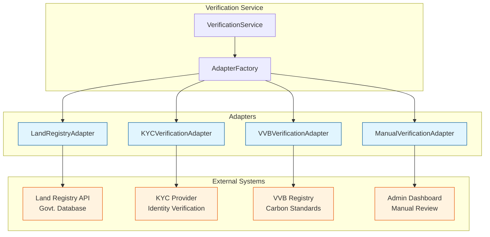

### 5.2 Verification Sequence

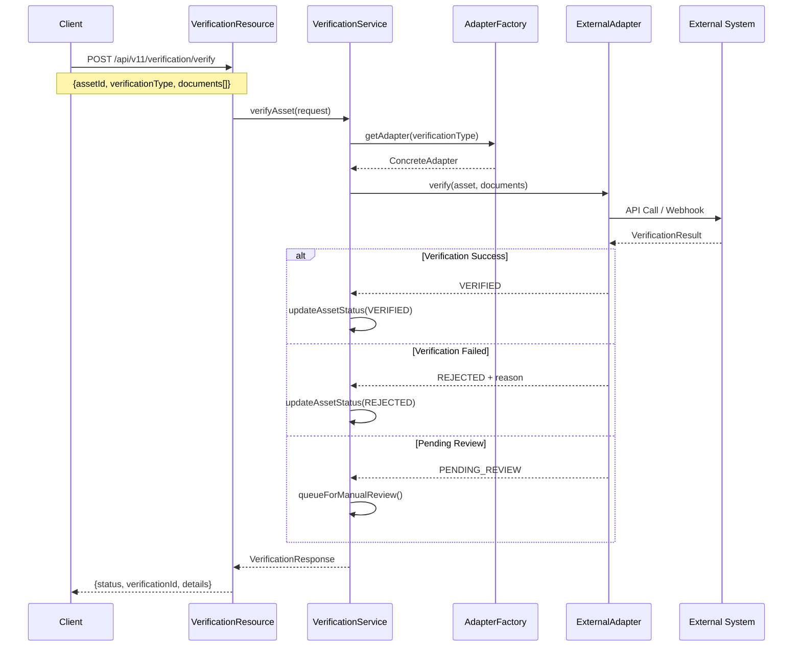

---

## 6. Database Schema (ER Diagram)

### 6.1 Entity Relationship Diagram

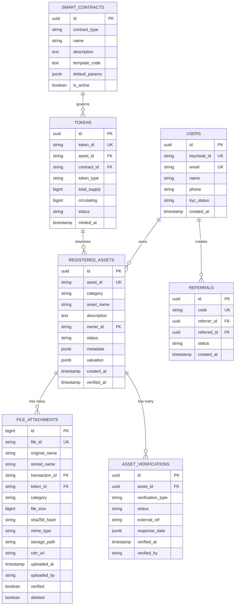

### 6.2 Key Tables Summary

| Table | Rows (Est.) | Description |
|-------|-------------|-------------|
| `registered_assets` | 10K+ | Asset registry with 12 categories |
| `file_attachments` | 50K+ | Files with SHA256 hashes + CDN URLs |
| `asset_verifications` | 10K+ | External verification records |
| `tokens` | 5K+ | Minted tokens linked to assets |
| `smart_contracts` | 100+ | Contract templates (7 types) |
| `users` | 1K+ | Platform users |
| `referrals` | 500+ | Referral tracking |

---

## 7. CI/CD Pipeline

### 7.1 Pipeline Flow

```mermaid
flowchart LR
    subgraph "Source"
        GIT[GitHub<br/>V12 Branch]
    end

    subgraph "CI Stage"
        BUILD[Maven Build<br/>JVM + Native]
        TEST[Unit Tests<br/>+ Integration]
        SCAN[Security Scan<br/>+ SonarQube]
    end

    subgraph "Artifact"
        JAR[JAR Artifact<br/>12.0.0-runner.jar]
        DOCKER[Docker Image<br/>ghcr.io/aurigraph]
    end

    subgraph "Deploy Stage"
        STAGING[Staging<br/>Deployment]
        SMOKE[Smoke Tests<br/>Health Checks]
        PROD[Production<br/>Blue-Green]
    end

    subgraph "Monitor"
        HEALTH[Health Checks<br/>/api/v11/health]
        METRICS[Prometheus<br/>Metrics]
        ALERTS[Alert Manager]
    end

    GIT --> BUILD
    BUILD --> TEST
    TEST --> SCAN
    SCAN --> JAR
    JAR --> DOCKER
    DOCKER --> STAGING
    STAGING --> SMOKE
    SMOKE --> PROD
    PROD --> HEALTH
    HEALTH --> METRICS
    METRICS --> ALERTS

    classDef ci fill:#e3f2fd,stroke:#1565c0
    classDef deploy fill:#e8f5e9,stroke:#2e7d32
    classDef monitor fill:#fff3e0,stroke:#e65100

    class BUILD,TEST,SCAN ci
    class STAGING,SMOKE,PROD deploy
    class HEALTH,METRICS,ALERTS monitor
```

### 7.2 Deployment Strategy

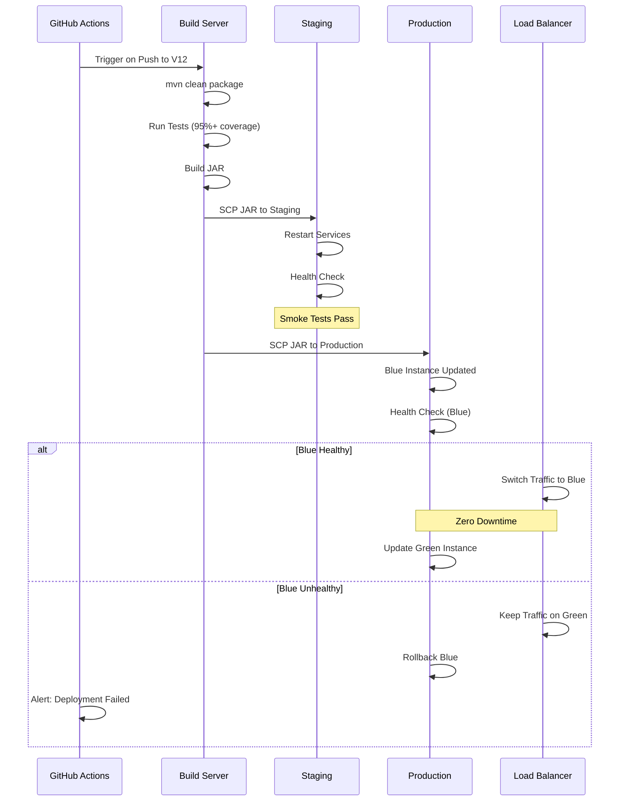

---

## 8. Infrastructure Deployment

### 8.1 Production Infrastructure

```mermaid
graph TB
    subgraph "DNS & CDN"
        DNS[dlt.aurigraph.io<br/>DNS]
    end

    subgraph "Load Balancer"
        NGINX[Nginx<br/>SSL Termination]
    end

    subgraph "Application Tier"
        QUARKUS1[Quarkus Node 1<br/>Port 9003]
        QUARKUS2[Quarkus Node 2<br/>Port 9003]
        QUARKUS3[Quarkus Node 3<br/>Port 9003]
    end

    subgraph "Container Cluster"
        BUS1[Business Node 1-5]
        BUS2[Business Node 6-10]
        BUS3[Business Node 11-20]
        VAL[Validator Nodes 1-3]
        SLIM[External Integration (EI) Nodes 1-5]
    end

    subgraph "Data Tier"
        PG[(PostgreSQL<br/>Master)]
        REDIS[(Redis<br/>Cache)]
        MINIO[MinIO<br/>Storage]
    end

    subgraph "External Services"
        IAM[Keycloak<br/>iam2.aurigraph.io]
    end

    DNS --> NGINX
    NGINX --> QUARKUS1
    NGINX --> QUARKUS2
    NGINX --> QUARKUS3

    QUARKUS1 --> BUS1
    QUARKUS2 --> BUS2
    QUARKUS3 --> BUS3

    BUS1 --> VAL
    BUS2 --> VAL
    BUS3 --> VAL

    QUARKUS1 --> PG
    QUARKUS2 --> PG
    QUARKUS3 --> PG

    QUARKUS1 --> REDIS
    QUARKUS1 --> MINIO
    QUARKUS1 --> IAM

    classDef app fill:#e3f2fd,stroke:#1565c0
    classDef data fill:#e8f5e9,stroke:#2e7d32
    classDef infra fill:#fff3e0,stroke:#e65100

    class QUARKUS1,QUARKUS2,QUARKUS3 app
    class PG,REDIS,MINIO data
    class BUS1,BUS2,BUS3,VAL,SLIM infra
```

### 8.2 Docker Container Layout

```
dlt.aurigraph.io Container Status:
├── aurigraph-business-[1-20]     # Business logic nodes
│   └── Port mapping: 19011-19030
├── aurigraph-validator-[1-3]     # Consensus validators
│   └── Port mapping: 19001-19003
├── aurigraph-ei-[1-5]          # Lightweight nodes
│   └── Port mapping: 19041-19045
├── minio                         # Object storage
│   └── Ports: 9000 (API), 9090 (Console)
├── postgres                      # Database
│   └── Port: 5432
└── redis                         # Cache
    └── Port: 6379
```

---

## 9. Security Architecture

### 9.1 Security Layers

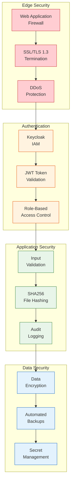

### 9.2 Authentication Flow

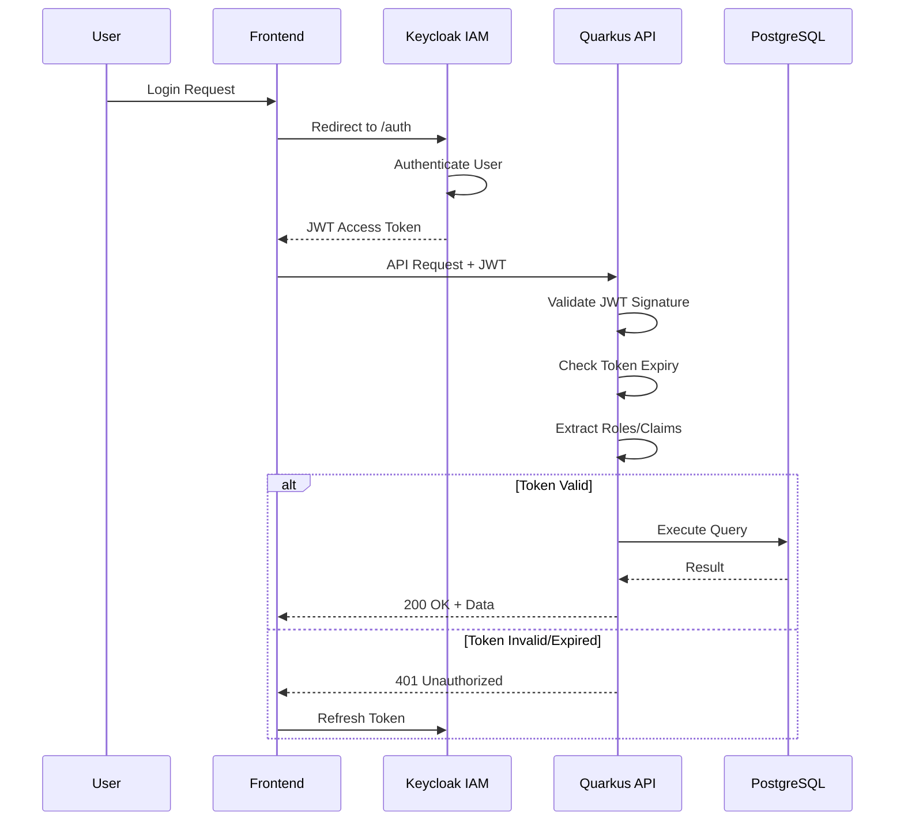

---

## Appendix A: API Endpoints Summary

### Core APIs

| Endpoint | Method | Description |
|----------|--------|-------------|
| `/api/v11/health` | GET | Health check |
| `/api/v11/info` | GET | Application info |
| `/api/v11/tokens` | GET/POST | Token management |
| `/api/v11/assets/register` | POST | Register asset |
| `/api/v11/assets/{id}` | GET/PUT | Asset CRUD |
| `/api/v11/attachments/upload` | POST | File upload |
| `/api/v11/attachments/{fileId}` | GET | File download |
| `/api/v11/verification/services` | GET | List verifiers |
| `/api/v11/verification/verify` | POST | Verify asset |
| `/api/v11/contracts/smart` | GET | List contracts |
| `/api/v11/referrals` | GET/POST | Referral management |

### CDN Endpoints

| Endpoint | Method | Description |
|----------|--------|-------------|
| `/cdn/attachments/{file}` | GET | Attachment CDN |
| `/cdn/documents/{file}` | GET | Document CDN |
| `/cdn/assets/{file}` | GET | Asset media CDN |

---

## Appendix B: Version History

| Version | Date | Changes |
|---------|------|---------|
| 12.0.0 | 2025-12-12 | Initial V12 architecture diagrams |
| - | - | Added MinIO CDN integration diagrams |
| - | - | Added File Attachments flow |
| - | - | Added Asset Registry diagrams |
| - | - | Added External Verification adapters |
| - | - | Added Database ER diagram |
| - | - | Added CI/CD pipeline flow |
| - | - | Added Security architecture |

---

**Document Status**: Production
**Next Review**: 2026-01-12
**Maintainer**: J4C Architecture Agent
