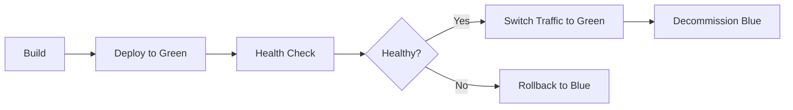

# Aurigraph V11 Production Deployment Runbook

**Version**: 1.0.0
**Last Updated**: October 20, 2025
**Owner**: DevOps & Deployment Agent (DDA)
**Status**: Production Ready

---

## Table of Contents

1. [Pre-Deployment Checklist](#pre-deployment-checklist)
2. [Deployment Strategies](#deployment-strategies)
3. [Step-by-Step Deployment](#step-by-step-deployment)
4. [Post-Deployment Validation](#post-deployment-validation)
5. [Rollback Procedures](#rollback-procedures)
6. [Disaster Recovery](#disaster-recovery)
7. [Monitoring & Alerts](#monitoring--alerts)
8. [Common Issues & Troubleshooting](#common-issues--troubleshooting)

---

## Pre-Deployment Checklist

### 1. Code Quality Gates

- [ ] All tests passing (897/897 tests)
  ```bash
  cd aurigraph-av10-7/aurigraph-v11-standalone
  ./mvnw test
  ```

- [ ] Coverage ≥95% (line), ≥90% (branch)
  ```bash
  ./mvnw jacoco:report
  open target/site/jacoco/index.html
  ```

- [ ] Security audit complete (no critical vulnerabilities)
  ```bash
  ./mvnw org.owasp:dependency-check-maven:check
  ```

- [ ] Performance validated (3M+ TPS)
  ```bash
  ./performance-benchmark.sh
  # Expected: TPS ≥ 2,560,000
  ```

### 2. Infrastructure Readiness

- [ ] Database migrations tested
  ```bash
  ./mvnw flyway:migrate -Dflyway.url=jdbc:postgresql://localhost:5432/aurigraph_v11_staging
  ```

- [ ] SSL certificates valid (>30 days)
  ```bash
  ssh -p 2235 subbu@dlt.aurigraph.io "sudo certbot certificates"
  ```

- [ ] Monitoring stack operational
  ```bash
  curl -f http://localhost:9090/-/healthy  # Prometheus
  curl -f http://localhost:3000/api/health # Grafana
  ```

- [ ] Backup verified (<24 hours old)
  ```bash
  ssh -p 2235 subbu@dlt.aurigraph.io "ls -lh /opt/aurigraph/backups/"
  ```

### 3. Team Readiness

- [ ] Deployment window scheduled (off-peak hours)
- [ ] On-call engineer available
- [ ] Stakeholders notified
- [ ] Rollback plan documented

---

## Deployment Strategies

### Blue-Green Deployment (Recommended)

**Pros**: Zero downtime, instant rollback
**Cons**: Requires 2x infrastructure
**Use Case**: Production releases



### Canary Deployment

**Pros**: Gradual rollout, risk mitigation
**Cons**: Complex traffic routing
**Use Case**: High-risk changes

**Traffic Distribution**:
- Phase 1: 10% → Green (5 minutes)
- Phase 2: 50% → Green (15 minutes)
- Phase 3: 100% → Green (production)

### Rolling Deployment

**Pros**: Resource efficient
**Cons**: Temporary version mismatch
**Use Case**: Kubernetes clusters

---

## Step-by-Step Deployment

### Phase 1: Build & Package (CI/CD Automated)

**Trigger**: Merge to `main` branch

```bash
# GitHub Actions automatically:
# 1. Runs all tests (897 tests)
# 2. Generates coverage report
# 3. Runs security scan
# 4. Builds native image
# 5. Creates Docker container
# 6. Pushes to ghcr.io
```

**Expected Duration**: 15-20 minutes
**Success Criteria**: All jobs green ✅

### Phase 2: Deploy to Staging (Automated)

```bash
# SSH to staging server
ssh -p 2235 staging-user@staging.aurigraph.io

# Pull latest image
docker pull ghcr.io/aurigraph-dlt-corp/aurigraph-dlt/aurigraph-v11:main

# Deploy with Docker Compose
cd /opt/aurigraph/staging
docker-compose -f docker-compose-deploy.yml up -d

# Health check
curl -f http://localhost:9004/q/health
curl -f http://localhost:9004/api/v11/health
```

**Expected Duration**: 5 minutes
**Success Criteria**: HTTP 200 on health endpoints

### Phase 3: Deploy to Production (Blue-Green)

#### Step 1: Backup Current State

```bash
# SSH to production
ssh -p 2235 subbu@dlt.aurigraph.io

# Create backup
TIMESTAMP=$(date +%Y%m%d_%H%M%S)
sudo cp -rL /opt/aurigraph/v11/blue /opt/aurigraph/backups/blue_$TIMESTAMP

# Backup database
pg_dump -U postgres aurigraph_v11 | gzip > /opt/aurigraph/backups/db_$TIMESTAMP.sql.gz

# Verify backup
ls -lh /opt/aurigraph/backups/
```

#### Step 2: Deploy to Green Slot

```bash
# Create release directory
RELEASE_DIR="/opt/aurigraph/v11/releases/$TIMESTAMP"
mkdir -p $RELEASE_DIR

# Download native executable (from GitHub Actions artifact)
# Or build locally:
cd /opt/aurigraph/source/aurigraph-av10-7/aurigraph-v11-standalone
./mvnw package -Pnative-fast -DskipTests
cp target/*-runner $RELEASE_DIR/aurigraph-v11

# Make executable
chmod +x $RELEASE_DIR/aurigraph-v11

# Symlink to green
ln -sfn $RELEASE_DIR /opt/aurigraph/v11/green
```

#### Step 3: Start Green Instance

```bash
# Start service
sudo systemctl start aurigraph-v11-green

# Wait for startup
sleep 10

# Check logs
sudo journalctl -u aurigraph-v11-green -n 50

# Health check
curl -f http://localhost:9004/q/health
curl -f http://localhost:9004/api/v11/info
```

**Expected Output**:
```json
{
  "status": "UP",
  "checks": [
    {"name": "Database", "status": "UP"},
    {"name": "Redis", "status": "UP"},
    {"name": "Consensus", "status": "UP"}
  ]
}
```

#### Step 4: Smoke Tests

```bash
# Test transaction submission
curl -X POST http://localhost:9004/api/v11/transactions \
  -H "Content-Type: application/json" \
  -d '{"from":"0x123","to":"0x456","amount":100,"data":"test"}'

# Test performance endpoint
curl http://localhost:9004/api/v11/performance

# Test consensus status
curl http://localhost:9004/api/v11/consensus/status
```

#### Step 5: Switch Traffic (NGINX)

```bash
# Update NGINX config to point to green
sudo cp /etc/nginx/sites-available/aurigraph-green /etc/nginx/sites-enabled/aurigraph

# Test config
sudo nginx -t

# Reload NGINX (zero downtime)
sudo systemctl reload nginx

# Verify production traffic
curl -f https://dlt.aurigraph.io/api/v11/health
```

#### Step 6: Monitor & Validate

```bash
# Watch logs (1 minute)
sudo journalctl -u aurigraph-v11-green -f

# Check Prometheus metrics
curl http://localhost:9090/api/v1/query?query=up{job="aurigraph-v11-backend"}

# Check Grafana dashboards
# Open: http://localhost:3000/d/aurigraph-v11-system
```

**Validation Criteria**:
- ✅ HTTP 200 on all endpoints
- ✅ No error logs in 1 minute
- ✅ TPS ≥ 2M
- ✅ Response time p95 < 100ms
- ✅ Error rate < 0.1%

#### Step 7: Decommission Blue

```bash
# Stop blue instance
sudo systemctl stop aurigraph-v11-blue

# Swap blue and green
mv /opt/aurigraph/v11/blue /opt/aurigraph/v11/blue_old
ln -sfn $RELEASE_DIR /opt/aurigraph/v11/blue
rm /opt/aurigraph/v11/green

# Update systemd service
sudo systemctl start aurigraph-v11-blue

# Clean up old releases (keep last 5)
cd /opt/aurigraph/v11/releases
ls -t | tail -n +6 | xargs rm -rf
```

---

## Post-Deployment Validation

### Automated Health Checks (5 minutes)

```bash
#!/bin/bash
# health-check.sh

ENDPOINT="https://dlt.aurigraph.io"
TIMEOUT=300  # 5 minutes
START_TIME=$(date +%s)

while true; do
  CURRENT_TIME=$(date +%s)
  ELAPSED=$((CURRENT_TIME - START_TIME))

  if [ $ELAPSED -gt $TIMEOUT ]; then
    echo "❌ Health check timeout after 5 minutes"
    exit 1
  fi

  # Check health endpoint
  HTTP_CODE=$(curl -s -o /dev/null -w "%{http_code}" $ENDPOINT/api/v11/health)

  if [ "$HTTP_CODE" = "200" ]; then
    echo "✅ Health check passed"
    break
  else
    echo "⏳ Waiting for health check... ($ELAPSED s)"
    sleep 5
  fi
done

# Validate performance
TPS=$(curl -s $ENDPOINT/api/v11/stats | jq '.tps')
if [ "$TPS" -ge 2000000 ]; then
  echo "✅ TPS validation passed: $TPS"
else
  echo "⚠️  TPS below target: $TPS (expected: ≥2M)"
fi
```

### Manual Validation Checklist

- [ ] Homepage loads (https://dlt.aurigraph.io)
- [ ] Enterprise Portal accessible (https://dlt.aurigraph.io)
- [ ] API responds (https://dlt.aurigraph.io/api/v11/health)
- [ ] Transaction submission works
- [ ] Metrics displayed correctly
- [ ] Grafana dashboards showing data
- [ ] No alerts firing (Prometheus)

---

## Rollback Procedures

### Immediate Rollback (< 2 minutes)

**Scenario**: Critical failure detected immediately after deployment

```bash
# SSH to production
ssh -p 2235 subbu@dlt.aurigraph.io

# Stop green instance
sudo systemctl stop aurigraph-v11-green

# Switch NGINX back to blue
sudo cp /etc/nginx/sites-available/aurigraph-blue /etc/nginx/sites-enabled/aurigraph
sudo nginx -t && sudo systemctl reload nginx

# Verify rollback
curl -f https://dlt.aurigraph.io/api/v11/health
```

**Expected Duration**: <2 minutes
**Downtime**: ~10 seconds (NGINX reload)

### Database Rollback

**Scenario**: Database migration caused issues

```bash
# Restore from backup
LATEST_BACKUP=$(ls -t /opt/aurigraph/backups/db_*.sql.gz | head -1)
gunzip -c $LATEST_BACKUP | psql -U postgres aurigraph_v11

# Restart application
sudo systemctl restart aurigraph-v11-blue
```

**Expected Duration**: 5-15 minutes (depends on database size)

---

## Disaster Recovery

### Complete System Failure

**RTO (Recovery Time Objective)**: 1 hour
**RPO (Recovery Point Objective)**: 1 hour

#### Step 1: Assess Damage

```bash
# Check system status
ssh -p 2235 subbu@dlt.aurigraph.io "uptime && df -h && free -h"

# Check services
sudo systemctl status aurigraph-v11-blue
sudo systemctl status nginx
sudo systemctl status postgresql
```

#### Step 2: Restore from Backup

```bash
# Find latest backup
ls -lht /opt/aurigraph/backups/ | head -5

# Restore application
LATEST_APP_BACKUP=$(ls -t /opt/aurigraph/backups/blue_* | head -1)
cp -r $LATEST_APP_BACKUP /opt/aurigraph/v11/blue

# Restore database
LATEST_DB_BACKUP=$(ls -t /opt/aurigraph/backups/db_*.sql.gz | head -1)
dropdb -U postgres aurigraph_v11
createdb -U postgres aurigraph_v11
gunzip -c $LATEST_DB_BACKUP | psql -U postgres aurigraph_v11
```

#### Step 3: Restart Services

```bash
# Start PostgreSQL
sudo systemctl start postgresql

# Start Redis
sudo systemctl start redis

# Start V11
sudo systemctl start aurigraph-v11-blue

# Start NGINX
sudo systemctl start nginx

# Health check
curl -f https://dlt.aurigraph.io/api/v11/health
```

#### Step 4: Validate & Monitor

```bash
# Watch logs
sudo journalctl -u aurigraph-v11-blue -f

# Check Grafana
open http://localhost:3000/d/aurigraph-v11-system

# Run smoke tests
./smoke-tests.sh
```

---

## Monitoring & Alerts

### Critical Alerts (Immediate Response)

| Alert | Threshold | Action |
|-------|-----------|--------|
| Service Down | 1 minute | Immediate rollback |
| TPS < 2M | 5 minutes | Investigate consensus/performance |
| Error Rate > 100/s | 5 minutes | Check logs, consider rollback |
| Consensus Failure | 1 minute | Emergency rollback |

### Grafana Dashboards

1. **System Health**: http://localhost:3000/d/aurigraph-v11-system
   - CPU, Memory, Disk, Network
   - JVM metrics, GC pauses

2. **Application Metrics**: http://localhost:3000/d/aurigraph-v11-application
   - TPS, Response time, Error rate
   - Request distribution

3. **Blockchain Metrics**: http://localhost:3000/d/aurigraph-v11-blockchain
   - Block height, Validators, Consensus
   - Transaction pool

4. **Security Metrics**: http://localhost:3000/d/aurigraph-v11-security
   - Auth failures, Anomaly detection
   - Crypto operations

5. **Business Metrics**: http://localhost:3000/d/aurigraph-v11-business
   - Transaction volume, Revenue
   - User activity

### Log Analysis (ELK Stack)

```bash
# Kibana dashboard
open http://localhost:5601

# Search for errors (last 15 minutes)
# Query: level:ERROR AND timestamp:[now-15m TO now]

# Search for slow transactions
# Query: duration:>1000 AND service:aurigraph-v11
```

---

## Common Issues & Troubleshooting

### Issue 1: Service Won't Start

**Symptoms**: `systemctl start aurigraph-v11-blue` fails

**Diagnosis**:
```bash
sudo journalctl -u aurigraph-v11-blue -n 100
```

**Common Causes**:
- Port 9003 already in use → `lsof -i :9003`
- Database connection failed → Check PostgreSQL status
- Permissions issue → `ls -l /opt/aurigraph/v11/blue`

**Resolution**:
```bash
# Kill process on port 9003
sudo kill -9 $(lsof -t -i:9003)

# Fix permissions
sudo chown -R aurigraph:aurigraph /opt/aurigraph/v11/blue

# Restart PostgreSQL
sudo systemctl restart postgresql
```

### Issue 2: Low TPS Performance

**Symptoms**: TPS < 2M

**Diagnosis**:
```bash
# Check CPU usage
top -n 1 | head -20

# Check memory
free -h

# Check consensus status
curl http://localhost:9003/api/v11/consensus/status
```

**Resolution**:
```bash
# Increase JVM heap
export QUARKUS_OPTS="-Xmx8g -Xms4g"
sudo systemctl restart aurigraph-v11-blue

# Check AI optimization
curl http://localhost:9003/api/v11/ai/stats

# Scale validators
# (Add more validator nodes)
```

### Issue 3: Database Connection Pool Exhausted

**Symptoms**: `HikariPool - Connection is not available`

**Diagnosis**:
```bash
# Check active connections
psql -U postgres -c "SELECT count(*) FROM pg_stat_activity WHERE datname='aurigraph_v11';"

# Check Prometheus
curl "http://localhost:9090/api/v1/query?query=hikaricp_connections_active"
```

**Resolution**:
```bash
# Increase connection pool size
# Edit: src/main/resources/application.properties
# quarkus.datasource.jdbc.max-size=100

# Kill idle connections
psql -U postgres -c "SELECT pg_terminate_backend(pid) FROM pg_stat_activity WHERE datname='aurigraph_v11' AND state='idle';"

# Restart application
sudo systemctl restart aurigraph-v11-blue
```

---

## Contact Information

**On-Call Engineer**: Available 24/7
**Email**: ops@aurigraph.io
**Slack**: #aurigraph-ops-alerts
**Phone**: +1-XXX-XXX-XXXX (emergency)

**Escalation Path**:
1. Level 1: On-call DevOps Engineer
2. Level 2: Senior Platform Architect
3. Level 3: CTO

---

## Appendix

### A. Service Ports

| Service | Port | Purpose |
|---------|------|---------|
| V11 Backend | 9003 | Main API |
| V11 gRPC | 9004 | gRPC services |
| NGINX | 80/443 | Reverse proxy |
| Prometheus | 9090 | Metrics |
| Grafana | 3000 | Dashboards |
| PostgreSQL | 5432 | Database |
| Redis | 6379 | Cache |
| Elasticsearch | 9200 | Logs |
| Kibana | 5601 | Log UI |

### B. File Locations

- Application: `/opt/aurigraph/v11/`
- Configuration: `/etc/aurigraph/v11/`
- Logs: `/var/log/aurigraph/`
- Backups: `/opt/aurigraph/backups/`
- NGINX: `/etc/nginx/sites-available/`
- Systemd: `/etc/systemd/system/aurigraph-v11*.service`

### C. Useful Commands

```bash
# Check service status
sudo systemctl status aurigraph-v11-blue

# View logs
sudo journalctl -u aurigraph-v11-blue -f

# Restart service
sudo systemctl restart aurigraph-v11-blue

# Check open ports
sudo netstat -tulpn | grep LISTEN

# Check disk usage
df -h

# Check memory
free -h

# Check process
ps aux | grep aurigraph
```

---

**Document History**:
- **v1.0.0** (Oct 20, 2025): Initial production runbook
- **Next Review**: Every 2 weeks or after major deployment

**Approved By**: DevOps & Deployment Agent (DDA)
**Signed Off**: Sprint 7 Infrastructure Team
