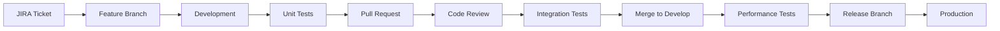

# Aurigraph V11 Project Structure & Organization

## 🏗️ Project Overview
**Aurigraph V11** - Enterprise-grade blockchain platform built with Java 21, Quarkus 3.26.2, and GraalVM for native compilation, achieving 2M+ TPS with sub-second startup times.

## 📁 Project Structure

```
aurigraph-v11/
├── 📋 PROJECT_STRUCTURE.md (this file)
├── 📋 README.md
├── 🔧 pom.xml (parent)
│
├── 🎯 core-modules/
│   ├── consensus-service/
│   │   ├── src/main/java/io/aurigraph/consensus/
│   │   │   ├── HyperRAFTConsensus.java
│   │   │   ├── ValidatorOrchestrator.java
│   │   │   └── QuantumShardManager.java
│   │   ├── src/test/java/
│   │   └── pom.xml
│   │
│   ├── crypto-service/
│   │   ├── src/main/java/io/aurigraph/crypto/
│   │   │   ├── QuantumCryptoService.java
│   │   │   ├── PostQuantumAlgorithms.java
│   │   │   └── NISTLevel5Compliance.java
│   │   └── pom.xml
│   │
│   ├── transaction-service/
│   │   ├── src/main/java/io/aurigraph/transaction/
│   │   │   ├── TransactionProcessor.java
│   │   │   ├── TransactionValidator.java
│   │   │   └── TransactionPool.java
│   │   └── pom.xml
│   │
│   └── network-service/
│       ├── src/main/java/io/aurigraph/network/
│       │   ├── P2PNetwork.java
│       │   ├── GRPCServer.java
│       │   └── HTTP2Handler.java
│       └── pom.xml
│
├── 🔗 integration-modules/
│   ├── crosschain-bridge/
│   │   ├── src/main/java/io/aurigraph/bridge/
│   │   │   ├── CrossChainBridgeService.java
│   │   │   ├── AtomicSwapManager.java
│   │   │   └── ChainAdapters.java
│   │   └── pom.xml
│   │
│   ├── ai-optimization/
│   │   ├── src/main/java/io/aurigraph/ai/
│   │   │   ├── AIOptimizationService.java
│   │   │   ├── PredictiveAnalytics.java
│   │   │   └── CollectiveIntelligence.java
│   │   └── pom.xml
│   │
│   └── rwa-tokenization/
│       ├── src/main/java/io/aurigraph/rwa/
│       │   ├── TokenizationService.java
│       │   ├── AssetRegistry.java
│       │   └── ComplianceEngine.java
│       └── pom.xml
│
├── 🌐 api-gateway/
│   ├── src/main/java/io/aurigraph/gateway/
│   │   ├── RestAPIResource.java
│   │   ├── GraphQLResource.java
│   │   ├── GRPCService.java
│   │   └── WebSocketHandler.java
│   ├── src/main/resources/
│   │   ├── application.properties
│   │   └── META-INF/resources/
│   └── pom.xml
│
├── 📊 monitoring-dashboard/
│   ├── src/main/java/io/aurigraph/monitoring/
│   │   ├── VizorDashboard.java
│   │   ├── MetricsCollector.java
│   │   └── PrometheusExporter.java
│   └── pom.xml
│
├── 🧪 testing/
│   ├── unit-tests/
│   ├── integration-tests/
│   ├── performance-tests/
│   ├── security-tests/
│   └── chaos-tests/
│
├── 🐳 deployment/
│   ├── docker/
│   │   ├── Dockerfile.native
│   │   ├── Dockerfile.jvm
│   │   └── docker-compose.yml
│   ├── kubernetes/
│   │   ├── deployment.yaml
│   │   ├── service.yaml
│   │   └── configmap.yaml
│   └── terraform/
│       ├── main.tf
│       ├── variables.tf
│       └── outputs.tf
│
├── 📚 docs/
│   ├── architecture/
│   ├── api-documentation/
│   ├── deployment-guide/
│   └── migration-guide/
│
├── 🔧 config/
│   ├── dev/
│   ├── staging/
│   └── production/
│
└── 📜 scripts/
    ├── build-native.sh
    ├── deploy.sh
    ├── test-all.sh
    └── performance-benchmark.sh
```

## 🎯 Module Descriptions

### Core Modules
- **consensus-service**: HyperRAFT++ consensus implementation
- **crypto-service**: Quantum-resistant cryptography (NIST Level 5)
- **transaction-service**: High-performance transaction processing
- **network-service**: P2P networking with gRPC/HTTP2

### Integration Modules
- **crosschain-bridge**: 50+ blockchain interoperability
- **ai-optimization**: Machine learning optimization
- **rwa-tokenization**: Real-world asset tokenization

### Infrastructure
- **api-gateway**: Unified API entry point
- **monitoring-dashboard**: Real-time Vizor monitoring
- **deployment**: Container and cloud deployment

## 📋 JIRA Epic Structure

### Epic AV11-1: Core Platform Migration
- **AV11-101**: Consensus Service Implementation
- **AV11-102**: Crypto Service Implementation
- **AV11-103**: Transaction Service Implementation
- **AV11-104**: Network Service Implementation

### Epic AV11-2: Integration Services
- **AV11-201**: Cross-Chain Bridge Migration
- **AV11-202**: AI Optimization Migration
- **AV11-203**: RWA Tokenization Migration

### Epic AV11-3: API & Infrastructure
- **AV11-301**: API Gateway Implementation
- **AV11-302**: Monitoring Dashboard Migration
- **AV11-303**: gRPC/HTTP2 Integration

### Epic AV11-4: Testing & Quality
- **AV11-401**: Unit Test Migration
- **AV11-402**: Performance Testing Suite
- **AV11-403**: Security Audit Implementation

### Epic AV11-5: Deployment & Operations
- **AV11-501**: Native Image Build Pipeline
- **AV11-502**: Kubernetes Deployment
- **AV11-503**: Production Rollout Strategy

## 🔄 GitHub Organization

### Branch Strategy
```
main (production)
├── develop (integration)
├── feature/AV11-101-consensus
├── feature/AV11-102-crypto
├── feature/AV11-201-bridge
└── release/v11.0.0
```

### GitHub Labels
- `epic:core` - Core platform components
- `epic:integration` - Integration services
- `epic:infrastructure` - Infrastructure & deployment
- `type:feature` - New functionality
- `type:bug` - Bug fixes
- `type:performance` - Performance improvements
- `priority:high` - Critical path items
- `status:in-progress` - Active development
- `status:review` - Code review needed

### Milestones
1. **M1: Foundation** - Core services setup (Week 1-2)
2. **M2: Migration** - TypeScript to Java migration (Week 3-6)
3. **M3: Integration** - Service integration (Week 7-8)
4. **M4: Testing** - Comprehensive testing (Week 9-10)
5. **M5: Deployment** - Production rollout (Week 11-12)

## 📊 Development Workflow



## 🚀 Quick Start Commands

```bash
# Build all modules
mvn clean package

# Run with JVM
java -jar api-gateway/target/quarkus-app/quarkus-run.jar

# Build native image
mvn package -Pnative

# Run native executable
./api-gateway/target/api-gateway-11.0.0-runner

# Run tests
mvn test

# Performance benchmark
./scripts/performance-benchmark.sh

# Deploy to Kubernetes
kubectl apply -f deployment/kubernetes/
```

## 📈 Progress Tracking

### Current Status
- ✅ Project structure defined
- ✅ Base Quarkus application running
- 🚧 Core modules in development
- 📋 Integration modules planned
- 📋 Testing framework setup pending

### Next Steps
1. Implement consensus service
2. Migrate crypto operations
3. Set up gRPC endpoints
4. Create performance tests
5. Configure native builds

## 🔗 Related Documentation
- [Migration Guide](docs/migration-guide/README.md)
- [API Documentation](docs/api-documentation/README.md)
- [Architecture Overview](docs/architecture/README.md)
- [Deployment Guide](docs/deployment-guide/README.md)

---

**Version**: 11.0.0  
**Last Updated**: 2025-09-09  
**Maintained By**: Aurigraph Development Team