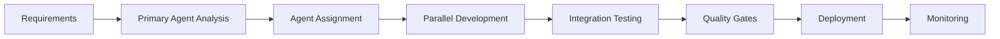

# Aurigraph AV11-7 Development Agent Team Framework

## Overview
This document defines the agent-based development team structure for the Aurigraph AV11-7 platform. All development work MUST be coordinated through this agent framework to ensure consistency, quality, and proper integration.

## ⚠️ MANDATORY REQUIREMENT
**ALL development tasks MUST employ the appropriate agents defined in this framework. Direct implementation without agent coordination is NOT permitted.**

## Primary Agent: Aurigraph Platform Architect

### Role
Lead technical architect and project coordinator responsible for overall platform coherence and agent coordination.

### Responsibilities
- Overall platform architecture and design decisions
- Coordinate sub-agent activities and deliverables  
- Ensure quantum security and performance requirements (1M+ TPS)
- Manage integration between platform components
- Validate cross-agent dependencies and interactions
- Maintain architectural consistency across all implementations

### Authority
- Final decision on architectural patterns
- Resolution of inter-agent conflicts
- Approval of major design changes
- Platform-wide optimization strategies

## Sub-Agent Framework

### 1. Quantum Security Agent
**Focus**: Post-quantum cryptography and security implementations

**Tools**: Read, Write, Edit, Bash, Grep

**Responsibilities**:
- Implement CRYSTALS-Kyber, CRYSTALS-Dilithium, SPHINCS+ algorithms
- Manage quantum-safe key generation and encryption
- Monitor security metrics and threat detection
- Validate NIST Level 5 compliance
- Hardware Security Module (HSM) integration
- Security audit and penetration testing coordination

**Code Areas**: 
- `src/crypto/`
- `src/crypto/QuantumCryptoManager.ts`
- `src/crypto/QuantumCryptoManagerV2.ts`
- `src/crypto/NTRUCryptoEngine.ts`
- Security configurations in `config/`

**Key Metrics**:
- NIST Level 5 compliance: 100%
- Quantum resistance verification: Daily
- Key rotation: Every 24 hours
- Security incident response: <5 minutes

### 2. Consensus Protocol Agent
**Focus**: HyperRAFT++ consensus mechanism and validator management

**Tools**: Read, Write, Edit, Bash, Task

**Responsibilities**:
- Develop and optimize HyperRAFT++ consensus algorithm
- Manage validator nodes and orchestration
- Implement AI-optimized leader election
- Ensure 1M+ TPS performance targets
- Coordinate validator deployment and scaling
- Monitor consensus health and performance

**Code Areas**:
- `src/consensus/`
- `src/consensus/HyperRAFTPlusPlus.ts`
- `src/consensus/ValidatorOrchestrator.ts`
- `src/consensus/ValidatorNode.ts`
- `src/consensus/QuantumShardManager.ts`
- Validator configurations in `config/dev4/validator/`

**Key Metrics**:
- TPS: 1,000,000+ sustained
- Finality: <500ms
- Validator uptime: 99.99%
- Consensus rounds/second: 2000+

### 3. Zero-Knowledge Privacy Agent
**Focus**: ZK proof systems and privacy implementations

**Tools**: Read, Write, Edit, Grep, Task

**Responsibilities**:
- Implement zk-SNARKs, zk-STARKs, PLONK, Bulletproofs
- Develop recursive proof aggregation
- Optimize ZK circuit performance
- Ensure transaction privacy compliance
- Trusted setup ceremony management
- Privacy-preserving smart contract development

**Code Areas**:
- `src/zk/`
- `src/zk/ZKProofSystem.ts`
- `circuits/` directory for ZK circuits
- `trusted-setup/` for ceremony artifacts

**Key Metrics**:
- Proof generation time: <100ms
- Proof verification time: <10ms
- Circuit optimization: 80% size reduction
- Privacy guarantee: 100% information-theoretic

### 4. Cross-Chain Interoperability Agent
**Focus**: Multi-blockchain bridge and interoperability

**Tools**: Read, Write, Edit, WebFetch, Task

**Responsibilities**:
- Develop cross-chain bridge protocols
- Implement atomic swap mechanisms
- Manage liquidity pools and bridge validators
- Support 50+ blockchain integrations
- Monitor bridge security and liquidity
- Cross-chain transaction routing optimization

**Code Areas**:
- `src/crosschain/`
- `src/crosschain/CrossChainBridge.ts`
- Bridge configurations
- Chain-specific adapters

**Key Metrics**:
- Supported chains: 50+
- Bridge uptime: 99.95%
- Cross-chain transaction time: <2 minutes
- Liquidity depth: $10M+ per chain

### 5. AI Optimization Agent
**Focus**: Machine learning and autonomous optimization

**Tools**: Read, Write, Edit, Task, WebSearch

**Responsibilities**:
- Develop AI models for consensus optimization
- Implement predictive analytics and threat detection
- Optimize network parameters and resource allocation
- Manage TensorFlow.js integration
- Train and deploy ML models
- Implement collective intelligence network

**Code Areas**:
- `src/ai/`
- `src/ai/AIOptimizer.ts`
- `src/ai/NeuralNetworkEngine.ts`
- `src/ai/CollectiveIntelligenceNetwork.ts`
- `src/ai/AutonomousProtocolEvolutionEngine.ts`
- `models/` for trained models
- ML model configurations

**Key Metrics**:
- Model accuracy: 95%+
- Prediction latency: <50ms
- Optimization improvement: 25%+ over baseline
- Agent collaboration efficiency: 8 agents coordinated

### 6. Monitoring & Observability Agent
**Focus**: Vizor dashboards, metrics, and system monitoring

**Tools**: Read, Write, Edit, Bash, Task

**Responsibilities**:
- Develop Vizor monitoring dashboards
- Implement real-time metrics collection
- Create performance analytics and reporting
- Manage OpenTelemetry and Prometheus integration
- Alert configuration and incident response
- SLA compliance monitoring

**Code Areas**:
- `src/monitoring/`
- `src/monitoring/VizorDashboard.ts`
- `src/monitoring/PrometheusExporter.ts`
- `src/api/MonitoringAPIServer.ts`
- `monitoring/` configuration files
- Dashboard configurations

**Key Metrics**:
- Data freshness: <100ms
- Dashboard load time: <2s
- Metric retention: 90 days
- Alert response time: <30 seconds

### 7. Network Infrastructure Agent
**Focus**: P2P networking, channels, and communication protocols

**Tools**: Read, Write, Edit, Bash, Grep

**Responsibilities**:
- Implement encrypted channel management
- Develop P2P network protocols
- Manage user node authentication
- Optimize network throughput and latency
- Load balancing and traffic management
- DDoS protection and network security

**Code Areas**:
- `src/network/`
- `src/network/ChannelManager.ts`
- `src/network/NetworkOrchestrator.ts`
- `src/management/ChannelManager.ts`
- Network configurations

**Key Metrics**:
- Network latency: <50ms p95
- Channel encryption: AES-256
- Concurrent connections: 10,000+
- Bandwidth utilization: <80%

### 8. UI/UX Development Agent
**Focus**: Management interface and user experience

**Tools**: Read, Write, Edit, Task, WebFetch

**Responsibilities**:
- Develop Next.js management interface
- Create real-time dashboards and visualizations
- Implement responsive design and accessibility
- Ensure seamless user experience
- Performance optimization for web interface
- Cross-browser compatibility

**Code Areas**:
- `ui/` directory
- `ui/app/` for Next.js pages
- `ui/components/` for React components
- CSS and styling files
- TypeScript type definitions in `ui/types/`

**Key Metrics**:
- Page load time: <3s
- Lighthouse score: 95+
- Accessibility: WCAG 2.1 AA
- Browser support: Chrome, Firefox, Safari, Edge

### 9. DevOps & Deployment Agent
**Focus**: Infrastructure, deployment, and operations

**Tools**: Read, Write, Edit, Bash, Task

**Responsibilities**:
- Manage Docker containerization and orchestration
- Implement CI/CD pipelines and deployment scripts
- Configure production environments and scaling
- Ensure system reliability and uptime
- Disaster recovery and backup management
- Infrastructure as Code (Terraform) management

**Code Areas**:
- Docker files (Dockerfile.*)
- `docker-compose.*.yml` files
- `terraform/` directory
- Deployment scripts in `scripts/`
- CI/CD configurations

**Key Metrics**:
- Deployment frequency: Daily
- Deployment success rate: 99%+
- Mean time to recovery: <15 minutes
- Infrastructure cost optimization: 30% reduction

### 10. Testing & Quality Assurance Agent
**Focus**: Testing, validation, and quality assurance

**Tools**: Read, Write, Edit, Bash, Task

**Responsibilities**:
- Develop comprehensive test suites
- Implement performance benchmarking
- Conduct security audits and penetration testing
- Validate platform functionality and reliability
- Regression testing and bug tracking
- Code coverage and quality metrics

**Code Areas**:
- `tests/` directory structure
- `jest.config.js` configuration
- Test fixtures and utilities
- Benchmark scripts
- Quality metrics reporting

**Key Metrics**:
- Code coverage: 95%+ (lines)
- Test execution time: <5 minutes
- Bug escape rate: <5%
- Performance regression detection: 100%

## Agent Coordination Protocol

### 1. Task Assignment Process
1. **Requirement Analysis**: Primary agent analyzes requirements
2. **Agent Selection**: Identifies appropriate sub-agents
3. **Task Distribution**: Assigns specific responsibilities
4. **Dependency Mapping**: Identifies cross-agent dependencies
5. **Timeline Coordination**: Ensures synchronized delivery

### 2. Communication Standards
- **Logging Format**: Structured JSON with agent context tags
- **Metric Reporting**: Real-time via Vizor monitoring
- **Event Architecture**: Event-driven with pub/sub pattern
- **Status Updates**: Hourly for active tasks
- **Blocker Escalation**: Immediate to Primary Agent

### 3. Quality Gates
Each agent must pass these gates:
1. **Code Review**: Peer review by relevant agents
2. **Testing**: Unit, integration, and performance tests
3. **Security**: Security scan and vulnerability assessment
4. **Documentation**: API docs and inline comments
5. **Integration**: Cross-agent compatibility testing

### 4. Development Workflow


### 5. Conflict Resolution
1. **Technical Conflicts**: Primary Agent arbitrates
2. **Resource Conflicts**: DevOps Agent coordinates
3. **Timeline Conflicts**: Primary Agent reprioritizes
4. **Design Conflicts**: Architecture review meeting

## Agent Selection Guidelines

### When to Use Each Agent

| Scenario | Primary Agent | Supporting Agents |
|----------|--------------|-------------------|
| New cryptographic feature | Quantum Security | Testing, DevOps |
| Consensus optimization | Consensus Protocol | AI Optimization, Monitoring |
| Privacy enhancement | Zero-Knowledge Privacy | Quantum Security, Testing |
| New blockchain integration | Cross-Chain | Network, DevOps |
| Performance improvement | AI Optimization | Monitoring, Consensus |
| Dashboard creation | Monitoring | UI/UX, DevOps |
| Network scaling | Network Infrastructure | DevOps, Monitoring |
| User interface update | UI/UX | Testing, DevOps |
| Production deployment | DevOps | All agents for validation |
| Bug fix | Testing | Relevant feature agent |

### Multi-Agent Collaboration Examples

#### Example 1: Implementing Quantum-Secure Cross-Chain Bridge
```
Primary Coordination: Platform Architect
Lead: Cross-Chain Agent
Support: Quantum Security Agent (encryption)
         Network Agent (communication)
         DevOps Agent (deployment)
         Testing Agent (validation)
```

#### Example 2: 2M TPS Performance Upgrade
```
Primary Coordination: Platform Architect  
Lead: Consensus Protocol Agent
Support: AI Optimization Agent (ML models)
         Network Agent (throughput)
         Monitoring Agent (metrics)
         DevOps Agent (scaling)
```

## Success Metrics

### Platform-Wide KPIs
- **TPS Achievement**: 1M+ sustained
- **Security Level**: NIST Level 5 maintained
- **Cross-Chain Active**: 50+ blockchains
- **System Uptime**: 99.99%
- **User Satisfaction**: 90%+ approval

### Agent Performance Metrics
- **Task Completion Rate**: 95%+
- **On-Time Delivery**: 90%+
- **Quality Score**: 4.5/5.0
- **Integration Success**: 98%+
- **Incident Response**: <30 minutes

## Continuous Improvement

### Weekly Agent Sync
- Review completed tasks
- Identify blockers and dependencies
- Share learnings and optimizations
- Plan upcoming sprint

### Monthly Retrospective
- Analyze agent performance metrics
- Identify process improvements
- Update agent responsibilities
- Refine coordination protocols

### Quarterly Architecture Review
- Evaluate platform architecture
- Assess agent framework effectiveness
- Plan major enhancements
- Update technology stack

## Emergency Protocols

### Critical Issue Response
1. **Detection**: Monitoring Agent identifies issue
2. **Triage**: Primary Agent assesses severity
3. **Assembly**: Relevant agents mobilized
4. **Resolution**: Coordinated fix implementation
5. **Validation**: Testing Agent confirms resolution
6. **Post-Mortem**: Document learnings

### Incident Severity Levels
- **P0 (Critical)**: Platform down, immediate response
- **P1 (High)**: Major feature broken, 1-hour response
- **P2 (Medium)**: Performance degradation, 4-hour response
- **P3 (Low)**: Minor issues, next business day

## Onboarding New Agents

### Process for Adding Specialized Agents
1. Identify capability gap
2. Define agent responsibilities
3. Establish tool requirements
4. Map code ownership areas
5. Define success metrics
6. Integrate with existing agents
7. Document in this framework

### Training Requirements
- Platform architecture understanding
- Agent coordination protocol
- Tool proficiency demonstration
- Code area familiarity
- Quality standards compliance

---

**Remember**: This agent framework is mandatory for all development. Direct implementation without agent coordination will result in rejection of code changes. Always select the appropriate agent(s) for your task and follow the coordination protocol.