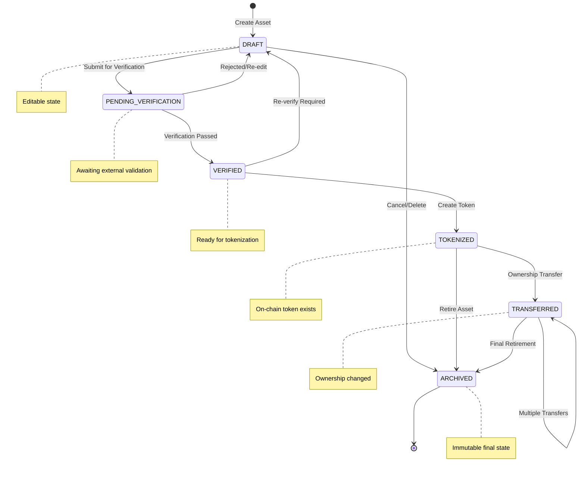
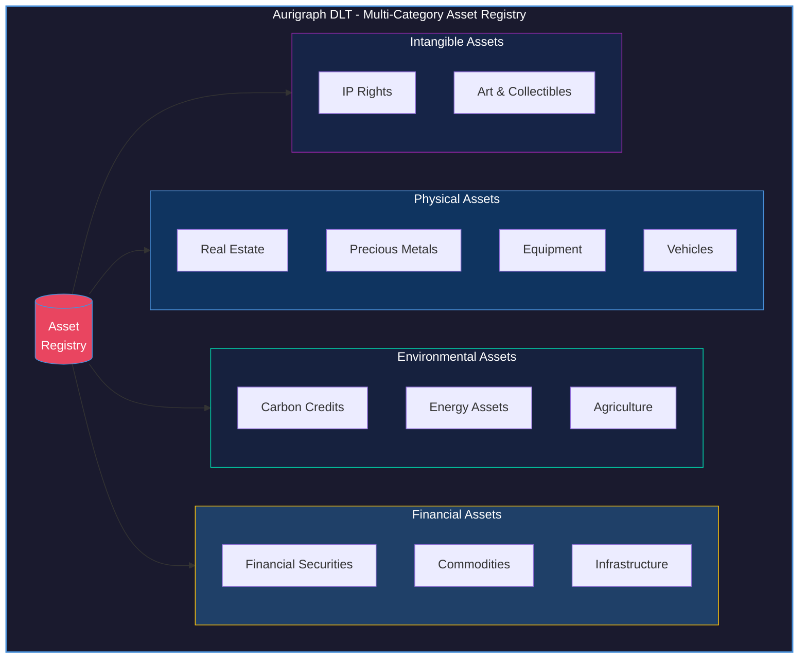
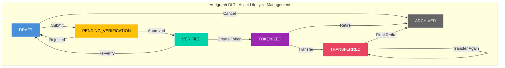
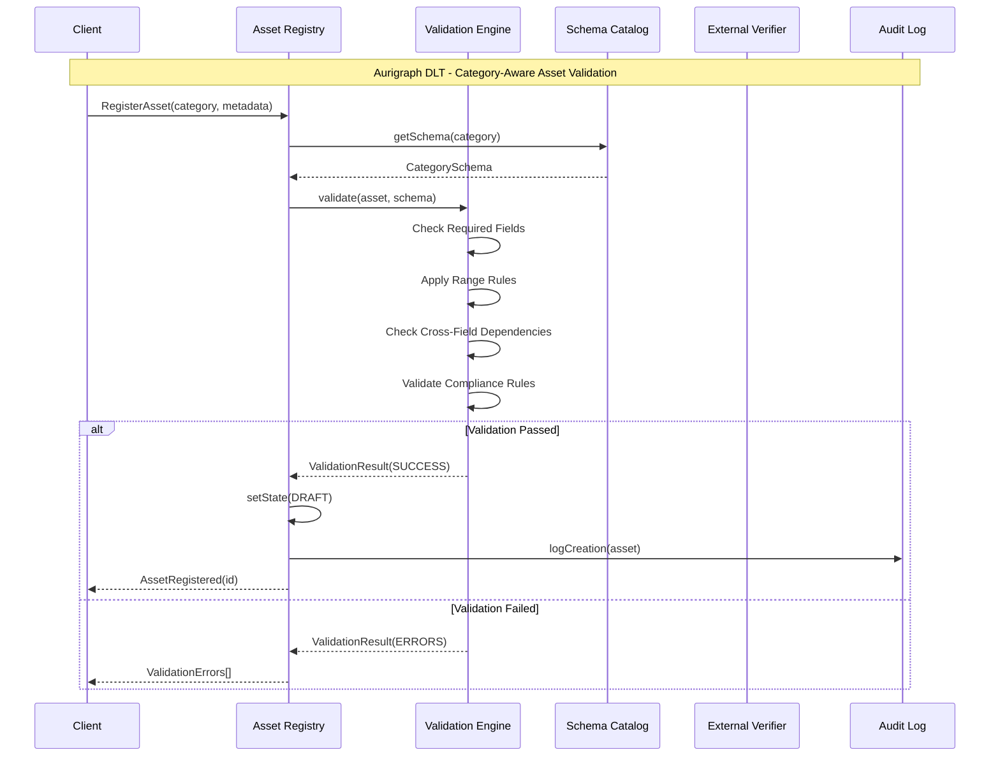

# PCT PATENT APPLICATION
# MULTI-CATEGORY ASSET REGISTRY WITH LIFECYCLE STATE MANAGEMENT

**Application Type**: Patent Cooperation Treaty (PCT) International Application
**Filing Date**: [To be determined]
**Priority Date**: December 12, 2025
**Applicant**: Aurigraph DLT Corporation
**Inventors**: [To be listed]
**Patent Family ID**: AURIGRAPH-PCT-005

---

## TITLE OF INVENTION

**MULTI-CATEGORY ASSET REGISTRY SYSTEM WITH DOMAIN-SPECIFIC VALIDATION RULES AND LIFECYCLE STATE MANAGEMENT FOR BLOCKCHAIN-BASED REAL-WORLD ASSET TOKENIZATION**

---

## PATENTABILITY ASSESSMENT

| Criterion | Score | Rating |
|-----------|-------|--------|
| Novelty | 4/5 | Good |
| Non-Obviousness | 3/5 | Moderate |
| Utility | 5/5 | Excellent |
| **Overall** | **12/15** | **Patentable** |

### Key Considerations
- **Novelty**: Category-specific validation is relatively novel
- **Non-Obviousness**: State machine pattern is well-known
- **Focus Claims On**: Domain-specific validation rules, category-aware workflows

---

## ABSTRACT

A multi-category asset registry system for blockchain-based tokenization platforms, comprising: (1) a registry supporting twelve distinct asset categories including real estate, carbon credits, intellectual property, and financial instruments; (2) domain-specific validation rules for each asset category defining required fields, acceptable value ranges, and compliance requirements; (3) a six-state lifecycle management system (DRAFT, PENDING_VERIFICATION, VERIFIED, TOKENIZED, TRANSFERRED, ARCHIVED) with category-aware state transitions; (4) immutable audit logging of all registry operations; and (5) integration with external verification adapters for category-appropriate validation. The system enables compliant registration and management of diverse real-world assets with appropriate validation for each asset type.

---

## TECHNICAL FIELD

The present invention relates to asset management systems, blockchain technology, and state machine implementations. More particularly, this invention relates to multi-category registry systems with domain-specific validation and lifecycle management for real-world asset tokenization.

---

## BACKGROUND OF THE INVENTION

### Prior Art Limitations

**1. Generic Token Registries**
Existing blockchain registries use generic data structures:
- ERC-20/ERC-721: No asset-type awareness
- Single metadata format for all assets
- No domain-specific validation
- No lifecycle state tracking

**2. Single-Purpose Registries**
Specialized platforms are limited to one asset type:
- RealT: Real estate only
- Toucan: Carbon credits only
- No unified multi-category system

**3. Manual Validation**
Current systems lack automated validation:
- No field-level validation rules
- No category-specific requirements
- Manual compliance checking
- Error-prone data entry

### Need for the Present Invention

There exists a need for an asset registry that:
- Supports multiple asset categories
- Applies domain-specific validation
- Tracks asset lifecycle states
- Provides immutable audit trails
- Integrates with verification services

---

## SUMMARY OF THE INVENTION

### Innovation 1: Twelve Asset Categories

Comprehensive coverage of tokenizable assets:
1. Real Estate
2. Carbon Credits
3. Intellectual Property
4. Financial Securities
5. Art & Collectibles
6. Commodities
7. Infrastructure
8. Energy Assets
9. Agricultural Assets
10. Precious Metals
11. Equipment & Machinery
12. Vehicles & Fleet

### Innovation 2: Domain-Specific Validation

Category-aware validation rules:
- Required fields per category
- Value range constraints
- Format validation
- Cross-field dependencies
- Compliance requirements

### Innovation 3: Lifecycle State Management

Six-state lifecycle with controlled transitions:

#### Figure 1: Aurigraph DLT - Asset Lifecycle State Machine



### Innovation 4: Audit Logging

Immutable record of all operations:
- State transitions
- Data modifications
- Verification events
- Access records

---

## DETAILED DESCRIPTION OF THE INVENTION

### 1. ASSET CATEGORIES

#### Figure 2: Aurigraph DLT - Twelve Asset Category Hierarchy



#### 1.1 Category Enumeration

```java
public enum AssetCategory {
    REAL_ESTATE("Real Estate", "Property and land assets"),
    CARBON_CREDITS("Carbon Credits", "Environmental offset certificates"),
    IP_RIGHTS("Intellectual Property", "Patents, trademarks, copyrights"),
    FINANCIAL("Financial Securities", "Stocks, bonds, derivatives"),
    ART_COLLECTIBLES("Art & Collectibles", "Fine art, collectibles, NFTs"),
    COMMODITIES("Commodities", "Physical goods and materials"),
    INFRASTRUCTURE("Infrastructure", "Physical infrastructure assets"),
    ENERGY("Energy Assets", "Power generation and storage"),
    AGRICULTURAL("Agriculture", "Farm land and produce"),
    PRECIOUS_METALS("Precious Metals", "Gold, silver, platinum"),
    EQUIPMENT("Equipment", "Machinery and equipment"),
    VEHICLES("Vehicles", "Cars, aircraft, vessels");

    private final String displayName;
    private final String description;
}
```

#### 1.2 Category-Specific Schemas

```java
public interface AssetSchema {
    List<FieldDefinition> getRequiredFields();
    List<FieldDefinition> getOptionalFields();
    List<ValidationRule> getValidationRules();
    List<VerificationType> getRequiredVerifications();
}

public class RealEstateSchema implements AssetSchema {
    @Override
    public List<FieldDefinition> getRequiredFields() {
        return Arrays.asList(
            new FieldDefinition("propertyId", FieldType.STRING, "Government property ID"),
            new FieldDefinition("address", FieldType.ADDRESS, "Physical address"),
            new FieldDefinition("propertyType", FieldType.ENUM, "Type of property",
                Arrays.asList("RESIDENTIAL", "COMMERCIAL", "INDUSTRIAL", "LAND")),
            new FieldDefinition("area", FieldType.DECIMAL, "Area in square meters"),
            new FieldDefinition("jurisdiction", FieldType.STRING, "Legal jurisdiction")
        );
    }

    @Override
    public List<ValidationRule> getValidationRules() {
        return Arrays.asList(
            new RangeRule("area", 0.01, 1_000_000_000),  // 0.01 sqm to 1B sqm
            new PatternRule("propertyId", "[A-Z]{2}[0-9]{6,12}"),
            new RequiredIfRule("buildingAge", "propertyType", "RESIDENTIAL", "COMMERCIAL")
        );
    }

    @Override
    public List<VerificationType> getRequiredVerifications() {
        return Arrays.asList(
            VerificationType.OWNERSHIP,
            VerificationType.EXISTENCE
        );
    }
}

public class CarbonCreditSchema implements AssetSchema {
    @Override
    public List<FieldDefinition> getRequiredFields() {
        return Arrays.asList(
            new FieldDefinition("creditId", FieldType.STRING, "Registry credit ID"),
            new FieldDefinition("standard", FieldType.ENUM, "Certification standard",
                Arrays.asList("VCS", "GOLD_STANDARD", "ACR", "CAR", "PLAN_VIVO")),
            new FieldDefinition("projectName", FieldType.STRING, "Project name"),
            new FieldDefinition("vintage", FieldType.INTEGER, "Credit vintage year"),
            new FieldDefinition("tonneCO2e", FieldType.DECIMAL, "Tonnes CO2 equivalent"),
            new FieldDefinition("projectType", FieldType.ENUM, "Project category",
                Arrays.asList("FORESTRY", "RENEWABLE", "METHANE", "EFFICIENCY"))
        );
    }

    @Override
    public List<ValidationRule> getValidationRules() {
        return Arrays.asList(
            new RangeRule("vintage", 2000, LocalDate.now().getYear()),
            new RangeRule("tonneCO2e", 0.001, 100_000_000),
            new NotRetiredRule("creditId")
        );
    }

    @Override
    public List<VerificationType> getRequiredVerifications() {
        return Arrays.asList(
            VerificationType.ENVIRONMENTAL,
            VerificationType.EXISTENCE
        );
    }
}
```

### 2. DOMAIN-SPECIFIC VALIDATION

#### 2.1 Validation Engine

```java
public class AssetValidationEngine {

    private final Map<AssetCategory, AssetSchema> schemas;

    public ValidationResult validate(RegisteredAsset asset) {
        AssetSchema schema = schemas.get(asset.getCategory());
        ValidationResult result = new ValidationResult();

        // Required field validation
        for (FieldDefinition field : schema.getRequiredFields()) {
            Object value = asset.getMetadata().get(field.getName());
            if (value == null || isBlank(value)) {
                result.addError(field.getName(), "Required field missing");
            } else if (!field.getType().isValid(value)) {
                result.addError(field.getName(), "Invalid type: expected " + field.getType());
            }
        }

        // Validation rule application
        for (ValidationRule rule : schema.getValidationRules()) {
            RuleResult ruleResult = rule.evaluate(asset.getMetadata());
            if (!ruleResult.isPassed()) {
                result.addError(rule.getField(), ruleResult.getMessage());
            }
        }

        // Cross-field validation
        result.addAll(validateCrossFields(asset, schema));

        return result;
    }

    private List<ValidationError> validateCrossFields(RegisteredAsset asset, AssetSchema schema) {
        List<ValidationError> errors = new ArrayList<>();

        // Category-specific cross-field rules
        switch (asset.getCategory()) {
            case REAL_ESTATE:
                validateRealEstateCrossFields(asset, errors);
                break;
            case CARBON_CREDITS:
                validateCarbonCrossFields(asset, errors);
                break;
            // ... other categories
        }

        return errors;
    }
}
```

#### 2.2 Validation Rules

```java
public interface ValidationRule {
    String getField();
    RuleResult evaluate(Map<String, Object> metadata);
}

public class RangeRule implements ValidationRule {
    private final String field;
    private final double min;
    private final double max;

    @Override
    public RuleResult evaluate(Map<String, Object> metadata) {
        Number value = (Number) metadata.get(field);
        if (value == null) return RuleResult.pass();

        double d = value.doubleValue();
        if (d < min || d > max) {
            return RuleResult.fail(
                String.format("%s must be between %.2f and %.2f", field, min, max));
        }
        return RuleResult.pass();
    }
}

public class RequiredIfRule implements ValidationRule {
    private final String field;
    private final String conditionField;
    private final Object... conditionValues;

    @Override
    public RuleResult evaluate(Map<String, Object> metadata) {
        Object conditionValue = metadata.get(conditionField);
        if (Arrays.asList(conditionValues).contains(conditionValue)) {
            Object value = metadata.get(field);
            if (value == null || isBlank(value)) {
                return RuleResult.fail(
                    String.format("%s is required when %s is %s",
                        field, conditionField, conditionValue));
            }
        }
        return RuleResult.pass();
    }
}
```

### 3. LIFECYCLE STATE MANAGEMENT

#### 3.1 State Machine

```java
public enum AssetLifecycleState {
    DRAFT,                  // Initial creation, editable
    PENDING_VERIFICATION,   // Submitted for verification
    VERIFIED,               // External verification complete
    TOKENIZED,              // Token created on blockchain
    TRANSFERRED,            // Ownership transferred
    ARCHIVED                // No longer active
}

public class AssetLifecycleStateMachine {

    private static final Map<AssetLifecycleState, Set<AssetLifecycleState>> VALID_TRANSITIONS =
        Map.of(
            DRAFT, Set.of(PENDING_VERIFICATION, ARCHIVED),
            PENDING_VERIFICATION, Set.of(VERIFIED, DRAFT),
            VERIFIED, Set.of(TOKENIZED, DRAFT),
            TOKENIZED, Set.of(TRANSFERRED, ARCHIVED),
            TRANSFERRED, Set.of(TRANSFERRED, ARCHIVED),
            ARCHIVED, Set.of()
        );

    public void transition(RegisteredAsset asset, AssetLifecycleState newState,
                           String reason, String userId) {
        AssetLifecycleState currentState = asset.getState();

        // Validate transition
        if (!VALID_TRANSITIONS.get(currentState).contains(newState)) {
            throw new InvalidStateTransitionException(currentState, newState);
        }

        // Category-specific transition validation
        validateCategoryTransition(asset, newState);

        // Execute transition
        asset.setState(newState);
        asset.setStateChangedAt(Instant.now());
        asset.setLastModifiedBy(userId);

        // Audit log
        auditLogger.logTransition(asset.getId(), currentState, newState, reason, userId);

        // Trigger state-specific actions
        onStateEnter(asset, newState);
    }

    private void onStateEnter(RegisteredAsset asset, AssetLifecycleState state) {
        switch (state) {
            case PENDING_VERIFICATION:
                // Trigger verification workflow
                verificationService.initiateVerification(asset);
                break;
            case TOKENIZED:
                // Emit tokenization event
                eventEmitter.emit(new AssetTokenizedEvent(asset));
                break;
            case ARCHIVED:
                // Clean up and archive
                archiveService.archive(asset);
                break;
        }
    }
}
```

#### 3.2 State Transition Diagram

#### Figure 3: Aurigraph DLT - Detailed State Transition Flow



#### Figure 4: Aurigraph DLT - Domain-Specific Validation Flow



### 4. AUDIT LOGGING

#### 4.1 Audit Record Structure

```java
public class AuditRecord {
    private final String recordId;
    private final String assetId;
    private final AuditEventType eventType;
    private final Instant timestamp;
    private final String userId;
    private final String ipAddress;
    private final Map<String, Object> previousValues;
    private final Map<String, Object> newValues;
    private final String reason;
    private final byte[] recordHash;           // SHA-256 for integrity

    public enum AuditEventType {
        ASSET_CREATED,
        ASSET_UPDATED,
        STATE_CHANGED,
        VERIFICATION_REQUESTED,
        VERIFICATION_COMPLETED,
        TOKEN_CREATED,
        OWNERSHIP_TRANSFERRED,
        ASSET_ARCHIVED,
        ACCESS_GRANTED,
        ACCESS_REVOKED
    }
}

public class ImmutableAuditLogger {

    private final AuditRecordStore store;
    private byte[] previousHash = new byte[32];  // Chain linking

    public void log(AuditRecord record) {
        // Compute hash including previous hash (blockchain-style linking)
        byte[] recordHash = computeChainedHash(record, previousHash);
        record.setRecordHash(recordHash);

        // Store immutably
        store.append(record);

        // Update chain
        previousHash = recordHash;
    }

    private byte[] computeChainedHash(AuditRecord record, byte[] previousHash) {
        MessageDigest sha256 = MessageDigest.getInstance("SHA-256");
        sha256.update(previousHash);
        sha256.update(record.getAssetId().getBytes());
        sha256.update(record.getEventType().name().getBytes());
        sha256.update(String.valueOf(record.getTimestamp().toEpochMilli()).getBytes());
        sha256.update(record.getUserId().getBytes());
        return sha256.digest();
    }

    public boolean verifyIntegrity() {
        List<AuditRecord> records = store.getAllRecords();
        byte[] expectedPrevious = new byte[32];

        for (AuditRecord record : records) {
            byte[] expectedHash = computeChainedHash(record, expectedPrevious);
            if (!Arrays.equals(expectedHash, record.getRecordHash())) {
                return false;  // Integrity violation
            }
            expectedPrevious = record.getRecordHash();
        }
        return true;
    }
}
```

---

## CLAIMS

### Independent Claims

**Claim 1.** A computer-implemented method for managing real-world assets in a blockchain-based tokenization platform, comprising:
a) defining a plurality of asset categories, each category having associated domain-specific validation rules;
b) receiving asset registration requests specifying an asset category and asset metadata;
c) validating said metadata against the domain-specific rules for the specified category;
d) managing asset lifecycle through a six-state state machine with controlled transitions;
e) logging all state transitions and data modifications in an immutable audit log; and
f) integrating with external verification adapters appropriate for each asset category.

**Claim 2.** A multi-category asset registry system for distributed ledger platforms, comprising:
a) a category definition module supporting at least twelve distinct asset categories;
b) a validation engine configured to apply domain-specific validation rules per category;
c) a lifecycle state machine managing assets through DRAFT, PENDING_VERIFICATION, VERIFIED, TOKENIZED, TRANSFERRED, and ARCHIVED states;
d) an immutable audit logging system recording all registry operations; and
e) an integration layer connecting to category-appropriate verification adapters.

**Claim 3.** A non-transitory computer-readable medium storing instructions that, when executed by a processor, cause the processor to:
a) receive asset data including category identification and metadata fields;
b) retrieve validation schema for the identified category;
c) validate metadata fields against required fields, value ranges, and cross-field dependencies;
d) manage asset state transitions according to lifecycle rules;
e) create chained audit records for all operations; and
f) trigger appropriate verification workflows based on category requirements.

### Dependent Claims

**Claim 4.** The method of claim 1, wherein asset categories include at least real estate, carbon credits, intellectual property, and financial securities.

**Claim 5.** The method of claim 1, wherein domain-specific validation rules include required field checks, value range validation, and conditional field requirements.

**Claim 6.** The method of claim 1, wherein lifecycle states include DRAFT allowing editing, PENDING_VERIFICATION awaiting external validation, and TOKENIZED indicating blockchain token creation.

**Claim 7.** The system of claim 2, wherein the validation engine supports range rules, pattern rules, and conditional requirement rules.

**Claim 8.** The system of claim 2, wherein the audit logging creates hash-chained records enabling integrity verification.

**Claim 9.** The system of claim 2, wherein state transitions trigger category-specific workflows including verification initiation and token creation.

**Claim 10.** The computer-readable medium of claim 3, wherein the twelve asset categories are real estate, carbon credits, intellectual property, financial securities, art, commodities, infrastructure, energy, agriculture, precious metals, equipment, and vehicles.

---

## ABSTRACT OF THE DISCLOSURE

A multi-category asset registry system enabling blockchain-based tokenization of diverse real-world assets with domain-specific validation and lifecycle management. The system supports twelve asset categories including real estate, carbon credits, and financial securities, each with tailored validation rules covering required fields, value ranges, and compliance requirements. Assets progress through a six-state lifecycle (DRAFT, PENDING_VERIFICATION, VERIFIED, TOKENIZED, TRANSFERRED, ARCHIVED) with controlled transitions and automatic workflow triggers. An immutable audit log with hash-chained records provides complete operational transparency and integrity verification.

---

## PRIOR ART REFERENCES

1. ERC-721: Non-Fungible Token Standard (2018)
2. ERC-1155: Multi Token Standard (2019)
3. State Machine Pattern: Gamma et al., "Design Patterns", 1994
4. Asset tokenization platforms: RealT, Harbor, Securitize

---

## DOCUMENT INFORMATION

**Document Type**: PCT Patent Application (Individual Innovation)
**Innovation Area**: Asset Registry System
**Patentability Rating**: Patentable (12/15)
**Focus Claims On**: Domain-specific validation rules
**Estimated Filing Cost**: $8,000-$15,000 (USPTO + PCT)
**Estimated Grant Timeline**: 24-42 months

---

**Generated**: December 12, 2025
**Applicant Reference**: AURIGRAPH-PCT-005-REGISTRY
