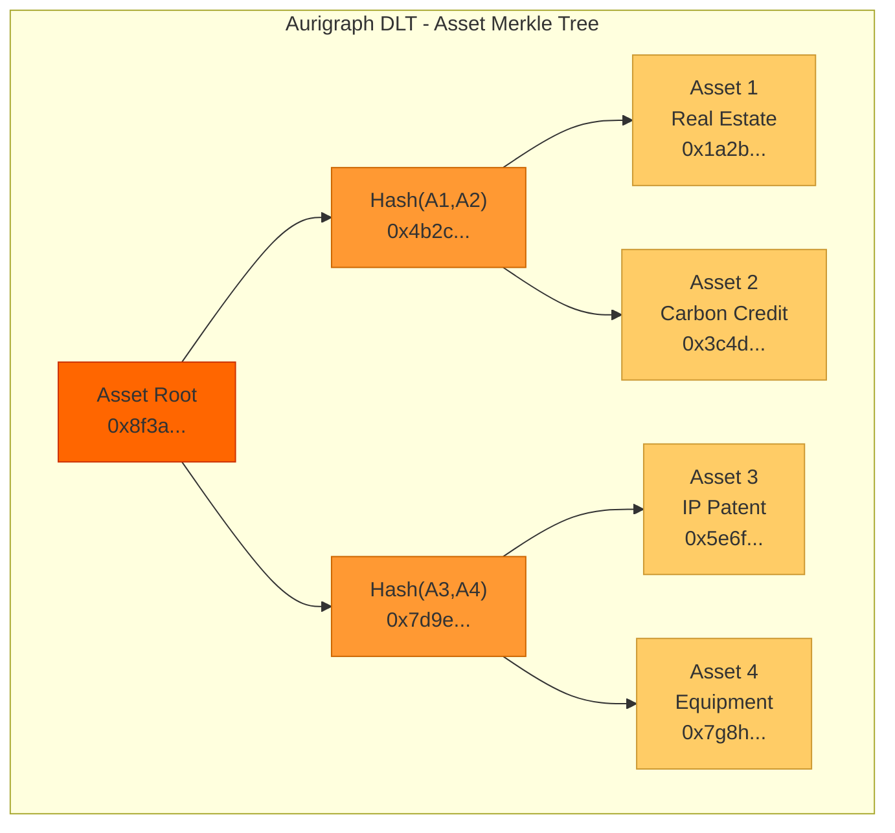
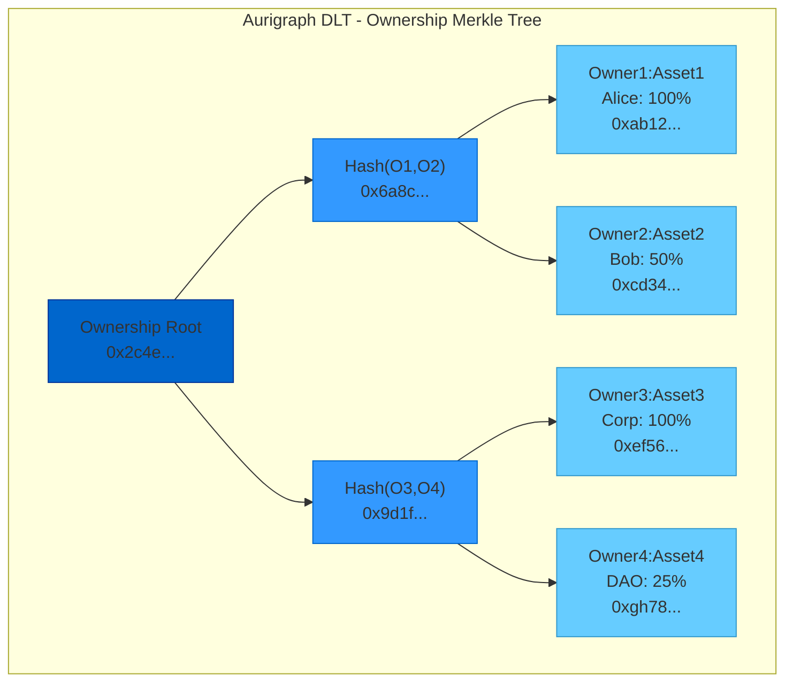
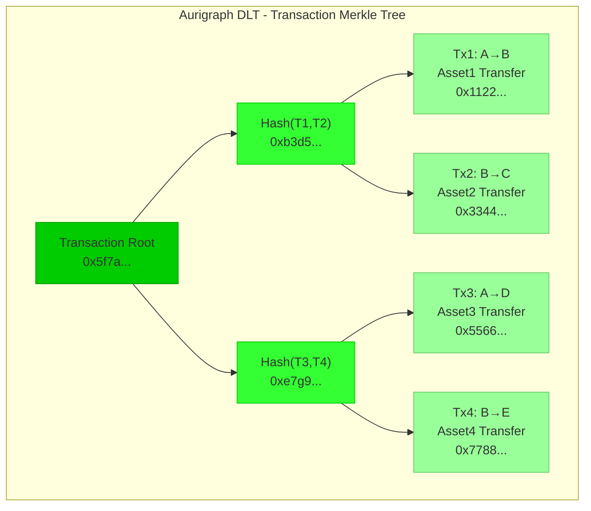
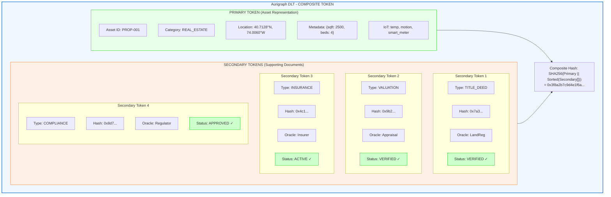
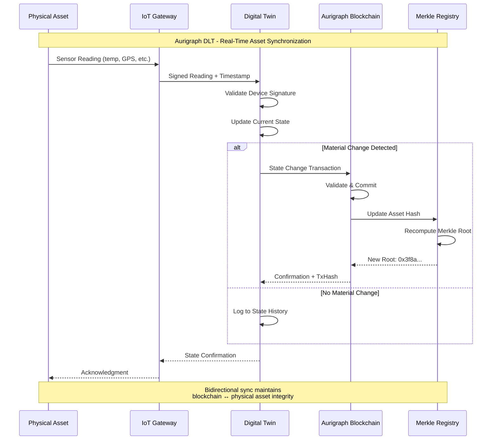
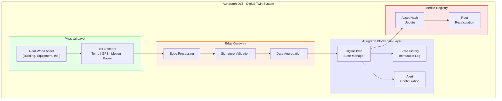

# PCT PATENT APPLICATION
# HIERARCHICAL COMPOSITE TOKEN FRAMEWORK FOR REAL-WORLD ASSET TOKENIZATION

**Application Type**: Patent Cooperation Treaty (PCT) International Application
**Filing Date**: [To be determined]
**Priority Date**: December 12, 2025
**Applicant**: Aurigraph DLT Corporation
**Inventors**: [To be listed]
**Patent Family ID**: AURIGRAPH-PCT-002

---

## TITLE OF INVENTION

**HIERARCHICAL COMPOSITE TOKEN FRAMEWORK WITH FIVE-LAYER ARCHITECTURE, TRIPLE MERKLE REGISTRY, AND ORACLE-ATTESTED VERIFICATION FOR CRYPTOGRAPHIC BINDING OF REAL-WORLD ASSETS TO BLOCKCHAIN TOKENS**

---

## PATENTABILITY ASSESSMENT

| Criterion | Score | Rating |
|-----------|-------|--------|
| Novelty | 5/5 | Excellent |
| Non-Obviousness | 5/5 | Excellent |
| Utility | 5/5 | Excellent |
| **Overall** | **15/15** | **Highly Patentable** |

### Key Differentiation from Prior Art
- **Novel 5-layer hierarchical architecture** (vs. flat token structures)
- **Triple Merkle registry system** (asset tree, ownership tree, transaction tree)
- **Teaching away evidence**: ERC-3643 explicitly avoids bundled composite approach

---

## ABSTRACT

A hierarchical composite token framework for blockchain-based tokenization of real-world assets, comprising: (1) a five-layer token architecture with execution, composite, evidence, asset, and verification layers; (2) a triple Merkle registry system maintaining cryptographic proof trees for assets, ownership, and transactions; (3) oracle-attested verification enabling external authorities to validate physical assets with quantum-resistant signatures; (4) primary tokens representing asset metadata without ownership information; (5) secondary tokens tracking ownership without asset details; (6) composite tokens bundling primary, secondary, and supporting documents with deterministic hash binding; and (7) IoT-connected digital twins enabling real-time asset state synchronization. The framework enables compliant tokenization of real estate, carbon credits, intellectual property, and other physical assets with cryptographic proof chains linking blockchain tokens to verified real-world assets.

---

## TECHNICAL FIELD

The present invention relates to digital asset tokenization, blockchain technology, and cryptographic proof systems. More particularly, this invention relates to hierarchical token frameworks for representing real-world assets on distributed ledgers with cryptographic binding, Merkle-based verification, and oracle attestation.

---

## BACKGROUND OF THE INVENTION

### Prior Art Limitations

**1. Flat Token Standards (ERC-20, ERC-721)**
Existing token standards provide basic fungible (ERC-20) and non-fungible (ERC-721) token capabilities but lack:
- Hierarchical structure for complex assets
- Separation of asset and ownership data
- Cryptographic proof chains to physical assets
- Support for multiple evidence documents

**2. Security Token Standards (ERC-1400, ERC-3643)**
Security token standards add compliance features but:
- Use flat data structures unsuitable for complex assets
- Lack cryptographic binding to physical assets
- Do not support composite asset bundles
- ERC-3643 explicitly teaches away from composite bundling

**3. Real Estate Tokenization Platforms**
- **RealT**: Uses simple ERC-20 tokens without asset binding
- **Securitize**: Single-layer tokens without Merkle proofs
- **Harbor**: Basic compliance tokens without hierarchical structure

**4. Carbon Credit Systems**
- **Toucan Protocol**: Bridge existing credits without verification
- **KlimaDAO**: Retirement tracking without asset binding

### Need for the Present Invention

There exists a need for a comprehensive token framework that:
- Represents complex real-world assets with hierarchical structure
- Separates concerns between asset metadata and ownership
- Provides cryptographic proof chains to physical assets
- Supports multiple verification authorities
- Enables real-time asset state tracking through IoT

---

## SUMMARY OF THE INVENTION

The present invention provides a Hierarchical Composite Token Framework with the following innovations:

### Innovation 1: Five-Layer Token Architecture

```mermaid
flowchart TB
    subgraph FiveLayer["Aurigraph DLT - Five-Layer Token Architecture"]
        subgraph L1["Layer 1: EXECUTION LAYER"]
            AC["ActiveContract<br/>(Ricardian Smart Contract)"]
            SM["State Machine Logic"]
            LT["Legal Terms + Code Binding"]
        end

        subgraph L2["Layer 2: COMPOSITE TOKEN LAYER"]
            CT["Composite Token Bundle"]
            DH["Deterministic SHA-256 Hash"]
        end

        subgraph L3["Layer 3: EVIDENCE LAYER"]
            PT["Primary Token<br/>(Asset Representation)"]
            ST["Secondary Tokens<br/>(Supporting Documents)"]
        end

        subgraph L4["Layer 4: ASSET LAYER"]
            RWA["Real-World Asset Metadata"]
            IOT["IoT Sensor Integration"]
            DT["Digital Twin State"]
        end

        subgraph L5["Layer 5: VERIFICATION LAYER"]
            MP["Merkle Proofs<br/>(Triple Registry)"]
            OS["Oracle Signatures<br/>(Quantum-Resistant)"]
        end

        L1 --> L2 --> L3 --> L4 --> L5
    end

    style L1 fill:#ffe6e6,stroke:#cc0000
    style L2 fill:#fff0e6,stroke:#ff6600
    style L3 fill:#ffffcc,stroke:#cccc00
    style L4 fill:#e6ffe6,stroke:#00cc00
    style L5 fill:#e6e6ff,stroke:#0000cc
```



### Innovation 2: Triple Merkle Registry System

Three independent Merkle trees maintaining cryptographic proof:
1. **Asset Merkle Tree**: All registered assets with metadata hashes
2. **Ownership Merkle Tree**: Current ownership state per asset
3. **Transaction Merkle Tree**: All transfers and state changes

### Innovation 3: Oracle-Attested Verification

External verification authorities attest to physical assets:
- Land registries for real estate
- KYC providers for ownership identity
- VVB (Verification/Validation Bodies) for carbon credits
- Government authorities for regulated assets

### Innovation 4: Primary/Secondary Token Separation

- **Primary Token**: Asset representation without ownership details
- **Secondary Token**: Ownership tracking without asset details
- **Composite Token**: Combined bundle with proof chain

### Innovation 5: IoT-Connected Digital Twins

Real-time asset state through:
- Environmental sensors (temperature, humidity, location)
- GPS tracking for movable assets
- Condition monitoring for equipment
- Utilization metrics for infrastructure

---

## DETAILED DESCRIPTION OF THE INVENTION

### 1. FIVE-LAYER ARCHITECTURE

#### 1.1 Execution Layer (Layer 1)

The execution layer contains the ActiveContract (Ricardian Smart Contract):

```java
public class ActiveContract {
    private final String contractId;
    private final ContractState state;
    private final ContractTerms legalTerms;      // Human-readable
    private final ExecutableLogic codeLogic;     // Machine-executable
    private final byte[] bindingHash;            // SHA-256 binding

    public enum ContractState {
        DRAFT,
        ACTIVE,
        EXECUTED,
        TERMINATED,
        DISPUTED
    }

    // Ricardian binding: legal + code
    public byte[] computeBindingHash() {
        MessageDigest sha256 = MessageDigest.getInstance("SHA-256");
        sha256.update(legalTerms.getHash());
        sha256.update(codeLogic.getHash());
        return sha256.digest();
    }
}
```

#### 1.2 Composite Token Layer (Layer 2)

The composite token bundles all components:

```java
public class CompositeToken {
    private final String compositeId;
    private final PrimaryToken primaryToken;
    private final List<SecondaryToken> secondaryTokens;
    private final List<SupportingDocument> documents;
    private final byte[] compositeHash;          // Deterministic hash

    public byte[] computeCompositeHash() {
        // Deterministic ordering for reproducible hash
        ByteArrayOutputStream baos = new ByteArrayOutputStream();
        baos.write(primaryToken.getHash());
        secondaryTokens.stream()
            .sorted(Comparator.comparing(SecondaryToken::getId))
            .forEach(st -> baos.write(st.getHash()));
        documents.stream()
            .sorted(Comparator.comparing(SupportingDocument::getId))
            .forEach(doc -> baos.write(doc.getHash()));

        return SHA256.hash(baos.toByteArray());
    }
}
```

#### 1.3 Evidence Layer (Layer 3)

Primary and secondary tokens in the evidence layer:

```java
public class PrimaryToken {
    private final String tokenId;
    private final AssetCategory category;
    private final AssetMetadata metadata;
    private final GeoLocation location;
    private final List<IoTSensor> sensors;
    private final byte[] assetHash;

    // NO ownership information in primary token
}

public class SecondaryToken {
    private final String tokenId;
    private final DocumentType type;
    private final String documentHash;
    private final VerificationStatus status;
    private final List<OracleAttestation> attestations;

    public enum DocumentType {
        TITLE_DEED,
        VALUATION_REPORT,
        INSURANCE_POLICY,
        COMPLIANCE_CERTIFICATE,
        ENVIRONMENTAL_REPORT
    }
}
```

#### 1.4 Asset Layer (Layer 4)

Real-world asset representation:

```java
public class RealWorldAsset {
    private final String assetId;
    private final AssetCategory category;
    private final PhysicalAttributes attributes;
    private final Valuation currentValuation;
    private final MaintenanceRecord maintenance;
    private final List<IoTReading> sensorData;

    public enum AssetCategory {
        REAL_ESTATE,
        CARBON_CREDITS,
        INTELLECTUAL_PROPERTY,
        FINANCIAL_SECURITIES,
        ART_COLLECTIBLES,
        COMMODITIES,
        INFRASTRUCTURE,
        ENERGY_ASSETS,
        AGRICULTURAL,
        PRECIOUS_METALS,
        EQUIPMENT,
        VEHICLES
    }
}
```

#### 1.5 Verification Layer (Layer 5)

Merkle proofs and oracle signatures:

```java
public class VerificationLayer {
    private final MerkleProof assetProof;
    private final MerkleProof ownershipProof;
    private final MerkleProof transactionProof;
    private final List<OracleSignature> attestations;

    public boolean verifyAssetInclusion(byte[] assetHash) {
        return assetProof.verify(assetHash, assetMerkleRoot);
    }

    public boolean verifyOwnership(String owner, String assetId) {
        byte[] ownershipHash = computeOwnershipHash(owner, assetId);
        return ownershipProof.verify(ownershipHash, ownershipMerkleRoot);
    }
}
```

### 2. TRIPLE MERKLE REGISTRY SYSTEM

#### 2.1 Asset Merkle Tree



Each leaf contains: `SHA256(assetId || category || metadataHash || locationHash)`

#### 2.2 Ownership Merkle Tree



Each leaf contains: `SHA256(ownerId || assetId || sharePercentage || timestamp)`

#### 2.3 Transaction Merkle Tree



Each leaf contains: `SHA256(txId || fromOwner || toOwner || assetId || amount || timestamp)`

#### 2.4 Registry Implementation

```java
public class TripleMerkleRegistry {
    private final MerkleTree assetTree;
    private final MerkleTree ownershipTree;
    private final MerkleTree transactionTree;

    public RegistryProof generateProof(String assetId) {
        return new RegistryProof(
            assetTree.generateProof(assetId),
            ownershipTree.generateProof(assetId),
            transactionTree.generateProofForAsset(assetId)
        );
    }

    public boolean verifyCompleteProvenance(String assetId) {
        // Verify asset exists
        if (!assetTree.contains(assetId)) return false;

        // Verify ownership chain is valid
        List<OwnershipRecord> chain = ownershipTree.getChain(assetId);
        if (!validateOwnershipChain(chain)) return false;

        // Verify transaction history matches ownership
        List<Transaction> txHistory = transactionTree.getHistory(assetId);
        return validateTransactionConsistency(chain, txHistory);
    }
}
```

### 3. ORACLE-ATTESTED VERIFICATION

#### 3.1 Oracle Types

```java
public interface VerificationOracle {
    OracleAttestation attest(Asset asset, VerificationRequest request);
    boolean verifyAttestation(OracleAttestation attestation);
}

public class LandRegistryOracle implements VerificationOracle {
    // Connects to government land registry systems
    // Verifies property ownership, boundaries, encumbrances
}

public class KYCOracle implements VerificationOracle {
    // Connects to identity verification providers
    // Verifies owner identity, AML/KYC compliance
}

public class VVBOracle implements VerificationOracle {
    // Connects to Verification/Validation Bodies
    // Verifies carbon credit validity, additionality
}
```

#### 3.2 Oracle Attestation Structure

```java
public class OracleAttestation {
    private final String oracleId;
    private final String assetId;
    private final VerificationType type;
    private final VerificationResult result;
    private final long timestamp;
    private final byte[] signature;           // Quantum-resistant (Dilithium)

    public enum VerificationType {
        OWNERSHIP,
        EXISTENCE,
        VALUATION,
        COMPLIANCE,
        ENVIRONMENTAL
    }

    public byte[] sign(DilithiumPrivateKey privateKey) {
        byte[] data = serializeForSigning();
        return DilithiumSigner.sign(data, privateKey);
    }
}
```

### 4. PRIMARY/SECONDARY TOKEN SEPARATION

#### 4.1 Rationale for Separation

The separation of primary (asset) and secondary (ownership/documents) tokens provides:

1. **Privacy**: Asset details visible without revealing ownership
2. **Compliance**: Ownership transfers without asset re-registration
3. **Flexibility**: Multiple secondary tokens per primary token
4. **Efficiency**: Update ownership without touching asset data

#### 4.2 Token Relationship Diagram



### 5. IoT-CONNECTED DIGITAL TWINS

#### 5.1 Digital Twin Architecture

```java
public class DigitalTwin {
    private final String twinId;
    private final String assetId;
    private final List<IoTDevice> connectedDevices;
    private final StateHistory stateHistory;
    private final AlertConfiguration alerts;

    public void processReading(IoTReading reading) {
        // Update current state
        currentState.update(reading);

        // Store in history with timestamp
        stateHistory.append(reading);

        // Check alert conditions
        alerts.evaluate(currentState);

        // Update asset hash if material change
        if (isMaterialChange(reading)) {
            updateAssetMerkleTree();
        }
    }
}

public class IoTReading {
    private final String deviceId;
    private final ReadingType type;
    private final double value;
    private final long timestamp;
    private final byte[] deviceSignature;

    public enum ReadingType {
        TEMPERATURE,
        HUMIDITY,
        LOCATION_GPS,
        MOTION,
        POWER_CONSUMPTION,
        VIBRATION,
        PRESSURE,
        SOIL_MOISTURE
    }
}
```

#### 5.2 Real-Time State Synchronization



**Digital Twin Architecture:**



---

## CLAIMS

### Independent Claims

**Claim 1.** A computer-implemented method for tokenizing real-world assets on a blockchain, comprising:
a) receiving asset metadata describing a physical asset;
b) creating a primary token containing said asset metadata without ownership information;
c) creating one or more secondary tokens representing supporting documents, each containing document hashes and oracle attestations;
d) computing a deterministic composite hash from said primary token and secondary tokens;
e) generating Merkle proofs for asset inclusion, ownership state, and transaction history using a triple Merkle registry system; and
f) storing said composite token with cryptographic binding to said Merkle proofs on the blockchain.

**Claim 2.** A hierarchical token framework for real-world asset representation, comprising:
a) an execution layer containing a Ricardian smart contract binding human-readable legal terms to machine-executable logic;
b) a composite token layer bundling asset and document tokens with deterministic hashing;
c) an evidence layer containing primary tokens for asset representation and secondary tokens for supporting documentation;
d) an asset layer storing physical asset metadata with IoT sensor integration; and
e) a verification layer maintaining Merkle proofs and quantum-resistant oracle signatures.

**Claim 3.** A triple Merkle registry system for real-world asset provenance, comprising:
a) an asset Merkle tree wherein each leaf represents a registered asset with its metadata hash;
b) an ownership Merkle tree wherein each leaf represents current ownership state per asset;
c) a transaction Merkle tree wherein each leaf represents an ownership transfer or state change;
d) wherein the three trees are independently maintained but cryptographically linked; and
e) wherein complete provenance verification requires valid proofs from all three trees.

**Claim 4.** A non-transitory computer-readable medium storing instructions that, when executed by a processor, cause the processor to:
a) separate asset representation into primary tokens and ownership/document tracking into secondary tokens;
b) bind primary and secondary tokens into composite tokens using deterministic hashing;
c) maintain triple Merkle registries for assets, ownership, and transactions;
d) integrate oracle attestations with quantum-resistant signatures; and
e) synchronize digital twin state with IoT sensor readings from physical assets.

### Dependent Claims

**Claim 5.** The method of claim 1, wherein the primary token includes location coordinates, physical attributes, and IoT sensor identifiers without ownership details.

**Claim 6.** The method of claim 1, wherein secondary tokens include at least one of: title deeds, valuation reports, insurance policies, compliance certificates, or environmental reports.

**Claim 7.** The method of claim 1, wherein the composite hash is computed using SHA-256 with deterministic ordering of secondary tokens by token identifier.

**Claim 8.** The framework of claim 2, wherein the execution layer implements Ricardian contracts binding legal prose to executable code with cryptographic hash linking.

**Claim 9.** The framework of claim 2, wherein the verification layer signatures use CRYSTALS-Dilithium post-quantum digital signatures.

**Claim 10.** The framework of claim 2, further comprising IoT-connected digital twins providing real-time asset state synchronization.

**Claim 11.** The system of claim 3, wherein Merkle proofs enable verification of asset existence, current ownership, and complete transaction history.

**Claim 12.** The system of claim 3, wherein ownership transfers require updating both the ownership tree and transaction tree atomically.

**Claim 13.** The computer-readable medium of claim 4, wherein oracle attestations are provided by external verification authorities including land registries, KYC providers, and environmental validators.

**Claim 14.** The computer-readable medium of claim 4, wherein the asset layer supports twelve asset categories including real estate, carbon credits, intellectual property, and financial securities.

---

## ABSTRACT OF THE DISCLOSURE

A hierarchical composite token framework enabling cryptographic binding of real-world assets to blockchain tokens. The framework implements a five-layer architecture comprising execution, composite, evidence, asset, and verification layers. A triple Merkle registry system maintains independent proof trees for assets, ownership, and transactions, enabling complete provenance verification. The system separates asset representation (primary tokens) from ownership tracking (secondary tokens), allowing flexible updates while maintaining cryptographic integrity. Oracle-attested verification enables external authorities to validate physical assets using quantum-resistant signatures. IoT-connected digital twins provide real-time synchronization between physical assets and their blockchain representations. The framework enables compliant tokenization of real estate, carbon credits, intellectual property, and other regulated assets.

---

## PRIOR ART REFERENCES

1. ERC-20: Ethereum Token Standard (2015)
2. ERC-721: Non-Fungible Token Standard (2018)
3. ERC-1400: Security Token Standard (2018)
4. ERC-3643: T-REX Security Token Protocol (2021) - **Teaching Away Evidence**
5. US Patent 11,128,528 - "Systems for tokenizing real estate" (RealBlocks)
6. Szabo, N., "Formalizing and Securing Relationships on Public Networks" (1997) - Ricardian Contracts

---

## DOCUMENT INFORMATION

**Document Type**: PCT Patent Application (Individual Innovation)
**Innovation Area**: Composite Token Framework
**Patentability Rating**: Highly Patentable (15/15)
**Estimated Filing Cost**: $8,000-$15,000 (USPTO + PCT)
**Estimated Grant Timeline**: 18-36 months
**Maintenance**: 20-year patent term with maintenance fees

---

**Generated**: December 12, 2025
**Applicant Reference**: AURIGRAPH-PCT-002-COMPOSITE
