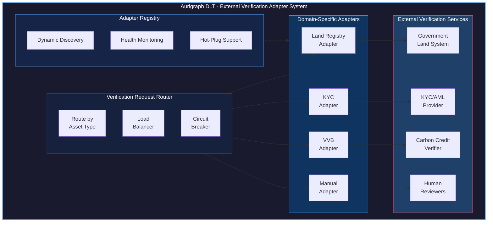
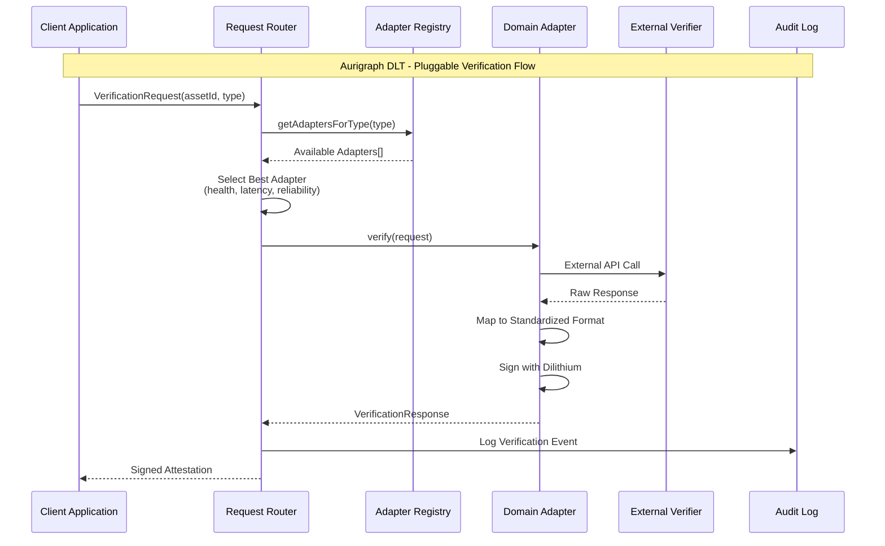
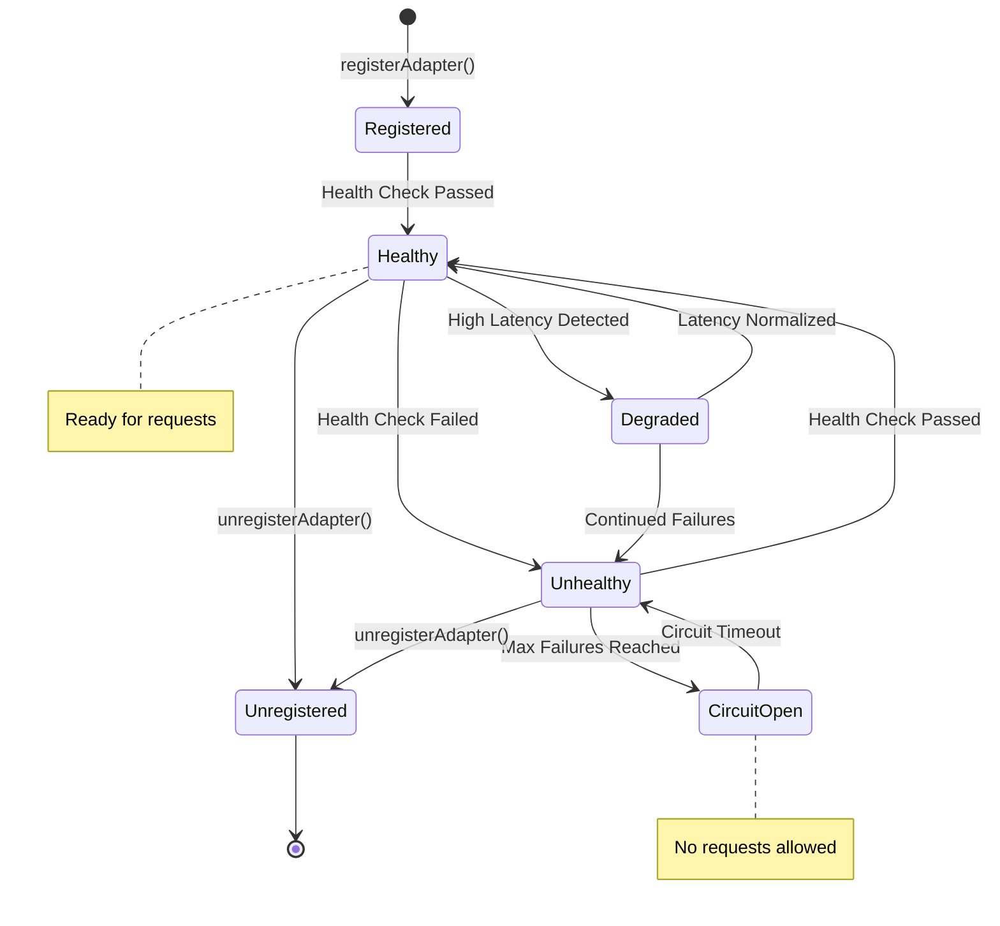

# PCT PATENT APPLICATION
# PLUGGABLE EXTERNAL VERIFICATION ADAPTER SYSTEM FOR BLOCKCHAIN ASSET VALIDATION

**Application Type**: Patent Cooperation Treaty (PCT) International Application
**Filing Date**: [To be determined]
**Priority Date**: December 12, 2025
**Applicant**: Aurigraph DLT Corporation
**Inventors**: [To be listed]
**Patent Family ID**: AURIGRAPH-PCT-004

---

## TITLE OF INVENTION

**PLUGGABLE EXTERNAL VERIFICATION ADAPTER PATTERN FOR INTEGRATING THIRD-PARTY VALIDATION SERVICES WITH BLOCKCHAIN-BASED ASSET TOKENIZATION SYSTEMS**

---

## PATENTABILITY ASSESSMENT

| Criterion | Score | Rating |
|-----------|-------|--------|
| Novelty | 4/5 | Good |
| Non-Obviousness | 4/5 | Good |
| Utility | 5/5 | Excellent |
| **Overall** | **13/15** | **Patentable** |

### Key Considerations
- **Novelty**: Adapter pattern is known, but blockchain integration is novel
- **Chainlink Prior Art**: Review US 11,196,573 for oracle patterns
- **Differentiation**: Pluggable architecture with unified response format

---

## ABSTRACT

A pluggable external verification adapter system for blockchain-based asset tokenization platforms, comprising: (1) a unified adapter interface enabling integration with diverse third-party verification services; (2) a land registry adapter for validating real estate ownership and boundaries; (3) a KYC verification adapter for identity validation and anti-money laundering compliance; (4) a VVB (Verification/Validation Body) adapter for carbon credit certification; (5) a manual verification adapter enabling human auditor review with cryptographic attestation; and (6) an adapter registry with dynamic discovery and hot-plugging capabilities. The system enables external authorities to validate physical assets and ownership claims with standardized responses and quantum-resistant cryptographic signatures, bridging the gap between blockchain systems and authoritative off-chain data sources.

---

## TECHNICAL FIELD

The present invention relates to blockchain systems, oracle networks, and software integration patterns. More particularly, this invention relates to pluggable adapter architectures for integrating external verification services with distributed ledger platforms.

---

## BACKGROUND OF THE INVENTION

### Prior Art Limitations

**1. Existing Oracle Systems**
Current blockchain oracle systems have limitations:
- **Chainlink**: General-purpose oracle network, not asset-specific
- **Band Protocol**: Cross-chain data feeds without verification semantics
- **API3**: First-party oracles without standardized verification responses

**2. Hardcoded Integrations**
Most tokenization platforms use hardcoded integrations:
- Tightly coupled to specific providers
- Difficult to add new verification sources
- No standardized response format
- Manual code changes for new adapters

**3. Limited Verification Types**
Existing systems typically support only:
- Price feeds (financial data)
- Random number generation
- Simple API calls

### Need for the Present Invention

There exists a need for a pluggable verification adapter system that:
- Supports diverse verification types (ownership, identity, environmental)
- Enables easy addition of new verification providers
- Provides standardized response formats
- Includes cryptographic attestation
- Supports both automated and manual verification

---

## SUMMARY OF THE INVENTION

The present invention provides a Pluggable External Verification Adapter System with the following innovations:

### Innovation 1: Unified Adapter Interface

Standardized interface for all verification adapters:
- Common request/response format
- Cryptographic signature requirements
- Error handling patterns
- Timeout and retry policies

### Innovation 2: Domain-Specific Adapters

Specialized adapters for different verification needs:
- Land Registry Adapter (real estate)
- KYC Adapter (identity verification)
- VVB Adapter (carbon credits)
- Manual Adapter (human review)

### Innovation 3: Adapter Registry

Dynamic management of verification adapters:
- Hot-plugging support
- Service discovery
- Load balancing
- Failover handling

### Innovation 4: Standardized Attestations

Unified attestation format with:
- Verification result
- Confidence score
- Evidence hash
- Cryptographic signature

---

## DETAILED DESCRIPTION OF THE INVENTION

### 1. SYSTEM ARCHITECTURE

#### Figure 1: Aurigraph DLT - External Verification Adapter Architecture



#### Figure 2: Aurigraph DLT - Verification Request Flow



#### Figure 3: Aurigraph DLT - Adapter State Machine



### 2. UNIFIED ADAPTER INTERFACE

#### 2.1 Core Interface Definition

```java
public interface ExternalVerificationAdapter {

    /**
     * Get the adapter identifier
     */
    String getAdapterId();

    /**
     * Get supported verification types
     */
    List<VerificationType> getSupportedTypes();

    /**
     * Verify an asset with the external authority
     */
    VerificationResponse verify(VerificationRequest request);

    /**
     * Check adapter health/availability
     */
    HealthStatus getHealth();

    /**
     * Get adapter capabilities
     */
    AdapterCapabilities getCapabilities();
}

public enum VerificationType {
    OWNERSHIP,           // Verify ownership claim
    EXISTENCE,           // Verify asset exists
    VALUATION,           // Get/verify valuation
    IDENTITY,            // Verify identity (KYC)
    ENVIRONMENTAL,       // Environmental certification
    COMPLIANCE,          // Regulatory compliance
    DOCUMENT,            // Document authenticity
    LOCATION             // Geographic verification
}
```

#### 2.2 Request/Response Structures

```java
public class VerificationRequest {
    private final String requestId;
    private final String assetId;
    private final VerificationType type;
    private final Map<String, Object> parameters;
    private final Instant requestTime;
    private final byte[] requesterSignature;

    // Getters and builder pattern
}

public class VerificationResponse {
    private final String requestId;
    private final VerificationResult result;
    private final double confidenceScore;           // 0.0 - 1.0
    private final Map<String, Object> details;
    private final byte[] evidenceHash;              // SHA-256 of evidence
    private final Instant responseTime;
    private final String adapterId;
    private final byte[] adapterSignature;          // Quantum-resistant

    public enum VerificationResult {
        VERIFIED,           // Verification successful
        FAILED,             // Verification failed
        PENDING,            // Requires manual review
        EXPIRED,            // Previous verification expired
        NOT_FOUND,          // Asset/entity not found
        ERROR               // System error
    }
}
```

### 3. DOMAIN-SPECIFIC ADAPTERS

#### 3.1 Land Registry Adapter

```java
public class LandRegistryAdapter implements ExternalVerificationAdapter {

    private final LandRegistryClient client;
    private final DilithiumSigner signer;

    @Override
    public String getAdapterId() {
        return "LAND_REGISTRY_V1";
    }

    @Override
    public List<VerificationType> getSupportedTypes() {
        return Arrays.asList(
            VerificationType.OWNERSHIP,
            VerificationType.EXISTENCE,
            VerificationType.LOCATION
        );
    }

    @Override
    public VerificationResponse verify(VerificationRequest request) {
        // Extract property details
        String propertyId = (String) request.getParameters().get("propertyId");
        String claimedOwner = (String) request.getParameters().get("owner");

        // Query land registry
        PropertyRecord record = client.getPropertyRecord(propertyId);

        if (record == null) {
            return VerificationResponse.builder()
                .requestId(request.getRequestId())
                .result(VerificationResult.NOT_FOUND)
                .confidenceScore(1.0)
                .adapterId(getAdapterId())
                .sign(signer)
                .build();
        }

        // Verify ownership
        boolean ownershipMatch = record.getOwner().equals(claimedOwner);

        return VerificationResponse.builder()
            .requestId(request.getRequestId())
            .result(ownershipMatch ? VerificationResult.VERIFIED : VerificationResult.FAILED)
            .confidenceScore(1.0)  // Government source = high confidence
            .details(Map.of(
                "registeredOwner", record.getOwner(),
                "propertyType", record.getType(),
                "area", record.getArea(),
                "encumbrances", record.getEncumbrances()
            ))
            .evidenceHash(SHA256.hash(record.serialize()))
            .adapterId(getAdapterId())
            .sign(signer)
            .build();
    }
}
```

#### 3.2 KYC Verification Adapter

```java
public class KYCVerificationAdapter implements ExternalVerificationAdapter {

    private final KYCProviderClient kycClient;
    private final DilithiumSigner signer;

    @Override
    public String getAdapterId() {
        return "KYC_VERIFICATION_V1";
    }

    @Override
    public List<VerificationType> getSupportedTypes() {
        return Arrays.asList(
            VerificationType.IDENTITY,
            VerificationType.COMPLIANCE
        );
    }

    @Override
    public VerificationResponse verify(VerificationRequest request) {
        String userId = (String) request.getParameters().get("userId");
        String documentType = (String) request.getParameters().get("documentType");
        byte[] documentHash = (byte[]) request.getParameters().get("documentHash");

        // Perform KYC check
        KYCResult kycResult = kycClient.verifyIdentity(userId, documentType, documentHash);

        // Map KYC risk levels to confidence scores
        double confidence = mapRiskToConfidence(kycResult.getRiskLevel());

        // Check AML sanctions
        boolean amlClear = kycClient.checkSanctions(userId);

        return VerificationResponse.builder()
            .requestId(request.getRequestId())
            .result(kycResult.isVerified() && amlClear ?
                    VerificationResult.VERIFIED : VerificationResult.FAILED)
            .confidenceScore(confidence)
            .details(Map.of(
                "kycStatus", kycResult.getStatus(),
                "riskLevel", kycResult.getRiskLevel(),
                "amlStatus", amlClear ? "CLEAR" : "FLAGGED",
                "verificationDate", kycResult.getVerificationDate()
            ))
            .evidenceHash(kycResult.getEvidenceHash())
            .adapterId(getAdapterId())
            .sign(signer)
            .build();
    }

    private double mapRiskToConfidence(RiskLevel risk) {
        return switch (risk) {
            case LOW -> 0.95;
            case MEDIUM -> 0.75;
            case HIGH -> 0.50;
            case VERY_HIGH -> 0.25;
        };
    }
}
```

#### 3.3 VVB (Carbon Credit) Adapter

```java
public class VVBVerificationAdapter implements ExternalVerificationAdapter {

    private final VVBRegistryClient vvbClient;
    private final DilithiumSigner signer;

    @Override
    public String getAdapterId() {
        return "VVB_CARBON_V1";
    }

    @Override
    public List<VerificationType> getSupportedTypes() {
        return Arrays.asList(
            VerificationType.ENVIRONMENTAL,
            VerificationType.EXISTENCE,
            VerificationType.COMPLIANCE
        );
    }

    @Override
    public VerificationResponse verify(VerificationRequest request) {
        String creditId = (String) request.getParameters().get("creditId");
        String standard = (String) request.getParameters().get("standard");  // VCS, GS, etc.

        // Query VVB registry
        CarbonCreditRecord credit = vvbClient.getCreditRecord(creditId, standard);

        if (credit == null) {
            return buildNotFoundResponse(request);
        }

        // Verify credit is valid and not retired
        boolean isValid = credit.getStatus() == CreditStatus.ACTIVE;
        boolean isVerified = credit.getVerificationBody() != null;
        boolean notRetired = !credit.isRetired();

        return VerificationResponse.builder()
            .requestId(request.getRequestId())
            .result(isValid && isVerified && notRetired ?
                    VerificationResult.VERIFIED : VerificationResult.FAILED)
            .confidenceScore(isVerified ? 0.95 : 0.50)
            .details(Map.of(
                "projectName", credit.getProjectName(),
                "vintage", credit.getVintage(),
                "tonnes", credit.getTonnesCO2e(),
                "standard", credit.getStandard(),
                "verificationBody", credit.getVerificationBody(),
                "expiryDate", credit.getExpiryDate()
            ))
            .evidenceHash(credit.getRegistryHash())
            .adapterId(getAdapterId())
            .sign(signer)
            .build();
    }
}
```

#### 3.4 Manual Verification Adapter

```java
public class ManualVerificationAdapter implements ExternalVerificationAdapter {

    private final ManualReviewQueue reviewQueue;
    private final NotificationService notificationService;
    private final DilithiumSigner signer;

    @Override
    public String getAdapterId() {
        return "MANUAL_VERIFICATION_V1";
    }

    @Override
    public List<VerificationType> getSupportedTypes() {
        return Arrays.asList(VerificationType.values());  // Supports all types
    }

    @Override
    public VerificationResponse verify(VerificationRequest request) {
        // Create review task
        ManualReviewTask task = ManualReviewTask.builder()
            .requestId(request.getRequestId())
            .assetId(request.getAssetId())
            .verificationType(request.getType())
            .parameters(request.getParameters())
            .priority(calculatePriority(request))
            .deadline(Instant.now().plus(Duration.ofHours(24)))
            .build();

        // Queue for human review
        reviewQueue.submit(task);

        // Notify reviewers
        notificationService.notifyReviewers(task);

        return VerificationResponse.builder()
            .requestId(request.getRequestId())
            .result(VerificationResult.PENDING)
            .confidenceScore(0.0)
            .details(Map.of(
                "taskId", task.getTaskId(),
                "estimatedCompletion", task.getDeadline(),
                "queuePosition", reviewQueue.getPosition(task.getTaskId())
            ))
            .adapterId(getAdapterId())
            .sign(signer)
            .build();
    }

    // Called when human reviewer completes review
    public VerificationResponse submitReview(ManualReviewResult reviewResult) {
        return VerificationResponse.builder()
            .requestId(reviewResult.getOriginalRequestId())
            .result(reviewResult.isApproved() ?
                    VerificationResult.VERIFIED : VerificationResult.FAILED)
            .confidenceScore(reviewResult.getConfidence())
            .details(Map.of(
                "reviewerId", reviewResult.getReviewerId(),
                "reviewNotes", reviewResult.getNotes(),
                "reviewDate", reviewResult.getReviewDate(),
                "evidenceUrls", reviewResult.getEvidenceUrls()
            ))
            .evidenceHash(SHA256.hash(reviewResult.serialize()))
            .adapterId(getAdapterId())
            .sign(signer)
            .build();
    }
}
```

### 4. ADAPTER REGISTRY

#### 4.1 Registry Implementation

```java
public class AdapterRegistry {

    private final Map<String, ExternalVerificationAdapter> adapters = new ConcurrentHashMap<>();
    private final Map<VerificationType, List<String>> typeToAdapters = new ConcurrentHashMap<>();
    private final HealthMonitor healthMonitor;

    public void registerAdapter(ExternalVerificationAdapter adapter) {
        String adapterId = adapter.getAdapterId();
        adapters.put(adapterId, adapter);

        // Index by verification types
        for (VerificationType type : adapter.getSupportedTypes()) {
            typeToAdapters.computeIfAbsent(type, k -> new CopyOnWriteArrayList<>())
                .add(adapterId);
        }

        // Start health monitoring
        healthMonitor.startMonitoring(adapter);

        log.info("Registered adapter: {} supporting {}", adapterId, adapter.getSupportedTypes());
    }

    public void unregisterAdapter(String adapterId) {
        ExternalVerificationAdapter adapter = adapters.remove(adapterId);
        if (adapter != null) {
            for (VerificationType type : adapter.getSupportedTypes()) {
                typeToAdapters.getOrDefault(type, List.of()).remove(adapterId);
            }
            healthMonitor.stopMonitoring(adapterId);
        }
    }

    public ExternalVerificationAdapter getAdapter(String adapterId) {
        return adapters.get(adapterId);
    }

    public List<ExternalVerificationAdapter> getAdaptersForType(VerificationType type) {
        return typeToAdapters.getOrDefault(type, List.of()).stream()
            .map(adapters::get)
            .filter(adapter -> healthMonitor.isHealthy(adapter.getAdapterId()))
            .collect(Collectors.toList());
    }

    public ExternalVerificationAdapter selectBestAdapter(VerificationType type) {
        List<ExternalVerificationAdapter> available = getAdaptersForType(type);
        if (available.isEmpty()) {
            throw new NoAdapterAvailableException(type);
        }

        // Select based on health, latency, and reliability
        return available.stream()
            .max(Comparator.comparingDouble(adapter ->
                healthMonitor.getReliabilityScore(adapter.getAdapterId())))
            .orElse(available.get(0));
    }
}
```

#### 4.2 Health Monitoring

```java
public class HealthMonitor {

    private final Map<String, AdapterHealth> healthStatus = new ConcurrentHashMap<>();
    private final ScheduledExecutorService scheduler = Executors.newScheduledThreadPool(4);

    public void startMonitoring(ExternalVerificationAdapter adapter) {
        String adapterId = adapter.getAdapterId();
        healthStatus.put(adapterId, new AdapterHealth());

        // Schedule periodic health checks
        scheduler.scheduleAtFixedRate(() -> {
            try {
                HealthStatus status = adapter.getHealth();
                updateHealth(adapterId, status);
            } catch (Exception e) {
                recordFailure(adapterId, e);
            }
        }, 0, 30, TimeUnit.SECONDS);
    }

    public boolean isHealthy(String adapterId) {
        AdapterHealth health = healthStatus.get(adapterId);
        return health != null && health.isHealthy();
    }

    public double getReliabilityScore(String adapterId) {
        AdapterHealth health = healthStatus.get(adapterId);
        if (health == null) return 0.0;

        return health.getSuccessRate() * 0.5 +
               health.getLatencyScore() * 0.3 +
               health.getUptimeScore() * 0.2;
    }
}
```

---

## CLAIMS

### Independent Claims

**Claim 1.** A computer-implemented method for integrating external verification services with blockchain-based asset tokenization, comprising:
a) defining a unified adapter interface with standardized request/response formats;
b) implementing domain-specific adapters for land registry, KYC, environmental, and manual verification services;
c) maintaining an adapter registry with dynamic discovery and hot-plugging capabilities;
d) routing verification requests to appropriate adapters based on asset type and verification requirements;
e) generating standardized attestations including verification results, confidence scores, and cryptographic signatures; and
f) monitoring adapter health and selecting optimal adapters for each verification request.

**Claim 2.** A pluggable verification adapter system for distributed ledger platforms, comprising:
a) a unified adapter interface defining common methods for verification requests;
b) a plurality of domain-specific adapters implementing said interface for different verification types;
c) an adapter registry configured for dynamic adapter management and service discovery;
d) a request router configured to select and invoke appropriate adapters; and
e) wherein each adapter generates cryptographically signed attestations with confidence scores.

**Claim 3.** A non-transitory computer-readable medium storing instructions that, when executed by a processor, cause the processor to:
a) receive verification requests specifying asset identifiers and verification types;
b) route requests to registered adapters based on verification type;
c) invoke external verification services through adapter implementations;
d) receive verification results and map to standardized response format;
e) sign responses with quantum-resistant cryptographic signatures; and
f) monitor adapter health and implement failover for unavailable adapters.

### Dependent Claims

**Claim 4.** The method of claim 1, wherein the land registry adapter queries government property records to verify ownership claims and property boundaries.

**Claim 5.** The method of claim 1, wherein the KYC adapter performs identity verification and AML sanctions screening.

**Claim 6.** The method of claim 1, wherein the VVB adapter verifies carbon credit validity with certification standards including VCS and Gold Standard.

**Claim 7.** The system of claim 2, further comprising a manual verification adapter enabling human reviewer attestation with cryptographic signatures.

**Claim 8.** The system of claim 2, wherein the adapter registry supports hot-plugging of new adapters without service interruption.

**Claim 9.** The system of claim 2, wherein adapter selection considers health status, latency, and reliability scores.

**Claim 10.** The computer-readable medium of claim 3, wherein confidence scores are computed based on verification source authority and response completeness.

---

## ABSTRACT OF THE DISCLOSURE

A pluggable external verification adapter system enabling blockchain platforms to integrate with diverse third-party verification services through a unified interface. The system comprises domain-specific adapters for land registry, KYC, environmental (VVB), and manual verification, along with an adapter registry supporting dynamic discovery and hot-plugging. Each adapter generates standardized attestations with verification results, confidence scores, and quantum-resistant cryptographic signatures. The architecture enables easy addition of new verification providers while maintaining consistent response formats and security guarantees.

---

## PRIOR ART REFERENCES

1. US 11,196,573 - "Oracle system for blockchain networks" (Chainlink)
2. US 10,789,150 - "Method for identity verification" (Jumio)
3. Adapter Pattern: Gamma et al., "Design Patterns", 1994
4. Oracle Network documentation (Chainlink, Band Protocol, API3)

---

## DOCUMENT INFORMATION

**Document Type**: PCT Patent Application (Individual Innovation)
**Innovation Area**: External Verification Adapters
**Patentability Rating**: Patentable (13/15)
**Estimated Filing Cost**: $8,000-$15,000 (USPTO + PCT)
**Note**: Review Chainlink patents for freedom to operate
**Estimated Grant Timeline**: 24-42 months

---

**Generated**: December 12, 2025
**Applicant Reference**: AURIGRAPH-PCT-004-VERIFICATION
