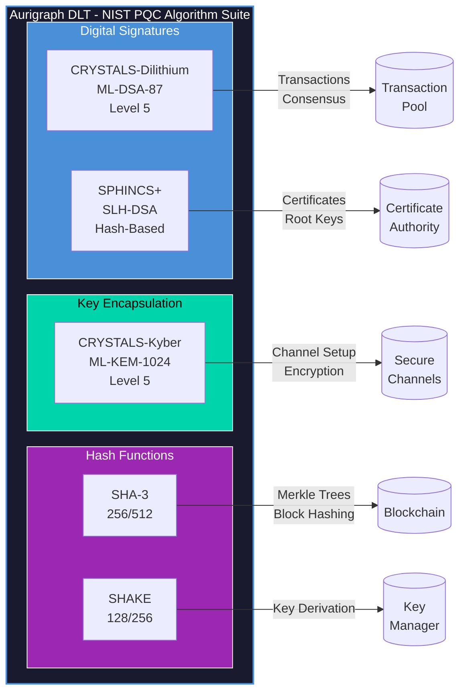
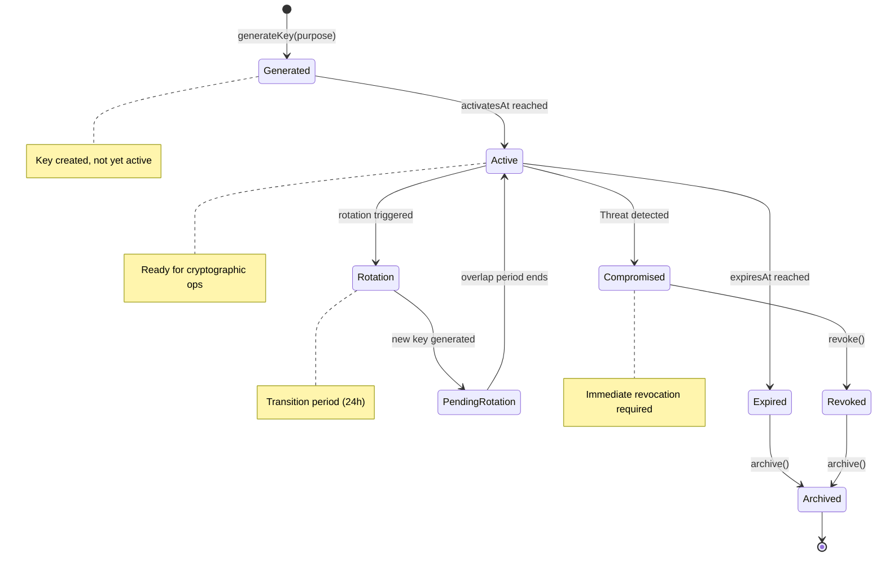
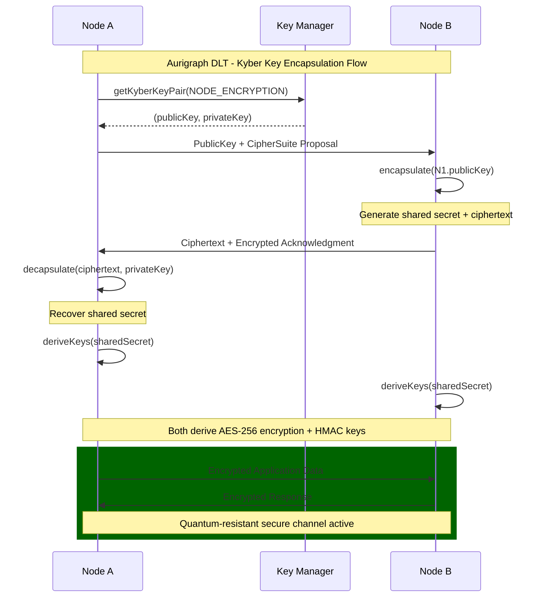

# PCT PATENT APPLICATION
# INTEGRATED QUANTUM-RESISTANT CRYPTOGRAPHIC SYSTEM FOR BLOCKCHAIN PLATFORMS

**Application Type**: Patent Cooperation Treaty (PCT) International Application
**Filing Date**: [To be determined]
**Priority Date**: December 12, 2025
**Applicant**: Aurigraph DLT Corporation
**Inventors**: [To be listed]
**Patent Family ID**: AURIGRAPH-PCT-006

---

## TITLE OF INVENTION

**INTEGRATED SIX-LAYER QUANTUM-RESISTANT CRYPTOGRAPHIC SYSTEM IMPLEMENTING NIST LEVEL 5 POST-QUANTUM ALGORITHMS FOR DISTRIBUTED LEDGER PLATFORMS**

---

## PATENTABILITY ASSESSMENT

| Criterion | Score | Rating |
|-----------|-------|--------|
| Novelty | 3/5 | Moderate |
| Non-Obviousness | 3/5 | Moderate |
| Utility | 5/5 | Excellent |
| **Overall** | **11/15** | **Patentable** |

### Key Considerations
- **Novelty**: CRYSTALS algorithms are NIST standards (FIPS 203/204)
- **Non-Obviousness**: Integration approach may face obviousness challenges
- **Focus Claims On**: Six-layer security model, blockchain-specific integration

---

## ABSTRACT

An integrated quantum-resistant cryptographic system for distributed ledger platforms, comprising: (1) CRYSTALS-Dilithium implementation for post-quantum digital signatures with NIST Level 5 security; (2) CRYSTALS-Kyber implementation for quantum-safe key encapsulation and encryption; (3) SPHINCS+ hash-based signatures for long-term security; (4) a six-layer security model spanning application, API, transport, cryptography, consensus, and network layers; (5) key lifecycle management with automated rotation and quantum-safe key derivation; and (6) zero-knowledge proof integration for privacy-preserving verification. The system provides comprehensive protection against both classical and quantum computing attacks while maintaining compatibility with existing blockchain operations.

---

## TECHNICAL FIELD

The present invention relates to cryptography, post-quantum security, and distributed systems. More particularly, this invention relates to quantum-resistant cryptographic implementations for blockchain platforms using NIST-standardized post-quantum algorithms.

---

## BACKGROUND OF THE INVENTION

### Quantum Computing Threat

**1. Vulnerable Current Cryptography**
Existing blockchain systems rely on cryptographic primitives vulnerable to quantum attacks:
- **ECDSA** (Bitcoin, Ethereum): Broken by Shor's algorithm
- **RSA**: Also vulnerable to Shor's algorithm
- **SHA-256**: Requires doubled output length for quantum resistance

**2. Harvest Now, Decrypt Later**
Adversaries can:
- Record encrypted blockchain data today
- Decrypt when quantum computers mature
- Compromise historical transactions retroactively

**3. NIST Post-Quantum Standardization**
NIST finalized standards in 2024:
- **FIPS 203**: ML-KEM (based on CRYSTALS-Kyber)
- **FIPS 204**: ML-DSA (based on CRYSTALS-Dilithium)
- **FIPS 205**: SLH-DSA (based on SPHINCS+)

### Prior Art Limitations

**1. No Blockchain-Specific Implementation**
Existing implementations lack:
- Blockchain operation integration
- Multi-layer security architecture
- Key rotation for long-lived systems

**2. Single Algorithm Approaches**
Most systems implement only one algorithm:
- Signatures OR encryption
- No defense-in-depth

### Need for the Present Invention

There exists a need for a comprehensive quantum-resistant system that:
- Implements multiple NIST PQC standards
- Provides multi-layer security
- Integrates with blockchain operations
- Includes key management for long-term security

---

## SUMMARY OF THE INVENTION

### Innovation 1: CRYSTALS-Dilithium Signatures

Digital signature implementation:
- NIST Level 5 security (256-bit classical, 128-bit quantum)
- Transaction signing
- Consensus message authentication
- Certificate signing

### Innovation 2: CRYSTALS-Kyber Key Encapsulation

Key encapsulation mechanism:
- Quantum-safe key exchange
- Symmetric key derivation
- Node-to-node encryption
- Data-at-rest protection

### Innovation 3: SPHINCS+ Hash-Based Signatures

Alternative signature scheme:
- Stateless hash-based
- Long-term security
- Conservative security margin

### Innovation 4: Six-Layer Security Model

Comprehensive protection:
1. Application Layer
2. API Layer
3. Transport Layer
4. Cryptography Layer
5. Consensus Layer
6. Network Layer

### Innovation 5: Key Lifecycle Management

Automated key handling:
- Generation with quantum randomness
- Rotation schedules
- Revocation procedures
- Secure storage

---

## DETAILED DESCRIPTION OF THE INVENTION

### 1. CRYPTOGRAPHIC ALGORITHMS

#### 1.1 CRYSTALS-Dilithium Implementation

```java
public class DilithiumSignatureService {

    private static final int SECURITY_LEVEL = 5;  // NIST Level 5
    private static final String ALGORITHM = "ML-DSA-87";

    private final KeyPairGenerator keyGen;
    private final Signature signer;

    public DilithiumSignatureService() {
        // Initialize with NIST Level 5 parameters
        Security.addProvider(new BouncyCastlePQCProvider());
        this.keyGen = KeyPairGenerator.getInstance(ALGORITHM);
        this.signer = Signature.getInstance(ALGORITHM);

        // ML-DSA-87 parameters (Level 5)
        // Public key: 2592 bytes
        // Secret key: 4896 bytes
        // Signature: 4627 bytes
    }

    public KeyPair generateKeyPair() {
        return keyGen.generateKeyPair();
    }

    public byte[] sign(byte[] message, PrivateKey privateKey) {
        signer.initSign(privateKey);
        signer.update(message);
        return signer.sign();
    }

    public boolean verify(byte[] message, byte[] signature, PublicKey publicKey) {
        signer.initVerify(publicKey);
        signer.update(message);
        return signer.verify(signature);
    }

    // Transaction signing
    public SignedTransaction signTransaction(Transaction tx, PrivateKey key) {
        byte[] txBytes = tx.serialize();
        byte[] signature = sign(txBytes, key);

        return SignedTransaction.builder()
            .transaction(tx)
            .signature(signature)
            .algorithm(ALGORITHM)
            .publicKeyHash(SHA256.hash(key.getPublic().getEncoded()))
            .build();
    }
}
```

#### 1.2 CRYSTALS-Kyber Key Encapsulation

```java
public class KyberKeyEncapsulationService {

    private static final String ALGORITHM = "ML-KEM-1024";  // Level 5

    private final KeyPairGenerator keyGen;
    private final KeyGenerator kemKeyGen;

    public KyberKeyEncapsulationService() {
        Security.addProvider(new BouncyCastlePQCProvider());
        this.keyGen = KeyPairGenerator.getInstance(ALGORITHM);

        // ML-KEM-1024 parameters (Level 5)
        // Public key: 1568 bytes
        // Secret key: 3168 bytes
        // Ciphertext: 1568 bytes
        // Shared secret: 32 bytes
    }

    public KeyPair generateKeyPair() {
        return keyGen.generateKeyPair();
    }

    public EncapsulationResult encapsulate(PublicKey recipientPublicKey) {
        // Generate shared secret and ciphertext
        KEMParameterSpec params = new KEMParameterSpec(
            recipientPublicKey.getEncoded(), "AES");

        KeyGenerator kg = KeyGenerator.getInstance(ALGORITHM);
        kg.init(params);

        SecretKey sharedSecret = kg.generateKey();
        byte[] ciphertext = ((KEMSecretKey) sharedSecret).getCiphertext();

        return new EncapsulationResult(sharedSecret, ciphertext);
    }

    public SecretKey decapsulate(byte[] ciphertext, PrivateKey privateKey) {
        KEMParameterSpec params = new KEMParameterSpec(
            ciphertext, "AES");

        KeyGenerator kg = KeyGenerator.getInstance(ALGORITHM);
        kg.init(params, privateKey);

        return kg.generateKey();
    }

    // Secure channel establishment
    public SecureChannel establishChannel(PublicKey peerPublicKey, PrivateKey myPrivateKey) {
        // Encapsulate to peer
        EncapsulationResult result = encapsulate(peerPublicKey);

        // Derive encryption keys from shared secret
        byte[] keyMaterial = result.getSharedSecret().getEncoded();
        SecretKey encryptionKey = deriveKey(keyMaterial, "encryption");
        SecretKey macKey = deriveKey(keyMaterial, "mac");

        return new SecureChannel(encryptionKey, macKey, result.getCiphertext());
    }
}
```

#### 1.3 SPHINCS+ Implementation

```java
public class SphincsSignatureService {

    private static final String ALGORITHM = "SLH-DSA-SHAKE-256f";  // Fast variant

    public SphincsSignatureService() {
        Security.addProvider(new BouncyCastlePQCProvider());

        // SPHINCS+ parameters (Level 5)
        // Public key: 64 bytes
        // Secret key: 128 bytes
        // Signature: 49,856 bytes (larger but hash-based)
    }

    // Used for long-term signatures (certificates, root keys)
    public byte[] signLongTerm(byte[] message, PrivateKey key) {
        Signature signer = Signature.getInstance(ALGORITHM);
        signer.initSign(key);
        signer.update(message);
        return signer.sign();
    }

    public boolean verifyLongTerm(byte[] message, byte[] signature, PublicKey key) {
        Signature verifier = Signature.getInstance(ALGORITHM);
        verifier.initVerify(key);
        verifier.update(message);
        return verifier.verify(signature);
    }
}
```

### 2. SIX-LAYER SECURITY MODEL

#### Figure 1: Aurigraph DLT - Six-Layer Quantum-Resistant Security Architecture


#### Figure 2: Aurigraph DLT - Quantum-Resistant Algorithm Stack



#### 2.1 Layer Architecture (Original ASCII Reference)

#### 2.2 Layer Implementation

```java
public class SixLayerSecurityManager {

    private final ApplicationSecurityLayer applicationLayer;
    private final APISecurityLayer apiLayer;
    private final TransportSecurityLayer transportLayer;
    private final CryptographyLayer cryptoLayer;
    private final ConsensusSecurityLayer consensusLayer;
    private final NetworkSecurityLayer networkLayer;

    public SecurityContext createSecurityContext(Request request) {
        SecurityContext ctx = new SecurityContext();

        // Layer 1: Network validation
        ctx.setNetworkValidation(networkLayer.validate(request));

        // Layer 2: Consensus authentication
        ctx.setConsensusAuth(consensusLayer.authenticate(request));

        // Layer 3: Cryptographic verification
        ctx.setCryptoVerification(cryptoLayer.verify(request));

        // Layer 4: Transport security
        ctx.setTransportSecurity(transportLayer.validate(request));

        // Layer 5: API security
        ctx.setApiSecurity(apiLayer.validate(request));

        // Layer 6: Application security
        ctx.setAppSecurity(applicationLayer.validate(request));

        return ctx;
    }
}
```

### 3. KEY LIFECYCLE MANAGEMENT

#### Figure 3: Aurigraph DLT - Key Lifecycle State Management



#### Figure 4: Aurigraph DLT - Quantum-Safe Channel Establishment



#### 3.1 Key Generation

```java
public class QuantumSafeKeyManager {

    private final SecureRandom quantumRandom;  // QRNG source if available
    private final KeyStore keyStore;
    private final Map<String, KeyRotationPolicy> rotationPolicies;

    public ManagedKeyPair generateKey(KeyPurpose purpose) {
        KeyType keyType = getKeyTypeForPurpose(purpose);
        KeyPair keyPair;

        switch (keyType) {
            case DILITHIUM:
                keyPair = dilithiumService.generateKeyPair();
                break;
            case KYBER:
                keyPair = kyberService.generateKeyPair();
                break;
            case SPHINCS:
                keyPair = sphincsService.generateKeyPair();
                break;
            default:
                throw new IllegalArgumentException("Unknown key type");
        }

        // Create managed key with metadata
        ManagedKeyPair managedKey = ManagedKeyPair.builder()
            .keyId(generateKeyId())
            .keyPair(keyPair)
            .purpose(purpose)
            .algorithm(keyType.getAlgorithm())
            .securityLevel(5)
            .createdAt(Instant.now())
            .expiresAt(Instant.now().plus(getExpirationPeriod(purpose)))
            .rotationPolicy(rotationPolicies.get(purpose.name()))
            .build();

        // Store securely
        keyStore.store(managedKey);

        return managedKey;
    }

    private Duration getExpirationPeriod(KeyPurpose purpose) {
        return switch (purpose) {
            case TRANSACTION_SIGNING -> Duration.ofDays(365);
            case CONSENSUS_AUTHENTICATION -> Duration.ofDays(90);
            case NODE_ENCRYPTION -> Duration.ofDays(30);
            case ROOT_CA -> Duration.ofDays(3650);  // 10 years
        };
    }
}
```

#### 3.2 Key Rotation

```java
public class KeyRotationService {

    private final QuantumSafeKeyManager keyManager;
    private final ScheduledExecutorService scheduler;

    public void scheduleRotation(ManagedKeyPair key) {
        KeyRotationPolicy policy = key.getRotationPolicy();

        scheduler.scheduleAtFixedRate(() -> {
            if (shouldRotate(key, policy)) {
                rotateKey(key);
            }
        }, policy.getCheckInterval(), policy.getCheckInterval(), TimeUnit.HOURS);
    }

    private boolean shouldRotate(ManagedKeyPair key, KeyRotationPolicy policy) {
        // Time-based rotation
        if (Instant.now().isAfter(key.getCreatedAt().plus(policy.getMaxAge()))) {
            return true;
        }

        // Usage-based rotation
        if (key.getUsageCount() > policy.getMaxUsage()) {
            return true;
        }

        // Compromise indicator
        if (keyCompromiseDetector.isCompromised(key.getKeyId())) {
            return true;
        }

        return false;
    }

    private void rotateKey(ManagedKeyPair oldKey) {
        // Generate new key
        ManagedKeyPair newKey = keyManager.generateKey(oldKey.getPurpose());

        // Overlap period for transition
        newKey.setActivatesAt(Instant.now());
        oldKey.setDeactivatesAt(Instant.now().plus(Duration.ofHours(24)));

        // Update references
        keyRegistry.updateKeyReference(oldKey.getKeyId(), newKey.getKeyId());

        // Audit log
        auditLogger.logKeyRotation(oldKey.getKeyId(), newKey.getKeyId());

        // Notify dependent services
        eventEmitter.emit(new KeyRotatedEvent(oldKey.getKeyId(), newKey.getKeyId()));
    }
}
```

### 4. ZERO-KNOWLEDGE PROOF INTEGRATION

#### 4.1 ZK Proof Service

```java
public class ZeroKnowledgeProofService {

    // Prove ownership without revealing private key
    public ZKProof proveKeyOwnership(PublicKey publicKey, PrivateKey privateKey) {
        // Schnorr-style proof adapted for lattice-based crypto
        byte[] commitment = generateCommitment(privateKey);
        byte[] challenge = hashChallenge(publicKey, commitment);
        byte[] response = computeResponse(privateKey, challenge);

        return new ZKProof(commitment, response);
    }

    public boolean verifyKeyOwnership(PublicKey publicKey, ZKProof proof) {
        byte[] challenge = hashChallenge(publicKey, proof.getCommitment());
        return verifyResponse(publicKey, proof.getResponse(), challenge);
    }

    // Prove balance without revealing amount
    public ZKProof proveBalanceRange(BigInteger balance, BigInteger min, BigInteger max,
                                      PrivateKey key) {
        // Range proof using Bulletproofs-style construction
        RangeProofBuilder builder = new RangeProofBuilder();
        builder.setBalance(balance);
        builder.setRange(min, max);
        builder.setBlindingFactor(generateBlindingFactor(key));

        return builder.build();
    }
}
```

---

## CLAIMS

### Independent Claims

**Claim 1.** A computer-implemented method for providing quantum-resistant security in a blockchain platform, comprising:
a) implementing CRYSTALS-Dilithium digital signatures for transaction and consensus message authentication;
b) implementing CRYSTALS-Kyber key encapsulation for secure key exchange between nodes;
c) implementing SPHINCS+ hash-based signatures for long-term certificate security;
d) applying security controls across six layers: application, API, transport, cryptography, consensus, and network;
e) managing key lifecycle including generation, rotation, and revocation with quantum-safe algorithms; and
f) integrating zero-knowledge proofs for privacy-preserving verification.

**Claim 2.** A quantum-resistant cryptographic system for distributed ledger platforms, comprising:
a) a signature module implementing NIST FIPS 204 (ML-DSA) at security level 5;
b) a key encapsulation module implementing NIST FIPS 203 (ML-KEM) at security level 5;
c) a hash-based signature module implementing NIST FIPS 205 (SLH-DSA);
d) a six-layer security manager coordinating protection across application, API, transport, cryptography, consensus, and network layers;
e) a key lifecycle manager handling generation, rotation, and secure storage; and
f) a zero-knowledge proof module for privacy-preserving operations.

**Claim 3.** A non-transitory computer-readable medium storing instructions that, when executed by a processor, cause the processor to:
a) sign transactions and consensus messages using lattice-based digital signatures;
b) establish secure channels between nodes using lattice-based key encapsulation;
c) apply security validation at each of six security layers;
d) manage cryptographic keys with automated rotation policies;
e) generate and verify zero-knowledge proofs for balance and ownership claims; and
f) maintain quantum resistance against both Shor's and Grover's algorithms.

### Dependent Claims

**Claim 4.** The method of claim 1, wherein CRYSTALS-Dilithium signatures use ML-DSA-87 parameters providing NIST Level 5 security.

**Claim 5.** The method of claim 1, wherein CRYSTALS-Kyber key encapsulation uses ML-KEM-1024 parameters providing NIST Level 5 security.

**Claim 6.** The method of claim 1, wherein key rotation is triggered by time expiration, usage count, or compromise detection.

**Claim 7.** The system of claim 2, wherein the transport layer implements TLS 1.3 with post-quantum cipher suites.

**Claim 8.** The system of claim 2, wherein the consensus layer authenticates all messages with quantum-resistant signatures.

**Claim 9.** The system of claim 2, wherein key generation uses quantum random number generation when available.

**Claim 10.** The computer-readable medium of claim 3, wherein zero-knowledge proofs enable balance verification without amount disclosure.

---

## ABSTRACT OF THE DISCLOSURE

An integrated quantum-resistant cryptographic system implementing NIST-standardized post-quantum algorithms for blockchain platforms. The system comprises CRYSTALS-Dilithium for digital signatures, CRYSTALS-Kyber for key encapsulation, and SPHINCS+ for long-term certificate security, all at NIST security level 5. A six-layer security model provides defense-in-depth across application, API, transport, cryptography, consensus, and network layers. Automated key lifecycle management handles generation, rotation, and revocation with quantum-safe algorithms. Zero-knowledge proof integration enables privacy-preserving verification of ownership and balances without disclosure.

---

## PRIOR ART REFERENCES

1. NIST FIPS 203 - Module-Lattice-Based Key-Encapsulation Mechanism Standard (2024)
2. NIST FIPS 204 - Module-Lattice-Based Digital Signature Standard (2024)
3. NIST FIPS 205 - Stateless Hash-Based Digital Signature Standard (2024)
4. Ducas et al., "CRYSTALS-Dilithium Algorithm Specifications" (2021)
5. Bos et al., "CRYSTALS-Kyber Algorithm Specifications" (2021)
6. Bernstein et al., "SPHINCS+" (2019)

---

## DOCUMENT INFORMATION

**Document Type**: PCT Patent Application (Individual Innovation)
**Innovation Area**: Quantum-Resistant Cryptography
**Patentability Rating**: Patentable (11/15)
**Note**: Focus on integration aspects rather than algorithm claims
**NIST Standards**: FIPS 203, 204, 205 (public domain algorithms)
**Estimated Filing Cost**: $8,000-$15,000 (USPTO + PCT)
**Estimated Grant Timeline**: 24-48 months

---

**Generated**: December 12, 2025
**Applicant Reference**: AURIGRAPH-PCT-006-QUANTUM
