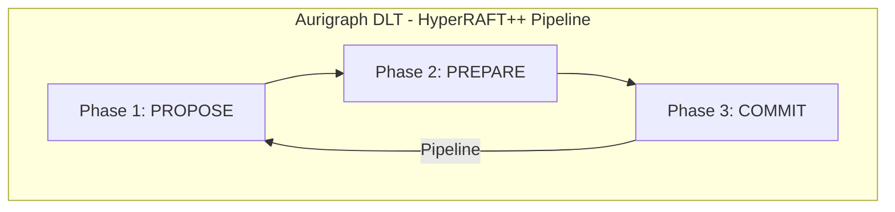
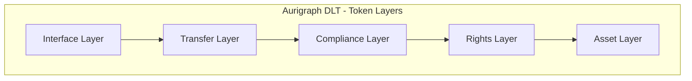
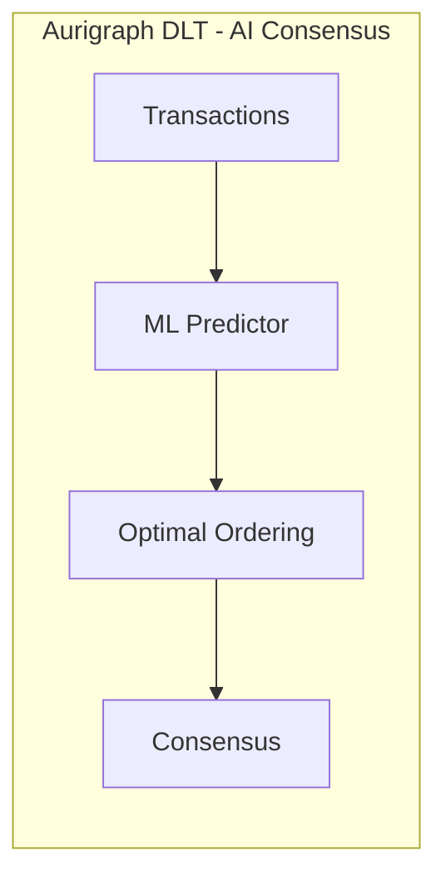
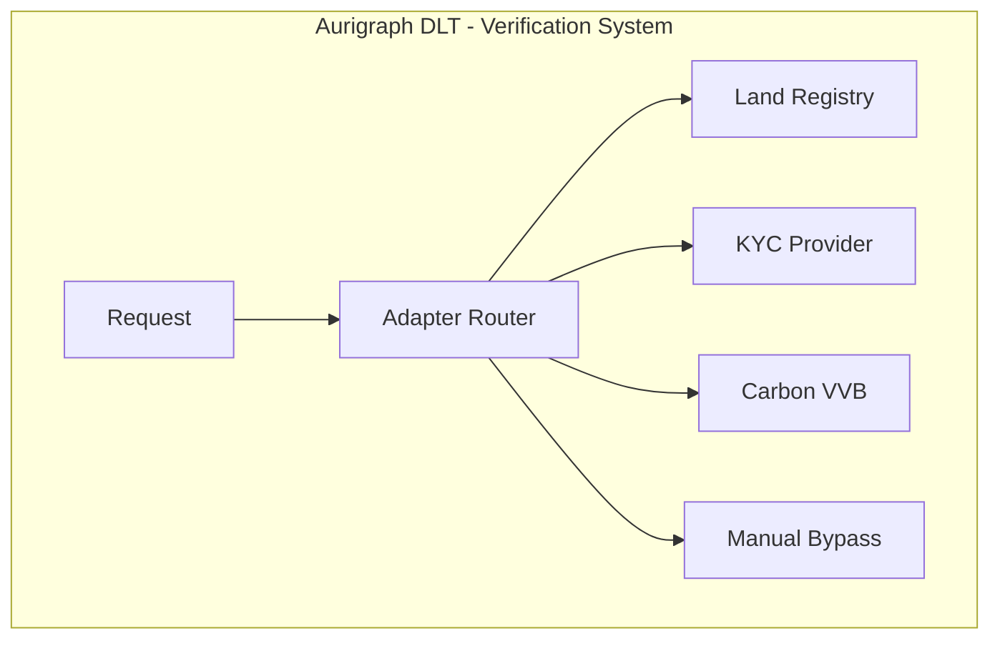
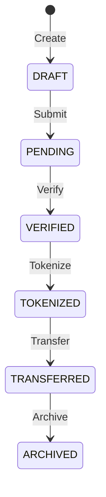
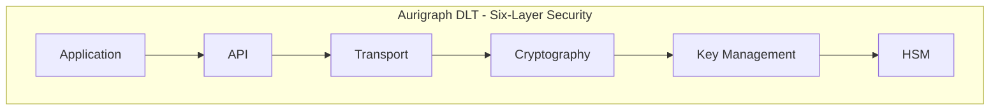

# Aurigraph DLT V12 - PCT Patent Applications

## Overview

This directory contains 6 PCT (Patent Cooperation Treaty) draft patent applications for Aurigraph DLT V12 blockchain innovations. Each document includes embedded Mermaid markdown diagrams for technical visualization.

## Patent Portfolio Summary

| # | Patent Application | Innovation | Diagrams |
|---|-------------------|------------|----------|
| 1 | [PCT-HYPERRAFT-CONSENSUS.md](PCT-HYPERRAFT-CONSENSUS.md) | HyperRAFT++ Pipelined Consensus | 5 |
| 2 | [PCT-COMPOSITE-TOKEN-FRAMEWORK.md](PCT-COMPOSITE-TOKEN-FRAMEWORK.md) | 5-Layer Token Architecture | 7 |
| 3 | [PCT-AI-CONSENSUS-OPTIMIZATION.md](PCT-AI-CONSENSUS-OPTIMIZATION.md) | ML-Driven Transaction Ordering | 2 |
| 4 | [PCT-EXTERNAL-VERIFICATION-ADAPTERS.md](PCT-EXTERNAL-VERIFICATION-ADAPTERS.md) | Pluggable Verification System | 3 |
| 5 | [PCT-ASSET-REGISTRY-SYSTEM.md](PCT-ASSET-REGISTRY-SYSTEM.md) | 12-Category Asset Lifecycle | 4 |
| 6 | [PCT-QUANTUM-RESISTANT-CRYPTOGRAPHY.md](PCT-QUANTUM-RESISTANT-CRYPTOGRAPHY.md) | NIST Level 5 PQC Security | 4 |

**Total: 25 embedded Mermaid diagrams**

---

## 1. HyperRAFT++ Pipelined Consensus Protocol

**File:** `PCT-HYPERRAFT-CONSENSUS.md`

**Abstract:** Novel distributed consensus mechanism achieving 2M+ TPS through pipelined execution, optimistic speculation, and hybrid Byzantine fault tolerance.

### Key Innovations
- 3-phase pipelined consensus (Propose/Prepare/Commit)
- Optimistic transaction speculation with rollback
- Hybrid BFT for 10,000+ node networks
- Sub-second finality with deterministic ordering

### Embedded Diagrams

---

## 2. Composite Token Framework

**File:** `PCT-COMPOSITE-TOKEN-FRAMEWORK.md`

**Abstract:** 5-layer hierarchical token architecture with triple Merkle registry for complex asset representation including fractional ownership and regulatory compliance.

### Key Innovations
- 5-layer architecture (Asset/Rights/Compliance/Transfer/Interface)
- Triple Merkle registry for ownership, rights, and state
- Cross-token atomic operations
- Regulatory compliance embedding

### Embedded Diagrams

---

## 3. AI-Driven Consensus Optimization

**File:** `PCT-AI-CONSENSUS-OPTIMIZATION.md`

**Abstract:** Machine learning system for predictive transaction ordering, conflict detection, and adaptive consensus parameter tuning.

### Key Innovations
- LSTM-based transaction arrival prediction
- Graph neural network conflict detection
- Reinforcement learning consensus tuning
- Real-time throughput optimization

### Embedded Diagrams

---

## 4. External Verification Adapters

**File:** `PCT-EXTERNAL-VERIFICATION-ADAPTERS.md`

**Abstract:** Pluggable adapter pattern for integrating external verification services including land registries, KYC providers, and carbon credit validators.

### Key Innovations
- Domain-specific adapter interfaces
- Asynchronous verification with circuit breakers
- Multi-source verification aggregation
- Manual override for demo/testing modes

### Embedded Diagrams

---

## 5. Asset Registry System

**File:** `PCT-ASSET-REGISTRY-SYSTEM.md`

**Abstract:** Comprehensive 12-category asset classification with 6-state lifecycle management for tokenization of real-world assets.

### Key Innovations
- 12 asset categories (Real Estate, Commodities, Securities, etc.)
- 6-state lifecycle (DRAFT -> PENDING -> VERIFIED -> TOKENIZED -> TRANSFERRED -> ARCHIVED)
- Domain-specific validation rules
- Regulatory compliance tracking

### Asset Categories
1. REAL_ESTATE
2. COMMODITIES
3. SECURITIES
4. INTELLECTUAL_PROPERTY
5. CARBON_CREDITS
6. RENEWABLE_ENERGY
7. INFRASTRUCTURE
8. ART_COLLECTIBLES
9. VEHICLES
10. AGRICULTURAL
11. FINANCIAL_INSTRUMENTS
12. DIGITAL_ASSETS

### Embedded Diagrams

---

## 6. Quantum-Resistant Cryptography

**File:** `PCT-QUANTUM-RESISTANT-CRYPTOGRAPHY.md`

**Abstract:** Six-layer security architecture implementing NIST Level 5 post-quantum cryptography with CRYSTALS-Dilithium/Kyber and SPHINCS+.

### Key Innovations
- CRYSTALS-Dilithium (digital signatures)
- CRYSTALS-Kyber (key encapsulation)
- SPHINCS+ (long-term signatures)
- Hybrid classical/PQC transition support

### Security Layers
1. Hardware Security Module (HSM)
2. Key Management
3. Cryptography (PQC algorithms)
4. Transport (TLS 1.3 + PQC)
5. API Security
6. Application Validation

### Embedded Diagrams

---

## Diagram Types Used

| Type | Description | Use Case |
|------|-------------|----------|
| `flowchart` | Architecture diagrams | Component relationships, data flow |
| `sequenceDiagram` | Protocol sequences | API interactions, message flows |
| `stateDiagram-v2` | State machines | Asset lifecycle, key states |
| `gantt` | Timeline charts | Pipeline phases, timing |

---

## Viewing Diagrams

Mermaid diagrams render automatically in:
- GitHub (native support)
- VS Code (with Mermaid extension)
- Obsidian
- Notion
- Most modern markdown viewers

For other viewers, use [Mermaid Live Editor](https://mermaid.live/).

---

## Filing Information

| Field | Value |
|-------|-------|
| **Applicant** | Aurigraph DLT Corp |
| **Technology** | Distributed Ledger / Blockchain |
| **Filing Route** | PCT (Patent Cooperation Treaty) |
| **Priority Date** | TBD |
| **Designated States** | All PCT contracting states |

---

## Document Statistics

| Metric | Value |
|--------|-------|
| Total Patents | 6 |
| Total Diagrams | 25 |
| Total Claims | ~90+ |
| Combined Size | ~158 KB |

---

## Google Drive Backup

Manual upload location:
https://drive.google.com/drive/folders/1z4e64CSULqcYqQPoiTNstuJaMRZ58O2W

---

*Generated: December 2024*
*Platform: Aurigraph DLT V12*
